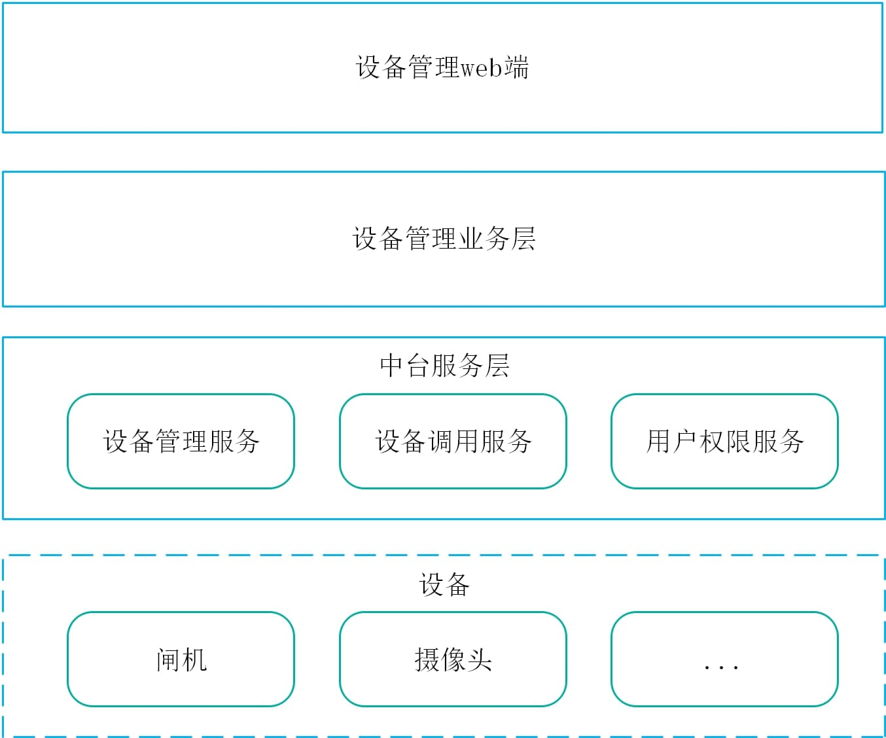

## 设备管理子系统总体架构


### 架构说明
设备管理子系统核心部分为中台服务层中的**设备管理服务**和**设备调用服务**。
为了演示比较完整的业务流程，我们实现了一个模拟业务层调用的服务消费者，供业务层调用的demo用户权限服务，设备管理的web前端，以及闸机模拟器。

#### 闸机开闸流程
~~~ mermaid
sequenceDiagram
participant C as 设备管理业务层
participant D as 设备管理服务
participant DD as 设备调用服务
participant U as 用户权限服务
participant G as 闸机
participant Cam as 摄像头
participant V as 图像识别服务
participant K as Kafka
Cam->>V:人脸图片
V->>K:人脸识别信息
K->>C:人脸识别信息
activate C
C->>U:权限查询
U-->>C:权限结果
C->>D:设备调用命令
D->>DD:控制指令
deactivate C
DD->>G:开闸或告警指令
~~~

#### 设备初始化流程
~~~ mermaid
sequenceDiagram
participant D as 设备管理服务
participant DD as 设备调用服务
participant Cam as 设备
participant V as 图像识别服务
participant R as Redis
participant N as Nacos
participant DB as 数据库
activate D
D->>DB:查询设备信息列表
DB-->>D:注册的设备信息列表
D->>N:查询已注册的设备调用服务列表
N-->>D:已注册的设备调用服务列表
D->>R:设备和设备管理服务对应关系
D->>DD:当前设备调用服务管理的设备列表
deactivate D
activate DD
DD->>Cam:创建链接
DD->>N:注册成功的设备列表
deactivate DD
~~~

#### 设备同步调用流程
~~~ mermaid
sequenceDiagram
participant C as 设备管理业务层
participant D as 设备管理服务
participant DD as 设备调用服务
participant Cam as 设备
participant R as Redis
C->>D:设备调用请求
activate D
D->>R:查询设备对应的调用服务
R-->>D:设备调用服务标识
D->>DD:设备调用指令
DD->>Cam:调用adapter指令
DD-->>D:调用结果
deactivate D
~~~

#### 设备异步调用流程
~~~ mermaid
sequenceDiagram
participant C as 设备管理业务层
participant D as 设备管理服务
participant DD as 设备调用服务
participant Cam as 设备
participant K as Kafka
participant R as Redis
C->>D:设备调用请求
activate D
D->>R:查询设备对应的调用服务
R-->>D:设备调用服务标识
D->>DD:设备调用指令
activate DD
DD-->>D:指令调用结果
deactivate D
DD->>Cam:调用adapter指令
Cam-->>DD:设备调用结果
DD->>K:设备调用结果
deactivate DD
K->>C:设备调用结果信息
~~~

#### 设备管理服务
提供如下功能：
- 设备类型注册和管理
- 设备信息注册和管理
- 设备调用服务管理设备的负载均衡
- 设备调用路由

#### 设备调用服务
提供如下功能:
- 向设备创建连接，并进行维护
- 向设备下发调用指令
- 采集设备返回的数据并返回

### 微服务调用程序实现
#### 微服务模块示例
我们约定每个服务的服务提供者配套实现一个定义该服务提供者接口的module，如在设备管理服务中，涉及到的module如下
- device-manager-service-api
- device-manager-service-provider
- device-manager-service-consumer

其中device-manager-service-api定义了device-manager-service-provider对外开放的接口和与外部进行交互的实体类的格式。device-manager-service-provider是具体服务实现类。device-manager-service-consumer是服务消费者，在具体项目中，由系统业务层扮演服务消费者的身份。
后续小结将讲解每个module在服务调用实现时应当注意的要点。
#### device-manager-service-api
定义了device-manager-service-provider服务提供者对外开放的接口和与外部进行交互的实体类的格式。
#### device-manager-service-provider
设备管理服务的具体实现。provider模块在pom文件中应当引入对应api的依赖，如在device-manager-service-provider中我们引入device-manager-service-api:
```xml
<dependency>   
    <groupId>com.cssc.ljmp.devicemanager</groupId>   
    <artifactId>device-manager-service-api</artifactId>   
    <version>1.0-SNAPSHOT</version>
</dependency>

<dependency>
    <groupId>org.springframework.cloud</groupId>
    <artifactId>spring-cloud-starter-netflix-hystrix</artifactId>
    <version>2.1.6.RELEASE</version>
</dependency>

<dependency>
    <groupId>com.alibaba.cloud</groupId>
    <artifactId>spring-cloud-starter-alibaba-nacos-discovery</artifactId>
    <version>2.1.4.RELEASE</version>
</dependency>

<dependency>
    <groupId>com.alibaba.nacos</groupId>
    <artifactId>nacos-client</artifactId>
    <version>1.2.1</version>
</dependency>
```
在application.yml中添加对nacos服务器的配置
```yml
spring:
  cloud:
    nacos:
      discovery:     
        server-addr: 127.0.0.1:8848
```
在启动类上加上相应注解:
```java
@EnableHystrix
@EnableDiscoveryClient
@SpringBootApplication
@EnableTransactionManagement
public class DeviceManagerProviderApplication {
    public static void main(String[] args) {
        SpringApplication.run(DeviceManagerProviderApplication.class, args);
    }
}
```
provider中以http的方式对外提供接口，在对外开放的Controller类中实现device-manager-service-api中定义的interface。
如DeviceInfoServiceController，实现了DeviceInfoService，如下代码中DeviceInfoService接口、TDeviceInfo这些controller中方法的参数类型和返回值类型，都在device-manager-service-api中进行定义。
```java
import com.cssc.ljmp.devicemanager.api.device.service.DeviceInfoService;
import com.cssc.ljmp.devicemanager.api.device.entity.TDeviceInfo;

@RestController
@RequestMapping(value = "deviceInfo")
@Tag(name = "DeviceInfo", description = "设备信息管理")
public class DeviceInfoServiceController implements DeviceInfoService {

    /** * 创建设备信息记录
    *
    * @param request 创建设备信息记录请求
    * @return 创建的设备信息记录
    * @throws ApiException 创建失败抛出异常
    */
    @Override
    @Operation(summary = "创建设备信息记录")
    @RequestMapping(value = "/create", method = RequestMethod.POST)
    public TDeviceInfo create(@NonNull TDeviceInfo request) throws ApiException{   
        // 具体接口实现
    }

    // 其他接口实现
}

```
#### device-manager-service-consumer
设备管理服务消费者。在该consumer中同样要在pom文件中加入对device-manager-service-api和spring cloud的相关依赖。在服务调用时我们使用了openfeign，依赖中相比provider增加了openfeign的依赖。
```xml
<dependency>   
    <groupId>com.cssc.ljmp.devicemanager</groupId>   
    <artifactId>device-manager-service-api</artifactId>   
    <version>1.0-SNAPSHOT</version>
</dependency>

<dependency>
    <groupId>org.springframework.cloud</groupId>
    <artifactId>spring-cloud-starter-netflix-hystrix</artifactId>
    <version>2.1.6.RELEASE</version>
</dependency>

<dependency>
    <groupId>com.alibaba.cloud</groupId>
    <artifactId>spring-cloud-starter-alibaba-nacos-discovery</artifactId>
    <version>2.1.4.RELEASE</version>
</dependency>

<dependency>
    <groupId>com.alibaba.nacos</groupId>
    <artifactId>nacos-client</artifactId>
    <version>1.2.1</version>
</dependency>

<dependency>
    <groupId>org.springframework.cloud</groupId>
    <artifactId>spring-cloud-starter-openfeign</artifactId>
    <version>2.2.7.RELEASE</version>
</dependency>
```
在application.yml中添加对nacos服务器的配置
```yml
spring:
  cloud:
    nacos:
      discovery:     
        server-addr: 127.0.0.1:8848
```
在启动类上添加@EnalbeFeignClients注解和@EnableDiscoveryClient注解
```java
@EnableFeignClients
@EnableDiscoveryClient
@SpringBootApplication(exclude= {DataSourceAutoConfiguration.class})
public class DeviceManagerConsumerApplication {
    public static void main(String[] args) {
        SpringApplication.run(DeviceManagerConsumerApplication.class, args); 
    }
}
```
声明一个新的接口，继承device-manager-service-api中声明的接口，在接口上添加@FeignClient注解，并说明provider的服务名，代码运行时openfeign就会自动去nacos中查询服务提供者的信息，并将对应接口的实现类注入到我们声明的接口中，可以像使用本地service那样使用provider中实现的服务了:
```java
@FeignClient(name="device-manager-service-provider")
public interface ConsumerDeviceInfoService extends DeviceInfoService {
}
```
在代码中就可以使用刚刚引入的服务了
```java
@RestController
public class DeviceInfoController implements ApiErrorProducer {
    @Resource
    private ConsumerDeviceInfoService deviceInfoService;
    // 调用的业务代码
}
```
#### 服务运行
在系统运行时，应当先确保nacos服务可以正常访问，然后依次启动provider，consumer服务，可以在nacos的管理页面中查看服务注册情况
