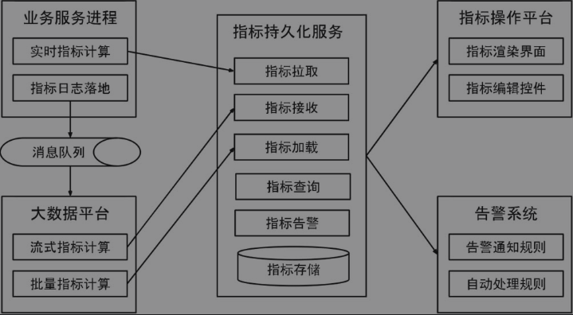
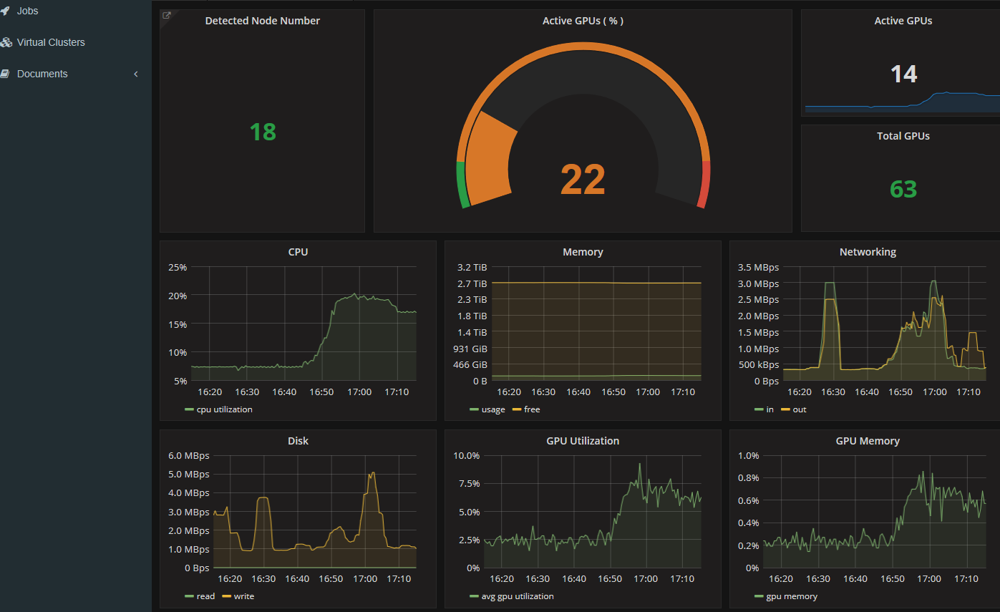
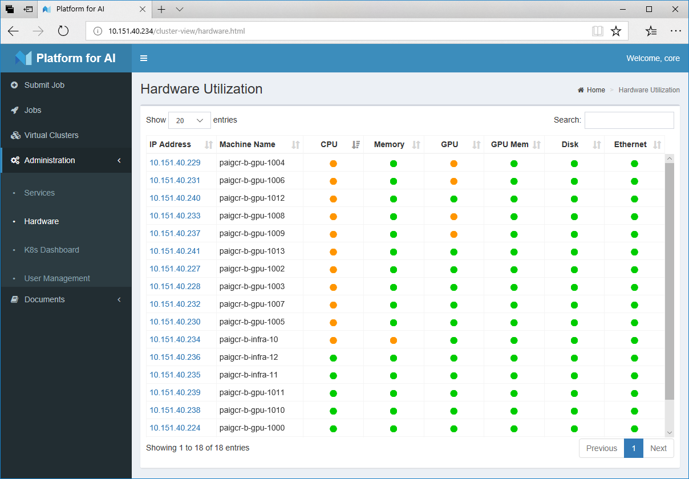

机器学习平台集群监控技术方案
## 一、背景
监控报警对于提升系统的稳定性和可用性有着重要意义，它为运维人员提供了一个中心化的、可观测的和可扩展的操作平台。特别是在大规模微服务架构下，监控报警系统在辅助运维人员进行故障的预警、定位和分析等过程中具有不可替代的作用。
## 二、实现方案
### 2.1、概述
目前业界有许多监控报警的开源解决方案，而且不少公司内部都有自研的监控报警体系，它主要由指标计算、指标持久化和可视化、告警系统这几个核心组件构成。

### 2.2、监控报警系统架构图

### 2.3 集群监控搭建
本方案在k8s集群中使用node-exporter、prometheus、grafana对集群进行监控。其实现原理有点类似ELK、EFK组合。node-exporter组件负责收集节点上的metrics监控数据，并将数据推送给prometheus, prometheus负责存储这些数据，grafana将这些数据通过网页以图形的形式展现给用户。
#### 2.3.1 基础环境
●  Linux

●  JDK(1.8以上，推荐1.8)●  Python(推荐Python2.7.X)●  Apache Maven 3.x (Compile DataX)

●  K8S (1.9.X)

#### 2.3.2 k8s安装
可参考：

[https://kubernetes.io/](https://kubernetes.io/)

[https://www.cnblogs.com/byron0918/p/8728876.html](https://www.cnblogs.com/byron0918/p/8728876.html)

#### 2.3.3 监控系统核心配置
可参考：

[https://blog.51cto.com/ylw6006/2084403](https://blog.51cto.com/ylw6006/2084403)

### 2.4 平台化改造
基于集群监控技术搭建的机器学习平台监控系统，提供了友好的用户界面，操作简单，便于用户进行集群监控、任务提交等。例如，主界面上显示了集群的GPU利用率、节点总数、CPU利用率、网络状况等。

参考实现：[OpenPAI：大规模人工智能集群管理平台](https://www.cnblogs.com/BeanHsiang/articles/9094269.html)

当某项数据异常时，OpenPAI将启动报警机制通知用户，并在UI上以颜色改变的形式进行提醒（如变成红色等）。详情如下：

集群中机器运行状况概览，不同颜色展现了不同的忙闲程度

 