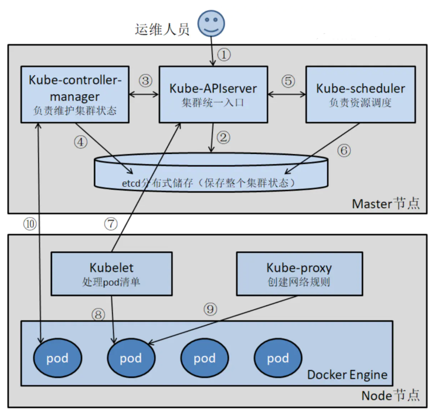
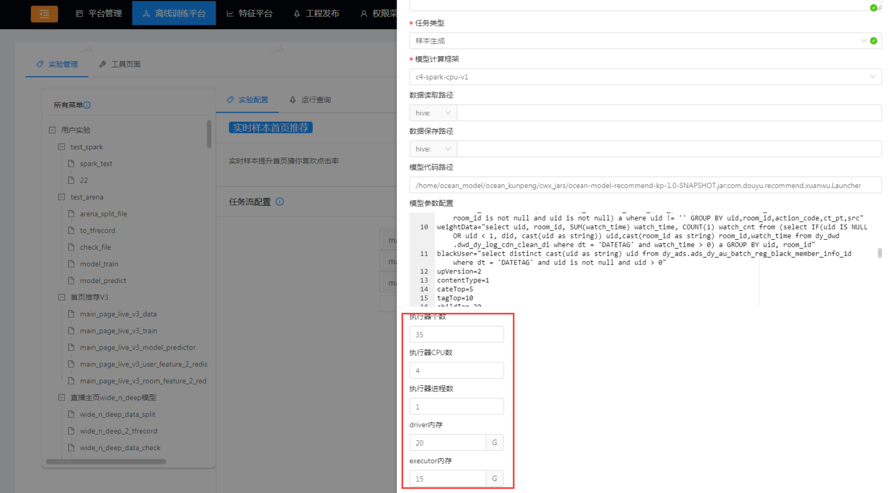
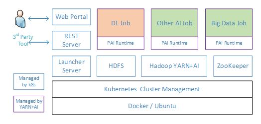
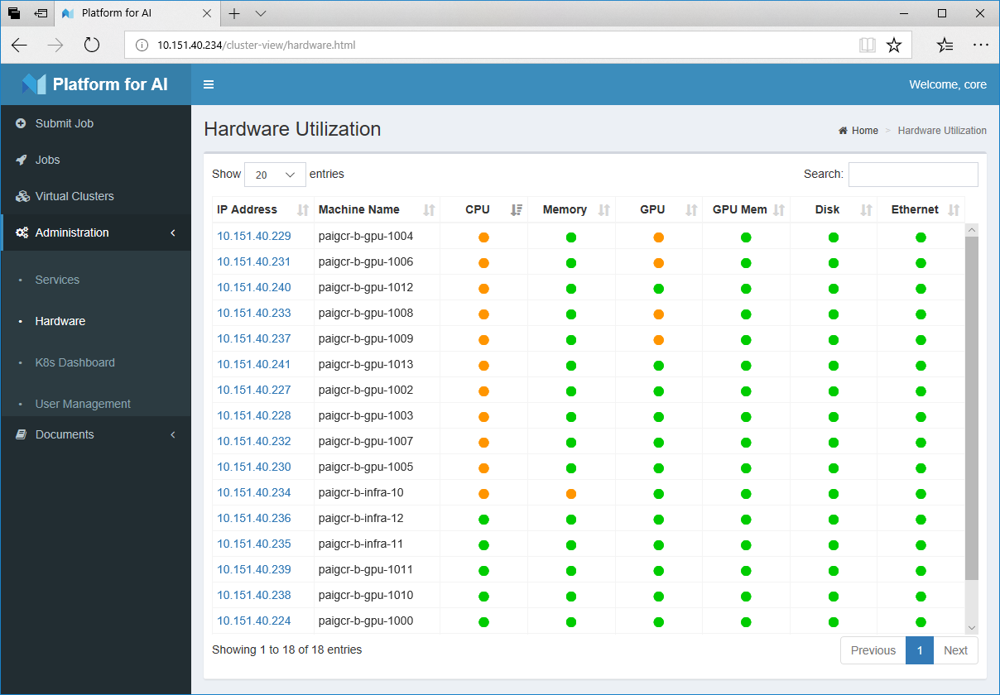

机器学习平台集群集群管理技术方案
## 一、背景
在机器学习能力走向平台化的过程中，机器学习系统需要对集群进行高效的管理。

集群管理平台的职责就是对计算资源和数据资源进行有效配置，对运行状态和服务质量进行实时监控，以便达到提升系统可用性和可维护性的目的。

机器学习集群管理主要有两种实现思路：基于Kubernetes的集群管理、基于MPI的集群管理

## 二、实现方案
### 2.1、概述
Kubernetes是一项容器编排技术。它是容器集群管理系统，是一个开源的平台，可以实现容器集群的自动化部署、自动扩缩容、维护等功能。
### 2.2、Kubernetes的集群管理架构图

集群经过Kubernetes进行管理以后，分布式深度学习框架运行在容器中，容器通过Kubernetes进行调度以满足所需的模型训练资源，因此能够很好的满足集群资源多部门共享的要求。主要解决以下三个问题：

1、  基于容器+ Kubernetes平台，每个项目组可以很容易的申请自己所需要的深度学习框架，tensorflow、caffe等，同时同一种深度学习框架的多种版本支持也不在话下。

2、  只要集群有利用率没达到100%，便可以方便地为其他项目组部署深度学习环境。

3、  通过Kubernetes的调度，完成底层硬件的容错。

### 2.3 安装
#### 2.3.1 基础环境
●  Linux

●  JDK(1.8以上，推荐1.8)●  Python(推荐Python2.7.X)●  Apache Maven 3.x (Compile DataX)

#### 2.3.2 k8s安装
可参考：

[https://kubernetes.io/](https://kubernetes.io/)

[https://www.cnblogs.com/byron0918/p/8728876.html](https://www.cnblogs.com/byron0918/p/8728876.html)

### 2.4 平台化改造

1.基于K8S集群管理技术搭建的机器学习平台，能够简易的支撑机器学习调度任务所需资源的灵活配置，详情如下：

2.开源项目参考：OpenPAI架构与功能简介

OpenPAI是由微软亚洲研究院和微软（亚洲）互联网工程院联合研发的，支持多种深度学习、机器学习及大数据任务，可提供大规模GPU集群调度、集群监控、任务监控、分布式存储等功能，且用户界面友好，易于操作。

OpenPAI的架构如下图所示，用户通过Web Portal调用REST Server的API提交作业（Job）和监控集群，其它第三方工具也可通过该API进行任务管理。随后REST Server与Launcher交互，以执行各种作业，再由Launcher Server处理作业请求并将其提交至Hadoop YARN进行资源分配与调度。可以看到，OpenPAI给YARN添加了GPU支持，使其能将GPU作为可计算资源调度，助力深度学习。其中，YARN负责作业的管理，其它静态资源（下图蓝色方框所示）则由Kubernetes进行管理。

OpenPAI架构

OpenPAI完全基于微服务架构，所有的OpenPAI服务和AI Job均在容器中运行，这样的设计让OpenPAI的部署更加简单，无论是在Ubuntu裸机集群还是在云服务器上，仅需运行几个脚本即可完成部署。这同时也使其能够支持多种不同类型的AI任务，如CNTK、TensorFlow、PyTorch等不同的深度学习框架。此外，用户通过自定义Job容器即可支持新的深度学习框架和其他机器学习、大数据等AI任务，具有很强的扩展性。

在运维方面，OpenPAI提供了AI任务在线调试、错误报警、日志管理、性能检测等功能，显著降低了AI平台的日常运维难度。同时，它还支持MPI、RDMA网络，可满足企业对大规模深度学习任务的性能要求。

参考链接：

[OpenPAI：大规模人工智能集群管理平台](https://www.cnblogs.com/BeanHsiang/articles/9094269.html)

