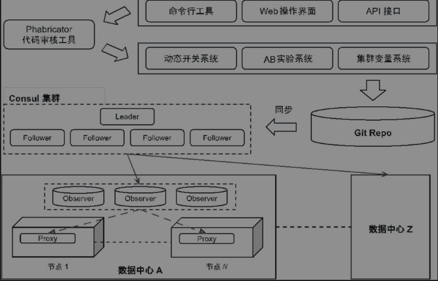

## 一、背景
平台部署主要分为以下几个步骤：

1. 编译支持GPU调度的Hadoop AI容器

2. 部署Kubernetes以及系统服务（如drivers、zookeeper、REST Server等）

3. 访问Web Portal进行任务提交和集群管理

  传统的配置分发通常都会依赖配置文件，这种静态的部署方式在传统软件领域中足以满足实际需求，但是在大规模的分布式系统中，这种方式会面临灵活性、时效性、分发规模上的一些挑战。

## 二、实现方案
### 2.1、概述
配置动态分发系统全流程介绍：

1、  使用者通过命令行工具、Web操作界面或者 API 接口来进行配置的撰写和提交。

2、  新提交的配置首先会被发送到Phabricator 代码审核系统中。

3、  在完成了自动审核和人工审核后，配置会被提交到对应的配置管理系统中，这些系统可以是动态开关系统、AB 实验系统和集群变量系统。

4、  这些配置管理系统都会将新生效的配置提交到统一的配置托管平台上。Git 代码仓库系统以它优异的运行性能和高效的版本控制特性足以满足配置托管的需求。

5、  生效的配置会被自动同步到一个具有高可用性和数据强一致性的数据库中。由于配置信息本身的数据规模较小，诸如 Consul 和 ZooKeeper 这类基于分布式一致性协议的存储系统是一个合理的选择。

6、  每个数据中心都会有监控节点实时地从中心数据库里获取新发布的配置信息。

7、  机器节点上的配置代理进程则从本数据中心的监控节点上获取最新的配置数据。这些代理进程专门为当前机器节点上的应用程序提供配置访问服务。

### 2.2、动态配置分发架构图

具体实现可参考：

[配置管理技术方案](https://www.yuque.com/sartner/sd94ah/rvvr3r)

[OpenPAI：大规模人工智能集群管理平台](https://www.cnblogs.com/BeanHsiang/articles/9094269.html)

### 2.3 安装
#### 2.3.1 基础环境
●  Linux

●  JDK(1.8以上，推荐1.8)●  Python(推荐Python2.7.X)●  Apache Maven 3.x (Compile DataX)

#### 2.3.2 k8s安装
可参考：

[https://kubernetes.io/](https://kubernetes.io/)

[https://www.cnblogs.com/byron0918/p/8728876.html](https://www.cnblogs.com/byron0918/p/8728876.html)

#### 2.3.3 参考文档
[OpenPAI：大规模人工智能集群管理平台](https://www.cnblogs.com/BeanHsiang/articles/9094269.html)