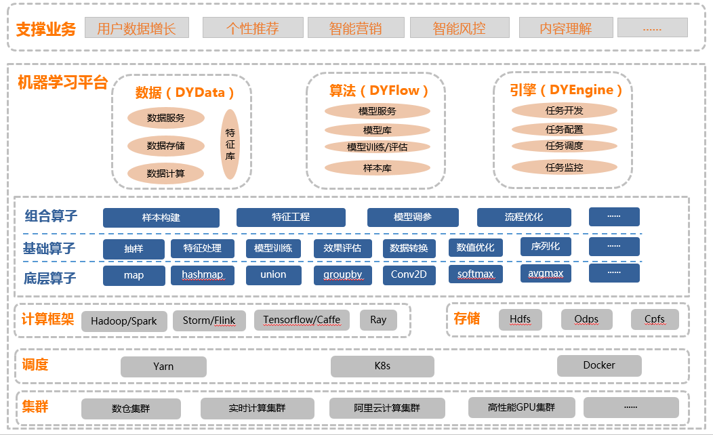
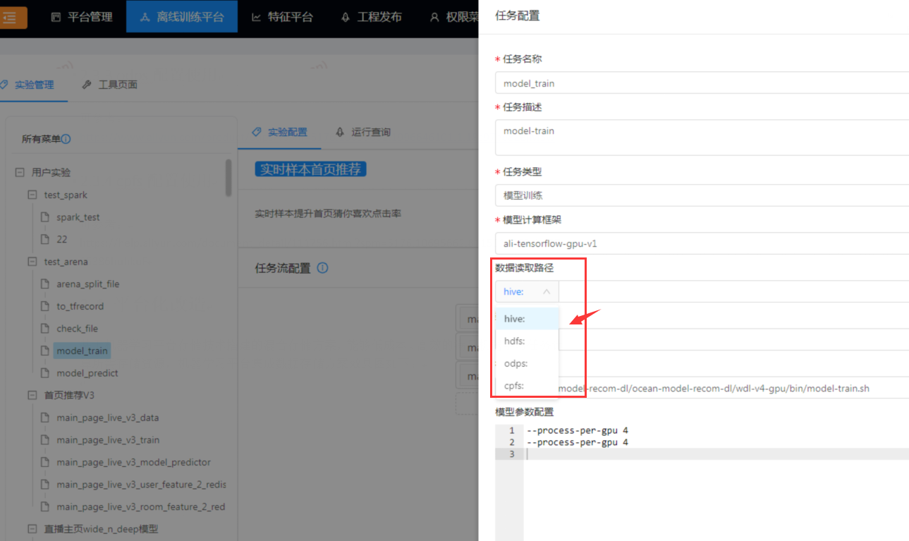

机器学习平台存储框架技术方案
## 一、背景
在机器学习能力走向平台化的过程中，存储系统需要提供更快更有效地收集数据和执行机器学习任务的能力。在构建机器学习平台存储系统的时候需要注意一下几个问题：

1、存储平台必须提供高性能和可扩展性，并可有效管理成本

2、性能必须包括提供高吞吐量以及实现低延迟性

3、好的AI模型意味着需要整理数TB或PB级数据，但是要做到成本可控

## 二、实现方案
### 2.1、概述
针对机器学习平台所应对的计算场景复杂：部分场景强调计算性能、部分场景强调长期存储、部分场景强调数据迁移。本方案设计了一套基于HDFS+ODPS+CPFS的混合存储方案。
### 2.2、机器学习平台及存储管理架构图

为机器学习和AI工作负载部署存储的好方法是简单地使用三层模型：性能层（CPFS）可提供尽可能多的性能和最低的延迟，同时可根据系统预计处理的最大数据集进行扩展；持久层（HDFS）可以提供大数据量长期存储；迁移层（ODPS）提供从自建HDFS集群到阿里云CPFS存储系统的数据迁移能力。

### 2.3 安装
#### 2.3.1 基础环境
●  Linux

●  JDK(1.8以上，推荐1.8)●  Hadoop-2.7.5●  Apache Maven 3.x (Compile DataX)

#### 2.3.2 hadoop安装
可参考：

[https://blog.csdn.net/shaock2018/article/details/88815480](https://blog.csdn.net/shaock2018/article/details/88815480)

#### 2.3.3 odps配置使用
可参考：

[https://www.aliyun.com/product/odps/?spm=5176.10695662.1996646101.1.18c97ee8ZBjM5w](https://www.aliyun.com/product/odps/?spm=5176.10695662.1996646101.1.18c97ee8ZBjM5w)

#### 2.3.4 cpfs配置使用
可参考：

[https://help.aliyun.com/document_detail/111756.html?spm=5176.10695662.8115314850.4.60705386huhkuF](https://help.aliyun.com/document_detail/111756.html?spm=5176.10695662.8115314850.4.60705386huhkuF)

### 2.4 平台化改造
基于机器学习平台存储技术搭建的混合存储方案，能够低成本、高效的满足机器学习任务计算所需存储资源，机器学习平台集成数据存储方案效果图如下：

