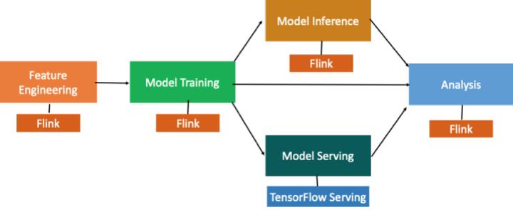
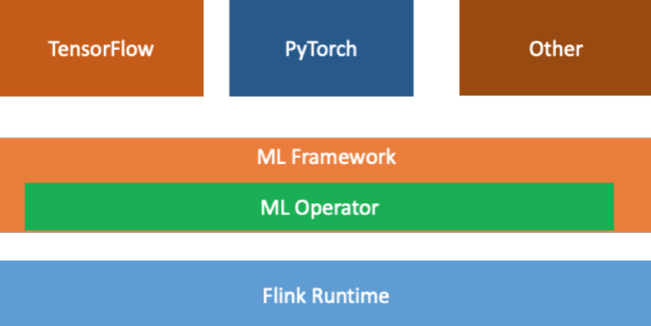
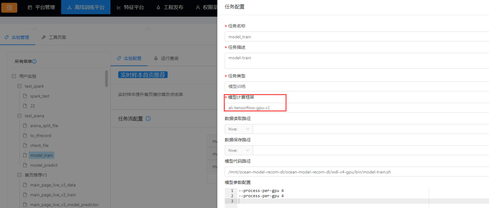

机器学习平台计算框架技术方案
## 一、背景
当前，深度学习的应用越来越多样化，随之涌现出诸多优秀的计算框架。其中 TensorFlow，PyTorch，MXNeT 作为广泛使用的框架更是备受瞩目。在将深度学习应用于实际业务的过程中，往往需要结合数据处理相关的计算框架如：模型训练之前需要对训练数据进行加工生成训练样本，模型预测过程中需要对处理数据的一些指标进行监控等。在这样的情况下，数据处理和模型训练分别需要使用不同的计算引擎，增加了用户使用的难度。
## 二、现方案
### 2.1、概述
本技术方案通过结合 Flink 和 TensorFlow，将 TensorFlow的程序跑在 Flink 集群上的这种方式构建了一套引擎搞定机器学习全流程的解决方案。
### 2.2计算框架方案
#### 2.2.1、计算框架整体流程图

特征工程用 Flink 去执行，模型训练和模型的准实时预测目标使 TensorFlow 计算引擎可以跑在 Flink 集群上。这样就可以用 Flink 一套计算引擎去支持模型训练和模型的预测，部署上更简单的同时也节约了资源。

#### 2.2.2、Flink-ai-extended 抽象
本方案基于flink-ai-extended 的抽象将 Flink 的 operator 结构与 Machine Learning 的 node、Application Manager 角色结合起来。
####  2.3、计算引擎架构图

在 Flink 运行环境上，抽象了 ML Framework 和 ML Operator 模块，负责连接 Flink 和其他计算引擎。

### 2.4 方案搭建                               
#### 2.4.1 基础环境
●  Linux

●  JDK(1.8以上，推荐1.8)●  Python(推荐Python2.7.X)●  Apache Maven 3.x (Compile DataX)

#### 2.3.2 引擎搭建
可参考：

[https://yqh.aliyun.com/](https://yqh.aliyun.com/)

### 2.5 平台化改造
基于机器学习计算引擎技术搭建的机器学习平台，能够简易的支撑机器学习任务所需计算框架的灵活选择，详情如下：

 

 

