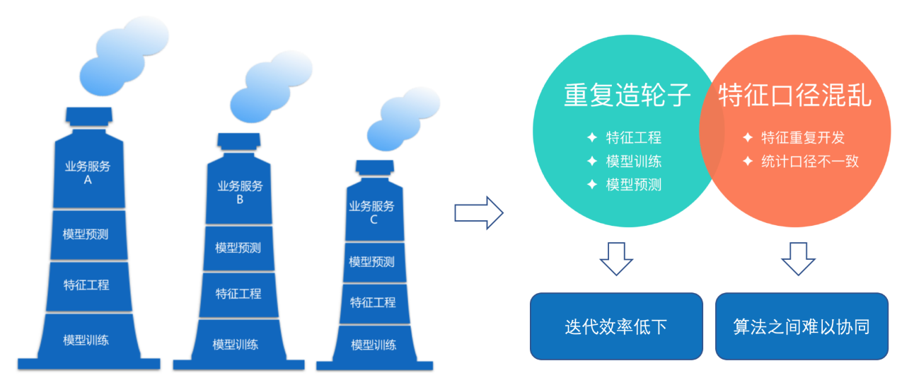
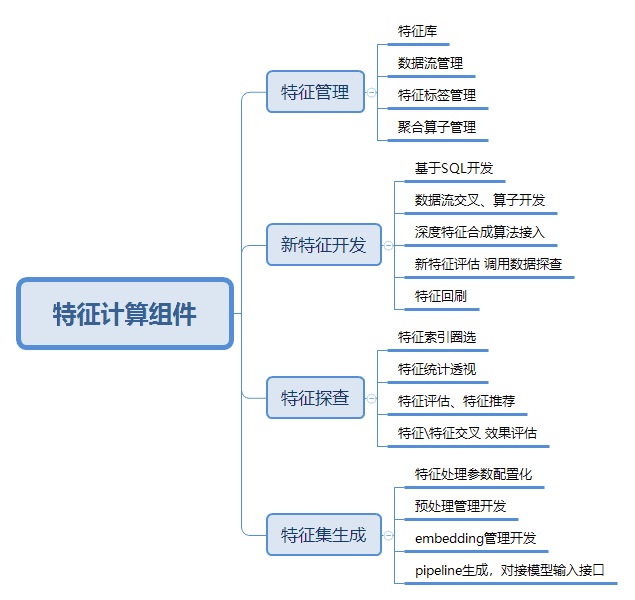
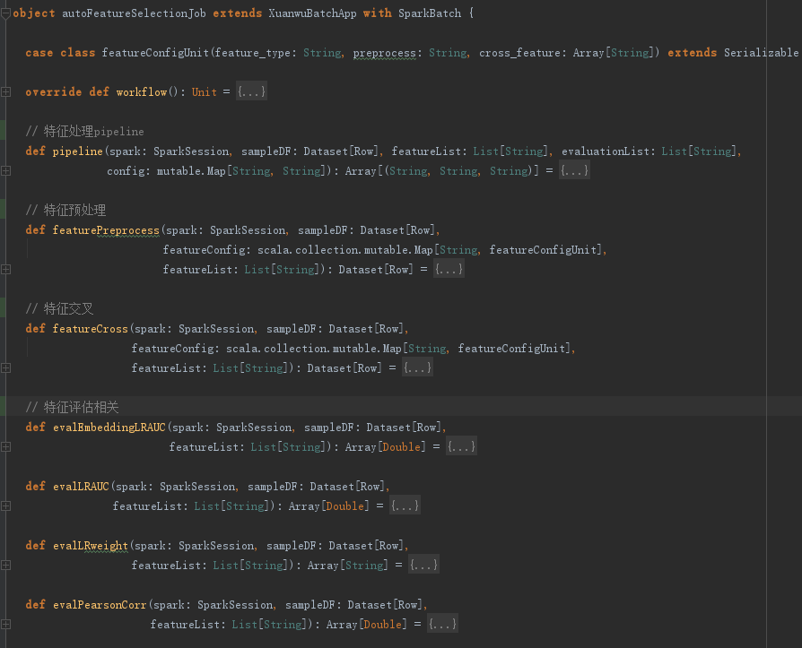
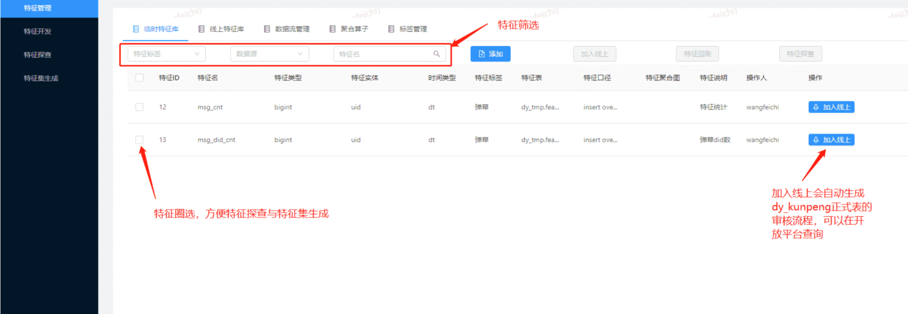
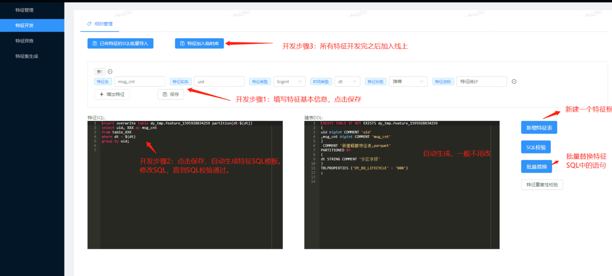
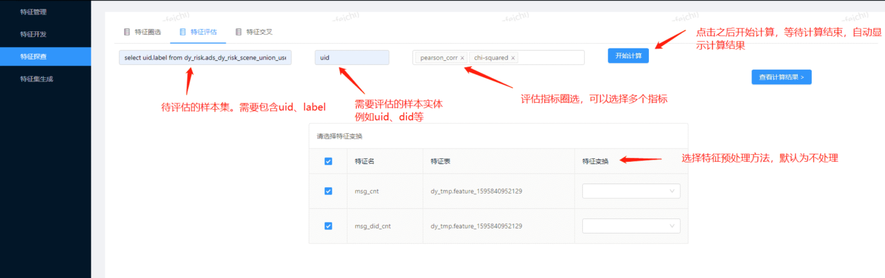
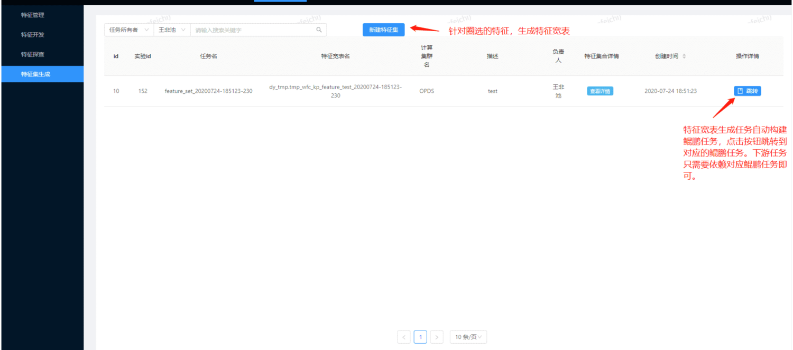
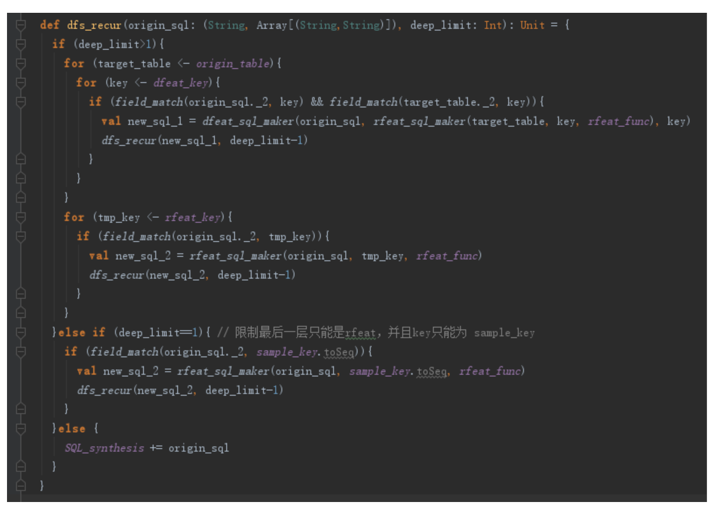

## [背景]()
随着平台发展，用户规模提升、大量主播入驻与直播场景复杂化，这使得算法人员在面对新生业务时需要更快（算法需要快速迭代、快速上线）、更好（业务越来越依赖机器学习算法产生正向的效果）、更准（算法的各种预测需要准确逼近真实值）的目标下也面临日益增大的挑战。数据流与特征作为机器学习的基础，往往决定着后续机器学习算法的性能上限。由于支撑公司业务发展，算法人员需要快速上线与迭代优化模型，因此更多是各自为战的灵活开发模式，这种模式虽然可以快速支撑业务的个性化需求，但是同时也带来了如下问题：
，在目前算法模型开发与维护过程中往往存在如下问题：

1. 不同模型的特征重复开发，难以复用。

2. 特征的应用具有场景局限性，多场景特征可以进一步提升各类模型效果。

3. 新特征的开发主要依赖专家意见，人工成本高，缺少客观评估指导。

4. 深度特征合成主要依赖于模型内部交叉，深度特征难以沉淀维护。

5. 特征提取优化模型的流程缺少规范，模型维护成本高。交接成本高。

   

## [实现方案]()
### [概述]()
针对斗鱼机器学习业务中的特征工程环节，我们需要设计一套包含特征管理、特征评估、特征计算等功能的一体化特征平台。目前业界成熟的平台有阿里的pai平台（[https://www.aliyun.com/product/bigdata/product/learn](https://www.aliyun.com/product/bigdata/product/learn)）、携程Flink实时计算平台（[https://www.sohu.com/a/246673917_315839](https://www.sohu.com/a/246673917_315839)）、滴滴九角星特征计算平台等。这些平台通过汇总特征计算，经可能的实现特征复用与特征计算优化，通过配置化维护保证线上线下一致性，同时借鉴autoML相关算法进行特征自动化流程，从而实现一站式的特征生产、上线与评估。
### [系统设计架构]()
通过特征工程系统，打通数据与模型壁垒，实现以下功能：
1. 特征管理。构建全场景特征库，将特征对应数据流（交叉数据流与关联实体）、聚合算子、时间跨度信息进行管理。

2. 特征探查。管理特征在应用场景的评估效果，形成特征标签，方便批量特征索引。汇总特征评估接口。从鲲鹏-样本管理组件中输入样本与标签，即可对库中特征进行批量效果评估，指导特征子集圈定。

3. 特征开发。sql自动解析，特征快速入库。通过选定数据流、交叉实体、计算算子（或自定义udf）、时间跨度等，快速开发新特征。另一方面应用autoML进行特征探索，深度特征合成。

4. 特征处理pipeline。将特征子集、预处理、特征embedding流程参数配置化。从鲲鹏-样本管理组件接入样本，通过pipeline计算特征，为鲲鹏-离线训练平台提供数据输入接口。

   

### [平台开发]()
基于上述需求开发鲲鹏-特征平台。功能实现主要基于scala，相关任务代码如下：

代码对应相关功能的界面设计如下：
1. 特征管理模块：

   

2. 特征开发模块

   

3. 特征探查模块

   

4. 特征集生成模块

   

### [深度特征合成]()
AutoML是近年来火热的前沿研究方向，斗鱼基于自身业务场景设计了特征自动合成模块。深度特征合成（Deep Feature Synthesis, DFS）算法主要是通过关系型数据库之间的关系路径来遍历生成特征，该算法可以跟深度的关系路径搜索来生成更深层的特征，这使得算法可以有效的挖掘到多个数据流之间的特征规律（见论文Deep feature synthesis: Towards automating data science endeavors）。然而，这种搜索方式对于海量数据场景中的数据流并不可行，深度的数据流关联很容易导致数据膨胀与特征维度爆炸。因此我们做出如下改进：
1.        dfeat改为对已有原始数据流关联，同时对数据流进行统一抽样。
2.        对关联特征进行限定，同时对所有数据源进行特征名与口径统一。另一方面，rfeat的group key同样是任意组合，因此同样对其进行限制。
3.        在树形结构中对中间结果进行存储，防止重复计算。同时进行剪枝。
4.        限制efeat使用之后必须与rfeat混合使用。
算法核心代码如下：

在改进算法之后，算法合成特征效果良好。基于该算法特征合成组件。在自动化特征合成之后，自动调用特征评估组件，使得有效特征可以直接凸显出来。在特征生成之后，可以加入特征库供线上使用。

 

 

