机器学习平台Flow模块技术方案
## 一、背景
在数据智能的推进过程中，基于AI支撑的业务场景会越来越复杂，规模会越来越大，算法模型开发效率会越来越重要。覆盖的业务场景包括智能增长、个性推荐、平台风控等。

当前由于业务场景之间有一定相似性，对于通用模型的开发存在人力投入重复现象；业务需求复杂，模型支撑方式多样性；特征数据量大维度多，模型单次开发成本高；算法开发方式多样，缺乏统一管理平台。

整合机器学习相关资产，构建统一的模型训练Flow流程规范，打造提供一站式的机器学习平台。主要实现方案有：

1.      购买使用成熟的商用机器学习平台，如阿里云的PAI平台；
2.      复用成熟组件，自主搭建内部机器学习平台。

基于当前各方面因素考虑，旨在帮助算法工程师脱离繁琐的工程化开发，聚焦于算法策略迭代，采用方案2。
## 二、实现方案
### 1、概述
        机器学习平台的工作流一般从积累的业务数据着手，经过相应的特征工程处理得到训练数据样本和预测数据样本，使用训练数据进行模型训练。训练完成之后使用预测样本进行模型预测效果评估，对达到标准的模型进行线上部署生效，持续迭代更新闭环。

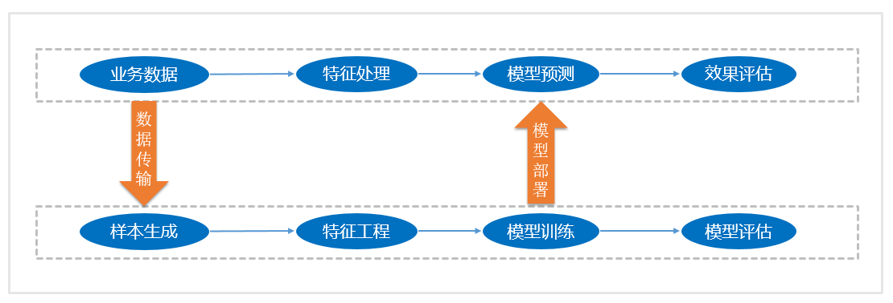

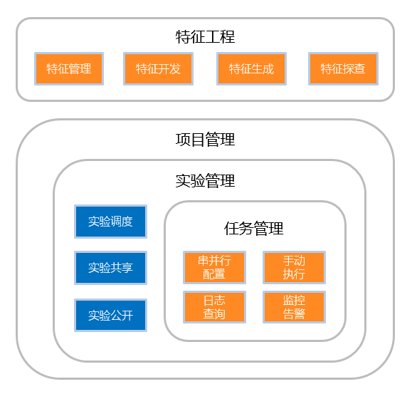

### 2、特征工程
        特征工程是机器学习中最为基础和重要的部分，是数据科学中最有创造力的一部分。利用原始积累的业务数据，通过衍生筛选来创造新的特征。特征开发一般有自定义开发和自动化生成两种方式。
#### 2.1、特征自定义开发
通过自定义SQL来从数据仓库提取加工所需特征，如下。

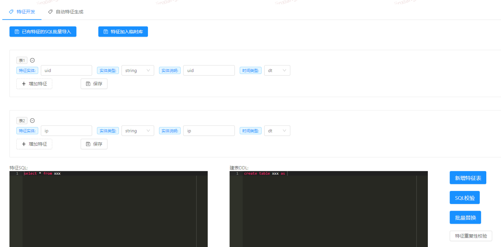

#### 2.2、特征自动化生成
通过特定的模型算法调整参数，通过原始数据计算自动提取特征。

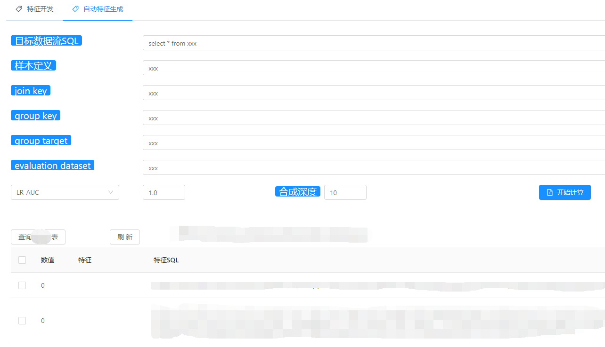

#### 2.3、特征评估
        特征生成后进行特征探查，选择评估标准，使用模型算法对特征有效性进行评估。

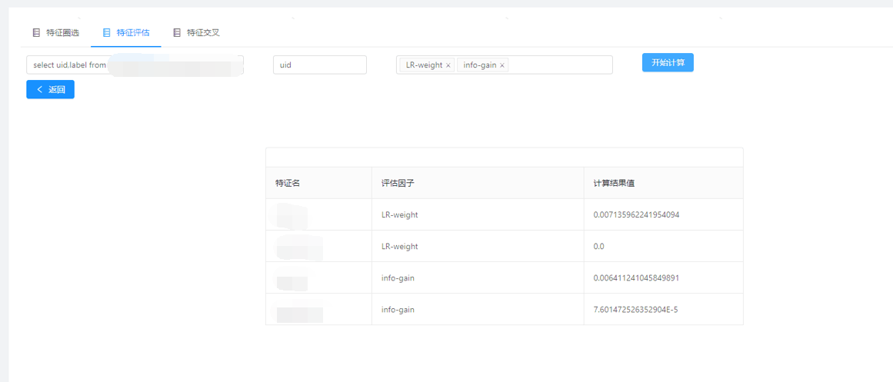

## 3、项目管理
        原始数据经过特征工程处理加工后，得到特征数据用于模型训练预测。首先创建一个项目，并设置为启用状态。

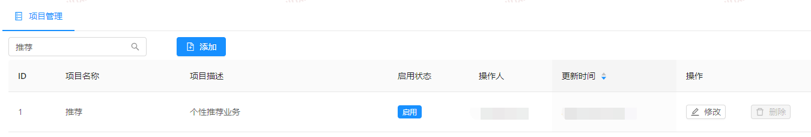

## 4、实验管理
        选择对应的项目，在项目下创建实验。实验可以共享给指定用户可见，也可以公开。实验可以配置自动调度及执行状态告警。

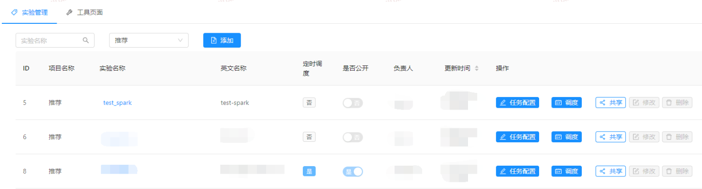

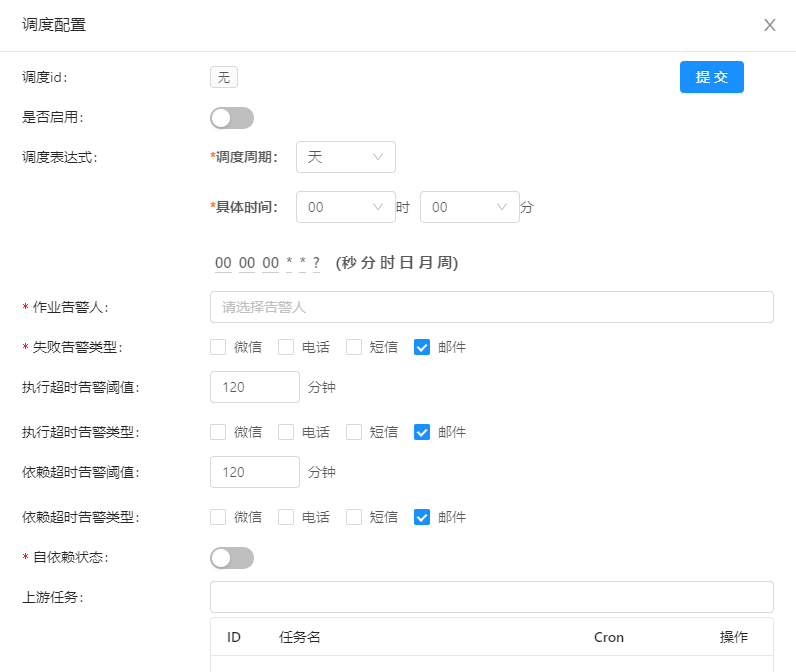

## 5、任务管理
        选择对应实验，在实验下创建任务，任务可以复制修改删除。可以设置为公共任务，所有实验可以选择。任务类型有：数据处理、样本生成、模型训练、模型预测。通用参数有：任务类型、计算框架、数据路径、模型路径、模型参数、资源配置、运行参数。

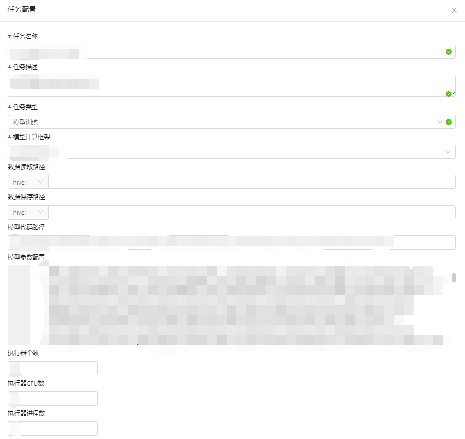

一个实验中可以配置多个任务，任务流顺序执行，任务流根据添加顺序依次执行,同一行的任务支持并行执行。任务支持单独重跑和带下游重跑。支持手动执行和自动调度。平台中可以查询任务最新执行状态，执行日志，集群地址。

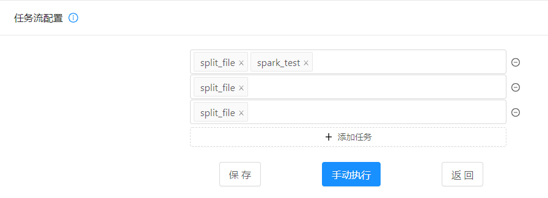

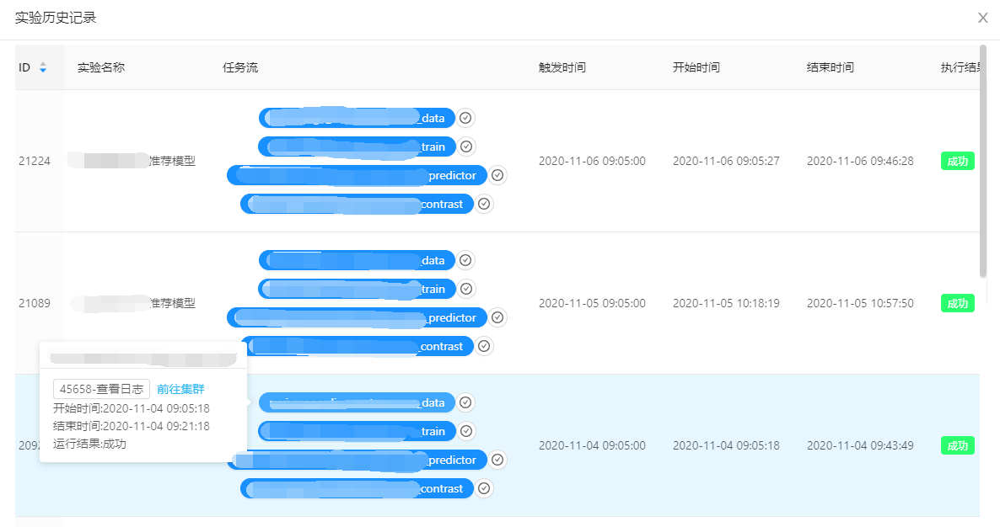

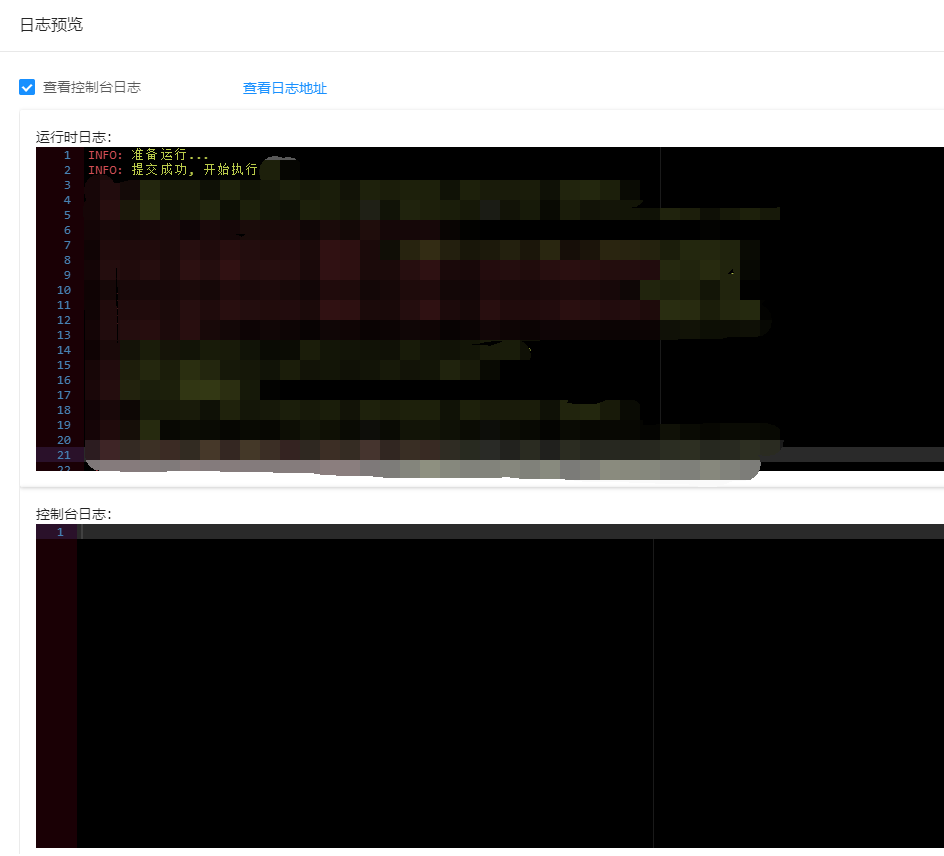