机器学习平台调度模块技术方案
## 一、背景
随着公司业务的发展，基于数据智能AI支撑的业务场景会越来越复杂，规模会越来越大，算法模型开发效率会越来越重要，亟需研发一站式机器学习平台，提高模型迭代效率，规范开发流程。基于当前各方面因素考虑采用内部成熟组件，自主搭建内部机器学习平台。

调度模块是机器学习平台中重要部分，负责实验和任务的调度。实验调度方案目前业务较通用的有Apache Dolphin Scheduler、XXL-JOB、Azkaban。由于业务特殊性需要与内部任务互通，所以选择内部自研调度框架Miner。任务调度则基于DAG内部实现。

## 二、实现方案
机器学习平台中的调度模块包含实验调度和任务调度，实验调度需要依赖内部数据任务，所以调度框架选择内部自研框架Miner。一个实验下需要配置任务流，任务流包含多个串并行的任务，任务之间调度则基于DAG内部实现。
### 1、实验调度
#### 1.1、目标
l  支持多种任务类型：Java、Shell、MR、Spark、SQL、XML、Empty等

l  支持定时调度、手动调度、工作流调度等多种调度方式

l  支持任务失败重试，任务失败、执行超时、依赖超时等告警

l  支持任务间依赖，任务自依赖，依赖跨周期

l  任务依赖自动解析

l  支持HA

l  支持调度计划提前生成

l  支持基线任务

#### 1.2、方案概述
##### Dolphin Scheduler
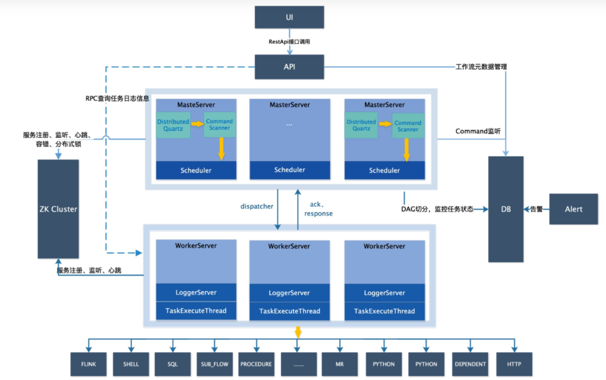

**MasterServer**： 其采用分布式无中心的MasterServer负责DAG任务的切分，任务提交，MasterServer及WorkerServer的健康监控。通过在Zookeeper上注册临时节点实现节点变化的容错处理。内部采用**Quartz**

**WorkerServer： ** WorkerServer也采用分布式无中心设计理念，WorkerServer主要负责任务的执行和提供日志服务。 WorkerServer服务启动时向Zookeeper注册临时节点，并维持心跳。

**ZooKeeper：** 系统中的MasterServer和WorkerServer节点都通过ZooKeeper来进行集群管理和容错，通过Zookeeper进行事件监听、实现分布式锁和任务队列。

DolphinScheduler使用ZooKeeper分布式锁来实现同一时刻只有一台Master执行Scheduler，或者只有一台Worker执行任务的提交。

**任务优先级： ** DolphinScheduler的流程及任务可以设置优先级，按照“**流程实例优先级_ 流程实例id_ 任务优先级_任务id** ”信息保存在ZooKeeper的优先权任务队列中，实现按照优先级进行任务的触发。

**日志： ** 其采用Logback的FileAppender和Filter功能实现每个任务实例生成一个日志文件，在web端采用gRPC的方式从Worker提供的日志服务中读取日志文件拉取信息。

可参考：[https://github.com/apache/incubator-dolphinscheduler](https://github.com/apache/incubator-dolphinscheduler)
##### XXL-Job
XXL-JOB是一个分布式任务调度平台，主要分为调度中心、执行器和DB。其架构如下：

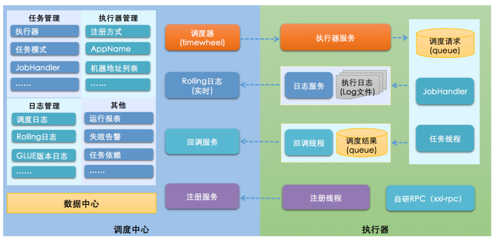

**调度中心：** 基于数据库的集群方案来保障HA，并没有使用Zookeeper。采用线程池进行任务调度，避免单线程阻塞引起调度任务延迟。重启时导致错过调度时间，会使用过期处理策略，可以处理过期5s内的任务。

**执行器：** 是一个内嵌的Server，会进行执行器注册。任务如果是Bean模式，则调用其execute方法，如果是GLUE模式，则加载GLUE代码，实例化Java对象，然后调用execute方法。

**解耦：** 调度器与执行器之前通过HTTP通讯，请求执行、执行状态以及日志服务等都是通过访问API服务完成。

**任务依赖：** 每个任务可以设置子任务，父任务成功会触发子任务执行。
**任务HA：** 执行器如果是集群部署，任务可以选择“故障转移”的路由策略，当任务调起时，会去检查执行器的存活状态，选择第一个存活的执行器进行任务执行。

可参考：[https://github.com/xuxueli/xxl-job](https://github.com/xuxueli/xxl-job)
##### Azkaban
Azkaban是LinkedIn 开源其自家的分布式工作流调度器，用以解决Hadoop作业依赖问题。支持单机模式和集群模式部署。

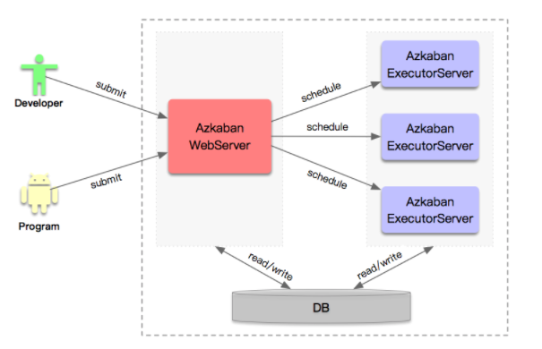

WebServer及ExecutorServer内部组件如下：

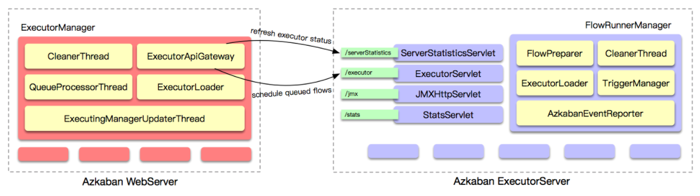

可参考：[https://github.com/azkaban/azkaban](https://github.com/azkaban/azkaban)

##### 内部自研方案Miner
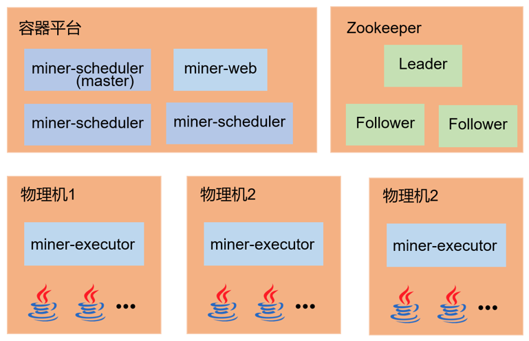

任务调度的模块分层如下：

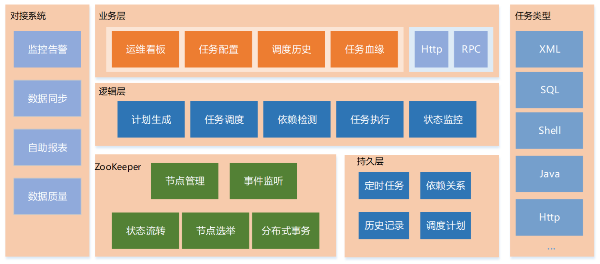

**调度周期：** 提供分钟、小时、天、周、月几种任务调度周期

**任务调度：** 通过Spring提供的@Scheduler的方式定时触发任务，系统将任务分为有上下游依赖与无上下游依赖的任务，它们遵循不同的调度策略。无上下游依赖的任务到了触发时间点会立即触发，生成任务实例；而有上下游依赖的任务的任务实例是在前一天10.00PM 提前生成的，并将任务实例的ID映射到每一分钟，记录到MySQL中，这样，每到1分钟的触发点，系统会从分钟任务实例映射表中取出这一分钟需要触发的任务，依次进行任务的触发。

**任务状态：** 包括预触发、触发、预准备，等待，准备，运行，异步运行，失败，取消，DQC校验，成功这几个状态。

**监控告警：** 系统提供任务失败、执行超时、依赖超时、触发超时等告警类型，提供任务失败重试机制。

**任务依赖：** 系统提供任务间的依赖配置，可以配置任务的上游依赖，以及查看任务的上下游依赖关系，对于SQL ETL任务，提供根据表与任务的血缘关系，在任务配置时进行上游任务的自动解析和填充。针对当前小时依赖上一小时的场景，系统还提供任务自依赖配置，可以让任务依赖上一周期的任务实例。

**任务调度器：** miner-scheduler可以启动多个实例，但只有一个会获取到Zookeeper的Master锁，成为Master调度器，当Master调度器服务挂掉是，系统会立即选举出一台新的调度器作为Master。

**任务执行器：** miner-executor服务可以部署到多台物理机上，通过Zookeeper的事件监听机制，获取任务实例的信息，任务执行器会上报自身所在节点的CPU使用率，任务调度器会选择当前CPU使用率最低的那个任务执行器作为执行节点。

**任务执行：** 任务执行器会根据任务实例的任务类型选择对应的Jar包，启动一个JVM进程执行该任务。任务执行器会每分钟拉取最新的Jar包，以保证任务执行的是最新逻辑。

| **调度系统** | **调度HA保证** | **调度策略** | **任务依赖** | **日志** | **通知方式** |
| --- | --- | --- | --- | --- | --- |
| Miner | Zookeeper分布式锁实现 | 无依赖到点触发，有依赖依据生成调度计划触发 | 任务间依赖  任务自依赖
任务实例依赖
跨周期依赖 | 文本存储+ES存储+HTTP提供数据 | 事件监听
与回调 |
| Dolphine   Scheduler | Zookeeper分布式锁实现 | 到点触发，不生成调度计划 | DAG内部任务依赖，DAG之间无依赖 | 文本存储+gRPC提供数据 | 接口调用 |
| XXL-JOB | MySQL数据库实现 | 到点触发，不生成调度计划 | 有任务间依赖 | 文本存储+HTTP提供数据 | 接口调用 |
| Azkaban | 无 | 到点触发，不生成调度计划 | DAG内部设置依赖，DAG间不能设置依赖 | DB存储+HTTP提供数据 | 接口调用 |

#### 1.3、调度配置
机器学习平台实验调度配置中可以配置调度周期、具体时间、作业告警人、作业告警类型、上游任务依赖。

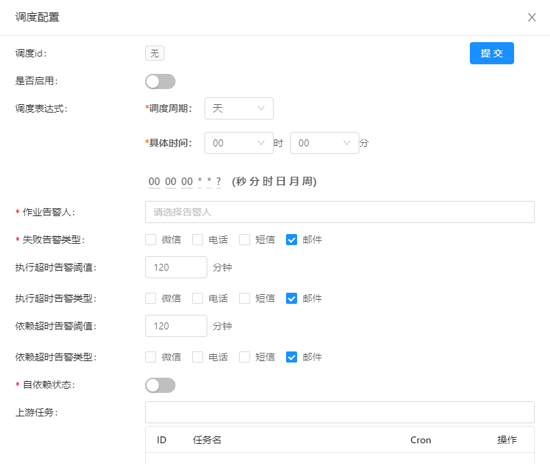

### 2、任务调度
#### 2.1、调度配置
一个实验中可以配置多个任务，任务流顺序执行，任务流根据添加顺序依次执行,同一行的任务支持并行执行。任务支持单独重跑和带下游重跑。支持手动执行和自动调度。

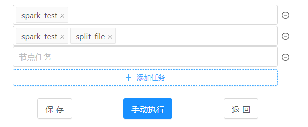

#### 2.2、代码示例
任务调度DAG图关键数据结构

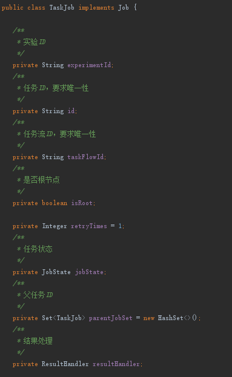

任务执行类

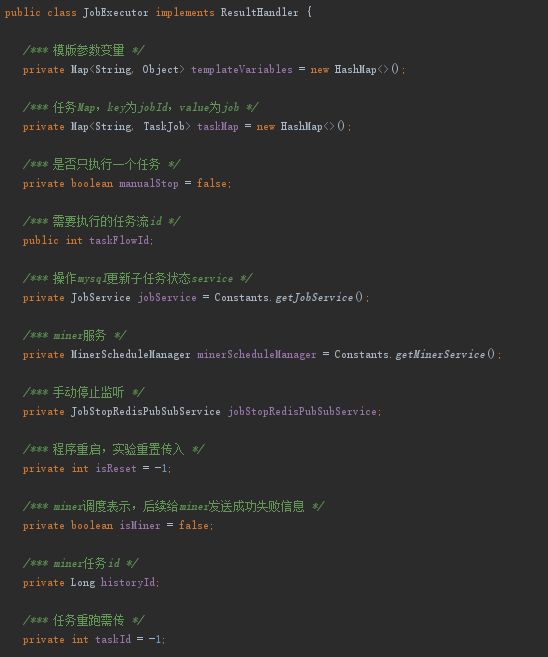

任务执行具体方法

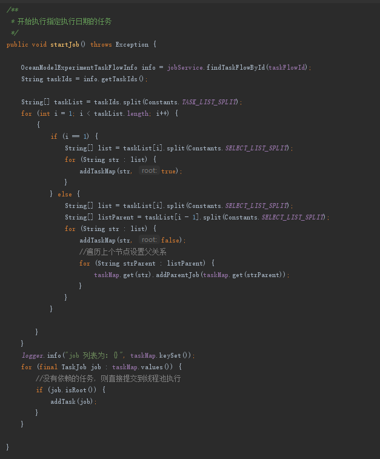

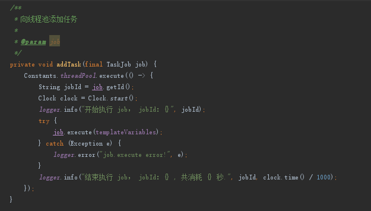