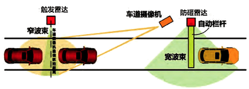

&nbsp;&nbsp;车辆出入口是园区安防的重要设防部位，一方面需要兼顾园区内出入通行效率，同时根据客户的需求，要对车辆进出进行权限校验或计时计费，是车辆对园区内活动的开始和结束点。
当前安防硬件厂商对车辆出入口提供的硬件设施包括一体化道闸、出入口雷达、自动拦车杆、遥控拦车杆、车道摄像机、LED显示屏等。 
&nbsp;&nbsp;在车辆出入口，可以使用有人值守方式，或无人值守方式进行部署。而无人值守方式又可以选择直接采购一体化闸道，或在客户当前已有的设备基础上进行改造，引入防砸雷达等设备，将出入口改成可以自动控制的出入口。 
以下将对由多设备联动的无人值守车辆出入口工作流程进行展示。

车辆卡口布局情况 

车辆卡口流程 

卡口系统调用图
~~~ mermaid
sequenceDiagram
participant S as 业务系统
participant DD as 设备调用服务
participant K as Kafka
participant C as 触发雷达
participant Cam as 车道摄像机
participant Vis as 车牌识别服务
participant Disp as 智能显示屏
participant F as 防砸雷达
participant Z as 自动栏杆
C ->> K: 检测到车辆经过的消息
K ->> S: 消费车辆经过消息
activate S
S ->> DD: 开启车道摄像机指令
activate DD
DD ->> Cam: 启动摄像机捕捉车牌
deactivate DD
activate Cam
Cam ->> Vis: 车牌影像
deactivate Cam
activate Vis
Vis ->> K: 车牌识别结果
deactivate Vis
K ->> S: 消费车牌信息
S ->> DD: 屏幕显示结果
activate DD
DD ->> Disp: 车牌号和停车时间
deactivate DD
S ->> DD: 打开自动栏杆
activate DD
DD ->> Z: 打开自动栏杆
deactivate DD
activate Z
S ->> DD: 激活防砸雷达
activate DD
DD ->> F: 进行车辆通过检测
deactivate DD
activate F
F ->> K: 车辆完全经过消息
deactivate F
K ->> S: 订阅车辆经过消息
S ->> DD: 关闭自动栏杆
activate DD
deactivate S
DD ->> Z:关闭自动栏杆
deactivate DD
deactivate Z
~~~
