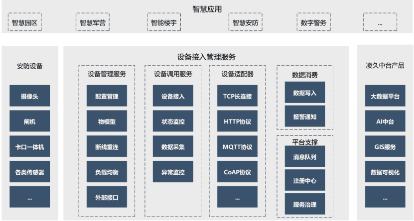

&nbsp;&nbsp;业务中台设备接入管理服务是为了提供一个设备便捷接入、管理的平台。在安防、智慧园区、智慧交通等等领域，依靠设备对各种状态进行感知，进而结合大数据和AI等技术，让园区变得更加智能，从而提升园区服务质量和管理效率，降低人工消耗，已经成了当前的重要发展方向。 
&nbsp;&nbsp;公司在进行园区安防建设中，设备的接入和管理是所有建设工作中最大的一部分工作。各种不同类型设备的接入，消耗的时间有时超过了整个项目的50%。 
&nbsp;&nbsp;本设备接入管理服务，通过将设备接入和管理过程中具有共性的部分进行提取，形成了一个可复用于各种项目的设备管理接入服务框架，同时定义了一套设备协议适配实现规范。业务部门通过使用该服务，可以逐渐将已经接入过的设备协议方便的管理维护起来，同时也实现了设备连接过程中一些复杂的技术问题和业务系统的分离，降低业务实施人员开发难度，提高业务实施人员开发效率。 
&nbsp;&nbsp;设备接入管理服务总体架构如下： 

&nbsp;&nbsp;我们针对园区安防领域中最常见的人员门禁、车辆出入卡口、周界入侵报警等场景进行了分析设计，并使用本设备接入管理服务实现了对应场景接入的演示程序。 

&nbsp;&nbsp;设备接入管理服务本身以微服务架构进行实现，如业务系统在实现人员门禁场景中，和设备接入管理服务组合形成的架构如下图： 

&nbsp;&nbsp;其中设备管理服务、设备调用服务为设备接入管理服务内部拆分的服务，用户权限服务是业务层在人员门禁校验过程中核对人员是否有通行权限时应当调用的服务。业务应用层通过调用设备管理服务，对人员门禁流程中的闸机和摄像头等设备进行控制，实现业务流程。 

在设备接入调用服务内部，设备初始化的流程如下
~~~ mermaid
sequenceDiagram
    participant Manager
		participant Nacos
		participant Dispatcher
		Note right of Dispatcher: 初始化，扫描Adpaters
		Dispatcher->>Nacos: 注册实例
		Nacos->>Manager: 上报实例注册
		Manager->>Dispatcher: 获取Dispatcher支持的adapter信息
		Note left of Manager: 将Dispatcher放入调度池
~~~

设备连接时，该服务内部调用流程如下
~~~ mermaid
sequenceDiagram
    participant 上层应用
    participant Manager
		participant Kafka
		participant Dispatcher
		上层应用->>Manager: 添加设备
		Note left of Manager: 匹配设备对应的Adapter 寻找支持此Adapter的所有Dispatchers 通过负载均衡算法获得目标Dispatcher 如果无可用的Dispatcher 返回失败
		Manager->>Dispatcher: 下发连接指令
		Note left of Dispatcher: 连接成功后更新Nacos
		loop 设备状态上报
			Dispatcher-->>Dispatcher: 设备状态监测
			Dispatcher->>Kafka: 设备状态消息发布
			Kafka->>Manager: 设备状态更新
			Kafka->>上层应用: 设备状态更新
		end
		loop 设备业务消息上报
			Dispatcher-->>Dispatcher: 设备业务消息监测
			Dispatcher->>Kafka: 设备业务消息发布
			Kafka->>Manager: 设备业务消息归档
			Kafka->>上层应用: 业务消息使用
		end
~~~

设备同步调用流程
~~~ mermaid
sequenceDiagram
    participant 上层应用
    participant Manager
		participant Dispatcher
		上层应用->>Manager: 下发设备指令
		Note left of Manager: 根据设备信息寻找管理此设备的Dispatcher 若不存在返回失败
		Manager-x上层应用: 执行失败
~~~

设备异步调用流程
~~~ mermaid
sequenceDiagram
    participant 上层应用
    participant Manager
		participant Dispatcher
    participant Kafka
		上层应用->>Manager: 下发设备指令
		Note left of Manager: 根据设备信息寻找管理此设备的Dispatcher 若不存在返回失败
		Manager-x上层应用: 执行失败
		Manager->>Dispatcher: 下发设备指令
		Note left of Dispatcher: 校验设备是否连接 校验指令是否合法 校验参数是否有效 校验失败返回错误
		Dispatcher-xManager: 执行失败
		Manager-x上层应用: 执行失败
		Dispatcher->>Manager: 返回指令流水号
		Manager->>上层应用: 返回指令流水号
		Dispatcher-->>Dispatcher: 调用Adapter执行指令(异步)
    Dispatcher->>Kafka: 发布指令执行结果
    Kafka->>Manager: 根据指令流水号获得原始指令，归档执行结果
		Kafka->>上层应用: 根据指令流水号获得指令执行，根据执行结果进行后续业务步骤
~~~
