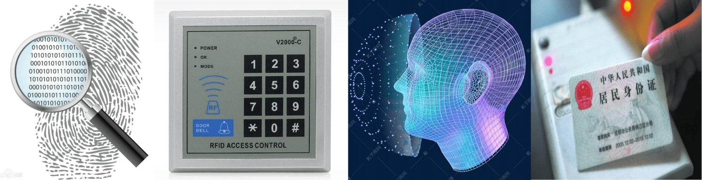
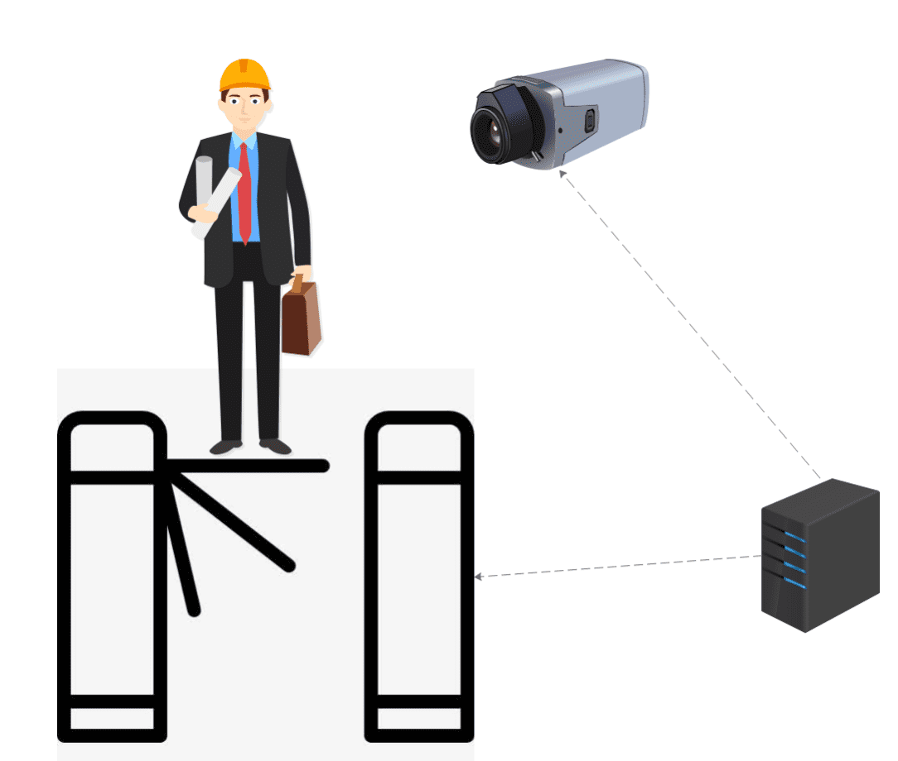
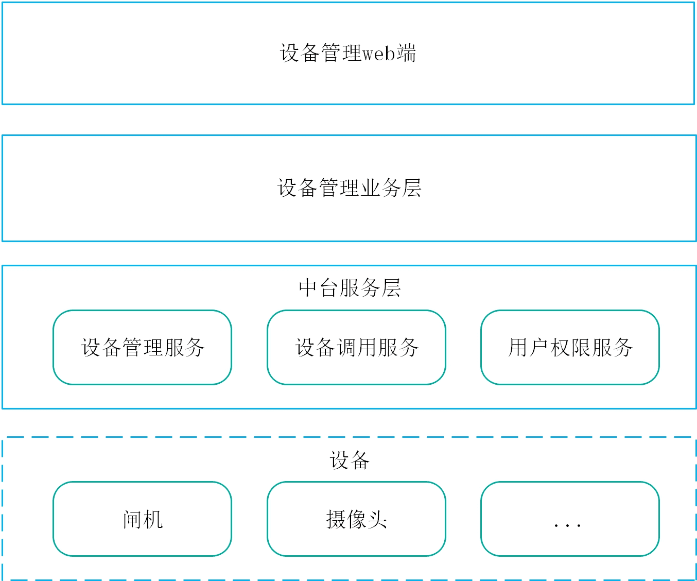

&nbsp;&nbsp;人员出入口当前进行身份验证的方案主要有刷卡、人脸识别、指纹验证、密码验证、刷身份证等方式。 

&nbsp;&nbsp;随着人脸识别技术成熟，人脸验证的快捷无感逐渐成了大家越来越倾向的验证方案。人员出入口承担着记录人员出入、权限验证的职责，一些企业内还会承担人员考勤的职责。园区内人员出入口人流常有上下班高峰人流较大的情况，需要保证在高峰期人员通行效率。 

&nbsp;&nbsp;我们使用设备管理接入服务，为基于人脸检测的人员出入口闸机控制做了一个演示demo。在本demo中，接入了摄像头、闸机等设备和图像识别服务的AI人脸识别算法。 

&nbsp;&nbsp;在本demo中我们使用微服务的调用实现方式，实现了一个模拟设备管理业务层的服务消费者，消费图像识别服务识别的人脸信息，然后从用户权限服务中校验权限，进而调用设备管理接入服务对闸机进行控制，实现人员通过时通过人脸识别对权限进行验证开闸流程。 

闸机控制过程中，设备管理调用服务和其他服务及设备交互流程如下：
~~~ mermaid
sequenceDiagram
participant C as 设备管理业务层
participant D as 设备管理调用服务
participant U as 用户权限服务
participant G as 闸机
participant V as 图像识别服务
participant K as Kafka
V->>K:人脸识别信息
K->>C:人脸识别信息
activate C
C->>U:权限查询
U-->>C:权限结果
C->>D:设备调用命令
deactivate C
D->>G:开闸或告警指令
~~~
