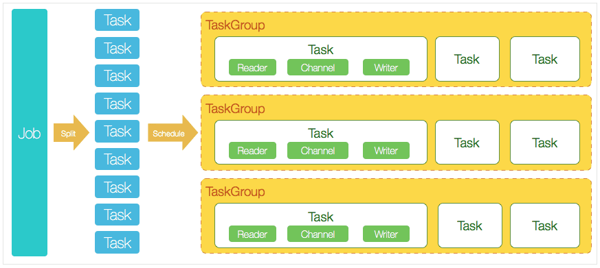
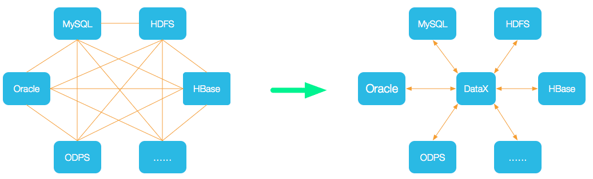
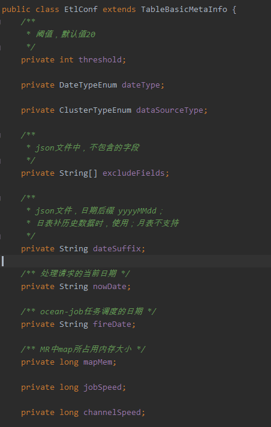
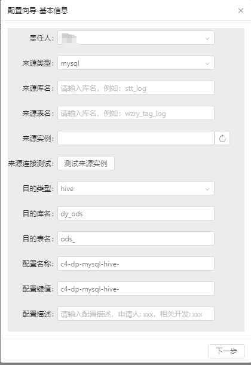
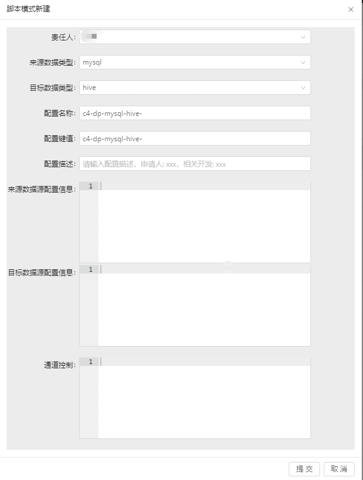
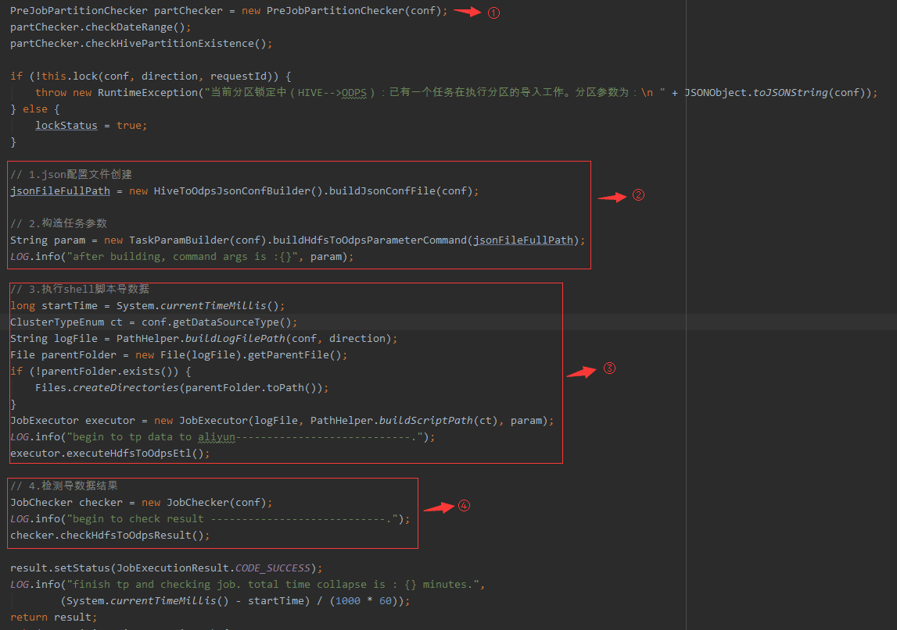

# 一、背景
当前异构数据接入系统，主要开源方案仅实现了数据迁移的引擎功能，使用成本和数据安全风险都较高，需要平台来管理这些数据同步任务，便于使用与维护，主要的实现方案有：

1. 使用开源sqoop方案，将任务开发再shell脚本中，有较大密码泄露风险，且随着任务越来越多，任务的管理成本指数级上升；
2. 基于DataX方案，根据数据源和数据目标库的不同，使用插件模式开发，即插即用，扩展性好；
3. 完全自主研发，需要对异构数据源之间迁移数据有较高的熟悉程度。

基于当前各方面因素考虑，优先实现从MySQL同步至Hive功能，会采用方案2。

# 二、实现方案
## 2.1、概述
数据接入整体方案是基于**DataX（或DataX-On-Hadoop集群模式）+配置中心**。借鉴业界成熟的开源数据同步工具DataX，在此基础上做Web化改造，完成数据接入任务线下迁移至线上，方便配置文件的维护管理，降低数据接入开发成本。

注：WebUI功能，可参考： [https://github.com/WeiYe-Jing/datax-web](https://github.com/WeiYe-Jing/datax-web) （DataX Web是在DataX之上开发的分布式数据同步工具，提供简单易用的操作界面，[https://segmentfault.com/u/weiye_jing/articles](https://segmentfault.com/u/weiye_jing/articles) 作者博客中有代码讲解系列文章）

## 2.2、DataX3.0架构图


设计理念：将复杂的网状同步链路变成星型数据链路。



## 2.3、安装
### 2.3.1、基础环境
- Linux
- [JDK(1.8以上，推荐1.8)](http://www.oracle.com/technetwork/cn/java/javase/downloads/index.html)
- [Python(推荐Python2.6.X)](https://www.python.org/downloads/)
- [Apache Maven 3.x](https://maven.apache.org/download.cgi) (Compile DataX)

### 2.3.2、DataX安装
可参考[https://github.com/alibaba/DataX/blob/master/userGuid.md](https://github.com/alibaba/DataX/blob/master/userGuid.md)

## 2.4、平台化改造
### 2.4.1、插件
MySQLReader参数说明文档见：[https://github.com/alibaba/DataX/blob/master/mysqlreader/doc/mysqlreader.md](https://github.com/alibaba/DataX/blob/master/mysqlreader/doc/mysqlreader.md)

HdfsWriter参数说明见文档：[https://github.com/alibaba/DataX/blob/master/hdfswriter/doc/hdfswriter.md](https://github.com/alibaba/DataX/blob/master/hdfswriter/doc/hdfswriter.md)

### 2.4.2、参数
表基础配置信息



### 2.4.3、数据接入参数配置
向导模式创建MySQL-》Hive数据同步任务参数：



脚本模式创建MySQL-》Hive数据同步任务参数：



以上均为内部参数，具体参数可参见DataX插件文档

### 2.4.4、代码示例



第一步：对目标源（Hive）做分区有无检测，若无该分区则抛出异常。

第二步：获取页面配置的参数，构造数据同步需要的json配置，并在机器上构建执行所需的Python/Shell脚本。

第三步：执行Python/Shell脚本开始数据同步。

第四步：检测导入的数据，获取记录数和源数据对比，如MySQL-》Hive可无需这一步处理。

### 2.4.5、普通文件上传
DataX支持的文件类型中暂时不支持普通文件上传方式，官方文档可以看到不支持普通文件操作：

- 实现包括 MySQL、Oracle、SqlServer、Postgre、HDFS、Hive、ADS、HBase、TableStore(OTS)、MaxCompute(ODPS)、DRDS 等各种异构数据源之间高效的数据同步功能。
- HdfsWriter提供向HDFS文件系统指定路径中写入TEXTFile文件和ORCFile文件,文件内容可与hive中表关联。
- FtpWriter提供了向远程FTP文件写入CSV格式的一个或者多个文件，在底层实现上，FtpWriter将DataX传输协议下的数据转换为csv格式，并使用FTP相关的网络协议写出到远程FTP服务器。
- TxtFileReader提供了读取本地文件系统数据存储的能力。在底层实现上，TxtFileReader获取本地文件数据，并转换为DataX传输协议传递给Writer。

如果需要实现普通文件同步，实现方案：

1. Hadoop API方式

```
public static void copyFileToHDFS(boolean delSrc,boolean overwrite,String srcFile,String destPath){
    // 源文件路径是 Linux 下的路径
    Path srcPath = new Path(srcFile);
    // 目的路径
    String hdfsUri = HDFSUri;
    if(StringUtils.isNotBlank(hdfsUri)){
        destPath = hdfsUri + destPath;
    }
    Path dstPath = new Path(destPath);
    // 实现文件上传
    try{
        // 获取 FileSystem 对象
        FileSystem fs = getFileSystem();
        fs.copyFromLocalFile(srcPath,dstPath);
        fs.copyFromLocalFile(delSrc,overwrite,srcPath,dstPath);
        // 释放资源
        fs.close();
    }catch(IOException e){
        logger.error("",e);
    }
}
```

2. 普通文件使用Ceph或者其他存储。

    将把HDFS用作普通文件存储不多见，可以考虑更合适的存储组件。

