# 1.概述

元数据通常定义为”关于数据的数据”，元数据贯穿了数据仓库的整个生命周期，使用元数据驱动数据仓库的开发，使数据仓库自动化，可视化。元数据打通了源数据、数据仓库、数据应用，记录数据从产生到消费的全过程。

元数据主要记录数据仓库中模型的定义、各层级间的映射关系、监控数据仓库的数据状态及 ETL 的任务运行状态。在数据仓库系统中，元数据可以帮助数据仓库管理员和开发人员非常方便地找到他们所关心的数据，用于指导其进行数据管理和开发工作，可以极大的提升工作的效率。

# 2.元数据定义

将元数据按用途的不同分为两类：

- 技术元数据（Technical Metadata)
- 业务元数据（Business Metadata）

## （1）技术元数据

技术元数据是存储关于数据仓库系统技术细节的数据，是用于开发和管理数据仓库使用的数据。常见的技术元数据有：

1. 存储元数据：

    如表、字段、分区等信息。记录了表的中英文名及表状态。分区信息、责任人信息、对应主题，文件大小、表类型，生命周期，权限信息

    记录列的字段中英文名、字段类型、字段备注、是否是分区字段，保密级别及权限信息等信息。

2. 运行元数据：

    如大数据平台上所有作业运行等信息：类似于 Hive Job 日志，包括作业类型、实例名称、输入输出、 SQL 、运行参数、执行时间，执行引擎等。

3. 数据开发平台中数据同步、计算任务、任务调度等信息：

    包括数据同步的输入输出表和字段，以及同步任务本身的节点信息。计算任务主要有输入输出、任务本身的节点信息。任务调度主要有任务的依赖类型、依赖关系等，以及不同类型调度任务的运行日志等。

4. 数据质量和运维相关元数据：

    如任务监控、运维报警、数据质量、故障等信息，包括任务监控运行日志、告警配置及运行日志、故障信息等。

## （2）业务元数据

业务元数据从业务角度描述了数据仓库中的数据，它提供了介于使用者和实际系统之间的语义层，使得不懂计算机技术的业务人员也能够读懂数据仓库中的数据。

常见的业务元数据有维度及属性(包括维度编码，字段类型，创建人，创建时间，状态等)、业务过程、指标(包含指标名称,指标编码，业务口径，指标类型，责任人，创建时间，状态，SQL等)，安全等级，计算逻辑等的规范化定义，用于更好地管理和使用数据。数据应用元数据，如数据报表、数据产品等的配置和运行元数据。

# 3.元数据价值

元数据有重要的应用价值，是数据管理、数据内容、数据应用的基础，在数据管理方面为集团数据提供在计算、存储、成本、质量、安全、模型等治理领域上的数据支持。

1. 例如在计算上可以利用元数据查找超长运行节点，对这些节点进行专项治理，保障基线产出时间。
2. 在数据内容方面为公司数据进行数据域、数据主题、业务属性等的提取和分析提供数据素材。
3. 例如可以利用元数据构建知识图谱，给数据打标签，清楚地知道现在有哪些数据。
4. 在数据应用方面打通产品及应用链路，保障产品数据准确、及时产出。
5. 例如打通DP和应用数据，明确数据产等级，更有效地保障产品数据。

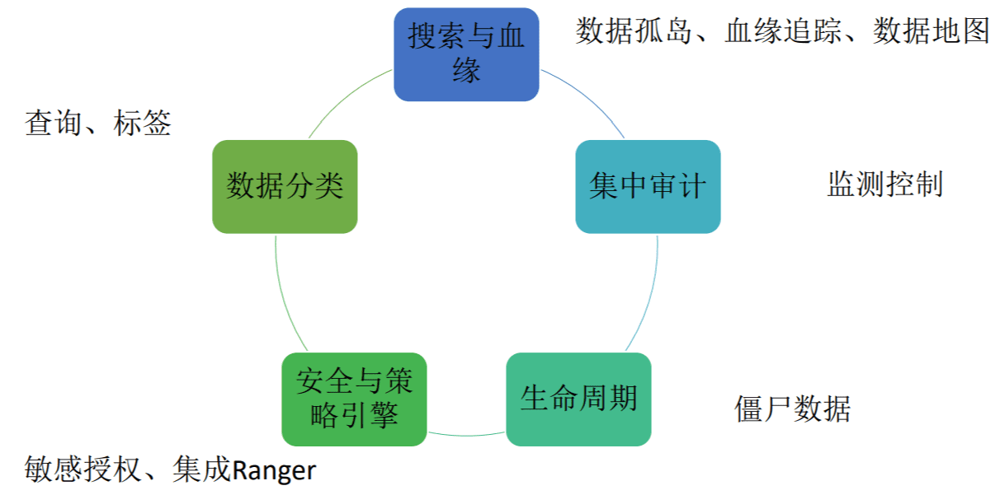

# 4.元数据管理

对于元数据管理，目前来说有三种方式可供选择。

## 1.Excel手工录入保存  

对于规模比较小，并且业务不大的公司，可能会用这种方式，简单方便操作。但是这种方式容易出错，维护性差。

## 2.自研元数据管理系统或者在数据平台开发元数据管理模块

很多公司会自研元数据管理系统或者相关模块，直接读取Hive元数据或者数据平台配置的任务及调度元数据进行展示，相比较Excel人工导入，功能扩展性更强，会更自主可控，统一管控技术元数据和业务元数据。但是相对于Atlas，实现成本更高，且如果没有长期迭代维护，效果不一定有Atlas好，很多时候也需要批量导入和手工录入。

采用自研方案实现系统效果图如下：

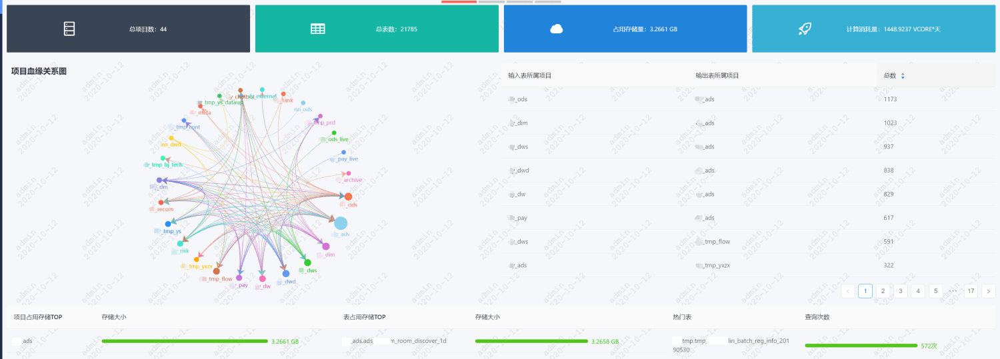

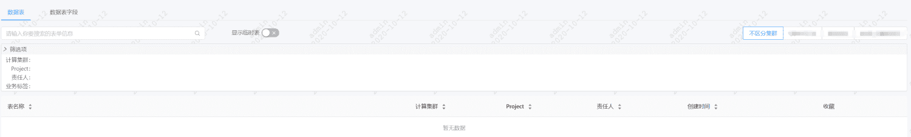

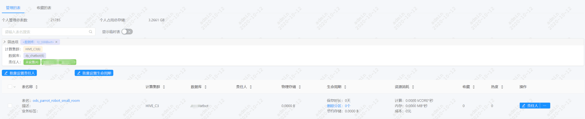

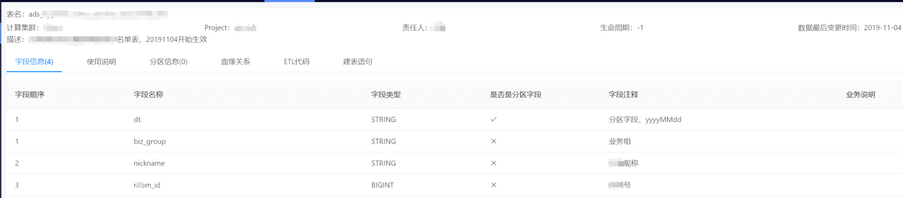

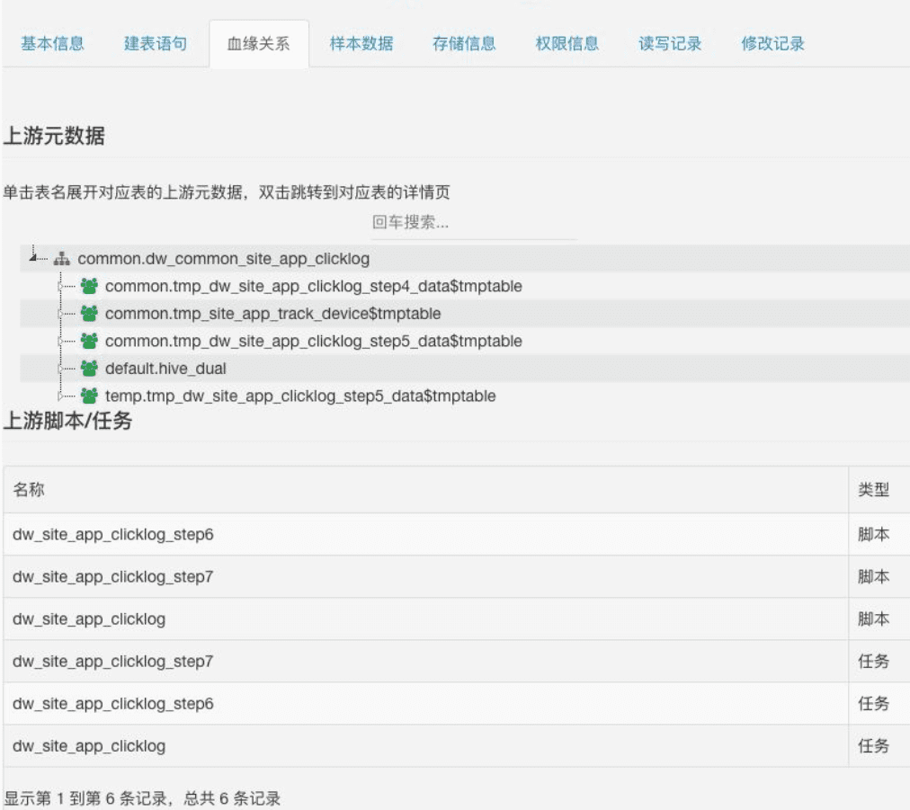

## 3.开源技术方案——Atlas元数据管理（常用）

Atlas 是一个可伸缩且功能丰富的元数据管理系统，深度对接了 Hadoop 大数据组件。简单理解就是一个跟 Hadoop 关系紧密的，可以用来做各类数据的元数据管理的一个软件系统。Atlas本身从技术上来说，就是一个典型的JavaWeb系统，其整体结构图如下所示：

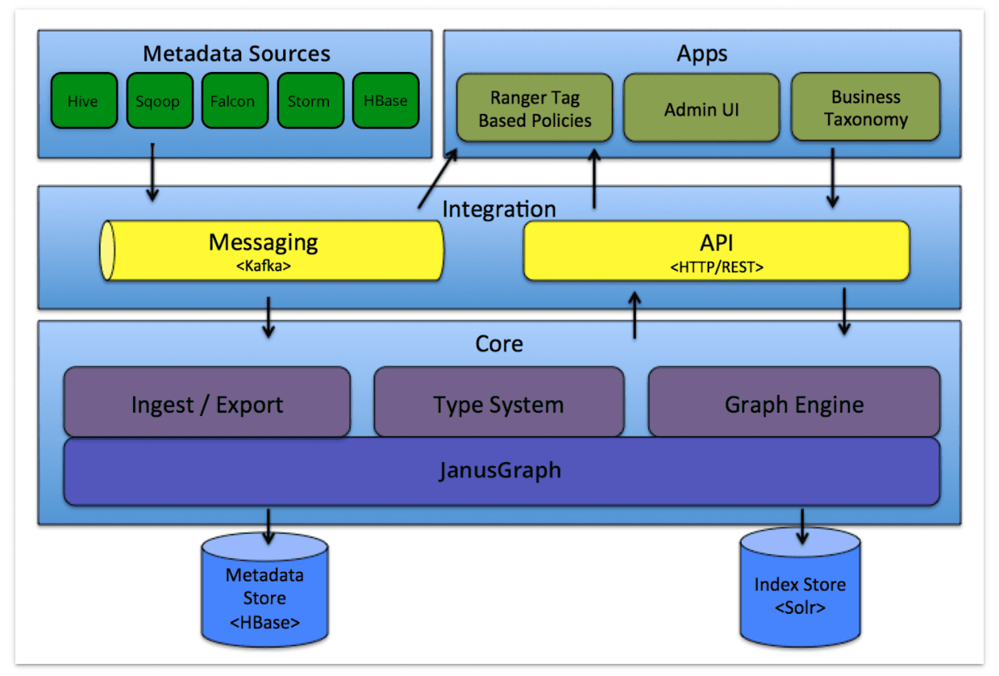

### 3.1 核心组件

- Core
    1. Type System：Atlas 允许用户为他们想要管理的元数据对象定义一个模型。该模型由称为“类型” 的定义组成。“类型” （类）的 实例被称为 “实体” ，表示被管理的实际元数据对象。类型系统是一个组件，允许用户定义和管理类型和实体。由 Atlas 管理的所有元数据对象（例如Hive表）都使用类型进行建模，并表示为实体(类对象，一条数据)。
    2. Ingest / Export：Ingest 组件允许将元数据添加到 Atlas。类似地，Export 组件暴露由 Atlas 检测到的元数据更改，以作为事件引发，消费者可以使用这些更改事件来实时响应元数据更改。
    3. Graph Engine ：在内部，Atlas 通过使用图形模型管理元数据对象。以实现元数据对象之间的巨大灵活性和丰富的关系。图形引擎是负责在类型系统的类型和实体之间进行转换的组件，以及基础图形模型。除了管理图形对象之外，图形引擎还为元数据对象创建适当的索引，以便有效地搜索它们。

- Integration

    用户可以使用两种方法管理 Atlas 中的元数据：

    1. API：Atlas 的所有功能都可以通过 REST API 提供给最终用户，允许创建，更新和删除类型和实体。它也是查询和发现通过 Atlas 管理的类型和实体的主要方法。

    2. Messaging：除了 API 之外，用户还可以选择使用基于 Kafka 的消息接口与 Atlas 集成。这对于将元数据对象传输到 Atlas 以及从 Atlas 使用可以构建应用程序的元数据更改事件都非常有用。如果希望使用与 Atlas 更松散耦合的集成，这可以允许更好的可扩展性，可靠性等，消息传递接口是特别有用的。Atlas 使用 Apache Kafka 作为通知服务器用于钩子和元数据通知事件的下游消费者之间的通信。事件由钩子(hook)和 Atlas 写到不同的 Kafka 主题:

        ATLAS_HOOK: 来自 各个组件的Hook 的元数据通知事件通过写入到名为 ATLAS_HOOK 的 Kafka topic 发送到 Atlas

        ATLAS_ENTITIES：从 Atlas 到其他集成组件（如Ranger）的事件写入到名为 ATLAS_ENTITIES 的 Kafka topic

- Metadata source

    Atlas 支持与许多元数据源的集成，将来还会添加更多集成。目前，Atlas 支持从以下数据源获取和管理元数据：

    1. Hive：通过hive bridge，Atlas可以接入Hive的元数据，包括hive_db/hive_table/hive_column/hive_process

    2. Sqoop：通过sqoop bridge，Atlas可以接入关系型数据库的元数据，包括sqoop_operation_type/sqoop_dbstore_usage/sqoop_process/sqoop_dbdatastore

    3. Falcon：通过falcon bridge，Atlas可以接入Falcon的元数据，包括falcon_cluster/falcon_feed/falcon_feed_creation/falcon_feed_replication/falcon_process
    
    4. Storm：通过storm bridge，Atlas可以接入流式处理的元数据，包括storm_topology/storm_spout/storm_bolt

    说明：Atlas集成大数据组件的元数据源需要实现以下两点：
    
    1. 需要基于atlas的类型系统定义能够表达大数据组件元数据对象的元数据模型(例如Hive的元数据模型实现在org.apache.atlas.hive.model.HiveDataModelGenerator)

    2. 需要提供hook组件去从大数据组件的元数据源中提取元数据对象，实时侦听元数据的变更并反馈给atlas

- Applications
    1. Atlas Admin UI: 该组件是一个基于 Web 的应用程序，允许数据管理员和科学家发现和注释元数据。Admin UI提供了搜索界面和类SQL的查询语言，可以用来查询由 Atlas 管理的元数据类型和对象。Admin UI 使用 Atlas 的 REST API 来构建其功能。

    2. Tag Based Policies: Apache Ranger 是针对 Hadoop 生态系统的高级安全管理解决方案，与各种 Hadoop 组件具有广泛的集成。通过与 Atlas 集成，Ranger 允许安全管理员定义元数据驱动的安全策略，以实现有效的治理。 Ranger 是由 Atlas 通知的元数据更改事件的消费者。

        Apache Atlas支持企业在数据生态系统中应用一致的数据分类标准。Apache Ranger 为 Hadoop 提供集中的安全性管理通过将 Atlas 与 Ranger 相集成，支持企业在运行时制定动态访问策略，从而帮助主动预防违规事件。这种整合成使企业能够实施基于分类的动态安全策略。
    
        Ranger 的集中式平台支持数据管理员根据 Atlas 元数据标签或属性确定安全策略。然后，他们可以对数据集的整个层级（包括数据库、表和列）实时应用该策略。
    
        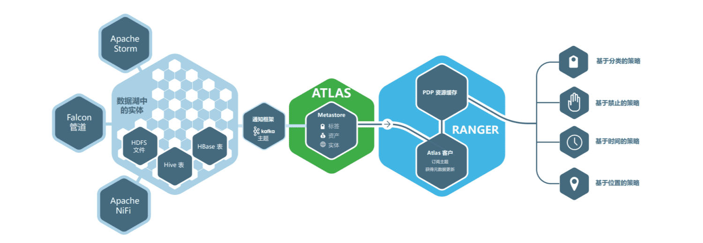

    3. Business Taxonomy:从元数据源获取到 Atlas 的元数据对象主要是一种技术形式的元数据。为了增强可发现性和治理能力，Atlas 提供了一个业务分类界面，允许用户首先定义一组代表其业务域的业务术语，并将其与 Atlas 管理的元数据实体相关联。业务分类法是一种 Web 应用程序，目前是 Atlas Admin UI 的一部分，并且使用 REST API 与 Atlas 集成。

### 3.2 Atlas 的使用

ATLAS的使用，包含两个方面：

1. 注入元数据信息到Atlas中（本质是：写入元数据到Atlas中）
    - 注入方式1：通过Atlas为数据系统开发好的Hook来注入
    - 注入方式2：通过Atlas自带的WEB-UI来人工填写元数据信息再注入
    - 注入方式3：通过在自己的数据系统中调用atlas对外暴露的API，来灵活注入
2. 使用Atlas中的元数据信息来为我们服务（本质是：从Atlas中读、改元数据）
    - 方式1：通过Atlas自带的WEB-UI前端系统来查看、修改元数据
    - 方式2：通过调用Atlas对外暴露的API，来开发自己的管理系统

### 3.3 Atlas支持的数据源

Atlas支持的数据源有：

   - [HBase](https://atlas.apache.org/#/HookHBase)
   - [Hive](https://atlas.apache.org/#/HookHive)
   - [Sqoop](https://atlas.apache.org/#/HookSqoop)
   - [Storm](https://atlas.apache.org/#/HookStorm)
   - [Kafka](https://atlas.apache.org/#/HookKafka)

注意：元数据源不在支持范围的4种内的, 比如MySQL的数据，现在暂时不支持，可以通过 Sqoop 将关系型数据库导入 Hive 等方式间接的实现关系型数据库的支持。

sqoop将MySQL数据库所有表数据同步到hive仓库命令：

```
sqoop import-all-tables  --connect jdbc:mysql://192.168.1.1:3306/testdb --username root --password ****** --hive-import --hive-database testdb  --m 1
```

Atlas管理台可以查看到每张表的血缘关系图:

Atlas目前不能采集到Spark计算任务的血缘关系。为了能够更好的监控数据质量，了解输出数据的计算逻辑，可以采用开源框架 Spline (from Spark lineage)作为计算任务血缘关系的采集方案。

## 4.开源技术方案——Metacat

Netflix公司的数据存储在Amazon S3、Druid、Elasticsearch、Redshift、Snowflake和 MySql 中。并且需要使用Spark、Presto、Pig和Hive消费、处理和生成数据集。因为数据源的多样性，为了确保数据平台能够横跨这些数据集成为一个“单一”的数据仓库，因此诞生了Metacat。Metacat是一种元数据服务，方便发现、处理和管理数据。 

Metacat的目标：

1. 元数据系统的联合视图（所有数据存储的元数据访问层）
2. 用于数据集元数据的统一API（各种计算引擎可以用来访问不同数据集的集中式服务）
3. 数据集的任意业务和用户元数据存储

Metacat是一种联合服务，提供统一的REST/Thrift接口来访问各种数据存储的元数据。元数据存储仍然是模式元数据的事实来源，所以Metacat没有保存这部分元数据。Metacat只保存业务相关和用户定义的元数据。它还将所有关于数据集的信息发布到Elasticsearch，以便进行全文搜索和发现。

Metacat的功能可以分为以下几类：

1. 数据抽象和互操作性
2. 业务和用户定义的元数据存储
3. 数据发现
4. 数据变更审计和通知
5. Hive Metastore优化

### 4.1 Atlas对比MetaCat

1. 血统采集（数据源）：Atlas支持数据源有Hive、Sqoop、Falcon、Storm和Hbase。Metacat支持的数据源RDS、AMAZON REDSHIFT、HIVE、Druid、Snowflke。
2. 元数据管理的模式：Atlas需要按照统一元数据规则，对元数据进行配置导入。而Metacat是直接从所支持的数据源中获取各自的元数据，对源数据库的元数据进行相应的转换，以形成元数据系统的联合视图，从而达到查询引擎交互查询不同数据系统的目的。
3. 血统的生命周期：Altas利用图数据库提供了UI界面，可直观的看到血统的生命周期。Metacat没有相应的UI界面，它将数据集组织为目录帮助消费者浏览信息，它使用标签来识别表格，进行血统的生命周期管理。
4. 图数据库：Atlas应用了JanusGraph作为源数据的图数据库，并用Hbase作为图数据库的后备存储，同时Atlas为实现通过图数据库索引元数据以支持全文本搜索查询，官网建议将Solr或Elasticsearch作为JanusGraph（图数据库）的后备索引存储，从而提高搜索的效率。Metacat将关于元数据的所有信息存储到Elasticsearch中。
5. 数据地图：Atlas所提供的UI界面不仅可以看到血统的生命周期，而且还可以确定目标数据是由那些来源数据所形成，同时也可以定位到各个来源数据所属的数据系统甚至可以定位到那个库的那个表。Altas同时支持数据字段的来源追踪。这对数据异常的追踪和定位提供了极大的方便。Metacat可以通过Elasticsearch查询元数据的相关信息，进行相应数据管理。
6. 数据状态的检测：Atlas中的导出模块，将元数据的状态暴露出来，一旦状态发生改变，将会生成相应的事件，下游的消费者会获取到相应的事件，并实时的作出元数据状态的响应。Metacat可以对所有元数据和数据的变更进行捕获，通过消息推送系统将事件推送到外部的数据管道，来了解数据的使用情况及趋势。
7. 组件的可扩展性：Atlas扩展新的大数据组件时，只需要将组件的HOOK按照kafka的规范添加到系统中即可，这样Atlas就可以对这一新的组件进行管理。Metacat扩展新的数据源时需要进行相应的开发，这也是Metacat未来待增强的特性之一。
8. Hive Metastore：Atlas和Metacat支持的数据源都有Hive，但Atlas使用的是传统的Hive Metastore，而Metacat对传统的Hive Metastore进行了相应的改进，避免了添加数千个分区的Hive Metastore调用时会发生超时的问题。

# 5.基于Atlas的元数据管理

## 5.1Atlas元数据存储模型分析

从三个方面介绍Atlas存储：类型系统、图存储模型以及类型是实体的存储结构。

### 5.1.1 Types(类型)介绍

Atlas允许用户为他们想要管理的元数据对象定义模型。该模型由称为Type(类型)的定义组成，称为Entities(实体)的Type(类型)实例，表示受管理的实际元数据对象。 Type System是一个允许用户定义和管理类型和实体的组件。开箱即用的Atlas管理的所有元数据对象（例如Hive表）都使用类型建模并表示为实体。要在Atlas中存储新类型的元数据，需要了解类型系统组件的概念。

Atlas中的 "类型" 定义了如何存储和访问特定类型的元数据对象。类型表示了所定义元数据对象的一个或多个属性集合。具有开发背景的用户可以将 "类型" 理解成面向对象的编程语言的 "类Class" 定义的或关系数据库的 "表模式 table schema"。

使用Atlas的类型的其中一个示例是Hive表。 Hive表定义了以下属性：

```
Name:         hive_table
TypeCategory: Entity
SuperTypes:   DataSet
Attributes:
    name:             string
    db:               hive_db
    owner:            string
    createTime:       date
    lastAccessTime:   date
    comment:          string
    retention:        int
    sd:               hive_storagedesc
    partitionKeys:    array<hive_column>
    aliases:          array<string>
    columns:          array<hive_column>
    parameters:       map<string,string>
    viewOriginalText: string
    viewExpandedText: string
    tableType:        string
    temporary:        boolean
```

从上面的例子中可以注意到以下几点：

- Atlas中的类型(Type)由`name`唯一标识

- Type具有元类型。Atlas中有以下元类型：
    - **原始元类型(Primitive metatypes)** ：boolean，byte，short，int，long，float，double，biginteger，bigdecimal，string，date
    - **枚举元型(Enum metatypes)** 
    - **集合元类型(Collection metatypes:)** ：array, map
    - **复合元类型(Composite metatypes)** ：Entity, Struct, Classification, Relationship

- 实体(Entity)和分类(Classification)类型可以从其他类型继承，称为“超类型/父类型”(supertype) ，它包括在超类型中定义的属性。这允许建模者在一组相关类型等中定义公共属性。类似于面向对象语言如何为类定义父类。 Atlas中的类型也可以从多个超类型扩展。
    - 在此示例中，每个配置单元表都从称为`DataSet`的预定义超类型扩展。

- 具有元类型`Entity`，`Struct`，`Classification`或`Relationship`的类型可以具有属性的集合。每个属性都有一个名称（例如:`name`）和一些其他相关属性。可以使用表达式`type_name.attribute_name`引用属性。值得注意的是，属性本身是使用Atlas元类型定义的。
    - 在此示例中，hive_table.name是String，hive_table.aliases是一个字符串数组，hive_table.db是指一个名为hive_db的类型的实例，依此类推。

- 属性中的类型引用（如hive_table.db）特别有趣，使用这样的属性，我们可以定义Atlas中定义的两种类型之间的任意关系，从而构建丰富的模型。此外，还可以将引用列表收集为属性类型（例如，hive_table.columns，表示从hive_table到hive_column类型的引用列表）

### 5.1.2 Entities(实体)
Atlas中的entity是type的特定值或实例，因此表示现实世界中的特定元数据对象。用我们对面向对象编程语言的类比，实例(instance)是某个类(Class)的对象(Object)。

实体的其中一个示例就是Hive表。Hive在'default'数据库中有一个名为'customers'的表。该表是hive_table类型的Atlas中的“实体”。由于是实体类型的实例，它将具有作为Hive表'type'的一部分的每个属性的值。

```
guid:     "9ba387dd-fa76-429c-b791-ffc338d3c91f"
typeName: "hive_table"
status:   "ACTIVE"
values:
    name:             “customers”
    db:               { "guid": "b42c6cfc-c1e7-42fd-a9e6-890e0adf33bc", "typeName": "hive_db" }
    owner:            “admin”
    createTime:       1490761686029
    updateTime:       1516298102877
    comment:          null
    retention:        0
    sd:               { "guid": "ff58025f-6854-4195-9f75-3a3058dd8dcf", "typeName": "hive_storagedesc" }
    partitionKeys:    null
    aliases:          null
    columns:          [ { "guid": ""65e2204f-6a23-4130-934a-9679af6a211f", "typeName": "hive_column" }, { "guid": ""d726de70-faca-46fb-9c99-cf04f6b579a6", "typeName": "hive_column" }, ...]
    parameters:       { "transient_lastDdlTime": "1466403208"}
    viewOriginalText: null
    viewExpandedText: null
    tableType:        “MANAGED_TABLE”
    temporary:        false
```

- 实体类型的每个实例都由唯一标识符GUID标识。此GUID由Atlas服务器在定义对象时生成，并在实体的整个生命周期内保持不变。在任何时间点，都可以使用其GUID访问此特定实体。
  
    - 在此示例中，默认数据库中的“customers”表由GUID“9ba387dd-fa76-429c-b791-ffc338d3c91f”唯一标识。

- 实体具有给定类型，并且类型的名称随实体定义一起提供。

    - 在此示例中，'customers'表是'hive_table'类型。

- 该实体的值是hive_table类型定义中定义的属性的所有属性名称及其值的映射。 属性值将根据属性的数据类型。实体类型属性将具有AtlasObjectId类型的值

有了实体的这个设计，我们现在可以看到Entity和Struct元类型之间的区别。实体(Entity)和结构(Struct)都构成其他类型的属性。但是，实体类型的实例具有标识(具有GUID值)，并且可以从其他实体引用（例如，从hive_table实体引用hive_db实体）。 Struct类型的实例没有自己的标识。 Struct类型的值是在实体本身内“嵌入”的属性集合。

### 5.1.3 Attributes(属性)
我们已经看到，属性(attributes)是在实体(Entity)，结构(Struct)，分类(Classification)和关系(Relationship)等元类型中定义的。但我们将属性列举为具有名称和元类型值。然而，Atlas中的attributes具有一些properties，这些properties定义了与类型系统相关的更多概念。

attributes具有以下properties：

```
name:        string,
    typeName:    string,
    isOptional:  boolean,
    isIndexable: boolean,
    isUnique:    boolean,
    cardinality: enum
```

上述属性具有以下含义：

- `name`: 属性的名称
- `dataTypeName`: 属性的元类型名称（native, collection, composite）
- `isComposite`:
    - 该标志表示建模的一个方面。如果将属性定义为复合(composite)，则意味着它不能具有独立于其所包含的实体的生命周期。这个概念的一个很好的示例是构成hive表的一部分的列集。由于列在hive表外部没有意义，因此它们被定义为复合属性。
    - 必须在Atlas中创建复合属性及其包含的实体。即，必须与hive表一起创建配置单元列。
- `isIndexable`
    - 标志指示是否应该对此属性建立索引，以便可以使用属性值作为谓词来执行查找，并且可以有效地执行查找。
- `isUnique`
    - 同样与索引相关。如果指定为唯一，则表示在JanusGraph中为此属性创建了一个特殊索引，允许基于相等的查找。
    - 具有该标志的真值的任何属性都被视为主键，以将该实体与其他实体区分开。因此，应该注意确保此属性确实在现实世界中为唯一属性建模。
        - 对于例如考虑hive_table的name属性。在单独的情况下，名称不是hive_table的唯一属性，因为具有相同名称的表可以存在于多个数据库中。如果Atlas在多个集群中存储hive表的元数据，那么即使是一对（数据库名称，表名）也不是唯一的。在物理世界中，只有集群位置，数据库名称和表名称才能被视为唯一。
- `multiplicity`: 标示该属性是必选(required)，可选(optional)的还是可以是多值的(multi-valued)。如果实体的属性值定义与类型定义中的多重性声明不匹配，则这将违反约束，并且实体添加将失败。因此，该字段可用于定义元数据信息的一些约束。

根据上面的内容，让我们展开下面的hive表的一个attributes的属性定义。让我们看一下名为'db'的属性，它表示hive表所属的数据库：

```
db:
    "name":        "db",
    "typeName":    "hive_db",
    "isOptional":  false,
    "isIndexable": true,
    "isUnique":    false,
    "cardinality": "SINGLE"
```

请注意“isOptional = true”约束 - 如果没有db引用，则无法创建表实体。

```
columns:
    "name":        "columns",
    "typeName":    "array<hive_column>",
    "isOptional":  optional,
    "isIndexable": true,
    “isUnique":    false,
    "constraints": [ { "type": "ownedRef" } ]
```

请注意列的“ownedRef”约束。通过这样，我们指出定义的列实体应始终绑定到它们所定义的表实体。

通过此描述和示例，您将能够意识到属性定义可用于影响Atlas系统强制执行的特定建模行为（约束，索引等）。

### 5.1.2 Atlas图存储结构

Atlas中所有数据均采用图存储，包括上文介绍的类型信息schema和具体的元数据实体，目前是Janus graph实现。可以预见，Atlas的所有数据最终都会转换成图存储中的顶点vertex、边edge和属性property三种元素。在内部的元数据系统中，Janus graph以hbase作为落地存储服务。

对janusgraph来说，需要将存储的三要素：顶点vertex、边edge和属性property转化为上面的模型。转化方式有两种：顶点切分和边切分。点切分即每个顶点转化为hbase的一行数据，顶点属性和关联此顶点的所有边均作为hbase的column存储在一行中。janusgraph正是采用了点分存储方式。

janusgraph存储模型转化后的结果如下图所示：

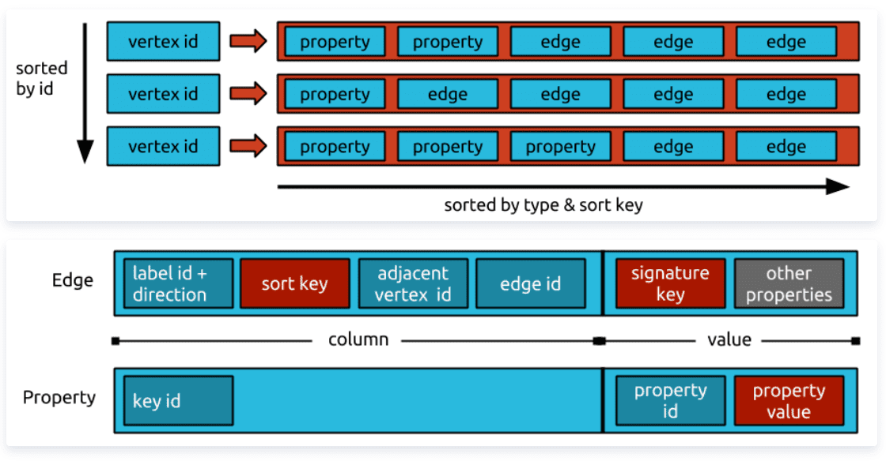

### 5.1.3 Atlas元数据存储模型
Atlas在图中存储的数据分两大类：**类型定义的存储** 和**元数据的存储** 。类型定义信息是元数据的元数据，比如tencent_bg类型，描述了腾讯BG拥有的属性名称和类型清单。

类型定义模型

- enum类型定义(enumDef)
- struct类型定义(structDef)
- classification类型定义(classificationDef)
- entity类型定义(entityDef)
- relationship定义(relationshipDef)

### 5.1.4 元数据实体图模型
元数据实体是指一种具体元数据类型的实例，比如一张具体的tdw hive表信息，或者一个具体BG信息。原始的信息以Json格式存在，后被转化为图存储模型。一个tencent_bg的json化数据如下：

```json
{
    "referredEntities": {},
    "entities": [
        {
            "typeName": "tencent_bg",
            "attributes": {
                "owner": "ls",
                "qualifiedName": "CSIG@tencent",
                "name": "CSIG",
                "description": "csig bussiness group"
            },
            "guid": "-1234567890",
            "proxy": false,
            "version": 0
        }
    ]
}
```

虽然具体的实体如thive表或tencent_bg携带不同的属性或引用关系信息，但是在底层图中存储却有相同的模型。

### 5.1.5 Atlas类型解析
Atlas中的类型是是可扩展的，开发人员通过简单的Json格式的类型定义描述，就可以实现新的类型。正是具有扩展性，Atlas需要对所有的类型信息进行解析校验，只有通过解析校验的类型，才是符合Atlas元数据管理规范的，这也是上面所有存储模型能成功落地到图数据库的前件。

解析校验最重要的逻辑是检查类型所有原生类型属性是否符合schema要求、所有引用类型的属性是否在现有图中已定义。其实整个resolve过程简单来看，围绕2方面进行：

- 属性，包括继承父类属性，解析属性的constraint，以及添加relationship中定义的属性到entityType中；当然会处理relation中边的label和direction等关系
- 类型继承，填充各种superType和subType

## 5.2 元数据采集 
Atlas 使用 Titan 图数据库来存储元数据对象。 Titan 使用两个存储：默认情况下元数据存储配置为 HBase ，索引存储配置为 Solr 。也可以通过构建相应的配置文件将元数据存储作为 BerkeleyDB 和 Index 存储使用为 ElasticSearch 。元数据存储用于存储元数据对象本身，并且索引存储用于存储元数据属性的索引，其允许高效搜索 。

Titan是一个分布式的图数据库，支持横向扩展，可容纳数千亿个顶点和边。 Titan支持事务，并且可以支撑上千并发用户和 计算复杂图形遍历。

Atlas安装完之后会在hive-site.xml文件中插入，是一个钩子函数:


Hive 在使用 hive hook 的hive 命令执行上支持侦听器。 这用于在 Atlas 中使用org.apache.atlas.hive.model.HiveDataModelGenerator 中定义的模型添加/更新/删除实体。 hive hook将请求提交给线程池执行器，以避免阻塞命令执行。 线程将实体作为消息提交给通知服务器，并且服务器读取这些消息并注册实体。

如果Atlas中没有元数据，需要手动执行：

/usr/hdp/2.6.0.3-8/atlas/hook-bin/import-hive.sh

Atlas认为数据治理有如下类型：


可以看出其包括了数据装载名称，数据库名称和权限拥有者，表名称，视图名称，字段名称，还有数据访问方式，维度，度量，ETL这些分类特性等内容。

### 5.2.1 Hive Model
默认 hive 建模在 org.apache.atlas.hive.model.HiveDataModelGenerator 中可用。 它定义以下类型：

```
hive_db(ClassType) - super types [Referenceable] - attributes [name, clusterName, description, locationUri, parameters, ownerName, ownerType]
  hive_storagedesc(ClassType) - super types [Referenceable] - attributes [cols, location, inputFormat, outputFormat, compressed, numBuckets, serdeInfo, bucketCols, sortCols, parameters, storedAsSubDirectories]
  hive_column(ClassType) - super types [Referenceable] - attributes [name, type, comment, table]
  hive_table(ClassType) - super types [DataSet] - attributes [name, db, owner, createTime, lastAccessTime, comment, retention, sd, partitionKeys, columns, aliases, parameters, viewOriginalText, viewExpandedText, tableType, temporary]
  hive_process(ClassType) - super types [Process] - attributes [name, startTime, endTime, userName, operationType, queryText, queryPlan, queryId]
  hive_principal_type(EnumType) - values [USER, ROLE, GROUP]
  hive_order(StructType) - attributes [col, order]
  hive_serde(StructType) - attributes [name, serializationLib, parameters]
```

使用唯一的限定名称创建和去重复实体。它们提供命名空间，也可以用于 query／lineage。请注意，dbName，tableName 和 columnName 应为小写。 clusterName 解释如下。

- hive_db - attribute qualifiedName - <dbName>@<clusterName>

- hive_table - attribute qualifiedName - <dbName>.<tableName>@<clusterName>

- hive_column - attribute qualifiedName - <dbName>.<tableName>.<columnName>@<clusterName>

- hive_process - attribute name - <queryString> - 小写的修剪查询字符串

### 5.2.2 导入 Hive Metadata
org.apache.atlas.hive.bridge.HiveMetaStoreBridge 使用org.apache.atlas.hive.model.HiveDataModelGenerator 中定义的模型将 Hive 元数据导入 Atlas。import-hive.sh 命令可以用来方便这一点。脚本需要 Hadoop 和 Hive 类路径 jar。 对于 Hadoop jar，请确保环境变量 HADOOP_CLASSPATH 已设置。另一种方法是将 HADOOP_HOME 设置为指向 Hadoop 安装的根目录同样，对于 Hive jar，将 HIVE_HOME 设置为 Hive 安装的根目录将环境变量 HIVE_CONF_DIR 设置为 Hive 配置目录复制 ${atlas-conf}/atlas-application.properties 到 hive conf 目录


```
Usage: <atlas package>/hook-bin/import-hive.sh
```

日志位于 ${atlas package}/logs/import-hive.log

如果要在 kerberized 集群中导入元数据，则需要运行以下命令：

```
<atlas package>/hook-bin/import-hive.sh -Dsun.security.jgss.debug=true -Djavax.security.auth.useSubjectCredsOnly=false -Djava.security.krb5.conf=[krb5.conf location] -Djava.security.auth.login.config=[jaas.conf location]
```

- krb5.conf is typically found at /etc/krb5.conf

- for details about jaas.conf and a suggested location see the [atlas security documentation](https://link.zhihu.com/?target=http%3A//atlas.apache.org/Security.html)

### 5.2.3 Hive Hook
Hive 在使用 hive hook 的 hive 命令执行上支持侦听器。 这用于在 Atlas 中使用 org.apache.atlas.hive.model.HiveDataModelGenerator 中定义的模型添加/更新/删除实体。 hive hook 将请求提交给线程池执行器，以避免阻塞命令执行。 线程将实体作为消息提交给通知服务器，并且服务器读取这些消息并注册实体。 按照 hive 设置中的这些说明为 Atlas 添加 hive hook ：

- Set-up atlas hook in hive-site.xml of your hive configuration:

```
<property>
  <name>hive.exec.post.hooks</name>
  <value>org.apache.atlas.hive.hook.HiveHook</value>
  </property>
```
```
<property>
  <name>atlas.cluster.name</name>
  <value>primary</value>
  </property>
```

- Add 'export HIVE_AUX_JARS_PATH=<atlas package>/hook/hive' in hive-env.sh of your hive configuration

- Copy <atlas-conf>/atlas-application.properties to the hive conf directory.

在<atlas-conf> /atlas-application.properties中的以下属性控制线程池和通知详细信息：

- atlas.hook.hive.synchronous - boolean，true来同步运行钩子。 默认false。 建议设置为false，以避免 hive 查询完成中的延迟。

- atlas.hook.hive.numRetries - 通知失败的重试次数。 默认值 3

- atlas.hook.hive.minThreads - 核心线程数。 默认值 5

- atlas.hook.hive.maxThreads - 最大线程数。 默认值 5

- atlas.hook.hive.keepAliveTime - 保持活动时间以毫秒为单位。 默认 10

- atlas.hook.hive.queueSize - 线程池的队列大小。 默认 10000

参考 [Configuration](https://link.zhihu.com/?target=http%3A//atlas.apache.org/Configuration.html) 通知相关配置

### 5.2.4 Column Level Lineage

从 atlas-0.8-incubating 版本开始，在 Atlas 中捕获列 lineage

#### Model

- ColumnLineageProcess 类型是 Process 的子类

- 这将输出列与一组输入列或输入表相关联

- Lineage 还捕获 Dependency 的类型：当前的值是 SIMPLE，EXPRESSION，SCRIPT
    - **SIMPLE依赖：** 意味着输出列具有与输入相同的值

    - **EXPRESSION依赖：** 意味着输出列被输入列上的运行时中的一些表达式（例如Hive SQL表达式）转换。

    - **SCRIPT依赖：** 表示输出列由用户提供的脚本转换。

- 在 **EXPRESSION** 依赖的情况下，表达式属性包含字符串形式的表达式

- 由于 Process 链接输入和输出 DataSet，我们使 Column 成为 DataSet 的子类

#### Examples

对于下面的简单 Creating a Table from Query Results (CTAS)：

```
create table t2 as select id, name from T1
```

lineage 为

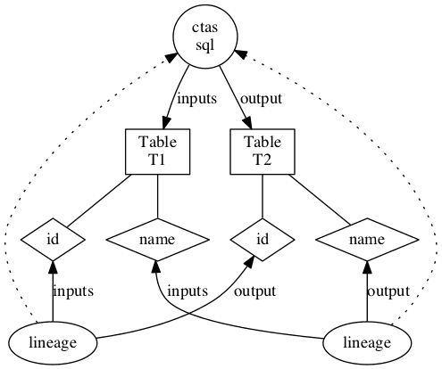

#### Extracting Lineage from Hive commands

- HiveHook 将 HookContext 中的 LineageInfo 映射到 Column lineage 实例

- Hive 中的 LineageInfo 为最终的 FileSinkOperator 提供 Column lineage ，将它们链接到 Hive 查询中的输入列

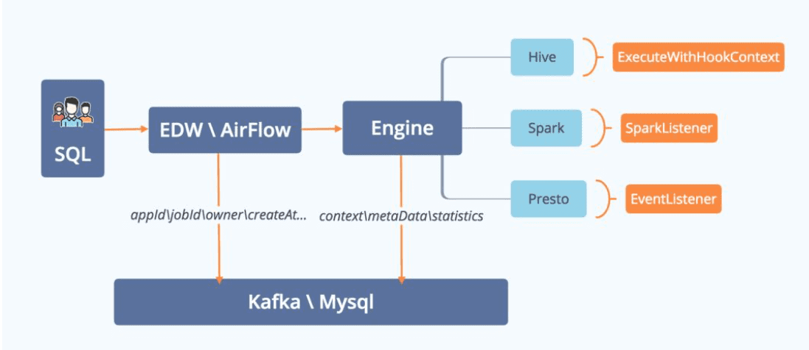

线上SQL，以执行中采集为主+保存前submit为辅。因为任务的SQL可能包含一些时间变量，比如dt、hour，以及任务可能是天调度、小时调度。执行中采集SQL实时性更高，也更容易处理。

EDW/AirFlow是调度系统。调度系统执行任务，并将任务相关的信息，比如appId、jobId、owner、SQL等信息存入DB。

计算引擎实现相关的监听接口，比如Hive实现Execute With Hook Context接口；Spark实现Spark Listener接口；Presto实现Event Listener接口。将计算引擎相关的上下文Context、元数据MetaData、统计Statistics等信息存入DB。

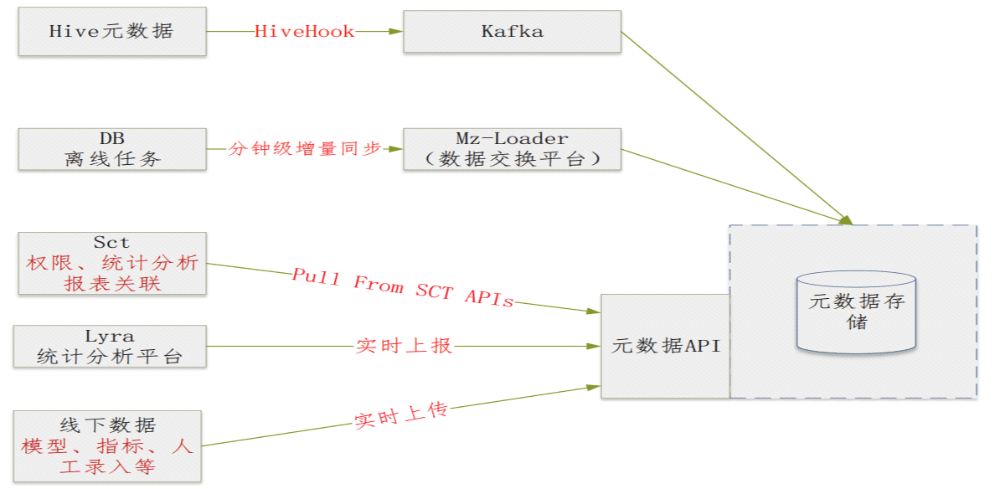

**SQL解析  ** 

解析SQL的方案，以Hive为例。先定义词法规则和语法规则文件，然后使用Antlr实现SQL的词法和语法解析，生成AST语法树，遍历AST语法树完成后续操作。

但对于SELECT *、CTAS等操作，直接遍历AST，不去获取Schema信息来检查表名、列名，就无法判定SQL的正确性，导致数据污染。 

综上所述，SQL解析方案，直接参考Hive的底层源码实现。

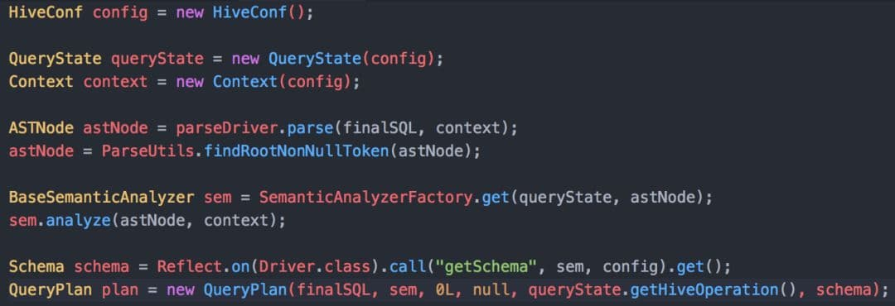

简单示例，先经过Semantic Analyzer Factory类进行语法分析，再根据Schema生成执行计划QueryPlan。关于表、列的血缘，可以从LineageInfo、LineageLogger类中获得解决方案。

当然，你需要针对部分类型SQL设置Hive Conf，比如“开启动态分区非严格模式”。对于CTAS类型，需要设置Context。UDF函数需要修改部分Hive源码，避免UDF Registry检查。

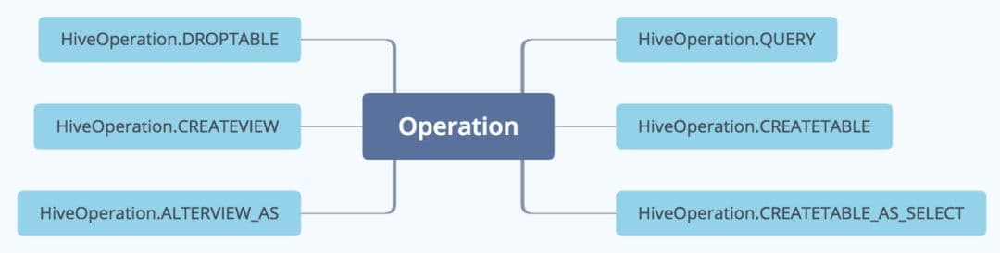

解析血缘的SQL支持的操作有：Query（包含select\insert into\insert overwrite）、CreateTable、CreateTableAsSelect、DropTable、CreateView、AlterView。基本覆盖生产环境99%+的SQL语法。

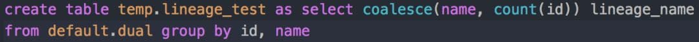

input是表、列输入值；output是表、列输出值；operation代表操作类型。比如表A+B通过insert，生成表C，则延展成A insert C; B insert C。

列式也一样：

input：name, 

operation: coalesce(name, count(id)), 

output: lineage_name;

input: id, 

operation: coalesce(name, count(id)), 

output：lineage_name

**表血缘结构** 

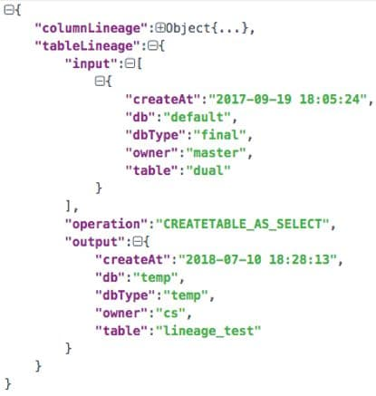

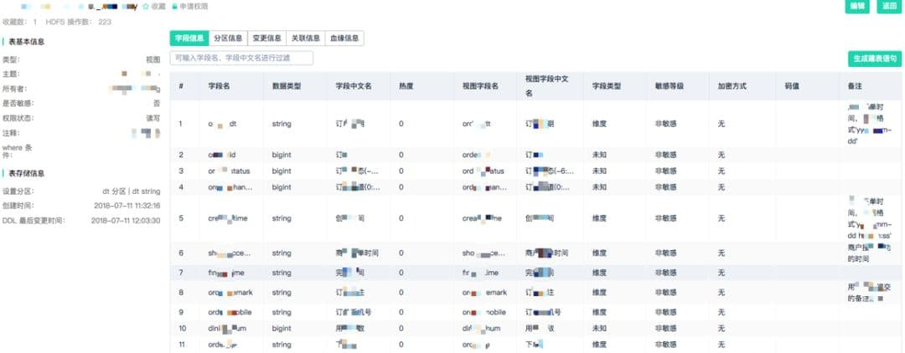

静态的Hive MetaStore表，比如DBS、TBLS、SDS、COLUMNS_V2、TABLE_PARAMS、PARTITIONS，保存表、字段、分区、Owner等基础信息，便于表、字段的信息检索功能。

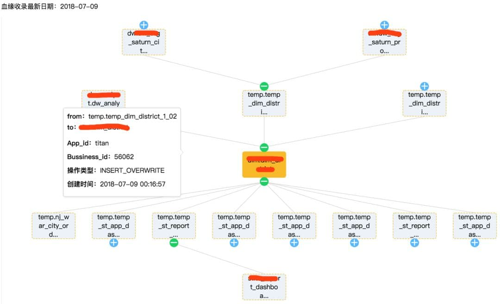

提供动态的表依赖血缘关系查询。节点是表基础信息，节点之间的边是Operation信息，同时附加任务执行Id、执行时间等属性。列血缘结构展示等同表血缘结构。

## 5.3 表字段热度分析

任务操作的SQL产生input output表，对表进行counter就能top counter，列也一样。

采用Apache Atlas作为数据仓库元数据管理的具体实现，由于Apache Atlas自带web UI，为了与整个数据体系子系统风格保持一致，我们对前端界面进行了重新开发，Apache Atlas负责提供RESTFul接口；调用方式参见：

[http://atlas.apache.org/api/v2/index.html](http://atlas.apache.org/api/v2/index.html)