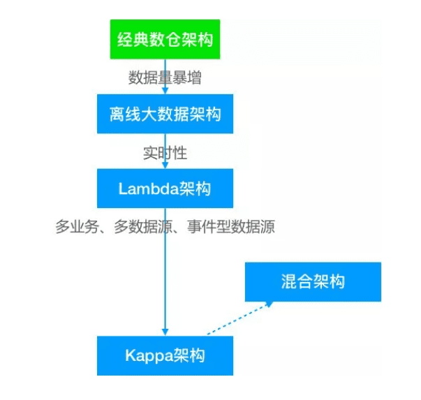
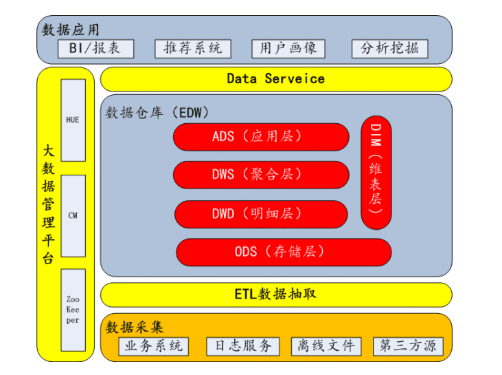
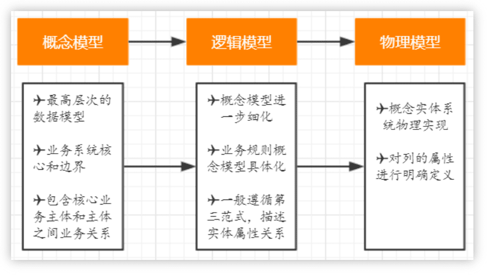
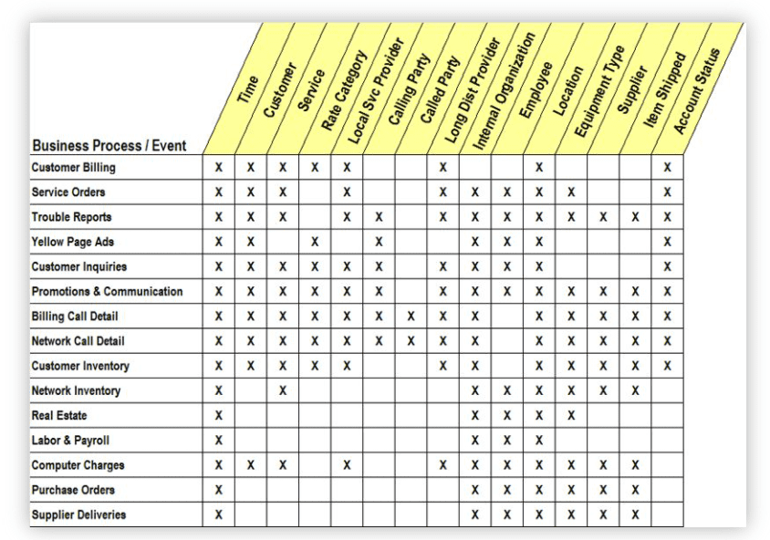
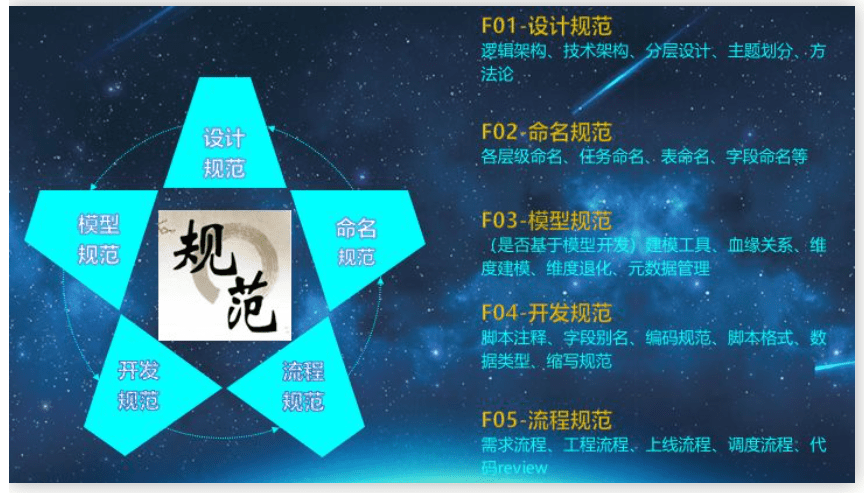
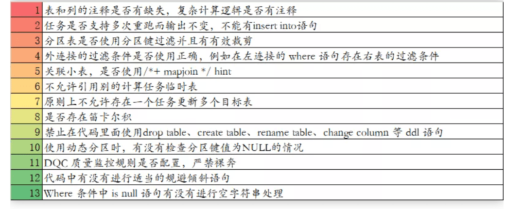
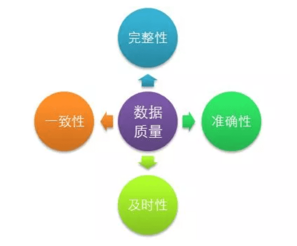
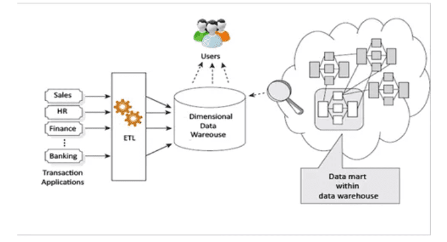
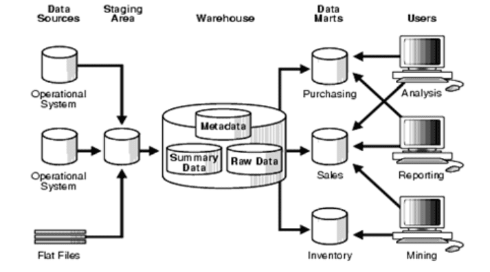

# 1. 架构演进
离线数据仓库到实时数据仓库，从lambda架构到kappa架构、再到混合架构。

# 2. 逻辑分层
数仓分层，一般按ods->dw->dm整体架构。不同的企业，不同的业务场景，有衍生出不同的分层架构模式。例如经典四层架构：ods->dwd->dws-ads，bdl->fdl->gdl->adl等。

技术选型，传统数仓一般以Oracle、greenplum、teradata 等，互联网数仓一般以Hadoop生态圈为主，离线以Hive为核心，准实时以spark为核心，实时以flink为核心构建。

# 3. 数据调研
业务调研，业务侧对齐，遵循关系型数据库建模方式，从概念模型（cdm）->逻辑模型（ldm）->物理模型（pdm）建模套路，是一个从抽象到具体的一个不断细化完善的分析，设计和开发的过程。

需求调研，现有BI报表需求，统计需求，用户画像，推荐系统等数据应用。
数据库调研，了解数据库表数据结构、数据形态，全局把握业务流程数据流向，做到真正业务流程和数据结构结合。

# 4. 主题域划分
业务高度抽象，可先确定企业业务bu模块，然后可根据概念模型（cdm）进行一级主题划分，确定一致性维度和事实流程，构建总线矩阵。

_图片来源 Kimball《The Data Warehouse Toolkits，- 3rd Edition》_

按照kimball大师经典建模四步骤：选择业务过程->声明粒度->确定维度->确定事实 进行维度建模。

# 5. 数仓规范
构建企业级数据仓库，必不可少的就是制定数仓规范。包括 命名规范，流程规范，设计规范，开发规范 等。无规矩不成方圆，建设数仓也是这样。

开发规范示例：

# 6. 数据治理
大数据时代必不可少的一个重要环节，可从数据质量、元数据管理、数据安全、数据生命周期等方面开展实施。数据治理是一个企业安身立命的根本。

数据质量，必须保证完整性、准确性、一致性、时效性。每一个任务都应该配置数据质量监控，严禁任务裸奔。可建设统一数据质量告警中心从以下四个方面进行监控、预警和优化任务。

元数据管理，关于数据的数据。可分为技术元数据和业务元数据。对于数仓开发和维护，模型血缘关系尤为重要。

数据安全，可包含以下五方面的内容，即数据的保密性、真实性、完整性、未授权拷贝和所寄生系统的安全性。

# 7. 数仓理念
从80年代到现在，数据仓库流派之争已趋于稳缓，比较经典的就是数仓大师Kimball的维度建模、数仓之父Inmon的范式(E-R)建模，另外还有Data Vault建模、Anchor模型等。

_Kimball Data Warehouse Architecture：_

_Inmon Data Warehouse Architecture：_

结语：数仓是一种思想，数仓是一种规范，数仓是一种解决方案。