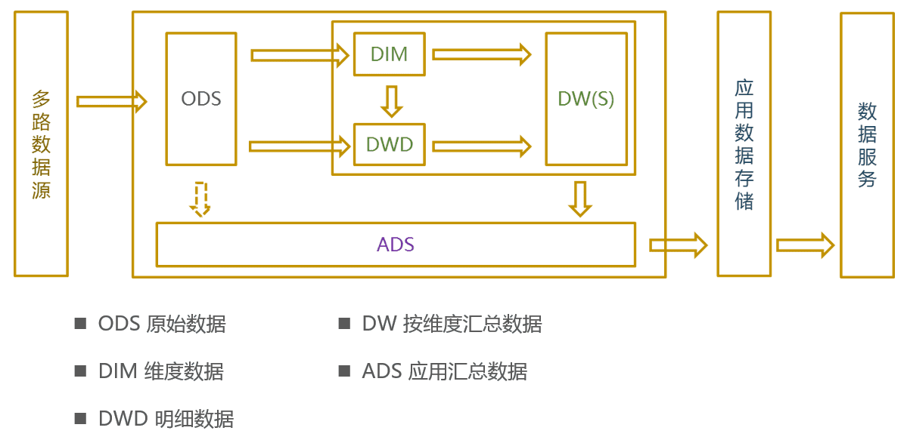

# 背景

数据仓库承载着公司大量业务数据离线存储和数据应用支持，主要围绕结构化数据的 ETL 过程进行数据价值转换，落地到业务报表、数据产品以及日常数据提取等数据应用中。

## 数据湖与数据仓库
数据仓库是一个优化的数据库，用于分析来自事务系统和业务线应用程序的关系数据。事先定义数据结构和 Schema 以优化快速 SQL 查询，其中结果通常用于操作报告和分析。数据经过了清理、丰富和转换。

数据湖是一个集中式存储库，允许以任意规模存储所有结构化和非结构化数据。按原样存储数据（无需先对数据进行结构化处理），并运行不同类型的分析 – 从面板和可视化到大数据处理、实时分析和机器学习，以指导做出更好的决策。

数据湖和数据仓库有所不同，因为它存储来自业务线应用程序的关系数据，以及来自移动应用程序、IoT 设备和社交媒体的非关系数据。捕获数据时，未定义数据结构或 Schema。这意味着可以存储所有数据，而不需要精心设计也无需知道将来可能需要哪些问题的答案，可以对数据使用不同类型的分析。

| 特性 | 数据仓库 | 数据湖 |
| :---: | :---: | :---: |
| **数据** | 来自事务系统、运营数据库和业务线应用程序的关系数据 | 来自 IoT 设备、网站、移动应用程序、社交媒体和企业应用程序的非关系和关系数据 |
| **Schema** | 设计在数据仓库实施之前（写入型 Schema） | 写入在分析时（读取型 Schema） |
| **性价比** | 更快查询结果会带来较高存储成本 | 更快查询结果只需较低存储成本 |
| **数据质量** | 可作为重要事实依据的高度监管数据 | 任何可以或无法进行监管的数据（例如原始数据） |
| **用户** | 业务分析师 | 数据科学家、数据开发人员和业务分析师 |
| **分析** | 批处理报告、BI 和可视化 | 机器学习、预测分析、数据发现和分析 |

简言之，数据湖采用多样化非结构化存储和计算，而数据仓库使用更标准的结构化存储，数据仓库的数据结构化存储和预计算能明显提升使用效率，二者也并非以孤立形式存在。

**本文将重点介绍数据仓库的设计思路，以及通用的业务概念。** 

# 数据仓库建模

数据仓库建模主要包括 **数据仓库的分层设计思想** ，以及各类 **数据仓库相关的规范** 。数据仓库的分层设计主要用于将数据按照特点和用途进行分类管理，各层会有匹配自身特点和用途管理模式。而数据仓库的相关规范，主要用于约束和辅助数据仓库进行分层管理，如，数据表命名规范定义了数据仓库各层应遵循的数据表命名规则，遵循此规则命名的数据表能以统一的范式传递该数据表的业务和计算方式。

## 数据分布

目前数据分布在 IDC 自建 CDH 集群和阿里云。自建集群统称 C4（Cluster 4），阿里云主要使用 MaxCompute（按量付费公共云），后续也可能会对接其他云厂商的云服务。集群（或云产品）之间通过数据同步工具进行任意方向的数据传输。

## 数据分层

数据仓库的数据采用了分层管理的模式，各层有清晰的业务边界，主要包括：ODS、DIM、DWD、DW 和 ADS

- **ODS（Original Data Source）** ：存储原始数据，如打点日志，交易流水等。
- **DIM（Dimension）** ：存储维度数据，如分区信息表、房间信息表等。
- **DWD（Data Warehouse Detail)** ：存储明细的数据，通常由ODS数据关联相应的维度信息得到，如在打点数据中关联房间名等。
- **DW/DWS（Data Warehouse Summary）** ：存储按照维度汇总的数据，如按照打点点位，汇总计算相应指标。该层数据具备较强的业务价值，能有极高的复用度
- **ADS（Application Data Store）** ：存储各类应用数据，搭建数据集市，如打点业务报表。

## 业务域与数据域

业务域和数据域是从逻辑上对数据进行归类编排，通过数据表的业务域和数据域能对表中数据有大致的业务归属认识

- **业务域** ：用于划定数据业务边界的标识，如内容、广告、游戏等。各业务域之间有较清晰的业务边界，理论上一个数据表应该只属于一个业务域。
- **数据域** ：用于区别数据的类型，如日志域，包括各种类型的日志数据；交易域，包括道具等；互动域，包括消息、关注等。

## 时间周期

任何离线计算的数据表都有固定的数据产出周期，如按天，按周，按月或按小时等。基本的小时、天、周、月、年用单词首字母h、d、w、m、y表示。基于此我们按如下方式定义时间周期（适用于DW和ADS），**并非所有的时间周期，相同模式举一反三**

1. 天-1d，每天产出前一天的数据
1. 多天-nd，每天产出前n天的数据，如7d标识每天计算近7天的数据，nd（n不是具体数据），表示该表每天计算含多天的数据
1. 自然周-cw，每周一产出上周数据
1. 非自然周-1w，每周任意一天产出上周数据，如每周五，产出上周五至本周四的数据
1. 自然月-cm，每月1号产出上月数据
1. 非自然月-1m，每月任意一天产出上月至前一天数据，如4月25日，产出3月25日至4月24日数据
1. 月累计至当日-mtd，每天产出当月至前一天的数据，如4月25日，产出4月1日至4月24日的数据

## 新增形式
明细数据会涉及到每日新增形式的问题

- **全量数据** 是指每个数据分区中都包含所有的历史数据，通常是因为历史数据会有状态变更。如直播间的开播记录是在开播时写入数据库，关播时更新关播时间，如果每天凌晨会只同步前一天开播数据，但跨天的直播还未关播，这样就会丢失准确的关播时间，故只能以全量形式进行数据同步，即每天同步所有的开播记录，**在明细数据中通常以f（full）标识全量** 。
- **增量数据** 指每个数据分区中只包含当日新增的数据，所有分区合起来为完整的数据，历史的数据记录不会再调整。打点的日志在用户行为产生时就被记录到日志中，不存在对过去日志修改的情况，这样每天只需同步前一天的数据到数据仓库中即可，**在明细数据中通常以i（incremental）标识增量** 

## 表命名

数据仓库中的数据多以结构化的数据表进行存储，清晰的表命名规范能很大程度上提升数据归类编排和查找效率，倘若不对数据表进行规范约定，数据的管理成本将随数据仓库用户的增长呈指数级倍增。出于以上考虑，数据仓库采用如下数据命名规范：

| 数据分层 | 表命名模式 | 示例 | 注释 |
| :---: | :---: | :---: | :---: |
| **原始数据-ODS** | 分层\_数据源原始表名 | ods_web_room_show | 直播间开播记录 |
| **明细数据-DWD** | 分层\_业务域\_数据域\_业务描述\_时间周期&新增形式 | dwd_dy_itr_chat_msg_clean_di | 用户弹幕清洗后天增量表 |
| **维度数据-DIM** | 分层\_业务域\_维度描述 | dim_vd_video | 点播(审核通过）视频信息表 |
| **汇总数据-DW** | 分层\_业务域\_数据域\_汇总维度\_时间周期 | dw_dy_log_cdn_mbr_1d | uid,CDN日志天汇总表 |
| **应用数据-ADS** | 分层\_业务域\_业务描述\_时间周期 | ads_dy_dataworks_tag_monitor_room_1d | 分区监控-直播间,20181203之前（含）为活跃直播间，之后为所有直播间,dataworks 专用视图 |

**在数据表命名中会使用一些关键词来表征特定的业务，如room-房间、user-did、mbr-uid、ct-终端、app-客户端、msg-消息、action-打点、itr-互动、follow-关注等** 