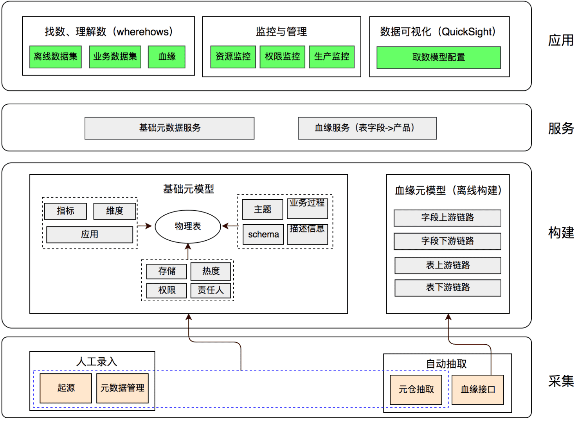
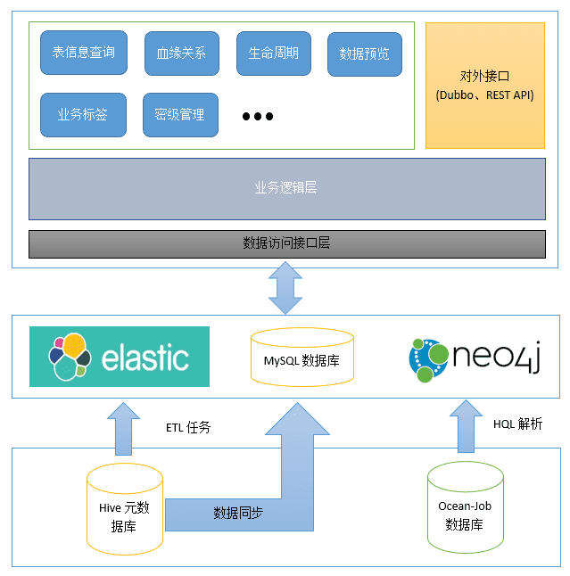
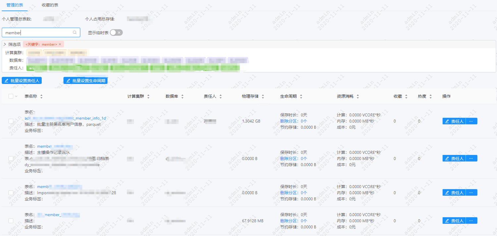
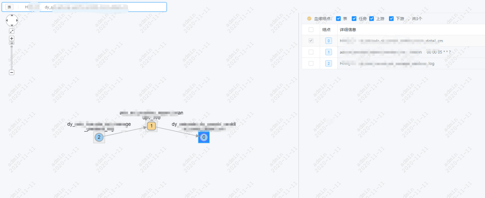
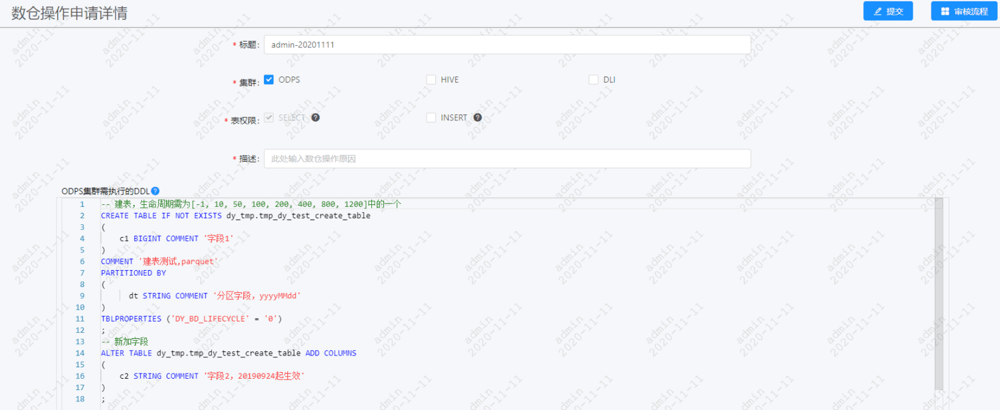

# 一、背景

目前在数据仓库开发以及使用的过程中，依赖于Shell命令行工具查询表的相关信息，效率低下不友好。HUE在使用的过程中存在bug，无法做定制化需求。数据地图系统的出现是为了解决表级字段级的模糊查询、物理表分区信息查询、DDL信息查询、表的使用说明、ETL逻辑代码、生命周期、字段级别的密级控制等需求，对外提供元数据服务，打通各个数据系统流程，统一管控元数据。

# 二、定义及目标

## （一）定义

- 元数据

    数据管理、数据内容、数据应用的基础。打通数据源、数据仓库、数据应用，记录了数据从生产到消费的完整链路。包含静态的表、列、分区信息；动态的任务、表依赖映射关系；数据仓库的模型定义、数据生命周期；以及ETL任务调度信息、输入输出等。

- 数据地图

    是元数据的升级，除对元数据的一系列管理功能外，还提供数据查找搜索功能，对外提供元数据服务功能。

## （二）目标

数据地图和数据建模、指标规范等共同构成了数据资产管理的重要部分。以工具化方式推进实现和维护规范化数据建模工具流，同时能对外提供元数据服务、数据查找搜索服务。

我们期望数据地图的建设达到以下目标：

- 采集构建完备的元数据。
- 平台化统一管理元数据。
- 提供数据查找、搜索功能。
- 提供元数据API服务。
- 推动业务标准实施落地。
- 实现指标规范定义管理、消除指标认知歧义。

# 三、业界方案

## （一）美团

### 1.   元数据架构设计

### 2.   架构说明

- 元数据采集

    元数据采集分为人工录入和自动抽取，通过人工录入的方式实现物理表的准确归属（包括该表属于仓库哪一层、对应的主题、业务过程、星型模型关系等）以及指标的采集，从而完成技术元数据和业务元数据的采集，通过自动抽取的方式完成生产元数据的采集和使用元数据的采集，主要包括：物理模型的依赖关系、存储占用、热度、等信息。

- 元模型构建

    分为以物理表为核心的基础元模型构建，以及以血缘为中心的血缘元模型。基础元模型构建以物理表为中心，打通其与技术元数据（主题、业务过程、Schema）的关系，实现了物理表的清晰归属，打通其与生产元数据的关系，为其加上了物理表查询热度、资源消耗、查询密级等生产使用信息，打通其与指标、维度和应用的对应关系，为上层的取数应用建立了完备的元数据。血缘元模型以血缘为中心，不仅构建了从上游业务表到仓库离线表的物理血缘，而且打通了仓库离线表到下游对应报表的血缘，为后续的影响评估构建了完备的元数据基础。

- 元数据服务

    统一元数据服务（OneService），主要提供两类元数据服务，提供查询表、指标、维度基本信息的基础元数据服务以及查询表级血缘、字段级血缘的血缘服务。

- 元数据应用

    主要孵化出了三个产品，以“找数、理解数、影响评估”为应用场景的数据地图（Wherehows），以“取数、数据可视化”为应用场景的数据可视化（QuickSight），以及以管理审计为目的的管理审计报表。

# 四、我们的方案

## （一）功能设计

整个系统的结构图所示，最下面一层为源数据层，需要从Hive的元数据库（MySQL）中抽取数据到元数据管理系统的数据库中，Ocean-Job数据库中数据用来做HQL解析，任务的输入输出表。通过对Hive元数据库的处理和加工，将用户搜索的数据直接放到ElasticSearch中支持关键词搜索，Neo4j图数据库用来做表和任务之间的关系查询。元数据管理系统的MySQL数据库用来支持常规查询、生命周期、业务标签、密级管理等功能的数据存储。

### 1.   表查询

通过输入表名的部分关键字、表的描述的关键字、表的责任人、表的业务标签等信息完成对表的检索以及排序展示功能，通过点击表名可以展示表的具体信息。

### 2.   字段查询

输入字段名称包含的单词、字段描述关键字、责任人等完成对字段级别的信息检索以及排序展示功能，通过点击字段名可以查看到该字段的所属的表的相关信息。

### 3.   物理表Detail展示功能

物理表Detail展示功能全面描述了一个表的相关信息，包括字段信息、分区信息、血缘关系、ETL代码、DDL、数据预览、使用WIKI、生命周期信息。

#### 3.1、字段信息

展示一个表的所有字段信息，包括字段名称、字段注释、字段类型，支持字段过多时分页展示。

#### 3.2、分区信息

展示一个表的所有分区信息，包括每个分区的记录数、分区的数据存储量、分区创建时间、分区更新时间，支持分区过多时分页展示。

#### 3.3、血缘关系

展示该表的上下游表、任务的血缘关系，支持选择表或者任务进行过滤和上下游钻取功能、支持钻取后重置功能（将当前表重置为当前节点）。

#### 3.4、ETL代码

如果是该表是有DataPorter抽取，则展示DataPorte的配置代码，如果是XmlJob任务产出则展示XmlJob中HiveSQL的代码，如果是其它方式则不展示。

#### 3.5、DDL&DML语句

展示该表的建表DDL（主要是create语句）以及DML（主要是select语句，方便查询时候的，避免每个人写重复简单的select语句），ocean-metadata数据库中不存储，通过调用Hive Metastore API提供。

#### 3.6、数据预览

展示最新一个分区的100条数据，支持分页、滚动、全屏显示等功能。

#### 3.7、使用说明

向用户说明该表如何使用、用于哪些业务领域、使用时注意事项等。

### 4.   数据表管理功能

#### 4.1、生命周期管理

为表设置生命周期，如果是分区表，从分区创建的时间开始，分区达到生命周期的deadline后就归档删除；如果是非分区表，从表的创建时间开发，分区达到生命周期的deadline后归档删除。

#### 4.2、标签管理

为表添加相关的业务标签，便于检索，支持表标签的增、删、改功能。

#### 4.3、WIKI管理

为表添加相关的使用wiki，便于检索，支持表wiki的增、删、改功能。

#### 4.4、设置密级

为表以及表的字段设置数据保密级别，表的保密级别和字段的保密级别为继承关系，字段保密级别必须高于或者等于表的保密级别。支持表以及字段保密级别的增删改查功能。

#### 4.5、权限标签管理

管理表的行列权限，可增删改行列权限标签，支持业务类的权限管控。

#### 4.6、表迁移管理

管理表下线过程中的标记及权限迁移。

### 5.   UDF管理

支持UDF查询、UDF使用方法和使用示例添加、修改功能。

### 6.   数仓操作管理

#### 6.1、操作申请

负责表DDL和DML语句的申请审批操作，以保证数仓中表和字段的规范性以及数据分层合理性。

### 7.   实现细节

#### 7.1、  数据资产大盘

数据资产大盘：数据存储量、计算消耗量、集群分布情况、表热度、项目血缘关系图。

效果图如下：

#### 7.2、数据表管理

数据表管理：数据表的管理功能，生命周期管理、标签管理、责任人、产出表、Wiki编辑管理。

#### 7.3、数据查找&搜索

找数据：搜索数据表，查看字段信息、分区信息、血缘关系、ETL代码、建表语句、Wiki等。

#### 7.4、血缘关系

**数据血缘：** 查询表-表、表-任务、任务-任务、任务-表之间的血缘依赖关系。

分为上下游依赖和全局依赖：

全局依赖

#### 7.5、UDF管理

可增删改UDF函数，管理函数的wiki说明。

#### 7.6、数仓操作

 