# 一、背景

今年来随着移动互联网、5G技术兴起，数据量指数级增长，大数据量带来的是极大的计算存储成本以及复杂度的上升，企业向从数据中挖掘出价值难度更大。数据建模是为了降低企业获取数据的成本和提升数据流转效率，进而将数据价值最大化应用到业务实践中，帮助业务快速发展。

# 二、定义及目标

## （一）定义

### 1.   相关定义

数据仓库：一个面向主题的（Subject Oriented ）、集成的（Integrated）、相对稳定的（Non-Volatile）、反映历史变化（Time Variant）的数据集合，用于支持管理决策和信息的全局共享。--《建立数据仓库》数据仓库支付Bill Inmon

数据仓库建模：用模型的方法帮助更好的组织和存储数据，以便在性能、成本、效率和质量之间取得最佳平衡。

### 2.   数据仓库核心概念

- 维度：是一个业务相关的观察角度，例如直播中的房间维度、分区维度。
- 粒度：是一个数据细分层度，例如按天、小时、分钟。
- 度量：是一些衡量企业运行状态的数值指标，业务量化的表示，例如DAU。
- 事实表：若干维度和度量组合而成的数据表，例如分区交易数据表。

## （二）目标

数据仓库建模的核心目标就一个词：降本提效。

- 降本

    通过对以往数据需求的分析，抽象业务主题经过清理、丰富和转换，辅以数据仓库系列规范形成标准的数据仓库建模体系，减少重复开发，降低数据查找成本。

- 提效

    通过分层的思想对数据进行建模，将数据做轻量级的汇总，以空间换时间来提升数据查询效率。

举例来说：

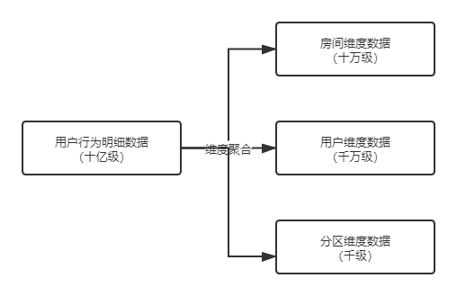

十亿级的用户行为明细数据经过维度的聚合，查询效率有指数级上升。

# 三、业界方案

## （一）典型建模方法论

数据仓库建模的方法有多种，每一种都代表了一种归纳概括数据的方法，下面介绍典型的三种方法。

### 1.   范式模型

该方法主要由Inmon提所提倡，主要解决关系型数据库的数据存储、利用的一种方法。业界主要采用3NF（3范式）建模法。

一个符合第三范式的关系必须具备以下三个条件：

- 每个属性值唯一，不具多义性。
- 每个非主属性必须完全依赖主键，而非主键的一部分。
- 每个非主属性不能依赖于其他关系中的属性。

范式建模的有点是从关系型数据库角度出发，结合业务系统的数据模型，能比较方便的实现数据仓库的建模。缺点是由于建模方法限定在关系型数据库上，有时反而限制了整个数据仓库模型的灵活性高。

### 2.   维度模型

维度建模常见的分为星型模型和雪花模型，两种模型表达的都是事实表和维度表之间的关系，但是关联关系有所不同。

星型模型：所需要的维度表都直接关联到事实表时，我们称之为星型模型。

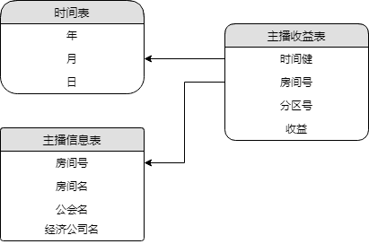

雪花模型：当一个或多个维表没有直接关联到事实表上，而是通过其他维表关联到事实表时，我们称之为雪花模型。

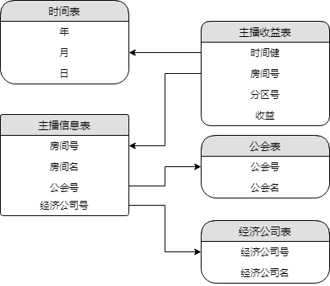

一般维度建模的基本步骤如下：

第一，  确定主题，确认要分析的是什么，例如主播的一个月的收益。

第二，  确定分析的维度，从哪些角度来分析数据。

第三，  确定事实表中的数据粒度，例如时间粒度细化到月。

第四，  确定分析的度量指标是什么。

### 3.   实体模型（ER关系模型）

实体建模是对实体以及实体间关系的抽象，一个业务过程可以划分成3个部分：实体、事件和说明：

- 实体：领域模型中特定的概念主题，指发生业务关系的对象。
- 事件：主体之间一次业务流程发生的过程。
- 说明：对实体和时间的补充说明。

## （二）业界实现

### 1.   阿里

#### 1.1、  分层模型

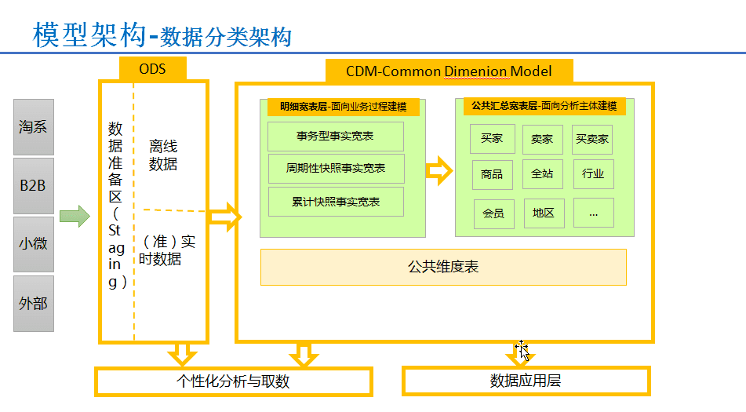

#### 1.2、  指标规范

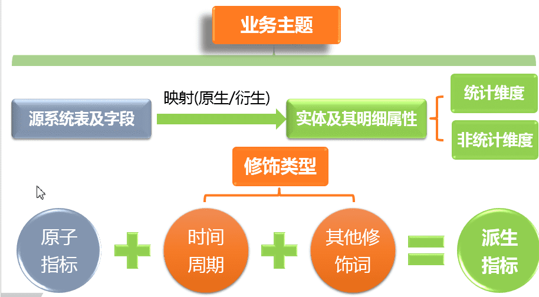

### 2.   滴滴

#### 2.1、分层模型

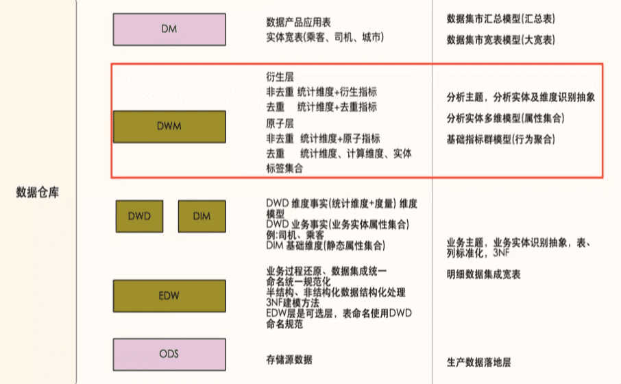

#### 2.2、指标规范

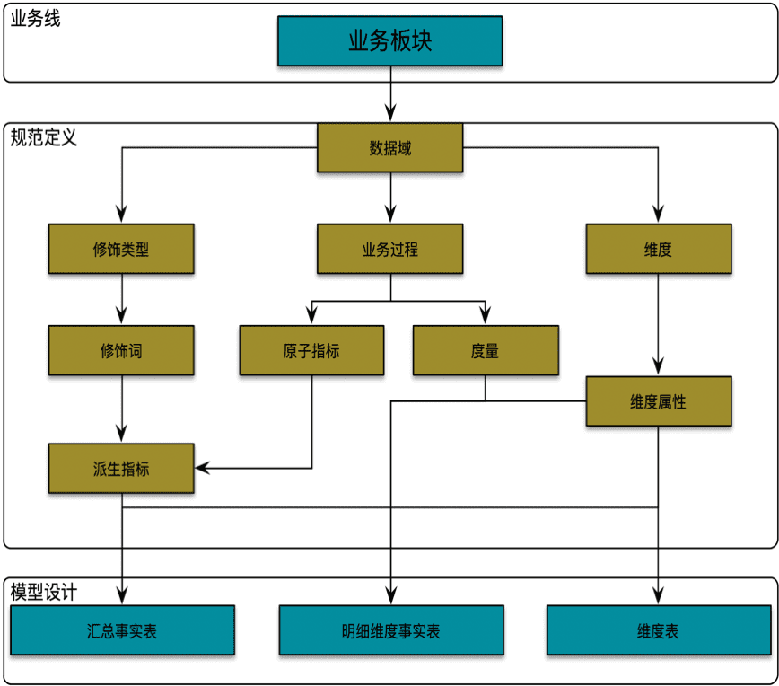

### 3.   美团

#### 3.1、分层模型

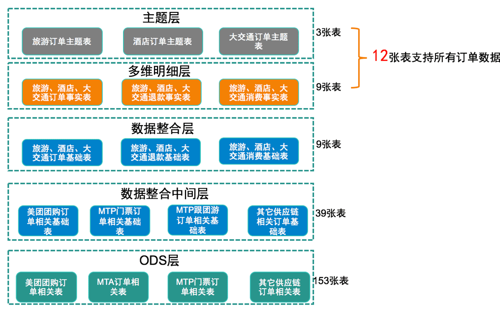

#### 3.2、指标规范

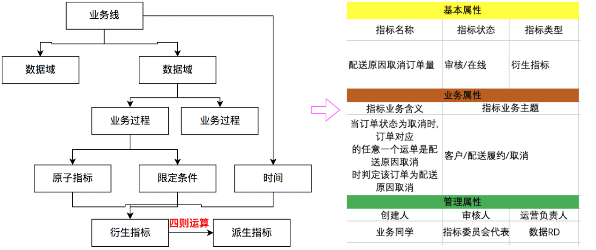

# 四、我们的方案

数据仓库建模在于利用分层的思想和模型的方法论，再辅以数仓相关的规范来提升数据归类编排的能力，降低数据分析挖掘的成本。

## （一）数仓分层

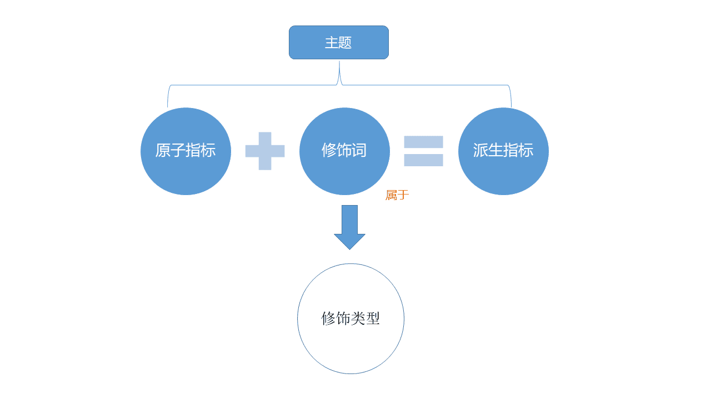

- ODS（Original Data Source）：存储原始数据，如打点日志，交易流水等。
- DIM（Dimension）：存储维度数据，如分区信息表、房间信息表等。
- DWD（Data Warehouse Detail)：存储明细的数据，通常由ODS数据关联相应的维度信息得到，如在打点数据中关联房间名等。
- DW/DWS（Data Warehouse Summary）：存储按照维度汇总的数据，如按照打点点位，汇总计算相应指标。该层数据具备较强的业务价值，能有极高的复用度。
- ADS（Application Data Store）：存储各类应用数据，搭建数据集市，如打点业务报表。

## （二）数仓规范

### 1.   业务域与主题域

业务域和数据域是从逻辑上对数据进行归类编排，通过数据表的业务域和数据域能对表中数据有大致的业务归属认识

- 业务域：用于划定数据业务边界的标识，如直播、点播、广告、游戏等。各业务域之间有较清晰的业务边界，理论上一个数据表应该只属于一个业务域。
- 数据域：用于区别数据的类型，如日志域，包括各种类型的日志数据；交易域，包括鱼翅、鱼丸和道具等；互动域，包括弹幕、关注等。

### 2.   时间周期

任何离线计算的数据表都有固定的数据产出周期，如按天，按周，按月或按小时等。基本的小时、天、周、月、年用单词首字母h、d、w、m、y表示。基于此我们按如下方式定义时间周期（适用于DW和ADS），并非所有的时间周期，相同模式举一反三

- 天-1d，每天产出前一天的数据。
- 多天-nd，每天产出前n天的数据，如7d标识每天计算近7天的数据，nd（n不是具体数据），表示该表每天计算含多天的数据。
- 自然周-cw，每周一产出上周数据。
- 非自然周-1w，每周任意一天产出上周数据，如每周五，产出上周五至本周四的数据；
- 自然月-cm，每月1号产出上月数据。
- 非自然月-1m，每月任意一天产出上月至前一天数据，如4月25日，产出3月25日至4月24日数据。
- 月累计至当日-mtd，每天产出当月至前一天的数据，如4月25日，产出4月1日至4月24日的数据。

### 3.   数据新增形式

明细数据会涉及到每日新增形式的问题

- 全量数据是指每个数据分区中都包含所有的历史数据，通常是因为历史数据会有状态变更。如直播间的开播记录是在开播时写入数据库，关播时更新关播时间，如果每天凌晨会只同步前一天开播数据，但跨天的直播还未关播，这样就会丢失准确的关播时间，故只能以全量形式进行数据同步，即每天同步所有的开播记录，在明细数据中通常以f（full）标识全量。
- 增量数据指每个数据分区中只包含当日新增的数据，所有分区合起来为完整的数据，历史的数据记录不会再调整。打点的日志在用户行为产生时就被记录到日志中，不存在对过去日志修改的情况，这样每天仅需同步前一天的数据到数据仓库中即可，在明细数据中通常以i（incremental）标识增量。

### 4.   表命名规范

数据仓库中的数据多以结构化的数据表进行存储，清晰的表命名规范能很大程度上提升数据归类编排和查找效率，倘若不对数据表进行规范约定，数据的管理成本将随数据仓库用户的增长呈指数级倍增。基于以上考虑，我们的数据仓库采用如下数据命名规范：

| **数据分层** | **表命名模式** | **示例** | **注释** |
| --- | --- | --- | --- |
| **ODS层** | 分层\_数据源原始表名 | ods_web_room_show | 直播间开播记录 |
| **DWD层** | 分层\_业务域\_数据域\_业务描述\_时间周期&新增形式 | dwd_dy_itr_chat_msg_clean_di | 用户弹幕清洗后天增量表 |
| **DIM层** | 分层\_业务域\_维度描述 | dim_vd_video | 点播(审核通过）视频信息表 |
| **DW(S)层** | 分层\_业务域\_数据域\_汇总维度\_时间周期 | dw_dy_log_cdn_mbr_1d | uid,CDN日志天汇总表 |
| **ADS层** | 分层\_业务域\_业务描述\_时间周期 | ads_dy_ios_pay_mbr_1d | iOS天付费用户表 |

### 5.   指标规范

#### 5.1、名词和术语

- 业务主题：数据建模从业务和数据的角度出发定义，对数据仓库不同来源，不同类型的数据按照业务的需求界定的数据计算、分析进而提供数据服务的主题。例如，交易主题（也称为交易域）、主播和会员主题、互动主题等。
- 原子指标：指数据建模中从业务出发、不可再细分的指标，原子指标不直接提供数据服务，与修饰词组合生成的派生指标才提供数据服务。例如，交易主题中的交易金额等。
- 指标修饰类型和修饰词：指数据仓库数据计算中可以兑原子指标发生修饰作用的各种类型及各种类型下的修饰词。例如，开播状态作为修饰类型，“天数”和“此数据”作为修饰词；时间周期作为修饰类型，包括“最近1天”、“最近7天”等。
- 派生指标：原子指标和指标修饰词可以根据业务的需求组合任务业务需要的最终指标，即派生指标。派生指标是最终对内外数据服务提供的唯一规范指标。

#### 5.1、指标定义规范

a）参照阿里的Onedata方案定义了满足我们需求的指标规范，具体如下图：

- 主题：分为主播和会员域、用户及会员域、交易域、互动域、公共域、日志域。
- 原子指标：例如视频数、订单会员数、访问房间数、弹幕数等。
- 修饰类型：例如视频、开播类型、贵族行为等。
- 修饰词：日期类修饰词例如日、周、月、自然月等；其他修饰类型如普通礼物、收益等。
- 派生指标：例如最近一天弹幕数、自然月、最近一天开播数等。

b）那么我们为什么要做指标的规范定义和管理呢，可以从以下三个角度来看：

- 业务视角：

    业务数据分析场景不明确。
    
    用户分析具体业务找数据、核对数据成本高。

- 技术视角：

    指标命名不规范，不唯一，口径不一致。

    指标重复建设，数据汇总成本高。

    数据出口不同意，重复输出，输出口径不一致。

- 产品视角：

    缺乏系统化的数据产品支持从生产到消费的数据流。

# 五、实现细节

## （一）数据分层实现

数仓分层主要用于将数据按照特点和用途进行分类管理，各层会有匹配自身特点和用途的管理模式。

下面是一个分层带来的好处示例：

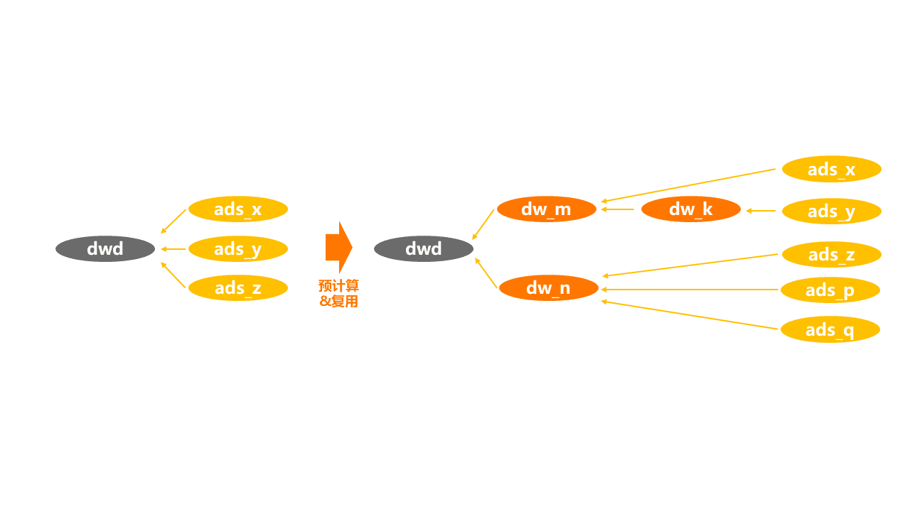

- 分层前：

    ads_x、ads_y、ads_z不同的业务应用表，但有相同的指标，在分层前需扫描dwd层明细数据三次，带来三次的重复计算成本浪费。

- 分层后：

    不同的业务引用表，相同的指标可从可复用的dw层（汇总层）直接取出，扫描的数量指数级的减少，无需重复计算多次，带来了成本上的节约和效率上的显著提升。

## （二）指标规范管理

通过平台化实现将规范化的指标统一管理起来，从源头提供最全面的规范化数据建模数据。

