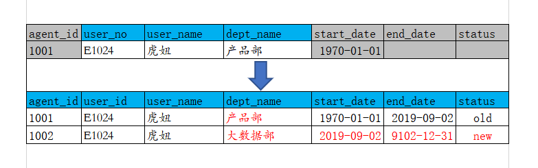
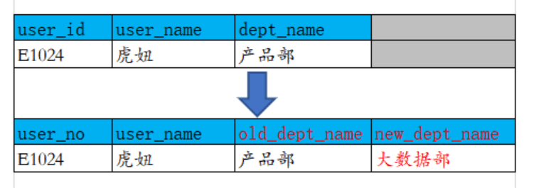
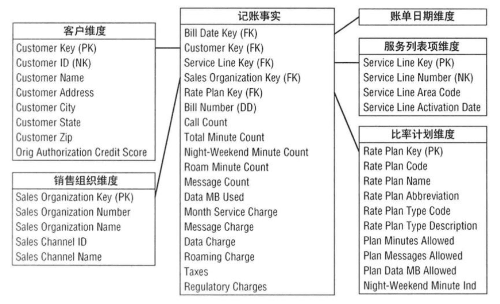
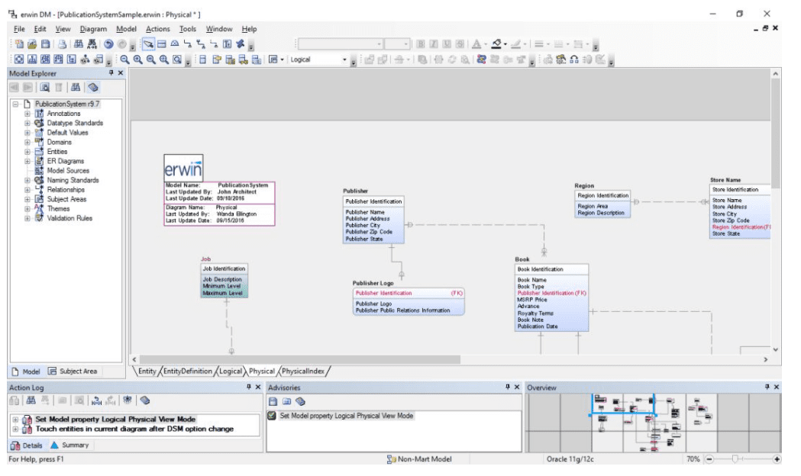
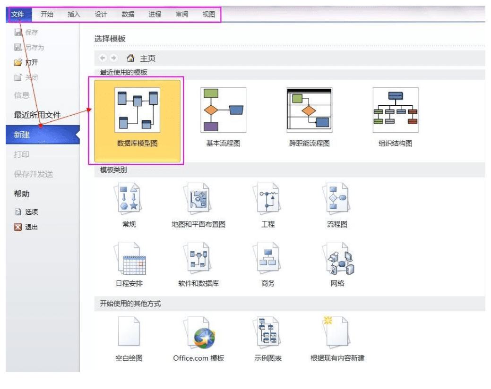
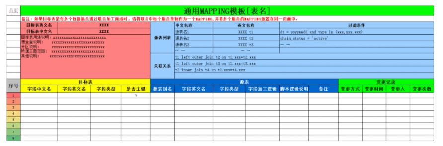

# 前言：
Model对于数仓是最核心的东西，数据模型是数据组织和存储方法，模型的好坏，决定了数仓能支撑企业业务多久。

为什么大多数企业，数仓都要重建，这不仅仅是业务拓展、发展迅速，很大一部分是因为模型建的不够好。

# 01. 基本概念
维度建模，是数据仓库大师Ralph Kimball提出的，是数据仓库工程领域最流行的数仓建模经典。

维度建模以分析决策的需求出发构建模型，构建的数据模型为分析需求服务，因此它重点解决用户如何更快速完成分析需求，同时还有较好的大规模复杂查询的响应性能。

它是面向分析的，为了提高查询性能可以增加数据冗余，反规范化的设计技术。

## 1.1 事实表
事实表产生于业务过程，存储了业务活动或事件提炼出来的性能度量。从最低的粒度级别来看，事实表行对应一个度量事件。

事实表根据粒度的角色划分不同，可分为事务事实表、周期快照事实表、累积快照事实表。

1. **事务事实表** ，用于承载事务数据，通常粒度比较低，它是面向事务的，其粒度是每一行对应一个事务，它是最细粒度的事实表，例如产品交易事务事实、ATM交易事务事实。

2. **周期快照事实表** ，按照一定的时间周期间隔(每天，每月)来捕捉业务活动的执行情况，一旦装入事实表就不会再去更新，它是事务事实表的补充。用来记录有规律的、固定时间间隔的业务累计数据，通常粒度比较高，例如账户月平均余额事实表。

3. **累积快照事实表** ，用来记录具有时间跨度的业务处理过程的整个过程的信息，每个生命周期一行，通常这类事实表比较少见。

_注意：这里需要值得注意的是，在事实表的设计时，一定要注意一个事实表只能有一个粒度，不能将不同粒度的事实建立在同一张事实表中。_

## 1.2 维度表   
维度表，一致性维度，业务过程的发生或分析角度，我们主要关注下退化维度和缓慢变化维。

1. **退化维度** （Degenerate Dimension）

    在维度类型中，有一种重要的维度称作为退化维度，亦维度退化一说。这种维度指的是直接把一些简单的维度放在事实表中。退化维度是维度建模领域中的一个非常重要的概念，它对理解维度建模有着非常重要的作用，退化维度一般在分析中可以用来做分组使用。

2. **缓慢变化维** （Slowly Changing Dimensions）

    维度的属性并不是始终不变的，它会随着时间的流逝发生缓慢的变化，这种随时间发生变化的维度我们一般称之为缓慢变化维（SCD）。

    SCD常用的三种处理方式：

    ① **TYPE1** 直接覆盖原值

    ② **TYPE2** 增加维度行

    _在为维度成员增加新行时，需为其分配新的主代理键。并且，至少需要在维度行再增加三列：有效日期、截止日期、行标识。这个地方可联想拉链表设计。_

    
    
    ③ **TYPE3** 增加属性列 

    

    ④ 混合方式

    可根据实际业务场景，混合或选择使用以上三种方式，以快速方便而又准确的分析历史变化情况。

## 1.3 粒度
用于确定某一事实表中的行表示什么，是业务最小活动单元或不同维度组合，即业务细节程度。

## 1.4 维度建模流程
维度建模步骤：选择业务过程->声明粒度->确定维度->确定事实。旨在重点解决数据粒度、维度设计和事实表设计问题。

声明粒度，为业务最小活动单元或不同维度组合。以共同粒度从多个组织业务过程合并度量的事实表称为合并事实表，需要注意的是，来自多个业务过程的事实合并到合并事实表时，它们必须具有同样等级的粒度。

# 02.建模方法 -- _经典数据仓库模型_

数据仓库建模方法论可分为：维度建模、范式建模、Data Vault模型、Anchor模型。

## 2.1 维度模型
企业中最流行、也是最经典的数仓建模经典，数据仓库大师Ralph Kimball的经典著作《数据仓库工具箱 维度建模权威指南 第三版》一本书进行了论述。从事数据仓库/ETL/BI的同学，强烈建议买一本至少读一遍。

按数据组织类型划分可分为星型模型、雪花模型、星座模型。

1. **星型模型** 

    星型模型主要是维表和事实表，以事实表为中心，所有维度直接关联在事实表上，呈星型分布。

    

    _图来源于Kimball《The Data Warehouse Toolkits -3rd Edition》_

2. **雪花模型** 

    雪花模型，在星型模型的基础上，维度表上又关联了其他维度表。这种模型维护成本高，性能方面也较差，所以一般不建议使用。尤其是基于hadoop体系构建数仓，减少join就是减少shuffle，性能差距会很大。

3. **星座模型** 

    星座模型，是对星型模型的扩展延伸，多张事实表共享维度表。数仓模型建设后期，大部分维度建模都是星座模型。

## 2.2 范式模型
即 实体关系（ER）模型，数据仓库之父Immon提出的，从全企业的高度设计一个3NF模型，用实体加关系描述的数据模型描述企业业务架构，在范式理论上符合3NF。此建模方法，对建模人员的能力要求非常高。

## 2.3 Data Vault模型
DataVault由Hub（关键核心业务实体）、Link（关系）、Satellite（实体属性） 三部分组成 ，是Dan Linstedt发起创建的一种模型方法论，它是在ER关系模型上的衍生，同时设计的出发点也是为了实现数据的整合，并非为数据决策分析直接使用。

## 2.4 Anchor模型
高度可扩展的模型，所有的扩展只是添加而不是修改，因此它将模型规范到6NF，基本变成了K-V结构模型。企业很少使用，本文不多做介绍。

# 03. 建模工具

建模工具，一般企业以Erwin、powerdesigner、visio，甚至Excel等为主。也有些企业自行研发工具，或使用阿里等成熟套装组件产品。

## 3.1 PowerDesigner
是Sybase的企业建模和设计解决方案，是能进行数据库设计的强大的软件，是一款开发人员常用的数据库建模工具。使用它可以分别从概念数据模型(Conceptual Data Model)和物理数据模型(Physical Data Model)两个层次对数据库进行设计。

## 3.2 ERWin 
全称是ERwin Data Modeler，是CA公司的数据建模工具。ERwin提供数据库结构，管理界面的容易简单，图形显示对视觉复杂。

## 3.3 Visio
Visio 是Office 软件系列中的负责绘制流程图和示意图的软件，是一款便于IT和商务人员就复杂信息、系统和流程进行可视化处理、分析和交流的软件。同时它也可以用来数据库建模。

打开visio 2010,文件—>新建—>数据库—>数据库模型图。建立数据库模型图之后，菜单栏多出一个菜单项"数据库"。

## 3.4  Excel Mapping
通过我们最熟悉的Excel进行维护数据模型、血缘关系和元数据管理：

# 04. 结语
对于数仓而言，模型就是命脉，好与坏直接决定企业数据存储、处理和应用。

对于维度建模，真正理解了粒度和一致性维度，也就理解了维度建模的魂。

对于建模工具，没有最好只有更好，适合业务的就是最好的。