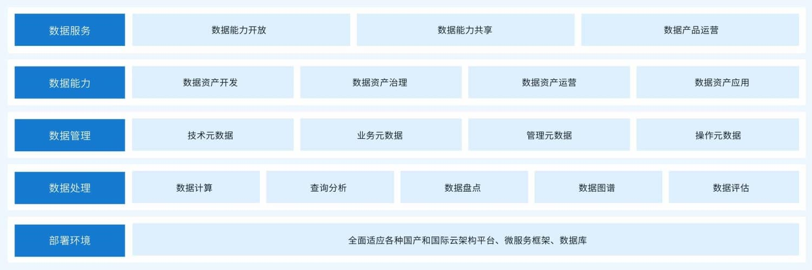
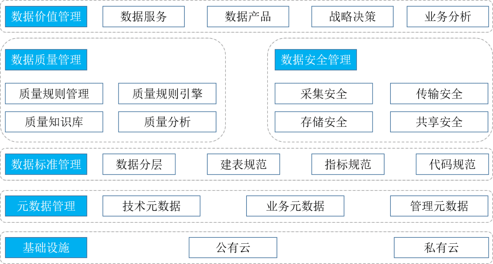
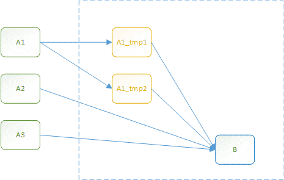
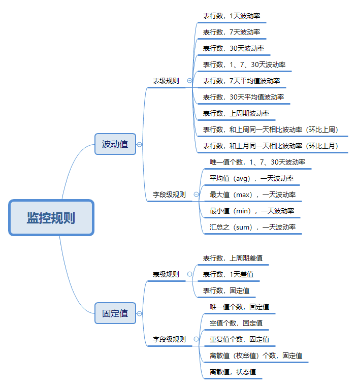
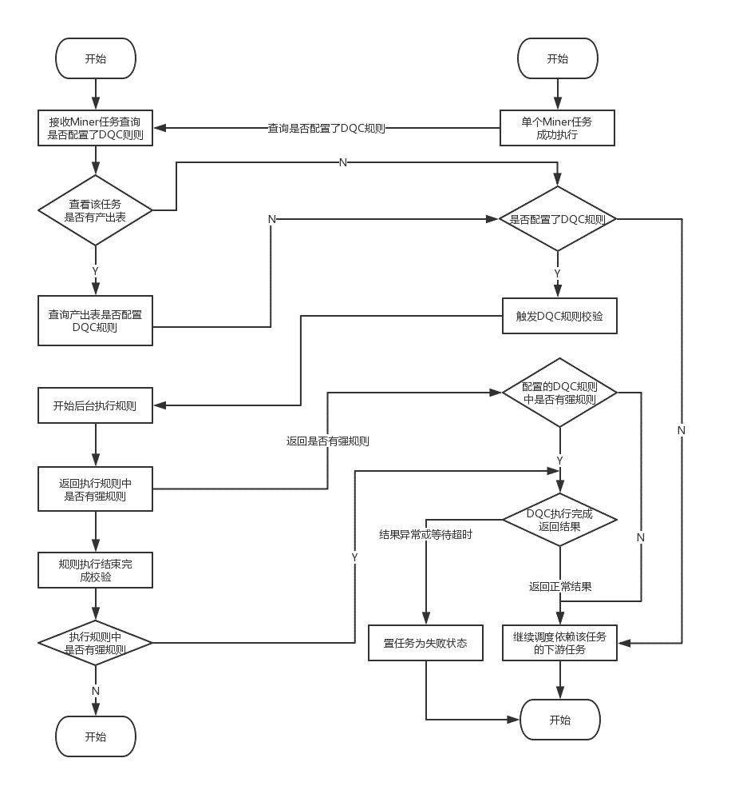
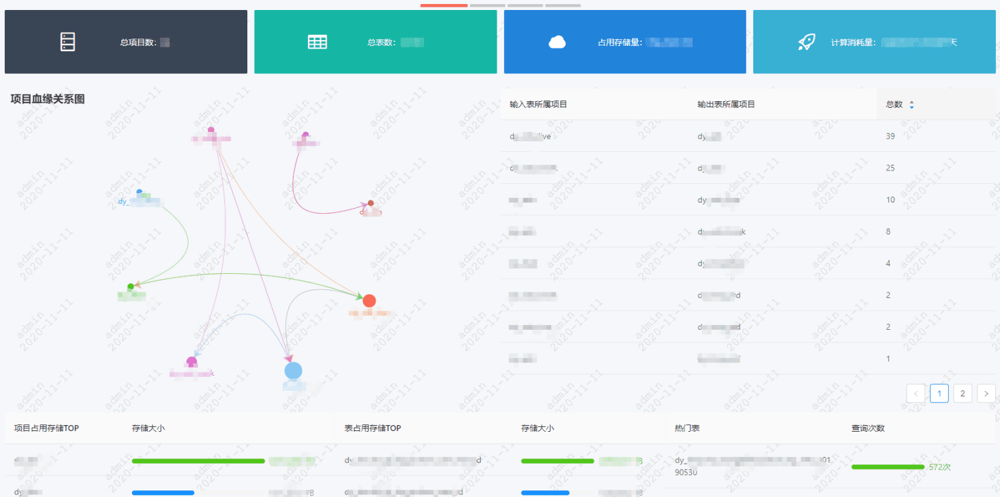
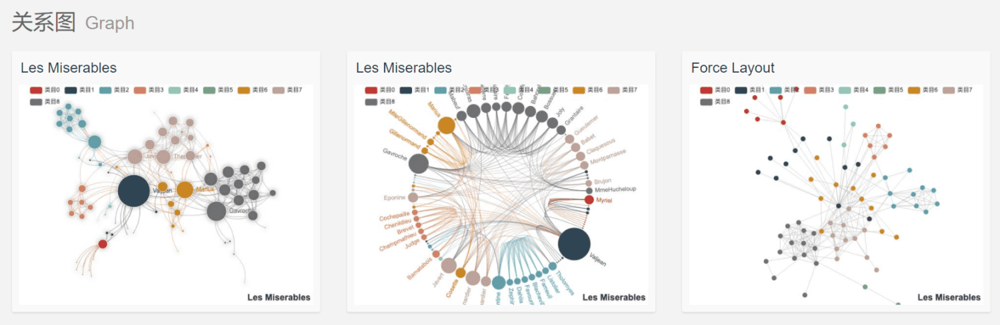
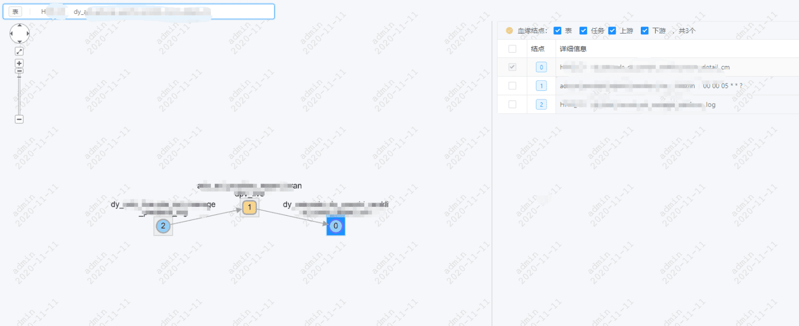

# 一、背景

近年来随着移动互联网的兴起。数据量呈现指数式增长，掌握丰富的高价值数据资源日益成为抢占未来发展主动权的前提。数据作为资产的概念已成为行业的工时，那么如何将数据作为资产管理起来，“盘活”数据充分释放数据的价值也成为了企业需要不断探索的命题。

# 二、定义及目标

## （一）数据资产管理的定义

### 1.   数据资产

数据资产是指企业拥有或者控制的，能够为企业带来未来经济效益的，以武力或电子的方式记录的数据资源。

### 2.   数据资产管理

数据资产管理是指规划、控制和提供数据集信息资产的一组业务职能。

## （二）数据资产管理的目标

### 1.   数据标准管理

数据标准管理包括建立标准化的数据模型、数据分层定义、数据指标规范管理、代码编码标准定义。

### 2.   元数据管理

元数据是指解释数据的数据，包括技术元数据、业务元数据、管理元数据和操作元数据。而元数据管理是指通过元数据的采集，统一视图，API化对外提供元数据的统一管理、搜索的服务。

### 3.   数据质量管理

数据质量管理是指对数据完整性、及时性、一致性、准确性的管理。通过制定一系列标准来衡量、提高和确保数据的质量。

### 4.   数据安全管理

数据安全管理是指以下两个方面：

- 数据环境：包括对生产环境、流转环境、访问环境全方位安全进行管控，防止数据的泄露造成企业损失；
- 管理策略：对数据设定不同的安全等级以及不同的安全等级对应的数据安全管理策略，确保敏感数据不外泄。

### 5.   数据价值管理

数据价值管理是指对数据价值的度量，从数据成本和应用价值开展

- 数据成本：包括数据采集、计算、存储和管理费用；
- 应用价值：数据资产分类、使用对象、频次和效果考量。

# 三、业界方案

## （一）亚信科技（AsianInfo）

### 1.架构

备注：图片来源于亚信科技官网（[https://www.asiainfo.com/zh_cn/product_datago_detail.html](https://www.asiainfo.com/zh_cn/product_datago_detail.html)）

### 2.简介

从部署环境、数据处理、数据管理、数据能力、数据服务五个方面设计了数据资产管理平台。

产品优势：

- 完善的数据治理和管控能力；
- 提供高效的数据开发应用手段；
- 帮助改善企业ROI；
- 实现数据资产化、货币化。

## （二）Tempodata

### 1.架构

备注：图片来资源Tempodata官网（[http://www.asktempo.com/product/tempodm.html](http://www.asktempo.com/product/tempodm.html)）

### 2.简介

从数据统一归集、数据标准管理、元数据管理、数据管理、文件管理、数据资产目录、数据质量管理、数据融合加工、数据服务、数据地图十个方面设计了数据应用管理平台。面向企业的数据资产管理、数据共享和数据治理平台。

核心设计理念：

- 微服务
- 大平台
- 轻技术
- 易操作

# 四、我们的方案

针对我们多计算中心、混合云的大数据场景，我们调研了业界实现方案，发现均有不满足的场景。于是我们设计开发了自研的数据资产管理系统。

## （一）整体架构

### 模块简介

- 基础设施：公有云包括阿里云、华为云、腾讯云，私有云为IDC自建云设施；
- 元数据管理：包括对技术元数据、业务元数据、管理元数据的管理。主要产品如数据地图；
- 数据标准管理：包括数据分层建模、建表规范、数据指标规范和管理、ETL代码规范；
- 数据质量管理：包括数据质量规则制定、质量规则引擎开发、质量知识库的维护更新以及数据质量分析报告；
- 数据安全管理：分别从采集安全、传输安全、存储安全、共享安全四个方向全方位的防范数据泄露；
- 数据价值管理：包括对外提供数据服务、数据产品化、以及提供业务分析和战略决策支撑。

## （二）重点模块介绍

### 1.   数据资产量化

#### 1.1、评估指标&维度

数据资产量化是用来量化数据的产出价值，主要从以下CPU、内存、存储三个指标评估。

- CPU评价指标：分配核数\*消耗时间（vcore\*seconds），单位：CUS、CUM、CUH、CUD

    说明：用“CPU分配的核数”乘以“核数使用的时间”来评估CPU的消耗。1CUD 称 1CU·天，指1个CPU核使用一天；

- 内存评价指标：分配内存数\*消耗时间（memory\*seconds），单位：MUS、MUM、MUH、MUD

    说明：用“内存分配数（MB）”乘以“内存使用时间”来评估内存的消耗。1MUD 称 1MU·天，指1MB内存使用一天；

- 存储评价指标：产生的结果数据所占用的磁盘存储资源

  说明：用存储消耗\*云厂商单位存储价格。

#### 1.2、评估模型

该表的直接产出任务在运行过程中消耗的CU和MU资源，例如：下图中，产出B表时，上游用了数据仓库中的A1、A2、A3表，任务在运行的时候分别先计算A1_tmp1、A1_tmp2表，然后在用A2、A3表参与运算最后产出B表，此时B表消耗的资源应该是虚线方框中计算A1_tmp1、A2_tmp2以及A1_tmp1、A1_tmp2、A2、A3产出B表，三个过程消耗的资源。

### 2.数据质量

#### 2.1、质量规则管理

数据质量规则分为模板规则和自定义规则：

- 模板规则为已在系统中开发配置完成，监控开发者只需将模板应用到表上即可完成该规则的监控；
- 自定义规则为非常用规则，需自定义sql规则完成质量监控。

模板常用规则如下：

#### 2.2、质量规则引擎

质量规则引擎用于执行数据质量监控项具体的规则，并返回监控值，其中涉及到与调度系统之间的交互，防止数据质量异常印象下游数据。

质量规则引擎工作流程如下：

名词解释：DQC：数据质量中心；Miner：自研分布式调度系统。

#### 2.3、质量分析报告

数据质量一般从完整性、准确性、一致性、及时性几个标准来衡量，那么数据质量的分析报告也应从这几个方面入手。

- 完整性：实体缺失、属性缺失、记录缺失和字段缺失；
- 准确性：一个数值与设定为准确的值之间的一致程度，或可接受程度之间的差异；
- 一致性：数据差异和相互矛盾的一致性，业务指标统一定义，数据逻辑加工结果一致性；
- 及时性：数据ETL、应用展现的及时性，任务耗时。

# 五、实现细节

## （一）数据地图实现效果

### 1.   数据地图

数据地图在大数据应用开发过程承担着举足轻重的作用，承担着管数据、找数据、找依赖以及提供元数据API的重要作用。下面分别介绍：

#### 1.1、  数据资产大盘

数据资产大盘：数据存储量、计算消耗量、集群分布情况、表热度、项目血缘关系图。效果如下图：

页面展示效果的实现方案参考《ECharts 关系图》
[https://echarts.apache.org/examples/zh/index.html#chart-type-graph](https://echarts.apache.org/examples/zh/index.html#chart-type-graph)

#### 1.2、  管数据

管数据：数据表的管理功能，生命周期管理、标签管理、责任人、产出表、Wiki编辑管理。

#### 1.3、  找数据

找数据：搜索数据表，查看字段信息、分区信息、血缘关系、ETL代码、建表语句、Wiki等。

#### 1.4、  找依赖

找依赖：查询表-表、表-任务、任务-任务、任务-表之间的血缘依赖关系。

分为上下游依赖和全局依赖：

