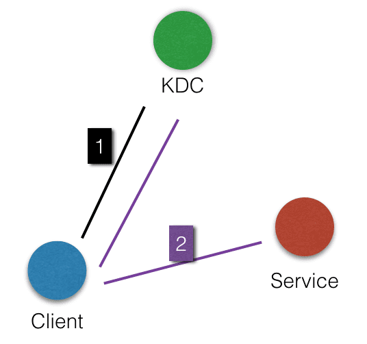
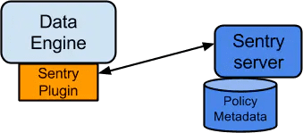
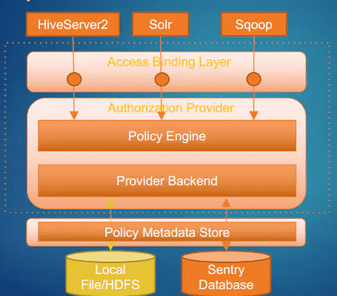
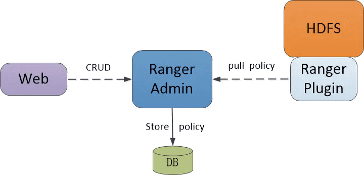
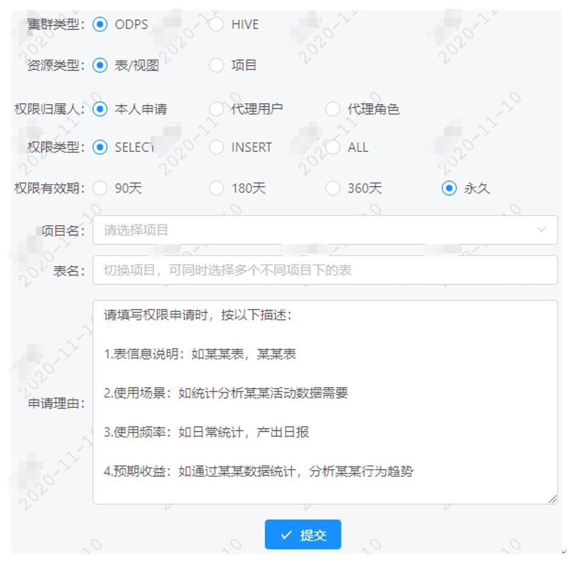

# 一、背景
数据仓库汇总了企业的数据。企业的发展壮大，对数据的需求不断增大，有权限访问到数据仓库人员变的多且杂，需要设计一套安全管控数据的权限管理系统，降低数据泄露风险，数据申请流程规范化。
# 二、目标
数据权限的管控本身与业务效率是相违背的，所以我们的权限管控原则是“防君子不防小人”，数据表均需经过流程申请才能访问，降低越权访问风险。

- 满足多集群的数据管控场景。
- 数据平台权限申请流程化。
- 数据权限申请流程化。
# 三、业界方案
权限管理相关工作可以分为两部分内容：

- 管理用户身份，也就是用户身份认证。
- 用户身份和权限的映射关系管理，也就是授权。
## （一）用户身份认证
Kerberos+LDAP
### 1.   Kerberos
#### 1.1、  简介
Kerberos提供在网络上安全的完成用户的身份验证。

认证流程如下：

Kerberos是一种基于对称密钥技术的身份认证协议，它作为一个独立的第三方的身份认证服务，可以为其它服务提供身份认证功能，且支持SSO（即客户端身份认证后，可以访问多个服务如HBase/HDFS等）。

Kerberos的认证主要分为两个阶段，第一阶段是KDC对Client身份认证，第二阶段是Service对Client身份认证。

#### 1.2、  模块介绍

- KDC：Kerberos的服务端程序。

- Client：需要访问服务的用户（principal），KDC和Service会对用户的身份进行认证。

- Service：集成了Kerberos的服务，如HDFS/YARN/HBase等。

- KDC对Client身份认证

    当客户端用户（principal）访问一个集成了Kerberos的服务之前，需要先通过KDC的身份认证。
    若身份认证通过，则客户端会获取到一个TGT（Ticket Granting Ticket），后续就可以使用该TGT去访问集成了Kerberos的服务。

- Service对Client身份认证

    当用户获取TGT后，就可以继续访问Service服务。它会使用TGT以及需要访问的服务名称（如 HDFS）去KDC获取SGT（Service Granting Ticket），然后使用SGT去访问 Service，Service会利用相关信息对Client进行身份认证，认证通过后就可以正常访问Service服务。
### 2. LDAP
LDAP是基于X.500标准的轻量级目录访问协议，主要是提供账号体系管理功能。

目录服务：一个特殊的数据库，用来保存描述性的、基于属性的详细信息，支持过滤功能。
#### 2.1、  简介
a）基本概念

目录树概念：

- 目录树：在一个目录服务系统中，整个目录信息集可以表示为一个目录信息树，树中的每个节点是一个条目。
- 条目：每个条目就是一条记录，每个条目有自己的唯一可区别的名称（DN）。
- 对象类：与某个实体类型对应的一组属性，对象类是可以继承的，这样父类的必须属性也会被继承下来。
- 属性：描述条目的某个方面的信息，一个属性由一个属性类型和一个或多个属性值组成，属性有必须属性和非必须属性。

b）DC、UID、OU、CN、SN、DN、RDN

- dc(Domain Component):域名的部分，其格式是将完整的域名分成几部分，如域名为example.com变成dc=example,dc=com（一条记录的所属位置）
- uid(User Id):用户ID songtao.xu（一条记录的ID）
- ou(Organization Unit):组织单位，组织单位可以包含其他各种对象（包括其他组织单元），如“oa组”（一条记录的所属组织）
- cn(Common Name):公共名称，如“Thomas Johansson”（一条记录的名称）
- sn(Surname):姓，如“许”
- dn(Distinguished Name):“uid=songtao.xu,ou=oa组,dc=example,dc=com”，一条记录的位置（唯一）
- rdn(Relative dn):相对辨别名，类似于文件系统中的相对路径，它是与目录树结构无关的部分，如“uid=tom”或“cn= Thomas Johansson”

#### 2.2、  LDAP使用流程

使用步骤：

1. 连接到LDAP服务器。
2. 绑定到LDAP服务器。
3. 在LDAP服务器上执行所需的任何操作。
4. 释放LDAP服务器的连接。
## （二）用户授权管理
### 1.   Sentry
#### 1.1、  架构
a）架构模型

- DataEngine：指的是具体的数据应用程序，这里指的是HDFS，Hive和Impala。
- Plugin：Plugin程序负责和Sentry Server通信，做权限策略信息的同步。同时在Plugin程序中，包含了认证引擎模块，来做权限的验证操作。
- Policy metadata：这里的matadata存储权限策略数据，对应的会需要一个外部存储db。

b）内部结构

### 2.   Ranger
#### 2.1、架构
a）架构模型

### 3.   两者区别
两者的区别主要在于Sentry对于Hive等相关组件支持集成的比较好，而Ranger在于它更通用化的支持和更加丰富的策略控制。

# 四、我们的方案
整体上用户身份认证我们使用了业界常用的Kerberos+LDAP的方案，下面介绍下用户授权管理方案
## （一）用户授权管理
我们的场景是本地集群+公有云的场景，公有云的权限控制通过厂商的权限管理API集成管理。本地集群的用户授权我们使用Sentry的方案，上面提到Sentry的方案和大数据各个组件集成度较高，经过轻量的改造即可使用，能支持项目、表、字段级别的权限控制。
### 1.   基本介绍

- 授权粒度：

    Sentry数据访问授权的实现依赖于授权对象和操作，授权对象定义要受授权规则约束的对象，可以是服务器(server)、数据库、表、视图甚至是列；操作定义运行的操作粒度，包括查找(select)、删除(delete)、创建(create)等。授权对象和操作级别的组合模式提供了不同特权级别的访问控制。

- 角色（Role）

    角色是一个权限集合，定义授权规则的基本单位。角色的概念允许将多个授权规则集合到一起，然后再把权限相同的用户分到一个角色里，很方便后续权限管理维护。

- 用户组（Group）

    组是一个用户集合，默认情况下Sentry使用Hadoop中配置的组映射机制（比如使用OS的用户组），Sentry使用Hadoop配置的组映射机制，以确保Sentry看到组映射和Hadoop生态系统中其他组件看到的相同。把一个Group加到多个Role里，这样就给用户分配到了权限，可以将多个用户分到一个组里。组的概念进一步降低了权限管理的复杂度。

### 2.   组件集成
Hive、Impala等查询组件集成Sentry后可以提高数据访问的安全性、限制用户访问特定资源。hive和Sentry集成后，可在beeline通过命令管理Sentry权限，需要注意的是Hive Cli不支持Sentry管理。赋权用GRANT语句，权限回收用REVOKE语句。如前所述，权限对象包括服务(SERVER)、数据库(DATABASE)、表(TABLE)，权限操作包括：ALL、SELECT、UPDATE。

### 3.   多集群整合
因混合云场景下需对用户提供统一的数据访问查询环境，数据权限的管理也需收拢。在不同集群权限整合时，我们采用了不同的方案。

公有云：通过调用云厂商API的方式集成权限管理。

私有云：通过调用Sentry API的方式集成权限管理。

### 4.   权限申请展示

