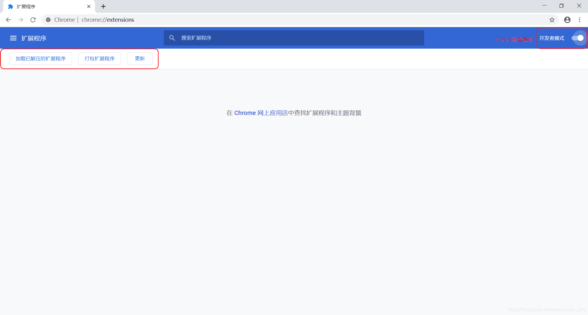
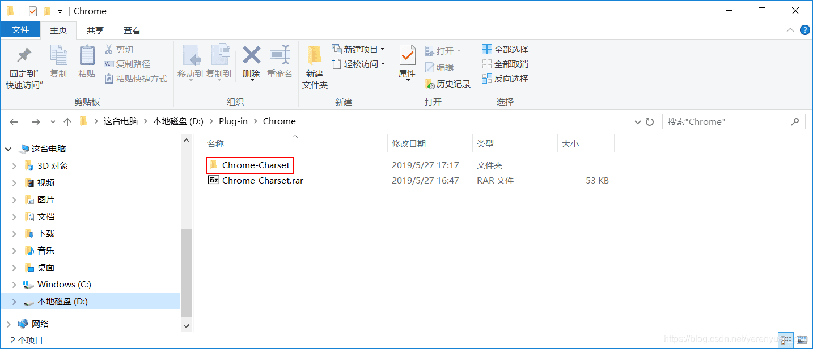
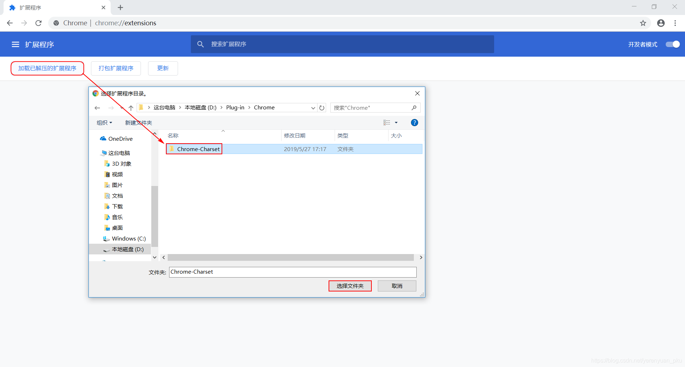
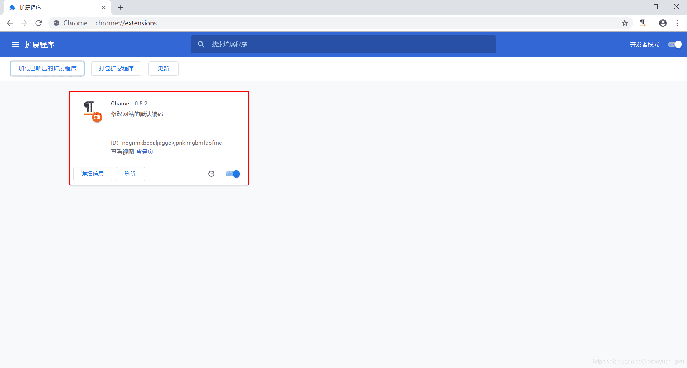
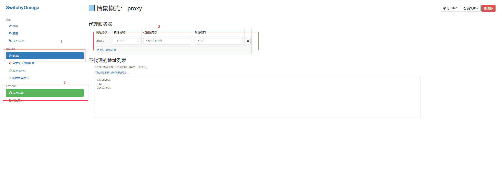
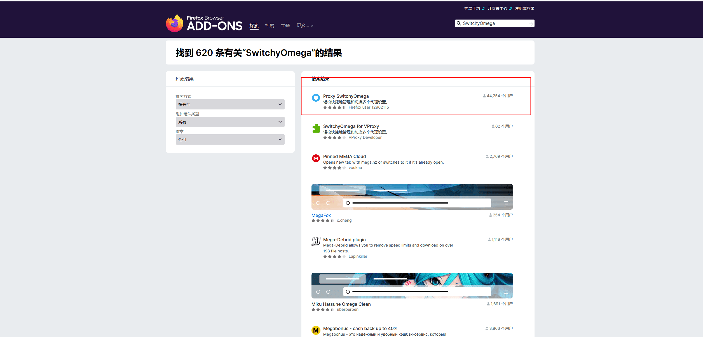

# 代理服务

## 谷歌浏览器

插件名称:SwitchyOmega

1.下载地址：https://github.com/FelisCatus/SwitchyOmega/releases

直接在该链接中下载已经编译好的插件（SwitchyOmega_Chromium.crx，谷歌浏览器插件是crx格式，火狐可不下载，可以在插件市场找到）

首先，打开Google Chrome浏览器，然后找到更多工具栏中的扩展程序，并打开，接着选择开发者模式。
在这里插入图片描述

然后，把下载好的.crx扩展名的离线Chrome插件的文件扩展名改成.zip或者.rar，如下：
在这里插入图片描述

接着，右键点击该文件，并使用压缩软件（如winrar、好压、360压缩等)对该压缩文件进行解压。
在这里插入图片描述

紧接着，打开Chrome浏览器的扩展程序管理界面，并在该界面的左上方点击“加载已解压的扩展程序”按钮，并选择刚刚解压的Chrome插件文件夹的位置。
在这里插入图片描述

这时，Chrome插件即可安装成功，如下图所示：

最后安装成功后的界面如下：

代理地址为：172.18.8.162:7010最后点击应用选项即可。

## 火狐浏览器

直接在扩展里面搜索名字

然后安装即可，使用方法和谷歌浏览器一样。

最后测试github，可以正常访问。

