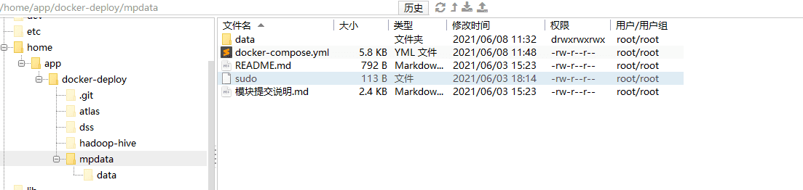
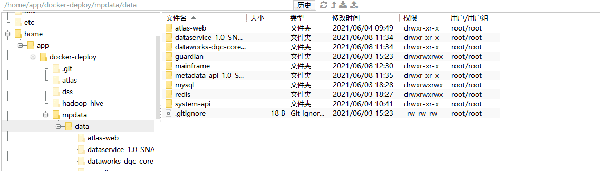
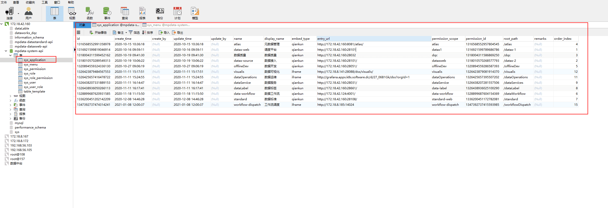
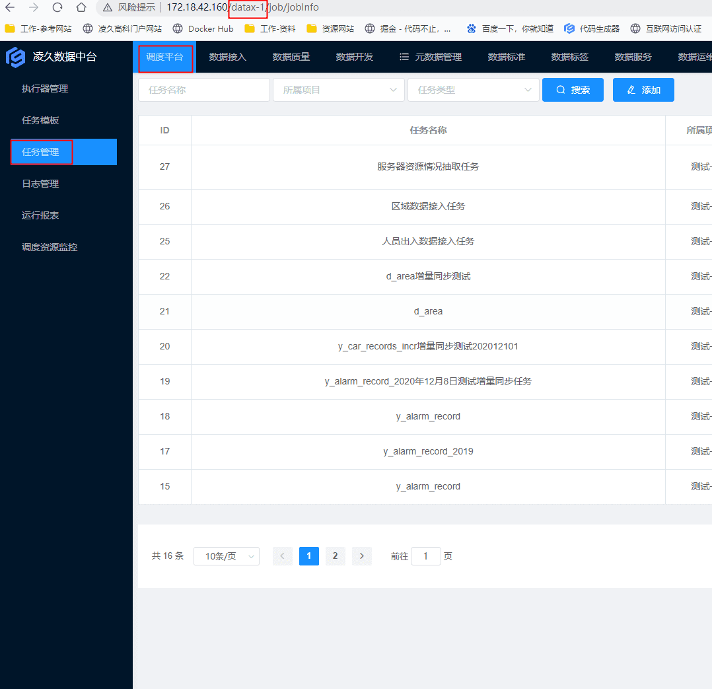
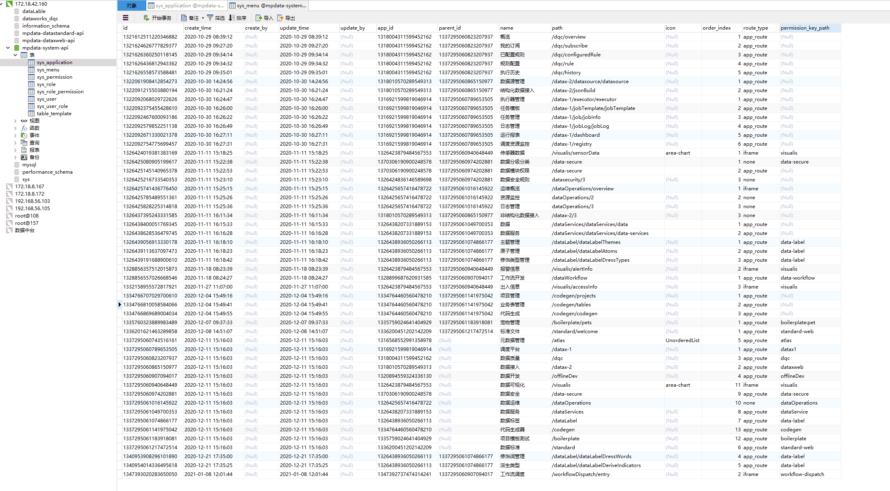

# 数据中台部署

## 1、后端配置文件

> 针对每一个后端服务

对于单机配置部署要求来说

因为后端，最终部署机器上数据库、redis等会和服务同时存在，因此需要单独编写配置文件，与本机容器内的mysql、redis等通信

举例：普通测试文档

> application-dev.yml文档中

application-dev.yml

```
server:
  port: 8087
spring:
  redis:
    host: 172.18.8.167
    port: 6379
  datasource:
    druid:
      url: jdbc:mysql://172.18.8.167:3306/mpdata-system-api?useUnicode=true&characterEncoding=UTF-8&serverTimezone=GMT%2B8
      username: root
      password: 123456
  application:
    name: mpdata-system-api


springdoc:
  swagger-ui:
    path: /api/docs


logging:
  level:
    com.cssc.ljmp.data: debug


ljmp:
  token:
    # token过期时间
    expire-time: 15m
    # token刷新时间
    refresh-threshold: 5m
  guardian:
    serverUrl: 'http://172.18.8.167:6001'
    enabled: false
    defaultEncryptJson: true

```

application-docker.yml

```
server:
  port: 8080
spring:
  redis:
    host: mpdata-redis
    port: 6379
  datasource:
    druid:
      url: jdbc:mysql://mpdata-mysql:3306/mpdata-system-api?useUnicode=true&characterEncoding=UTF-8&serverTimezone=GMT%2B8
      username: root
      password: 123456
  application:
    name: mpdata-system-api


springdoc:
  swagger-ui:
    path: /api/docs


#logging:
#  level:
#    com.cssc.ljmp.data: debug


ljmp:
  token:
    # token过期时间
    expire-time: 30m
    # token刷新时间
    refresh-threshold: 15m
  guardian:
    serverUrl: 'http://guardian:6001'
    enabled: true
    defaultEncryptJson: true

```


后端api服务

```
kind: pipeline  
type: docker
name: ci-java

volumes:
  - name: mvn-cache     //清除缓存 
    host:
      path: /app/drone/cache/.m2  //提前默认设置好的位置

steps:
  - name: build
    image: maven:3-jdk-8
    volumes:
      - name: mvn-cache
        path: /root/.m2
    commands:
      - mvn --projects system-api clean install package -s .drone/mvn-settings.xml -Dmaven.test.skip=true  //指定的文件来清除打包跳过测试阶段
      -
  - name: dev-generate-tag
    image: alpine  //一个linux发行版
    commands:
      - echo -n "0.1.2-dev-$(date '+%Y%m%d')-${DRONE_COMMIT_SHA:0:6}" > .tags   //dev分支程序，按日期+加密取前六位
      - cat .tags
    when:
      status:
        - 'success'
      branch:
        - dev

  - name: publish
    image: plugins/docker
    settings:
      repo: harbor.software.dc/mpdata/system-api
      registry: harbor.software.dc
      build_args:
        - MPDATA_API_VERSION=0.1.2
      username:
        from_secret: harbor_username
      password:
        from_secret: harbor_password
      insecure: true
      custom_dns: 172.18.8.161
      context: ./system-api
      dockerfile: ./system-api/Dockerfile
      mirror: https://ek23kius.mirror.aliyuncs.com
    when:
      status:
        - 'success'
      branch:
        - dev

  - name: notification
    image: lddsb/drone-dingtalk-message
    settings:
      token:
        from_secret: ding_token
      secret:
        from_secret: ding_secret
      type: markdown
      success_color: 008000
      failure_color: FF0000
    when:
      status:
        - "failure"
        - "success"

```


## 2、项目结构


启动中台项目服务之前需要先启动底层一些服务

启动顺序，atlas -> hadoop-hive -> dss

```
docker-compose  up -d 命令按顺序启动每个服务文件夹中的docker-compose.yml文件
```

最后进入到中台服务目录







## 3、整个服务的docker-compose文件

整个服务的docker-compose文件,在mpdata目录下

```yml
version: '3'
services:
  mpdata-redis: 
    image: "redis:alpine"
    restart: always
    container_name: mpdata-redis
    command: redis-server /etc/redis/redis.conf
    ports:
     - "26379:6379"
    volumes:
      - ./data/redis/data:/data
      - ./data/redis/redis.conf:/etc/redis/redis.conf
  
  mpdata-postgresql:
    image: 'harbor.software.dc/mpdata/mpdata-postgresql'
    container_name: 'mpdata-postgresql'
    ports:
      - "25432:5432"
    volumes:
      - "/app/mpdata/data/mpdata-postgres:/var/lib/postgresql/data"
    environment:
      POSTGRES_PASSWORD: windows-999
      
  mpdata-mysql:
    image: mysql:5.7
    restart: always
    container_name: mpdata-mysql
    volumes:
      - ./data/mysql/logs:/var/log/mysql/
      - ./data/mysql/data:/var/lib/mysql/
      - "./data/mysql/conf/my.cnf:/etc/mysql/my.cnf:ro"
      - ./data/mysql/init-sql:/docker-entrypoint-initdb.d
    ports:
      - "23306:3306"
    environment:
      MYSQL_ROOT_PASSWORD: "123456"

  #mpdata-system-api:
  #  image: 'harbor.software.dc/mpdata/system-api:0.1.2-dev-20201231-0577d7'
  #  restart: always
  #  ports:
  #    - "28010:8080"
  #  container_name: 'mpdata-system-api'
  #  command: ['java', '-jar', '/app/system-api.jar', '--spring.profiles.active=docker']
  #  depends_on:
  #    - mpdata-mysql
  #    - mpdata-redis

  system-api:
    image: 'openjdk:8-alpine'
    restart: always
    ports:
      - "8080:8080"
    container_name: 'mpdata-system-api'
    volumes:
      - ./data/system-api/system-api-0.1.2.jar:/app/system-api.jar
    command: ['java', '-jar', '/app/system-api.jar', '--spring.profiles.active=pre']

  guardian:
    image: 'harbor.software.dc/mpdata/mp-guardian:1.0.0-c64f56'
    restart: always
    ports:
      - "28011:6001"
    container_name: 'mpdata-guardian'
    volumes:
      - "./data/guardian/license:/app/license"
    command: ['/app/guardian-server', '--license', '/app/license']
 - ./data/mainframe/nginx.conf:/etc/nginx/conf.d/default.conf
 
  mainframe:
  #  image: harbor.software.dc/mpdata/mainframe:latest
    image: 'nginx:alpine'
    restart: always
    container_name: 'mpdata-mainframe'
    ports:
      - "80:80"
    volumes:
      - ./data/mainframe/dist:/app/dist
      - ./data/mainframe/nginx.conf:/etc/nginx/conf.d/default.conf
    depends_on:
    - system-api
  
  dataworks-api:
    image: 'harbor.software.dc/mpdata/dataworks-api:latest'
    container_name: 'dataworks-api'

  dataworks-web:
    image: 'harbor.software.dc/mpdata/dataworks-web'
    container_name: 'dataworks-web'
    ports:
      - "28032:80"

  dataservice-api:
    image: 'harbor.software.dc/mpdata/dataservice-api'
    container_name: 'dataservice-api'
    ports:
      - "28030:4000"

  dataservice-web:
    image: 'harbor.software.dc/mpdata/dataservice-web'
    container_name: 'dataservice-web'
    ports:
      - "28031:80"

  offline-dev-web:
    image: 'harbor.software.dc/mpdata/offline-dev-web:0.9.0-dev'
    container_name: 'mpdata-offline-dev-web'
    ports:
      - "28051:80"
  atlas-web:
    image: 'nginx:alpine'
    container_name: 'mpdata-atlas-web'
    restart: always
    ports:
      - "8081:80"
    volumes:
      - ./data/atlas-web/dist:/app/dist
      - ./data/atlas-web/nginx.conf:/etc/nginx/conf.d/default.conf

  mpdata-data-label-api: 
    image: "harbor.software.dc/mpdata/data-label-api:dev-20210129-206909"
    restart: always
    container_name: mpdata-data-label-api
    command: ['java', '-jar', '/app/dataLabel.jar','--spring.profiles.active=docker']
    ports:
      - "28660:8099"
  mpdata-data-label-web:
    image: 'harbor.software.dc/mpdata/data-label-web:dev-20210107-f4b45b'
    container_name: 'mpdata-data-label-web'
    ports:
      - "28661:80"
  mpdata-standard-web:
    image: 'harbor.software.dc/mpdata/standard-web:dev-20210105-f1fac8'
    container_name: 'mpdata-standard-web'
    ports:
      - "28108:80"
  mpdata-standard-api:
    image: 'harbor.software.dc/mpdata/standard-api:dev-20210107-4b3753'
    restart: always
    ports:
      - "28088:18088"
    container_name: 'mpdata-standard-api'
    command: ['java', '-jar', '/app/data-standard.jar', '--spring.profiles.active=docker']
  mpdata-datax-web-api:
    image: 'harbor.software.dc/mpdata/datax-web-api:dev-20210519-107898'
    restart: always
    ports:
      - "28104:9527"
    container_name: 'mpdata-datax-web-api'
    command:  "/data/datax-web/datax-web-2.1.2/bin/start-all.sh"
  mpdata-datax-web-source:
    image: 'harbor.software.dc/mpdata/datax-web:dev-20210106-e98b85'
    container_name: 'mpdata-datax-web-source'
    ports:
      - "28101:80"

networks:
  default:
    external:
      name: hadoop-ljzt

```

## 4、maiframe服务中的nginx配置文件

配置各个后台服务的代理，文件在/home/app/docker-deploy/mpdata/data/mainframe目录中

```yml
server {
    listen 80;
    server_name _;

    gzip on;
    gzip_min_length 1k;
    gzip_comp_level 9;
    gzip_types text/plain application/javascript application/x-javascript text/css application/xml text/javascript application/x-httpd-php image/jpeg image/gif image/png;
    gzip_vary on;
    gzip_disable "MSIE [1-6]\.";

    # system-api
    location /api/system {
    //要填写服务名
        proxy_pass http://system-api:8080;

        proxy_set_header X-Forwarded-For $remote_addr;
        proxy_set_header X-Forwarded-Proto $scheme;
        proxy_set_header Host $http_host;
        proxy_set_header X-Real-IP $remote_addr;

    }

    location /api/offlineDev/ {
        proxy_pass http://172.18.8.141:29001/api/rest_j/v1/;

        proxy_set_header X-Forwarded-For $remote_addr;
        proxy_set_header X-Forwarded-Proto $scheme;
        proxy_set_header Host $http_host;
        proxy_set_header X-Real-IP $remote_addr;

    }

    location /api/atlas {
        proxy_pass http://172.18.8.113:21000;

        proxy_set_header X-Forwarded-For $remote_addr;
        proxy_set_header X-Forwarded-Proto $scheme;
        proxy_set_header Host $http_host;
        proxy_set_header X-Real-IP $remote_addr;

    }

    location /api/codegen {
        proxy_pass http://172.18.8.167:17010;

        proxy_set_header X-Forwarded-For $remote_addr;
        proxy_set_header X-Forwarded-Proto $scheme;
        proxy_set_header Host $http_host;
        proxy_set_header X-Real-IP $remote_addr;
    }


    location /api/dqc {
        proxy_pass http://172.18.42.160:8001;

        proxy_set_header X-Forwarded-For $remote_addr;
        proxy_set_header X-Forwarded-Proto $scheme;
        proxy_set_header Host $http_host;
        proxy_set_header X-Real-IP $remote_addr;

    }

    location /apids/dataresource {
        proxy_pass http://172.18.42.160:8068;

        proxy_set_header X-Forwarded-For $remote_addr;
        proxy_set_header X-Forwarded-Proto $scheme;
        proxy_set_header Host $http_host;
        proxy_set_header X-Real-IP $remote_addr;

    }

    location /api/metadata {
        proxy_pass http://172.18.42.160:8070;

        proxy_set_header X-Forwarded-For $remote_addr;
        proxy_set_header X-Forwarded-Proto $scheme;
        proxy_set_header Host $http_host;
        proxy_set_header X-Real-IP $remote_addr;

    }

    location /api/dataLabel {
        proxy_pass http://mpdata-data-label-api:8099;

        proxy_set_header X-Forwarded-For $remote_addr;
        proxy_set_header X-Forwarded-Proto $scheme;
        proxy_set_header Host $http_host;
        proxy_set_header X-Real-IP $remote_addr;

    }

    location /api/datax/ {
        proxy_pass http://172.18.42.160:28104/;
        proxy_set_header X-Forwarded-For $remote_addr;
        proxy_set_header X-Forwarded-Proto $scheme;
        proxy_set_header Host $http_host;
        proxy_set_header X-Real-IP $remote_addr;
    }

   
    location /api/dataStandard {
           proxy_pass http://172.18.42.160:28088/;
           proxy_set_header X-Forwarded-For $remote_addr;
           proxy_set_header X-Forwarded-Proto $scheme;
           proxy_set_header Host $http_host;
           proxy_set_header X-Real-IP $remote_addr;
       }
    # web
    location / {                                    //根目录配置
        #root /usr/share/nginx/html;
        root /app/dist;
        try_files $uri $uri/ /index.html;
    }
}

```


## 5、报错解决

> 当出现404错误的时候，通过下面的方式进行检查

mainframe配置文件必须与数据库中的配置一一对应，有些服务是通过链接形式纯前端演示，由于服务是独立性的，全部部署在一台服务器上，必须保证数据库的数据都是来自同一服务器。通常界面菜单的404报错来自该表(应用表)，通过排查该表

- entry_url，有些服务是链接，检查该行数据
- display_name，显示出来的菜单的名字
- root_path，界面跳转的时候的根路径



举例子：调度平台

datax-1是调度平台的根路径




如果子菜单显示不正常或者报404的错误优先检查下面的子目录表。



关键属性解释

- app_id 应用id
- parent_id 父菜单id
- name 菜单名字
- path 菜单路径
- order_index 菜单排序编号
