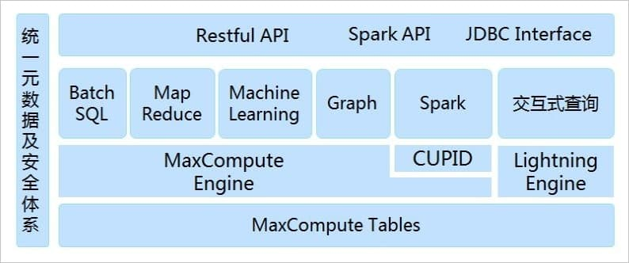
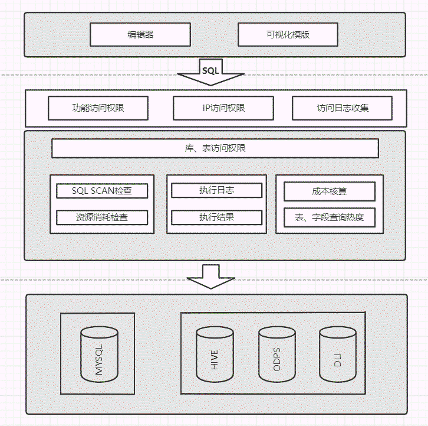
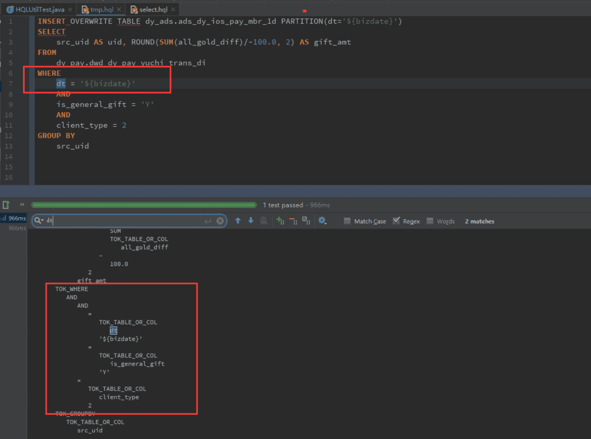
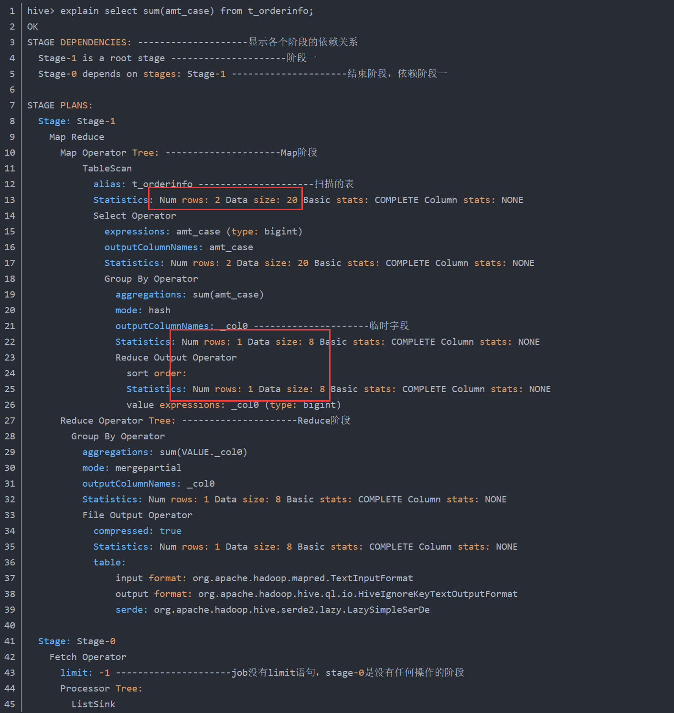
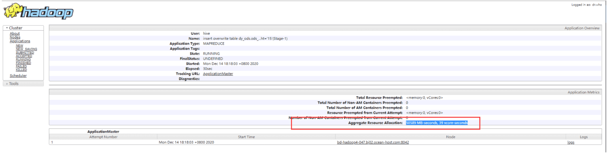
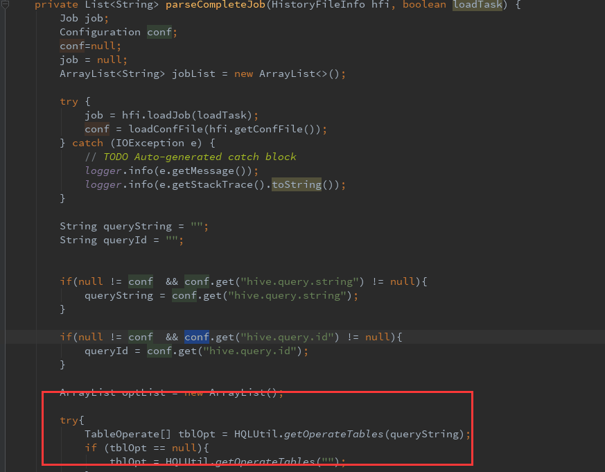
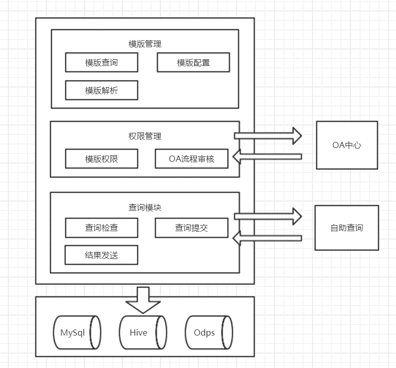
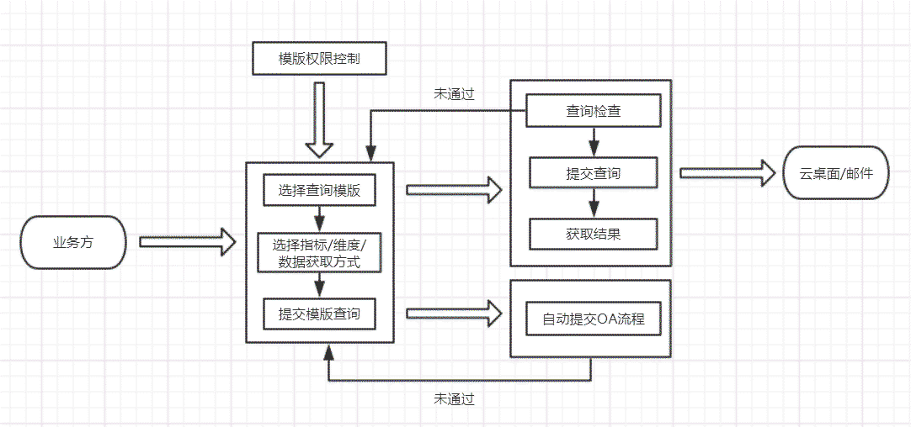
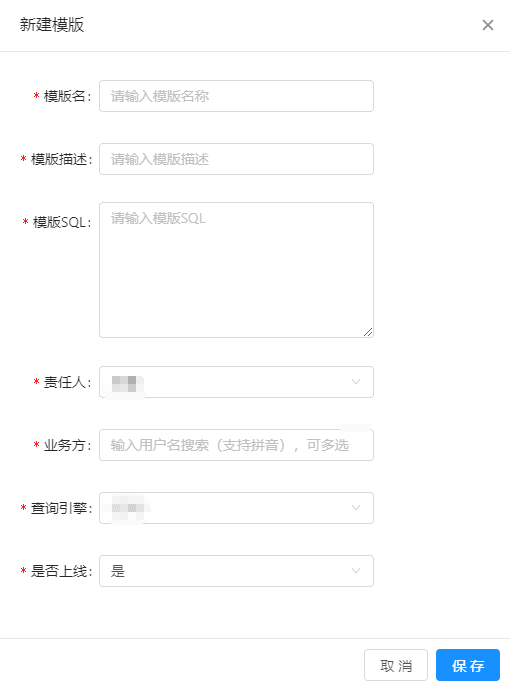
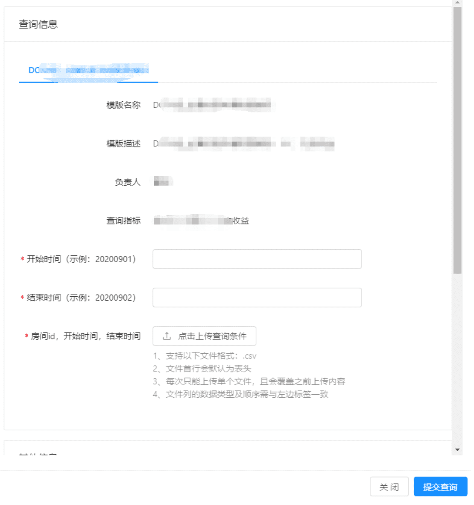

# 一、背景
数据开发的整体流程分为了解需求->模型设计->ETL开发->测试->发布上线->数据运维->任务/数据下线，传统的数据仓库搭建Oracle平台上，且对数据需求也较简单，通过Oracle统一的平台即可完成整个数据开发周期的工作。但随着互联网、移动互联网时代兴起，数据量指数级增长，数据来源多远，单纯的Oracle数据库平台已满足不了企业需求。需建立一种符合大数据发展，覆盖数据开发完整生命周期的平台。
# 二、目标
为了解决数据需求爆炸式增长带来的数据效率降低，为了帮助业务部门能快速获取数据，分析比赛活动效果，我们需要开发一个不仅仅能满足研发需求，也能满足业务部门数据分析师需求的大数据开发平台，即自助式数据查询平台。
需达到的目标如下：

- 一站式数据协作开发平台、提供即席分析、在线查看、下载功能。
- 完整的数据权限管理，保障数据开发过程中的数据安全。
- 协同可视化分析平台，降低数据分析式数据分析门槛。
# 三、业界方案
## （一）阿里商业云产品Maxcompute
### 1.   产品架构

### 2.   产品特性介绍
#### 2.1、大规模计算存储
MaxCompute适用于100GB以上规模的存储及计算需求，最大可达EB级别。
#### 2.2、多种计算模型
MaxCompute支持SQL、MapReduce、UDF（Java/Python）、Graph、基于DAG的处理、交互式、内存计算、机器学习等计算类型及MPI迭代类算法。简化了企业大数据平台的应用架构。
#### 2.3、强数据安全

-  MaxCompute已稳定支撑阿里全部数据仓库业务9年以上，提供多层沙箱防护、细粒度权限管理及监控。
-  MaxCompute通过了独立的第三方审计师针对阿里云对AICPA可信服务标准中关于安全性、可用性和机密性原则符合性描述的审计。
#### 2.4、低成本
与企业自建专有云相比，MaxCompute的计算存储更高效，可以降低30%~50%的采购成本。
#### 2.5、免运维
基于MaxCompute的Serverless无服务器的设计思路，用户只需关心作业和数据，而无需关心底层分布式架构及运维。
#### 2.6、极致弹性扩展
MaxCompute提供按量付费模式下的作业级别的资源管理。用户无需受困于资源扩展难题，系统会自动扩展计算、存储、网络等资源，最大程度地节省成本。
# 四、我们的方案
对于阿里云MaxCompute这样的商业产品面对的是各种各样不同的行业，对比我们的场景复杂程度高，架构设计也复杂。针对我们的场景无需设计这么复杂的功能，能满足公司未来的需求，高度兼容公司混合云持续共存的场景即可。
## （一）自助查询
面向数据分析师的自助式数据查询平台，通过SQL即可进行数据查询。
### 1.   系统架构

### 2.   重点模块介绍
### 2.1、SQLScan

#### 2.1.1 SQLScan原理介绍
SQLScan使用了Antlr 解析语法树的方式，解析出SQL元数据信息，制定相应的规则，扫描sql语句合理合规性。

Antlr 原理：

语言识别的另一个工具(ANother Tool for Language Recognition),( 前身是 PCCTS)是一种语言工具，它提供了一个框架，可以通过包含Java,C++,或C#动作的语法描述来构造语言识别器，编译器和解释器，ANTLR能够通过断言（Predicate）解决识别冲突；支持动作（Action）和返回值（Return Value）来；更棒的是，它能够依据输入自己主动生成语法树并可视化的显示出来。

a）词法分析器（Lexer）

词法分析器又称为Scanner，Lexical analyser和Tokenizer。程序设计语言通常由keyword和严格定义的语法结构组成。编译的终于目的是将程序设计语言的高层指令翻译成物力机器或虚拟机能够运行的指令。此法分析器的工作是分析量化那些本来毫无意义的字符流，将他们翻译成离散的字符组（也就是一个一个的Token）括keyword，标识符，符号（symbols）和操作符供语法分析器使用。

b）语法分析器（Parser）

编译器又称为Syntactical analyser。在分析字符流的时候，Lexer不关心所生成的单个Token的语法意义及其与上下文之间的关系，而这就是Parser的工作。语法分析器将收到的Tokens组织起来，并转换成为目标语言语法定义所同意的序列。

不管是Lexer还是Parser都是一种识别器，Lexer是字符序列识别器而Parser是Token序列识别器。他们在本质上是相似的东西，而仅仅是在分工上有所不同而已。

Antlr 将上述两者结合起来，它同意我们定义识别字符流的词法规则和用于解释Token流的词法分析规则。然后，Antlr 将依据用户提供的语法文件自己主动生成对应的词法/语法分析器。用户能够利用他们将输入的文本进行编译，并转换成其它形式（如AST—Abstract Syntax Tree，抽象的语法树）。

#### 2.1.2 ANTLR使用
安装及使用 到[http://www.antlr.org/](http://www.antlr.org/) 下载最新版本号的ANTLR开发包和源代码（比如版本号2.7.5）。将antlr-2.7.5.jar所在文件夹配置到你的环境变量中，写好语法文件（比如SensorSQL.g），执行命令“java antlr.Tool SensorSQL.g”就能够获得自己主动生成语法/词法分析器。

- 语法分析器
- 词法分析器

#### 2.1.3 SQLScan使用
SQLScan是指对数据开发过程中编写的sql进行规则扫描，包括代码规范类规则检查（命名规范等）、代码质量类规则检查（分母为0等）、代码性能类规则检查（大表扫描等）。

a）规则等级如下：

| **级别** | **说明** |
| --- | --- |
| **INNER** | 内部解析错误，一般开发人员无需关注 |
| **INFO** | 需要关注的信息 |
| **WARN** | 建议修改的问题 |
| **ERROR** | 必须修改的问题 |

b）规则举例如下：

| **检查类型** | **检查内容** | **告警级别** | **检查规则** | **修改建议** |
| --- | --- | --- | --- | --- |
| **ORDER语句** | 排序 | INFO | ORDER和collect函数配合使用 | Collect结果可能会很大，请注意检查 |
|  |  | WARN | 中间查询使用了ORDER | 除非和LIMIT或开窗函数配合使用，中间查询建议删除ORDER |
|  |  | ERROR | 创建临时表最外层使用了ORDER | HDFS文件分块，读时不保证顺序，创建临时表最外层应删除ORDER |
|  |  | ERROR | 写入表最外层使用了ORDER | HDFS文件分块，读时不保证行顺序，写入表最外层应删除ORDER |

#### 2.1.4 实现原理
通过语法解析拿到语法树，再从语法树中各种不同类型的结点拿到SQL的输入表、输出表、输入字段、输出字段、过滤条件、关联条件等，就可以判断其SQL逻辑是否合理，下图就展示了分区表分区字段检查的原理。

注：Antlr 的使用可以参考《[使用 Antlr 开发领域语言](https://developer.ibm.com/zh/languages/java/articles/j-lo-antlr/)》

### 2.2、资源消耗检查
我们的使用场景中除有专业的数据开发工程师外，还有大量的数据分析师、业务分析师，他们擅长于数据分析，但是对于数据开发中的SQL性能以及注意事项不熟悉，日常开发中会导致SQL逻辑的错误造成扫描过多的表数据，造成极大的资源浪费。在数据开发系统设计之初考虑到这种情况，我们设计了资源消耗检查的模块，并对单条SQL中的资源消耗最大量做了限制，并能动态配置调整，以适应不同的使用场景。

原理参考Hive explain：

### 2.3、成本核算
由于同时存在公有云和私有自建集群，我们需在成本模型上进行统一。公有云上已有较成熟的数据查询成本核算模型，根据资源消耗量、数据查询量、查询复杂度等维度进行建模，计算出单条SQL的成本。自建集群根据公有云同样的成本核算模型进行管理。可对各个查询进行ROI核算管理。

在Job的执行历史中，可以查看资源消耗情况：

总成本计算模型：

TOTAL_COST = ROUND(0.000099\*vcore\_seconds\*100 + 0.00000002\*memory\_seconds\*100, 0)   

其中 vcore\_seconds和memory\_seconds 两个系数是经验值。

### 2.4、查询热度
通过与元数据的集成，搜集各个集群建的数据查询SQL，对查询表和字段进行解析，统一存储到元数据管理系统中，对外提供API接口供查询。在数据地图中对表、字段查询热度进行统一的展示。

对于HIVE集群，通过解析得到SQL 语法树可以直接拿到输入表，就可以计算表和任务的每天使用的热度：

## （二）模板查询
面向业务人员自助式数据查询平台，通过简单的勾选即可进行数据查询。
### 1.   系统架构

### 2.   系统流程设计

### 3.   功能使用简介
#### 3.1、配置模板
通过如下方式针对业务需求配置相应的模板。

#### 3.2、赋权限
模板管理员针对特定的模板进行赋权。

#### 3.3、查询数据
配置简单的几个参数提交查询。

