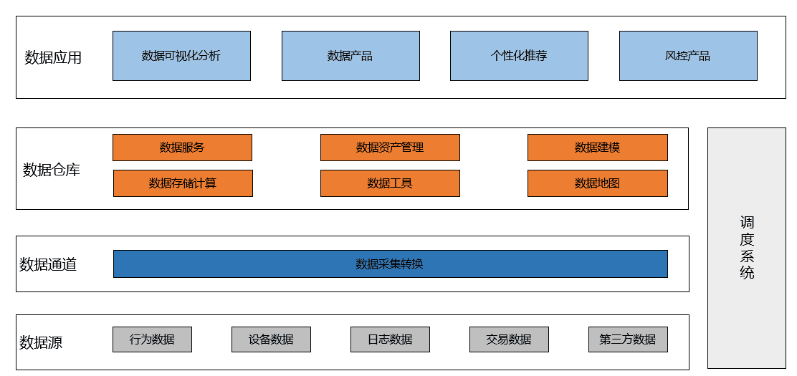
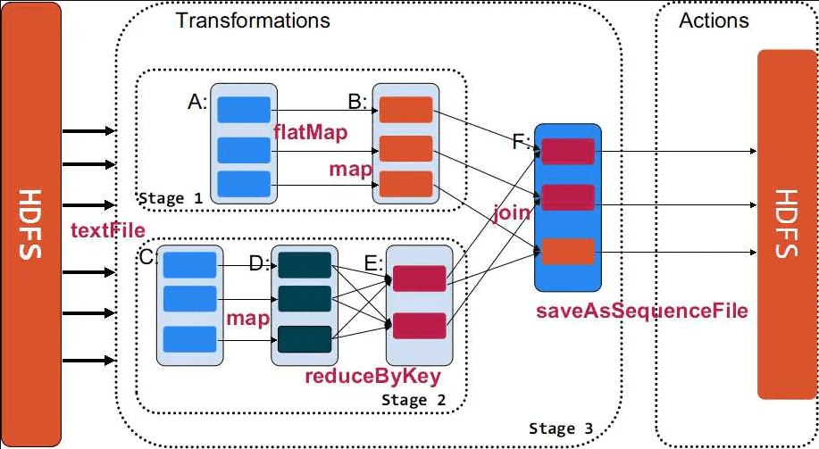
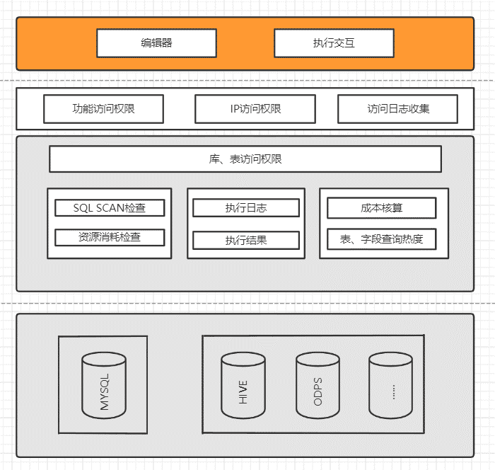
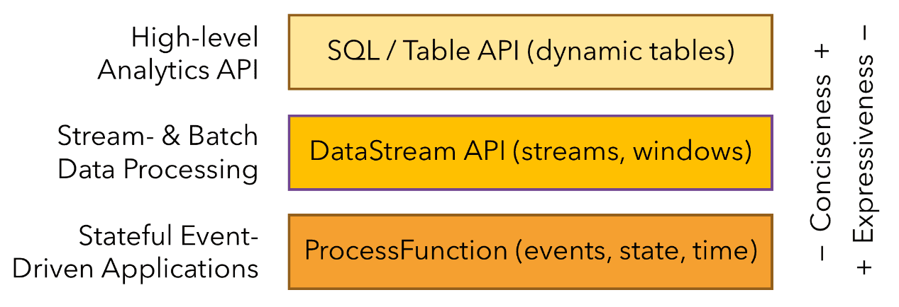
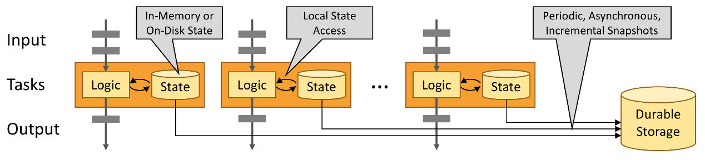
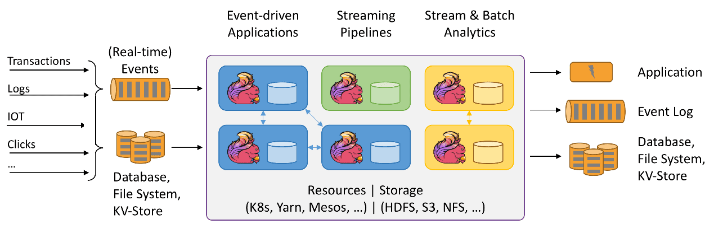
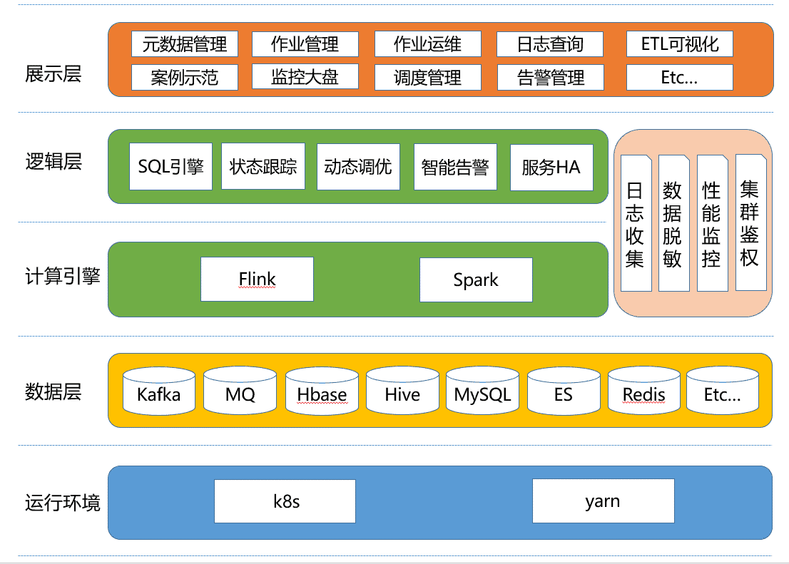

# 1.系统组成
数据中台建设的基本思路，就是要保障各个子模块（数据源、 数据通道、 数据仓库、 调度系统、数据应用）能够独立地开展建设，每个子模块内部又可以拆分成一些小的功能模块，然后对每个小的功能模块进行设计开发。例如数据通道要支持不同的数据源，数据源可以是行为数据、日志数据、第三方文本数据，针对不同类型的数据源，在保障数据正常接入的基础上，建立一套标准的数据接入流程体系，流程体系能够涵盖不同数据源在接入过程中的核心流程步骤，不同数据源适配方式有些许差异。

系统总体体系架构如下图所示：

系统总体体系架构包括数据源、 数据通道、 数据仓库、 调度系统、数据应用。
1. 数据源层

    数据源层为系统建设的数据来源， 包括结构化的文本信息（ 行为、设备、日志、交易）、 非结构化的数据（图片、视频）， 符合实时数据、 增量数据、 存量数据的多种采集方式， 实现了多源异构数据的采集、 存储、 管理等工作。

2. 数据通道
   
    基于自研的分布式数据传输工具， 支持从多种数据源中以不同的方式将数据导入到 HDFS、 HBase表、 私有云表、 Search(ElasticSearch)表等各种存储引擎中， 并且可以通过调度系统进行调度。
    
3. 数据仓库
   
    提供数据建设的方法论，并且在这一套方法论指导下构建的数据表。它包含了数据建模、数据资产管理、数据工具、数据地图、数据服务等一整套内容。

4. 调度系统
   
    基于Zookeeper的分布式任务调度系统，支持自定义、SQL、Shell、接口等多种类型任务调度，具备高可用、可扩展、易维护等核心特性。

5. 数据应用
   
    基于各个子系统提供的数据指标、数据服务形成的数据共享成果展开数据应用建设，如可视化分析、数据产品、个性推荐等。

各个子模块之间的交互方式如下图：

不同来源、多种结构化的源数据通过数据收集服务进行转换转发到Kafka消息队列和批量存储文件，流处理引擎实时读取消费Kafka消息队列中的数据， 并执行实时处理逻辑（如实时入库、实时统计、实时预警等），离线数据引擎读取明细数据进行批量计算，实时和离线计算的结果数据汇总成数据仓库中应用层数据，最后基于统一数据服务对外提供数据交互服务。

# 2.功能及技术指标
## 2.1本系统的功能有：
1. 数据流程与规范：通过特定的业务场景，制定统一的数据接入流程及数据规范标准；
2. 数据同步工具：该工具是根据数据流程与规范进行设计开发，提供高效、易操作、可扩展的数据接入、转化、存储工具；
3. 离线计算平台：基于 Hadoop 生态进行二次开发集成（包括 HDFS、YARN、MR、SPARK），提供大规模低成本计算存储服务，支持多种计算模型（SQL、MR、UDF等）；
4. 实时计算平台：基于Apache Flink构建的一站式、高性能实时大数据处理平台，提供标准实时数据处理流程，在 PB 级别的数据集上可以支持亚秒级别的处理延时；
5. 数据仓库：提供包含ETL流程（数据抽取、清洗、转换）、数据分层、数据建模、数据资产管理、数据地图、数据工具等功能的数据存储设计方案
6. 任务调度系统：把分散的，可靠性差的计划任务纳入统一的平台，并实现集群管理调度和分布式部署的一种定时任务的管理方式。
7. 数据全文检索。
8. 数据可视化展示平台。

## 2.2技术指标：
1. 数据流程与规范：流程与规范至少能覆盖4种类型（用户、设备、文本、第三方接口）数据接入；
2. 数据同步工具：该工具需要提供易用的可视化配置平台及SDK集成，支持7种以上异构数据（Redis、Mysql、Oracle、SQLServer、MongoDB、Hive、HBase）的增量及全量同步，并能够自定义扩展任意类型数据同步；
3. 离线计算平台：该平台能够完全兼容Hadoop生态组件（包括 HDFS、YARN、MR、SPARK、Elasticsearch），支持至少4种类型的任务计算（包括SQL、Shell、XML配置化、UDF）；
4. 实时计算平台：该平台能够完全兼容Flink相关功能，实现可视化实时流处理任务开发，实时计算数据延迟可以达到毫秒以下；
5. 数据仓库： 数据分层支持ODS、DWD、DW、DIM、DM、ADS，数据建模支持逻辑模型和物理模型，数据资产管理提供可视化数据资产量化指标，数据地图支持数据血缘关系。
6. 任务调度系统： 至少支持3中类型任务调度，包括Java、HTTP接口、Shell脚本，调度模式支持周期调度、手动触发调度、程序触发调度、工作流调度4种调度方式。

# 3.方案详细设计
## 3.1 离线计算平台
基于开源的Apache Hadoop和Apache Spark，可以方便地使用Hadoop和Spark生态系统中的其他周边系统（例如，Apache Hive、Apache Pig和HBase等）来分析和处理自己的数据。

Spark是专为大规模数据处理而设计的快速通用的计算引擎，Spark架构采用了分布式计算中的Master-Slave模型。Master是对应集群中的含有Master进程的节点，Slave是集群中含有Worker进程的节点。Master作为整个集群的控制器，负责整个集群的正常运行；Worker相当于是计算节点，接收主节点命令与进行状态汇报；Executor负责任务的执行；Client作为用户的客户端负责提交应用，Driver负责控制一个应用的执行。

Spark集群部署后，需要在主节点和从节点分别启动Master进程和Worker进程，对整个集群进行控制。在一个Spark应用的执行过程中，Driver和Worker是两个重要角色。Driver程序是应用逻辑执行的起点，负责作业的调度，即Task任务的分发，而多个Worker用来管理计算节点和创建Executor并行处理任务。在执行阶段，Driver会将Task和Task所依赖的file和jar序列化后传递给对应的Worker机器，同时Executor对相应数据分区的任务进行处理。

Spark的整体流程为：Client提交应用，Master找到一个Worker启动Driver，Driver向Master或者资源管理器申请资源，之后将应用转化为RDD Graph，再由DAGScheduler将RDD Graph转化为Stage的有向无环图提交给TaskScheduler，由TaskScheduler提交任务给Executor执行。在任务执行的过程中，其他组件协同工作，确保整个应用顺利执行。

Spark数据处理流程如下图：

整个执行流程在逻辑上会形成有向无环图（DAG）。Action算子触发之后，将所有累积的算子形成一个有向无环图，然后由调度器调度该图上的任务进行运算。Spark根据RDD之间不同的依赖关系切分形成不同的阶段（Stage），一个阶段包含一系列函数执行流水线。图中的A、B、C、D、E、F分别代表不同的RDD，RDD内的方框代表分区。数据从HDFS输入Spark，形成RDD A和RDD C，RDD C上执行map操作，转换为RDD D，RDD B和RDDE执行join操作，转换为F，而在B和E连接转化为F的过程中又会执行Shuffle，最后RDD F通过函数saveAsSequenceFile输出并保存到HDFS中。

本模块的离线计算平台构建与Spark之上，整体架构图如下：

主要包含数据源、数据批量计算、数据安全控制以及数据交互几个部分，离线计算平台具备以下核心特性：

1. 高性能、稳定性好：单实例限制最大并发任务数且支持动态水平扩展，避免内存与计算资源不足问题。
2. 支持多种计算引擎：通过对多种执行引擎的数据处理接口封装，平台支持Hive、ODPS、DLI等多个计算引擎，对查询、日志、结果等模块进行封装，支持水平灵活扩展。
3. 自定义函数管理：建立统一规范的自定义函数规范，对自定义函数的jar包、脚本进行统一部署管理，支持功能说明及使用案例在线查看。
4. 页面数据查询：后台封装执行期能力，在编辑器页面提供预览、执行能力，通过对执行引擎的能力封装，可以快速实现基于业务规则定制批量任务，同时可以基于Spark的分组聚合能力，对Hbase、Search不同模块的各类数据进行关联聚合、碰撞比对。
5. 成本可控：打造SQL成本模型，通过SQL检查规则及explain预览功能，对SQL的合法性及计算成本进行判断，并定时对高成本SQL进行分析优化。
6. 资源有效管控：查询任务提交之前，会对所有SQL的语法与SQL的资源进行检查，拦截非法SQL。 
7. 偏好分析：解析收集用户常用表、指标查询热度情况，为数仓建设提供参考依据。
8. 安全：通过从访问IP、平台功能、数据等多个维度设置数据权限，对设置白名单的IP才能使用，申请对应功能及数据权限才能进行数据查询操作，从多方面保障数据安全。

## 3.2 实时计算平台
实时计算平台是一套基于Apache Flink构建的一站式、高性能实时大数据处理平台，广泛应用于流式数据。

Flink 是一个针对无界和有界数据流进行有状态计算的框架。根据抽象程度分层，提供了三种不同的API。每一种 API 在简洁性和表达力上有着不同的侧重，并且针对不同的应用场景。

Flink 通过定期和异步地对本地状态进行持久化存储来保证故障场景下精确一次的状态一致性。

为了保证服务能够7\*24小时稳定运行，Flink通过几下多种机制维护应用可持续运行及其一致性:

- 检查点的一致性：Flink的故障恢复机制是通过建立分布式应用服务状态一致性检查点实现的，当有故障产生时，应用服务会重启后，再重新加载上一次成功备份的状态检查点信息。结合可重放的数据源，该特性可保证精确一次（exactly-once）的状态一致性。
- 高效的检查点：如果一个应用要维护一个TB级的状态信息，对此应用的状态建立检查点服务的资源开销是很高的，为了减小因检查点服务对应用的延迟性（SLAs服务等级协议）的影响，Flink采用异步及增量的方式构建检查点服务。
- 端到端的精确一次：Flink 为某些特定的存储支持了事务型输出的功能，及时在发生故障的情况下，也能够保证精确一次的输出。
- 集成多种集群管理服务：Flink已与多种集群管理服务紧密集成，如 [Hadoop YARN](https://hadoop.apache.org/), [Mesos](https://mesos.apache.org/), 以及 [Kubernetes](https://kubernetes.io/)。当集群中某个流程任务失败后，一个新的流程服务会自动启动并替代它继续执行。
- 内置高可用服务：Flink内置了为解决单点故障问题的高可用性服务模块，此模块是基于[Apache ZooKeeper](https://zookeeper.apache.org/) 技术实现的，[Apache ZooKeeper](https://zookeeper.apache.org/)是一种可靠的、交互式的、分布式协调服务组件。

本模块的离线计算平台构建与Spark之上，整体架构图如下：

1. 展示层

    - 元数据管理：收集展示集群&作业&数据相关信息
    - 作业管理：管理创建流式&批式作业
    - 作业运维：集中作业状态查询、重跑、停止等操作
    - 日志查询：实时查询作业运行日志
    - ETL可视化：可视化拖拽配置作业
    - 案例示范：提供案例示范作业配置
    - 监控大盘：全局监控作业、集群等信息
    - 调度管理：管理作业调度血缘信息
    - 告警管理：管理作业、集群相关告警项

2. 基础组件

    - 日志收集：收集作业运行&状态监控等日志
    - 数据脱敏：屏蔽作业涉及的敏感数据
    - 性能监控：实时监测作业相关metrics信息
    - 集群鉴权：hadoop集群鉴权

3. 逻辑层

    - SQL引擎：SQL化描述定义流式&批式作业
    - 状态跟踪：实时监控作业运行状态
    - 动态调优：根据历史执行记录动态调整作业资源
    - 智能告警：区分服务故障与作业故障
    - 服务HA：保障后端服务&集群高可用

4. 计算引擎：支持多个分布式计算引擎

5. 数据层：支持10+种SQL、NOSQL数据库

6. 运行环境：同时支持k8s容器和Yarn容器运行

本平台实现了流批一体的数据计算引擎，具体特点如下：

1. SQL化：无需额外编程，通过使用SQL即可同时完成流式数据和批式数据任务开发。
2. 可视化：可视化拖拽配置作业，通过页面简单配置即可完成实时流任务开发；
3. 实时统计分析：基于Flink的window function实现设定流数据的窗口长度并进行窗口统计分析即流上的实时统计分析，并且基于Flink的DataStream API可以在流上实现静态表、流表进行关联比对查询。
4. 多版本：作业支持多个版本并存，可根据需要使用任意版本发布运行。
5. 准实时：数据处理的延迟最低可达到毫秒级别 。
6. 高吞吐量：根据分配资源多少，可线性扩容提高吞吐量。
7. 易运维：计算集群支持灵活的进行线性扩展。
8. 易扩展：提供高级语言和 SQL 的编程接口， 降低用户的编程难度， 让用户可以通过简单的接口完成数据源扩展。
9. 支持多种数据源： 支持10+种数据源， 如：Kafka、Redis、Mysql、ElasticSearch、HBase、Clickhouse、Mysql等等。
10. 高可用：能够保证用户的流计算应用运行过程中不丢失数据。通过 WAL（Write Ahead Log） 以及 Spark 框架中 RDD 的重算机制， 可以保证在计算节点发生故障时， 数据也能被正常的处理； 通过 Checkpoint 机制， 当流计算应用的JM从故障恢复之后， 能够将发生故障时还未处理的数据处理， 保证数据的不丢失。
11. 易管理： 玄武平台提供了一站式作业开发、运行、监控、维护的服务平台。用户可以使用管理界面提交运行、 监控、 停止计算作业， 让计算作业更易管理， 降低计算作业的管理运维成本。