# 1.引言
## 1.1编写目的
为了明确数据质量中心（DQC）的整体结构、功能点、运行流程及原理等细节问题，方便团队开发协作，故编写数据质量中心设计说明书。
## 1.2背景
目前在数据研发过程中存在严重的数据质量不高的问题，主要表现在数据中存在空值异常、表数据量增幅异常、字段值数据范围异常、少量字段值数据乱码异常等，对产出的数据无法保证较高的数据质量。为了增强对外提供数据的质量监控，所以研发数据质量中心迫在眉睫。
## 1.3定义
DQC：Data Quality Center的简写，中文名：数据质量中心
## 1.4数据质量评价标准
### 1.4.1完整性
完整性是指数据的记录和信息是否完整，是否存在缺失的情况。数据的缺失主要包括记录的缺失和记录中某个字段信息的缺失，两者都会造成统计结果不准确，所以说数据完整性是数据质量的基础保障。
### 1.4.2准确性
准确性是指数据中记录的信息和数据是否准确，是否存在异常或者错误的信息。例如：某列或者某行数据值是否越界，某列或者某行平均值最大值波动是否符合规律等。
### 1.4.3一致性
一致性一般体现在跨度很大的数据仓库体系中，特别是当公司内部有多个业务的数据仓库分支的时候，对于同一份数据必须保证数据的一致性。
### 1.4.4及时性
在保证数据的完整性、一致性、及时性的条件下，数据能够及时有效的产出，这样才能最大化体现出数据的价值。
# 2.核心实现
具体实现可以参考开源项目：Apache Griffin [https://github.com/apache/griffin](https://github.com/apache/griffin)  。

Griffin起源于eBay中国，并于2016年12月进入Apache孵化器，Apache软件基金会2018年12月12日正式宣布Apache Griffin毕业成为Apache顶级项目。

Griffin是属于模型驱动的方案，基于目标数据集合或者源数据集(基准数据)，用户可以选择不同的数据质量维度来执行目标数据质量的验证。支持两种类型的数据源：batch数据和streaming数据。对于batch数据，我们可以通过数据连接器从Hadoop平台收集数据。对于streaming数据，我们可以连接到诸如Kafka之类的消息系统来做近似实时数据分析。在拿到数据之后，模型引擎将在spark集群中计算数据质量。
## 2.1数据质量中心架构图
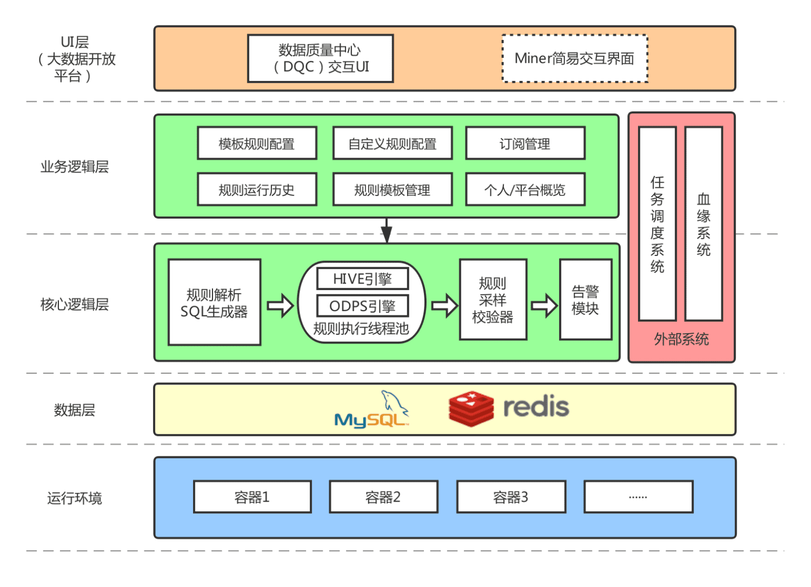
## 2.2DQC切入点流程
数据质量中心的切入点是任务调度系统在成功执行完每个Job后，此时任务调度系统会自动通过DQC的API异步请求进行数据质量校验，其中工作流程如下图所示。

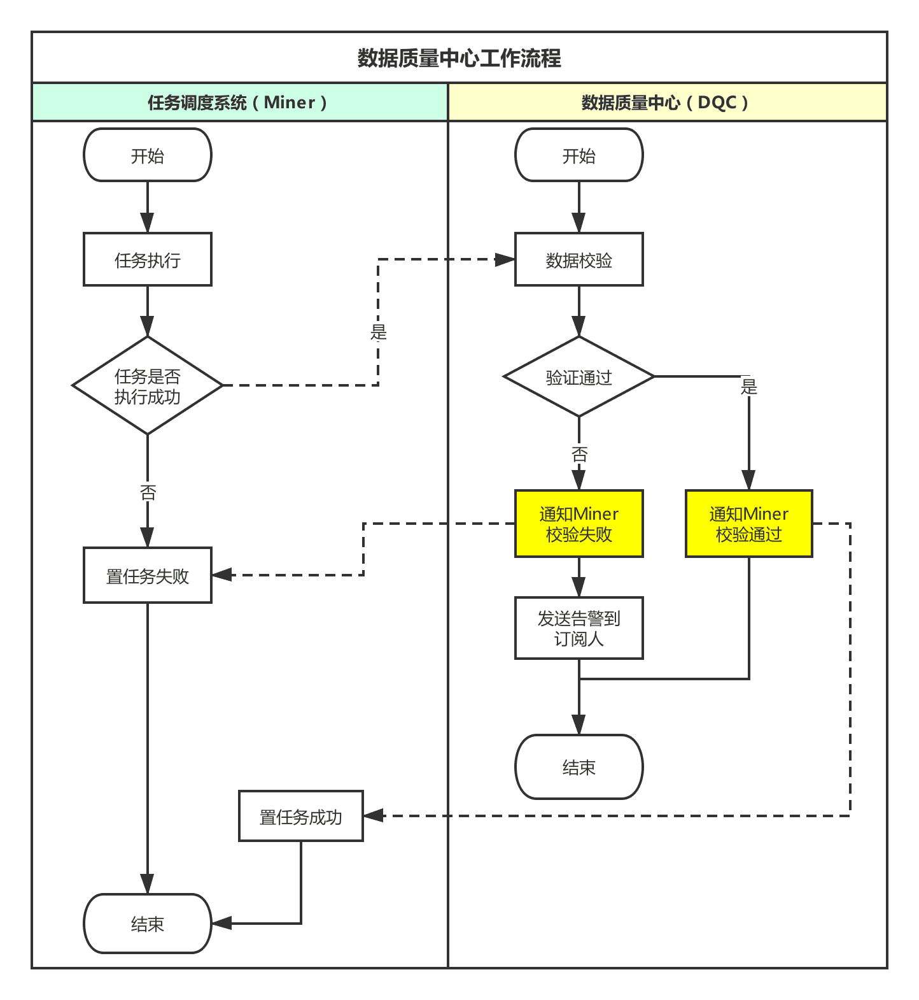

## 2.3DQC工作流程
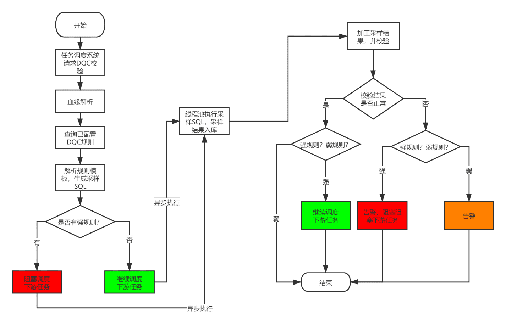

上图中，绿色表示继续调度下游，红色表示告警并阻塞下游，黄色表示只告警（因为黄色的规则对应的是弱规则，弱规则默认不阻塞调度下游任务）。

## 2.4核心模块实现
DQC的主干流程：

1. 录入一个针对\*\*表的数据量监控规则
2. 把这个监控规则映射成SQL
3. 然后通过定时任务形式把这个SQL的定时任务调度起来运行
4. 成功/失败状态记录下来
5. 用来状态统计

### 2.4.1DQC触发模块
任务调度系统通过HTTP请求或者RPC调用（例如dubbo），传入当前任务的任务ID（jobId），当前任务的执行实例ID（instanceId），当前实例执行的触发时间（fireTime）以及校验token。

DQC系统接到请求后，利用token进行参数合法性性校验，然后通过taskId查询血缘接口得到当前任务对应的产出表，再然后在查询产出表对应的已经配置的DQC规则列表，通过判断规则列表中是否有强规则，再然后返回给调度系统是否异步等待DQC执行完成。其中代码如下：

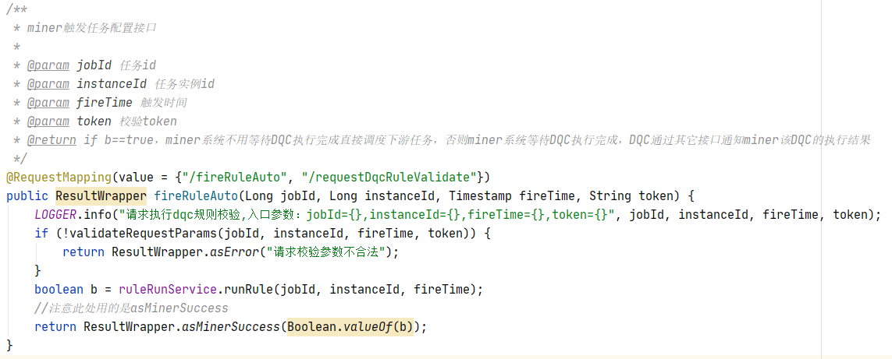

### 2.4.2规则解析模块
所有规则抽象成SQL，然后执行SQL进行采样，分为两类：模板规则和自定义规则。其中模板规则有固定的规则模板，只用填充部分参数就可以执行。自定义规则是用户自己按照标准编写的SQL。

规则SQL会进行采样，包括固定值采样和波动值采样。其中，其中波动值是针对两个统计量来说的，常用的统计量有计数（count）、求和（sum）、avg（平均值）、min（最小值）、max（最大值）、方差（variance）等；固定值是针对单个统计量或者单个值（离散值、枚举值）来说的，例如：某个表的行数为每一个产出周期都为固定值、某个字段的取值枚举值，某个字段值的长度为固定值。所以，总体上来讲，可以将所有监控规则提取为如下图所示：

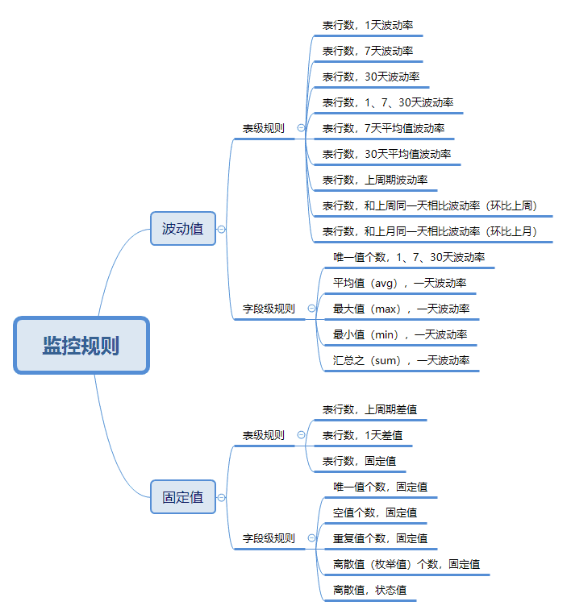

上述规则可以覆盖95%的离线数据监控场景，在极特殊的情况，允许通过自定义SQL来编写自定义的规则。波动值的计算公式如下：

        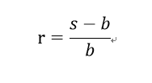

其中，r表示波动率，s表示采样值，b表示基准值。采样值和基准值的解释如下：

- l  采样值：指当天采集的具体的样本值，例如“表行数，1天波动率”这个规则的样本值是监控表当天分区的表行数。

- l  基准值：历史样本的对比值，一般来说固定值监控没有基准值。

其中部分模板规则对应的SQL如下：

|    |    |    |
|----|----|----|
| 1 | 表行数，1天波动率 | SELECT COUNT(CASE WHEN ${spe}   THEN 1 ELSE NULL END) ,COUNT( CASE WHEN ${bpe} THEN 1 ELSE NULL END) FROM   ${tn} WHERE (${spe} OR ${bpe}) |
| 2 | 表行数，7天波动率 | SELECT COUNT(CASE WHEN ${spe}   THEN 1 ELSE NULL END) ,COUNT( CASE WHEN ${bpe} THEN 1 ELSE NULL END) FROM   ${tn} WHERE (${spe} OR ${bpe}) |
| 3 | 表行数，30天波动率 | SELECT COUNT(CASE WHEN ${spe}   THEN 1 ELSE NULL END) ,COUNT( CASE WHEN ${bpe} THEN 1 ELSE NULL END) FROM   ${tn} WHERE (${spe} OR ${bpe}) |
| 4 | 表行数，1，7，30天波动率 | SELECT COUNT(CASE WHEN ${spe}   THEN 1 ELSE NULL END) ,COUNT( CASE WHEN ${bpe} THEN 1 ELSE NULL END ) ,COUNT(   CASE WHEN ${bpe1} THEN 1 ELSE NULL END ) ,COUNT( CASE WHEN ${bpe2} THEN 1   ELSE NULL END ) FROM ${tn} WHERE ${spe} or ${bpe} or ${bpe1} or ${bpe2} |
| 5 | 表行数，7天平均值波动率 | SELECT CASE WHEN ${spe} THEN cnt   ELSE NULL END ,AVG( CASE WHEN ${bpe} THEN cnt ELSE NULL END ) FROM ( SELECT   ${pcn} ,COUNT(1) AS cnt FROM ${tn} WHERE ${spe} or ${bpe} GROUP BY ${pcn} ) t    |
| 6 | 表行数，30天平均值波动率 | SELECT CASE WHEN ${spe} THEN cnt   ELSE NULL END ,AVG( CASE WHEN ${bpe} THEN cnt ELSE NULL END ) FROM ( SELECT   ${pcn} ,COUNT(1) AS cnt FROM ${tn} WHERE ${spe} or ${bpe} GROUP BY ${pcn} ) t    |
| 7 | 表行数，上周期波动率 | SELECT COUNT(CASE WHEN ${spe}   THEN 1 ELSE NULL END) ,COUNT( CASE WHEN ${bpe} THEN 1 ELSE NULL END) FROM   ${tn} WHERE (${spe} OR ${bpe}) |
| 8 | 表行数，上周期差值 | SELECT abs(COUNT(CASE WHEN   ${spe} THEN 1 ELSE NULL END)-COUNT(CASE WHEN ${bpe} THEN 1 ELSE NULL END))   FROM ${tn} WHERE (${spe} OR ${bpe}) |
| 9 | 表行数，1天差值 | SELECT abs(COUNT(CASE WHEN   ${spe} THEN 1 ELSE NULL END)-COUNT(CASE WHEN ${bpe} THEN 1 ELSE NULL END))   FROM ${tn} WHERE (${spe} OR ${bpe}) |
| 10 | 表行数，固定值 | SELECT COUNT(1) FROM ${tn} WHERE   ${spe} |
| 11 | 表行数，和上周同一天相比波动率 | SELECT COUNT(CASE WHEN ${spe}   THEN 1 ELSE NULL END) ,COUNT( CASE WHEN ${bpe} THEN 1 ELSE NULL END) FROM   ${tn} WHERE (${spe} OR ${bpe}) |
| 12 | 表行数，和上月同一天相比波动率 | SELECT COUNT(CASE WHEN ${spe}   THEN 1 ELSE NULL END) ,COUNT( CASE WHEN ${bpe} THEN 1 ELSE NULL END) FROM   ${tn} WHERE (${spe} OR ${bpe}) |
| 13 | 唯一值个数，固定值 | SELECT COUNT(1) FROM ( SELECT   ${cn} FROM ${tn} WHERE ${spe} GROUP BY ${cn} ) t |
| 14 | 唯一值个数，1、7、30天波动率 | SELECT max(case when ${spe} then   cnt else null end),max(case when ${bpe} then cnt else null end),max(case when   ${bpe2} then cnt else null end),max(case when ${bpe2} then cnt else null end)   FROM ( SELECT ${pcn},count(distinct ${cn}) as cnt FROM ${tn} WHERE ${spe} or   ${bpe} GROUP BY ${pcn} ) t |
| 15 | 空值个数，固定值 | SELECT COUNT(\*) FROM ${tn} WHERE   ${spe} AND ${cn} IS NULL |
| 16 | 重复值个数，固定值 | SELECT SUM(cnt) - COUNT(1) FROM   ( SELECT ${cn}, COUNT(1) AS cnt FROM ${tn} WHERE ${spe} GROUP BY ${cn} ) t |
| 17 | 离散值个数，固定值 | SELECT COUNT(1) FROM ( SELECT   ${cn} FROM ${tn} WHERE ${spe} GROUP BY ${cn} ) t |
| 18 | 离散值，状态值 | select COLLECT_SET(${cn}) from (   SELECT ${cn} FROM ${tn} WHERE ${spe} GROUP BY ${cn} ) t |
| 19 | 平均值（avg），1天波动率 | SELECT AVG(CASE WHEN ${spe} THEN   ${cn} ELSE NULL END), AVG(CASE WHEN ${bpe} THEN ${cn} ELSE NULL END) FROM   ${tn} WHERE ${spe} OR ${bpe} |
| 20 | 最大值（max），1天波动率 | SELECT MAX(CASE WHEN ${spe} THEN   ${cn} ELSE NULL END), MAX(CASE WHEN ${bpe} THEN ${cn} ELSE NULL END) FROM   ${tn} WHERE ${spe} OR ${bpe} |
| 21 | 最小值（min），1天波动率 | SELECT MIN(CASE WHEN ${spe} THEN   ${cn} ELSE NULL END), MIN(CASE WHEN ${bpe} THEN ${cn} ELSE NULL END) FROM   ${tn} WHERE ${spe} OR ${bpe} |
| 22 | 汇总值（sum），1天波动率 | SELECT SUM(CASE WHEN ${spe} THEN   ${cn} ELSE NULL END), SUM(CASE WHEN ${bpe} THEN ${cn} ELSE NULL END) FROM   ${tn} WHERE ${spe} OR ${bpe} |
| 23 | did长度!=17,32,36的行数，固定值 | SELECT count(1) FROM ${tn} WHERE   ${spe} and length(${cn}) not in (17,32,36) |
| 24 | 字段值=0的个数，固定值 | SELECT COUNT(\*) FROM ${tn} WHERE   ${spe} AND ${cn}=0 |

上述规则SQL中，${tn}表示表名，例如：nn_ods.ods_nn_xxx；${spe}表示采样分区表达式，例如：dt=’20200921’，其中dt是时间分区字段；${bpe}，${bpe1}，${bpe2}，……，${bpen}表示基础分区表达式，形式同采样分区表达式；${cn}表示字段名，例如：col1；${pcn}表示分区字段名，例如dt。

其实，规则解析本质上就是将规则对应的模板SQL中的位置变量替换成实际任务产出表的信息（包括表名，字段名等）。

### 2.4.3规则执行模块
规则解析成可执行的SQL之后，会将每个SQL封装成一个单独的线程丢到线程池中运行，代码如下图所示。

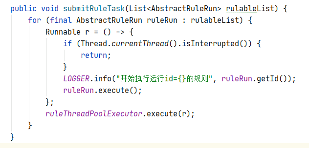

其中，ruleThreadPoolExecutor为线程池。AbstractRuleRun为解析后的规则对象及规则SQL封装。AbstractRuleRun为抽象类实现了RuleRunnable接口，包括两个子类TemplateRuleRun（模板规则封装类）和CustomizeRuleRun（自定义规则封装类），其中RuleRunnable接口只有一个execute方法，UML类图见附件1。

规则SQL进入线程池后会提交到集群执行，可以对接不同的执行引擎，其中HiveRuleRunEngine封装了在Hive引擎上执行SQL，其中代码如下：

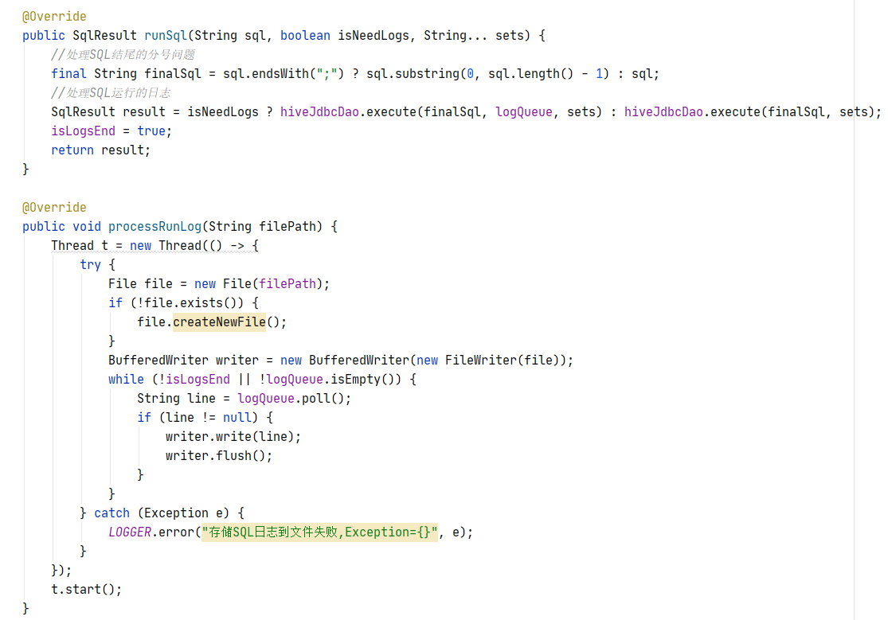

其中runSql方法执行sql，processRunLog方法处理执行SQL中的日志（方便排错，特别是自定义规则中的自定义SQL），执行引擎的UML类图见附件2。

### 2.4.4规则校验模块
规则SQL执行完成之后进行，会返回执行结果，执行结果会序列化json格式的数据存储到数据库中，然后进入规则校验模块。规则校验模块的UML类见附件3。下面以固定值校验为例解析代码，其中check方法是用来返回规则校验结果枚举值的，和期望值比较的方法为compare方法，代码如下图所示。

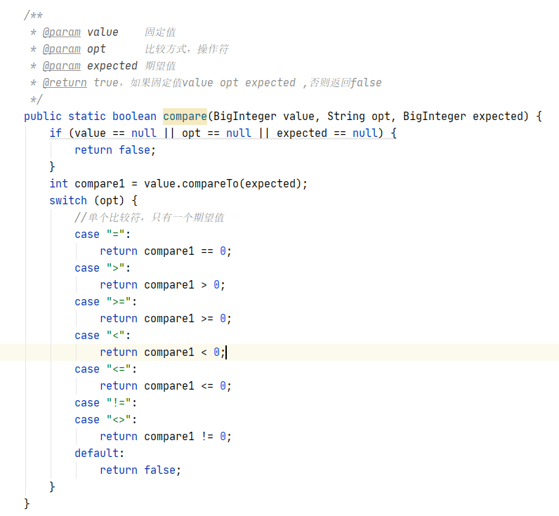

### 2.4.5规则告警模块
规则校验完成后，就可以通过校验结果判断是否有异常，如果异常就告警，并根据规则的强弱配置决定是否通知任务调度系统。

## 2.5系统效果图
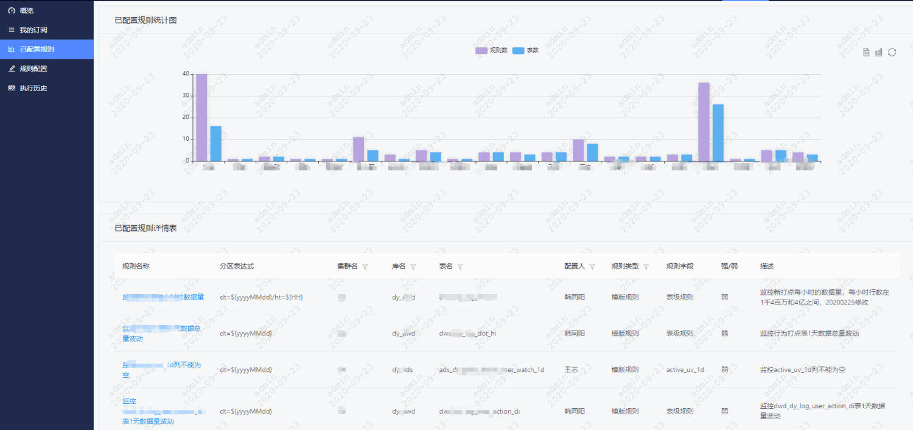

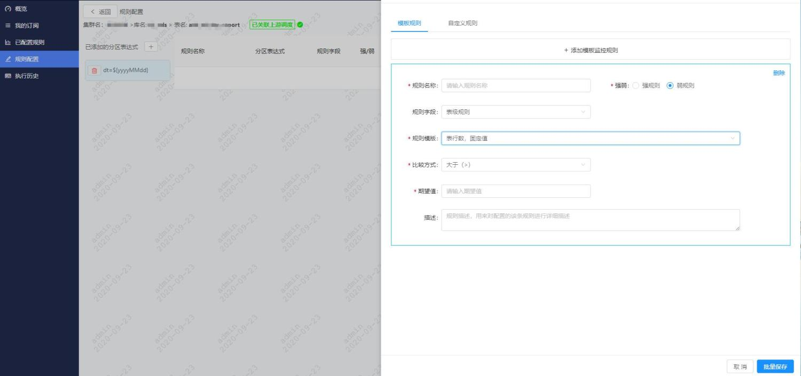

# 3.关键类图

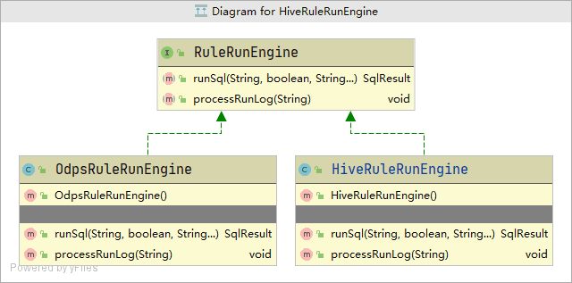

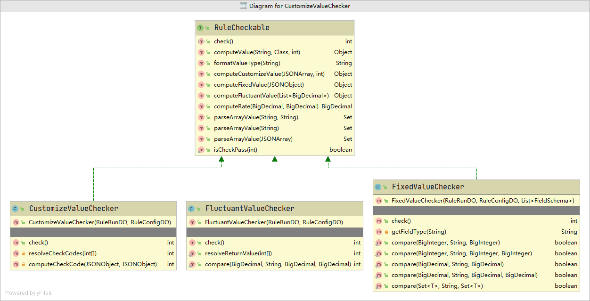

