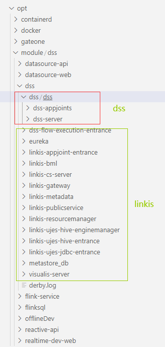
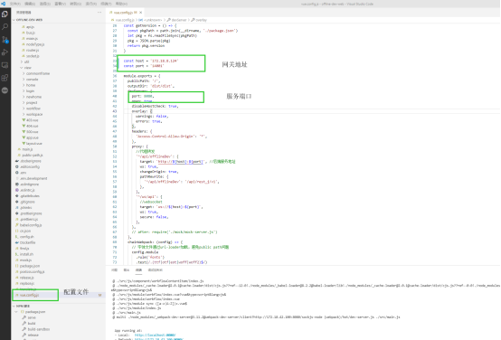
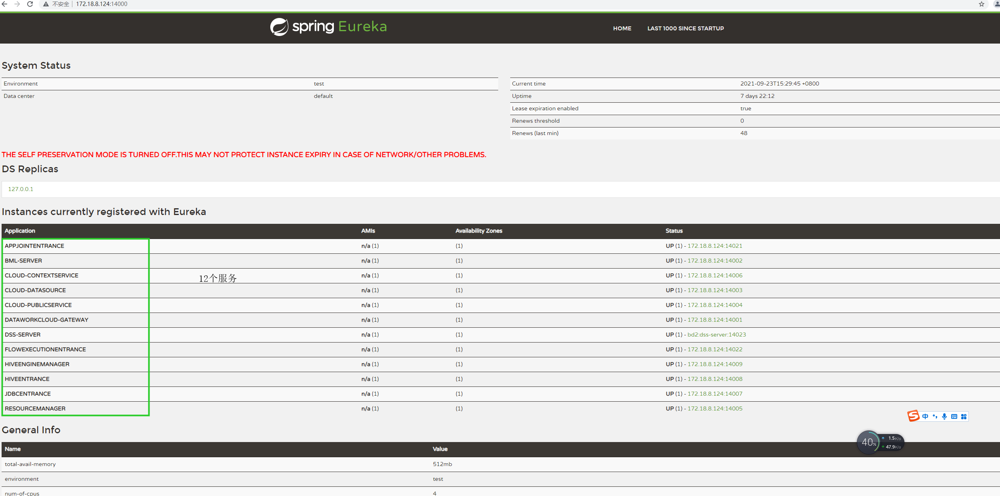
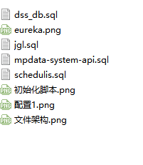

# 单机部署实时开发平台


[TOC]

## 1.主框架（后端）：

http://gitlab.software.dc/mp-data/mp-data-core

master分支

```yml
git clone http://gitlab.software.dc/mp-data/mp-data-core.git

mvn clean install

mvn clean package
```

将打包后的jar包放入/appcom2/mainframe/data/system-api2  目录下

直接运行外面的docker-compose up -d 即可


## 2.实时开发主框架（前端）：

nginx的前端容器运行项目的打包文件夹

http://gitlab.software.dc/mp-data/realtime-dev-web.git

master分支

```
git clone  http://gitlab.software.dc/mp-data/realtime-dev-web.git

npm run build

```

打包后的文件夹dist移动到/appcom2/mainframe/data/shishimain/mainframe/dist

配置的nginx文件在docker-compose中有指定，具体查看完整版的docker-compose

## 3.数据源后端：

http://gitlab.software.dc/mp-data/realtime-dev.git

jgl分支

基本maven项目，下载下来,

```
git clone http://gitlab.software.dc/mp-data/realtime-dev.git
mvn clean install 
mvn clean package
java -jar xxx.jar &
```

直接打成jar包，后台运行

## 4.数据源前端和dss前端：

**数据源前端**

nginx的前端容器运行项目的打包文件夹

demo分支

http://gitlab.software.dc/mp-data/data-source-vue

```
git clone http://gitlab.software.dc/mp-data/data-source-vue.git

yarn install

yarn build

```

打包完成之后，将整个打包后的dist包放入到对应的位置，直接启动相应的docker容器即可。

**dss前端**

放入docker容器中运行前端

master分支

地址:http://gitlab.software.dc/mp-data/offline-dev-web

```
git clone http://gitlab.software.dc/mp-data/offline-dev-web.git

yarn install

yarn build
```

打包完成之后，将整个打包后的dist包放入到对应的位置，直接启动相应的docker容器即可。

整体的结构如下：


- msyql2       是部署的时候单独使用的部署库
- system-api2    是部署的接触框架后台
- shishi-datasource    数据源前端
- shishimian    整个实时开发平台前端
- shishiofflineDev    dss开发的前端

以上全部是docker 容器方式启动。

## 5.dss编译好的地址和linkis：

所有的安装包全部在该服务器 172.18.8.124：/opt/module/dss/dss

源地址

dss:172.18.42.154：/opt/module/dss

Linkis:172.18.42.148：/opt/module/dss

Flink:172.18.42.154:/opt/module/flinksql/flink-1.11.3

flink stream:172.18.42.154/opt/module/flinksql/flinkStreamSQL


## 6.dss安装配置：

6.1、安装环境基础

jdk：略过

scala：略过

flinkx：参考之前文档

hadoop hive:配置以及安装网址

http://gitlab.software.dc/mp-data/dss/docker-hive

6.2、dss+linkis

dss smt5 172.18.42.154 /opt/module/dss

linkis smt4 172.18.42.153 /opt/module/dss 

数据库IP:172.18.42.150  端口:23306  数据库:dss_db





先启动linkis后启动dss

顺序如下:

1. eureka

2. linkis-gateway

3. linkis-publicservice

4. linkis-metadata

5. linkis-resourcemanager

其他的启动顺序没有要求

各个配置文件

```
首先需要修改hosts

Vi /etc/hosts

如下所示

127.0.0.1  localhost localhost.localdomain localhost4 localhost4.localdomain4

::1     localhost localhost.localdomain localhost6 localhost6.localdomain6

172.18.42.160  namenode           //

172.18.42.160  datanode

172.18.42.160  resourcemanager	   这些都是160上面docker容器里面

172.18.42.160  nodemanager1

172.18.42.160  hive-server

172.18.42.160  hive-metastore-postgresql

172.18.42.160  hive-metastore         //

 

172.18.8.124  bd2 //本机地址和本机hostname

172.18.42.150  smt1 ///hadoop集群

172.18.42.151  smt2 ///hadoop集群

172.18.42.152  smt3 //hadoop集群

#172.18.42.153  smt4    

#172.18.42.154  smt5 
```


Eureka:没有需要修改的配置文件

dss-flow-execution-entrance:

配置文件:

application.yml

```
server:
  port: 14022
spring:
  application:
    name: flowExecutionEntrance

eureka:
  client:
    serviceUrl:
      defaultZone: http://bd2:14000/eureka/    该位置需要配置eureka,bd2就是该服务器的hostname;14000为端口
  instance:
    lease-renewal-interval-in-second: 5
    lease-expiration-duration-in-second: 10
    prefer-ip-address: true
    instance-id: ${spring.cloud.client.ip-address}:${server.port}
    metadata-map:
      test: wedatasphere

management:
  endpoints:
    web:
      exposure:
        include: refresh,info
logging:
  config: classpath:log4j2.xml
```

linkis.properties

```
wds.linkis.server.restful.scan.packages=com.webank.wedatasphere.linkis.entrance.restful,com.webank.wedatasphere.dss.flow.execution.entrance.restful

#wds.linkis.server.component.exclude.classes=com.webank.wedatasphere.linkis.DataWorkCloudApplication

wds.linkis.engine.application.name=flowExecutionEngine

wds.linkis.enginemanager.application.name=flowExecution

wds.linkis.query.application.name=cloud-publicservice

wds.linkis.console.config.application.name=cloud-publicservice

wds.linkis.engine.creation.wait.time.max=20m

wds.linkis.server.version=v1

#hadoop config dir hadoop本地客户端配置地址

hadoop.config.dir=/opt/hadoop/hadoop-2.7.4/etc/hadoop

wds.linkis.entrance.config.logPath=file:///tmp/linkis/

wds.linkis.resultSet.store.path=hdfs://smt1:8020/tmp/linkis/

wds.linkis.server.socket.mode=true

##linkis gateway conf  这个就是是网关的配置地址

wds.linkis.gateway.url=http://bd2:14001

wds.linkis.client.flow.adminuser=ws

wds.linkis.client.flow.author.user.token=WS-AUTH

# 实现免登录，打开测试模式

wds.linkis.test.mode=true

# 指定测试模式下，所有请求都代理给哪个用户

wds.linkis.test.user=hadoop

wds.linkis.instance=3
```

linkis-appjoint-entrance

与dss-flow-execution-entrance配置类似，可以具体参考服务器上配置地址类似

linkis-bml

```
application.yml主要是注册到注册中心，和上面的配置是一样的。

linkis.properties与其他不同的地方是配置数据库地址

wds.linkis.server.mybatis.mapperLocations=classpath:com/webank/wedatasphere/linkis/bml/dao/impl/*.xml

wds.linkis.server.mybatis.typeAliasesPackage=com.webank.wedatasphere.linkis.bml.dao

wds.linkis.server.mybatis.BasePackage=com.webank.wedatasphere.linkis.bml.dao

wds.test.mode=true

wds.linkis.server.restful.scan.packages=com.webank.wedatasphere.linkis.bml.restful

#sit

wds.linkis.server.mybatis.datasource.url=jdbc:mysql://172.18.8.124:23306/dss_db?characterEncoding=UTF-8

wds.linkis.server.mybatis.datasource.username=root

wds.linkis.server.mybatis.datasource.password=123456

wds.linkis.server.version=v1

#linkis-bml需要配置hadoop参数

hadoop.config.dir=/opt/hadoop/hadoop-2.7.4/etc/hadoop

#必须加上网关参数

wds.linkis.gateway.url=http://bd2:14001

wds.linkis.gateway.ip=linkis-gateway

wds.linkis.gateway.port=14001

#
wds.linkis.bml.hdfs.prefix=smt1:8020/tmp/linkis
```

Linkis-cs-server

和linkis-bml配置的地方是一样

Linkis-Gateway

application.yml


```
server:

 port: 14001

spring:

 application:

  name: DataWorkCloud-Gateway

 cloud:

  gateway:   网关配置断言配置

   routes:

    - id: dws

     uri: http://localhost:port/ 

     predicates:

     - Path=/dws/

   - id: dws/vg

     uri: http://localhost:port/

     predicates:

     - Path=/dws/vg/

   - id: dws/easyide

     uri: http://localhost:port/

     predicates:

     - Path=/dws/easyide/

 

eureka:

 client:

  serviceUrl:

   defaultZone: http://bd2:14000/eureka/ 注册到注册中心

  registry-fetch-interval-seconds: 5

 instance:

  lease-renewal-interval-in-second: 5

  lease-expiration-duration-in-second: 10

  prefer-ip-address: true

  instance-id: ${spring.cloud.client.ip-address}:${server.port}

  metadata-map:

   test: wedatasphere

 

management:

 endpoints:

  web:

   exposure:

    include: refresh,info
```


linkis-metadata

与linkis-bml类似

linkis-publicservice

配置eureka地址，数据库地址，网关地址

linkis-resourcemanager

配置eureka地址，数据库地址，yarn地址

linkis-ujes-hive-enginemanager

配置eureka地址，hadoop配置地址，hive配置地址

linkis-ujes-hive-entrance

配置eureka地址，hadoop配置地址

linkis-ujes-jdbc-entrance

配置eureka地址，hadoop配置地址

以上的配置主要为注册服务eureka的地址，数据库的地址，hadoop地址，hive地址

6.3、前端安装

地址:http://gitlab.software.dc/mp-data/offline-dev-web

主要修改配置如下图所示:




组件：flinkx-executor

路径：/opt/module/dss/flink-service/flinkx-executor/src/main/resources/application.yml

重点修改的配置(有说明)：

```yaml
# web port

server:

# port: ${server.port}

 port: 8081


# log config

logging:

 config: classpath:logback.xml

# path: ${data.path}/applogs/executor/jobhandler

 path: /home/hadoop/data/flinkx-web-2.1.2/packages/flinkx-executor


flinkx:

 job:

  admin:

   ## flinkx admin address list, such as "http://address" or "http://address01,http://address02"

   addresses: http://172.18.42.154:9099

#   addresses: http://127.0.0.1:${flinkx.admin.port}

  executor:

   appname: flinkx-executor

   ip:

   port: 9999
 #   port: ${executor.port:9999}

   ### job log path

   logpath: /home/hadoop/data/flinkx-web-2.1.2/packages/flinkx-executor/

#   logpath: ${data.path}/applogs/executor/jobhandler

   ### job log retention days

   logretentiondays: 30

  ### job, access token

  accessToken:


#这个地方是重点修改的配置的地方
 executor:

  jsonpath: /opt/module/flinkx-1.10_release/job/

  fssJsonPath: /opt/module/flinkStreamSQL/launcher/job/

#  jsonpath: ${json.path}


 shell:

  path: /opt/module/flinkx-1.10_release/start.sh

  fssPath: /opt/module/flinkStreamSQL/start.sh

# pypath: ${python.path}
```


测试地址的时候，前端需要这样写${ip}:${port}/offlineDev/projec进行测试

启动后的eureka地址以及所示服务这就是正确的界面：



6.4、调度

172.18.42.148 地址： /appcom/Install/AzkabanInstall

前端： schedulis_0.5.0_web 进入bin目录启动（先启动后端）

后端：  wtss-exec 进入bin目录启动（先启动后端）


6.5、启动flink

地址：172.18.8.124:/opt/module/dss/flinksql/flink-1.11.3

启动：/bin/start-cluster.sh 只能启动这个


## 7.初始化脚本：

git clone 项目之后的文件夹里的img文件夹里就有初始化脚本

初始化脚本路径如下:




