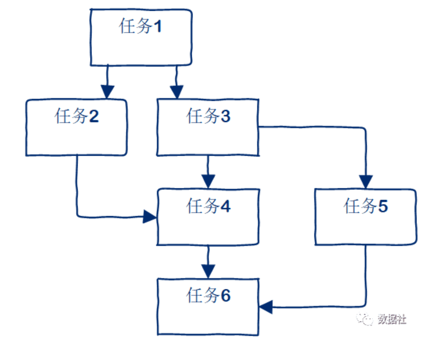
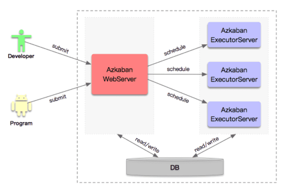
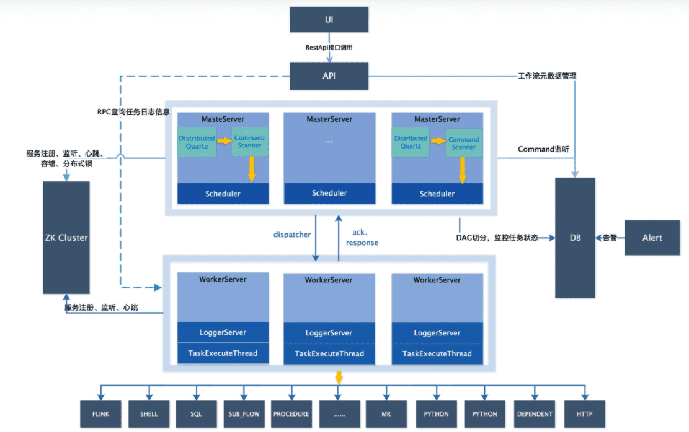
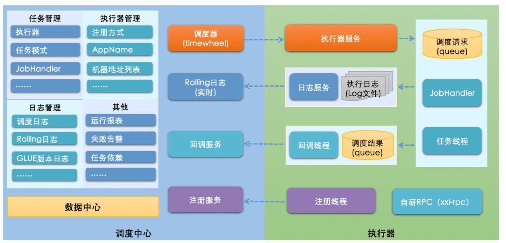
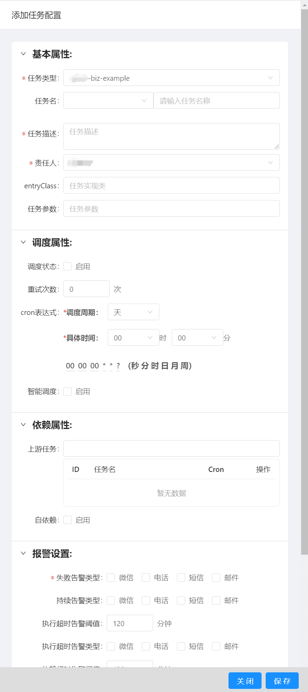
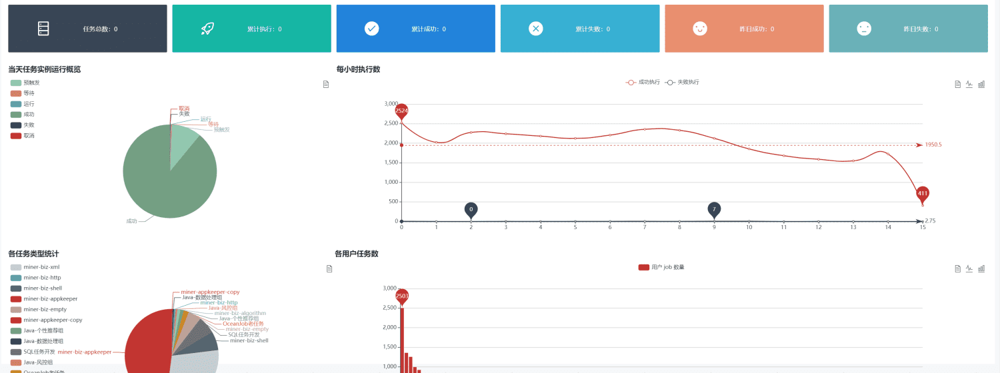
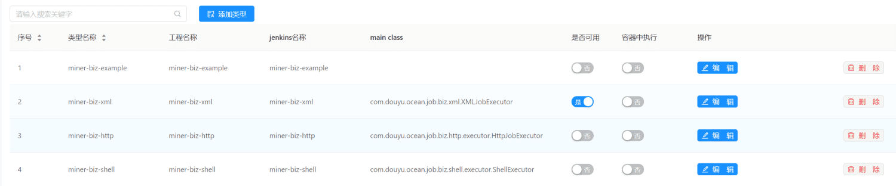

# 1.背景
多个任务单元之间往往有着强依赖关系，上游任务执行并成功，下游任务才可以执行。比如上游任务1结束后拿到结果，下游任务2、任务3需结合任务1的结果才能执行，因此下游任务的开始一定是在上游任务成功运行拿到结果之后才可以开始。

而为了保证数据处理结果的准确性，就必须要求这些任务按照上下游依赖关系有序、高效的执行，最终确保能按时正常生成业务指标。

# 2.技术方案
## 2.1调度平台目标
调度平台其实需要解决三个问题：任务编排、任务执行和任务监控。

- 任务编排，采用调用外部编排服务的方式，主要考虑的是编排需要根据业务的一些属性进行实现，所以将易变的业务部分从作业调度平台分离出去。如果后续有对编排逻辑进行调整和修改，都无需操作业务作业调度平台。
- 任务排队，支持多队列排队配置，后期根据不同类型的开发人员可以配置不同的队列和资源，比如面向不同的开发人员需要有不同的服务队列，面向不同的任务也需要有不同的队列优先级支持。通过队列来隔离调度，能够更好地满足具有不同需求的用户。不同队列的资源不同，合理的利用资源，达到业务价值最大化。
- 任务调度，是对任务、以及属于该任务的一组子任务进行调度，为了简单可控起见，每个任务经过编排后会得到一组有序的任务列表，然后对每个任务进行调度。这里面，稍有点复杂的是，任务里还有子任务，子任务是一些处理组件，比如字段转换、数据抽取，子任务需要在上层任务中引用实现调度。任务是调度运行的基本单位。被调度运行的任务会发送到消息队列中，然后等待任务协调计算平台消费并运行任务，这时调度平台只需要等待任务运行完成的结果消息到达，然后对作业和任务的状态进行更新，根据实际状态确定下一次调度的任务。

调度平台设计中还需要注意以下几项：

1. 调度运行的任务需要进行超时处理，比如某个任务由于开发人员设计不合理导致运行时间过长，可以设置任务最大的执行时长，超过最大时长的任务需要及时kill掉，以免占用大量资源，影响正常的任务运行。
2. 控制同时能够被调度的作业的数量，集群资源是有限的，我们需要控制任务的并发量，后期任务上千上万后我们要及时调整任务的启动时间，避免同时启动大量的任务，减少调度资源和计算资源压力；
3. 作业优先级控制，每个业务都有一定的重要级别，我们要有限保障最重要的业务优先执行，优先给与调度资源分配。在任务积压时候，先执行优先级高的任务，保障业务影响最小化。

## 2.2主流开源框架实现
- Azkaban
  
    Azkaban是由Linkedin公司推出的一个批量工作流任务调度器，用于在一个工作流内以一个特定的顺序运行一组工作和流程。Azkaban使用job配置文件建立任务之间的依赖关系，并提供一个易于使用的web用户界面维护和跟踪你的工作流。
    
    知名度比较高的应该是Apache Oozie，但是其配置工作流的过程是编写大量的XML配置，而且代码复杂度比较高，不易于二次开发。另外一个应用也比较广泛的调度系统是Airflow，但是其开发语言是Python。

    主要特性:

    1. 提供功能清晰，简单易用的Web UI界面
    2. 提供job配置文件快速建立任务和任务之间的依赖关系
    3. 提供模块化和可插拔的插件机制，原生支持command、Java、Hive、Pig、Hadoop
    4. 基于Java开发，代码结构清晰，易于二次开发

    系统架构：

    - **Web Server：** 负责管理项目，认证，调度及触发任务
    - **Executor Server：** 处理实际的工作流和作业，可以部署多个实现分布式的执行器功能
    - **MySQL实例：** Azkaban使用MySQL来存储项目和任务执行信息
    - **Azkaban Plugins：** Azkaban通过插件的机制，实现灵活扩展Azkaban的功能，如视图插件、触发器插件、用户管理插件、告警插件，通过实现这些插件，灵活的满足自定义需求。
    - **用户管理：** 其自带有简单的用户、角色、用户组、代理用户等用户管理功能。
    - **任务新建：** 新建任务通过编写任务脚本并压缩成zip包并上传到项目下的方式来新建任务，通过WebUI配置其调度属性。
    - **任务状态：** 提供取消、中断、恢复、失败重试、失败、准备执行等状态。

    

- Dolphin Scheduler

    Dolphin Scheduler的架构如下图所示：
    
    

    **MasterServer：** 其采用分布式无中心的MasterServer负责DAG任务的切分，任务提交，MasterServer及WorkerServer的健康监控。通过在Zookeeper上注册临时节点实现节点变化的容错处理。内部采用 **Quartz进行任务的调度和启停**。
    
    **WorkerServer：** WorkerServer也采用分布式无中心设计理念，WorkerServer主要负责任务的执行和提供日志服务。 WorkerServer服务启动时向Zookeeper注册临时节点，并维持心跳。
    
    **ZooKeeper：** 系统中的MasterServer和WorkerServer节点都通过ZooKeeper来进行集群管理和容错，通过Zookeeper进行事件监听、实现分布式锁和任务队列。DolphinScheduler使用ZooKeeper分布式锁来实现同一时刻只有一台Master执行Scheduler，或者只有一台Worker执行任务的提交。
    
    **任务优先级：** DolphinScheduler的流程及任务可以设置优先级，按照 **“流程实例优先级\_流程实例id\_任务优先级\_任务id”** 信息保存在ZooKeeper的优先权任务队列中，实现按照优先级进行任务的触发。
    
    **日志：** 其采用Logback的FileAppender和Filter功能实现每个任务实例生成一个日志文件，在web端采用gRPC的方式从Worker提供的日志服务中读取日志文件拉取信息。

- Airflow

    Apache Airflow 允许工作流开发人员轻松创建、维护和周期性地调度运行工作流（即有向无环图或成为DAGs）的工具。使用 Python 编写。Airflow 被 Airbnb 内部用来创建、监控和调整数据管道。
    
    在Airbnb中，这些工作流包括了如数据存储、增长分析、Email发送、A/B测试等等这些跨越多部门的用例。这个平台拥有和 Hive、Presto、MySQL、HDFS、Postgres和S3交互的能力，并且提供了钩子使得系统拥有很好地扩展性。除了一个命令行界面，该工具还提供了一个    基于Web的用户界面让您可以可视化管道的依赖关系、监控进度、触发任务等。  

- Kettle

    将各个任务操作组件拖放到工作区，kettle支持各种常见的数据转换。此外，用户可以将Python，Java，JavaScript和SQL中的自定义脚本拖放到画布上。
    
    kettle可以接受许多文件类型作为输入，还可以通过JDBC，ODBC连接到40多个数据库，作为源或目标。社区版本是免费的，但提供的功能比付费版本少。

- XXL-JOB
  
    XXL-JOB是一个分布式任务调度平台，其核心设计目标是开发迅速、学习简单、轻量级、易扩展。使用Java实现，自带WebUI。国内使用案例多，中文文档完备。

    系统架构：

    - **调度中心：** 基于数据库的集群方案来保障HA，并没有使用Zookeeper。采用线程池进行任务调度，避免单线程阻塞引起调度任务延迟。重启时导致错过调度时间，会使用过期处理策略，可以处理过期5s内的任务。
    - **执行器：** 是一个内嵌的Server，会进行执行器注册。任务如果是Bean模式，则调用其execute方法，如果是GLUE模式，则加载GLUE代码，实例化Java对象，然后调用execute方法。
    - **解耦：** 调度器与执行器之前通过HTTP通讯，请求执行、执行状态以及日志服务等都是通过访问API服务完成。
    - **任务依赖：** 每个任务可以设置子任务，父任务成功会触发子任务执行。
    - **任务HA：** 执行器如果是集群部署，任务可以选择“故障转移”的路由策略，当任务调起时，会去检查执行器的存活状态，选择第一个存活的执行器进行任务执行。

    将调度行为抽象形成“调度中心”公共平台，而平台自身并不承担业务逻辑，“调度中心”负责发起调度请求；将任务抽象成分散的JobHandler，交由“执行器”统一管理，“执行器”负责接收调度请求并执行对应的JobHandler中业务逻辑。

    项目地址：[https://github.com/xuxueli/xxl-job](https://github.com/xuxueli/xxl-job)

    文档地址：[https://www.xuxueli.com/xxl-job/](https://www.xuxueli.com/xxl-job/)

    

功能对比

| 功能 | Xxl-job | Azkaban | Airflow |
| --- | --- | --- | --- |
| license | GNU General Public License v3.0 | Apache License, Version 2.0 | Apache License, Version 2.0 |
| 调度模块 | Quartz | Quartz | 自实现 |
| 调度中心HA | 支持，基于Quartz集群实现 | 不支持 | 不支持 |
| 执行器HA | 支持 | 支持 | 支持 |
| 业务耦合度 | 高，业务逻辑在执行器中实现 | 低，与实际业务无耦合。 | 低，与实际业务无耦合。 |
| Job类型 | Java，脚本任务：支持以GLUE模式开发和运行脚本任务，包括Shell、Python、NodeJS、PHP、PowerShell等类型脚本; | Command、HadoopShell、Java、HadoopJava、Pig、Hive等，支持插件式扩展 | Python、Bash、HTTP、Mysql等，支持Operator的自定义扩展。 |
| Executor触发 | RPC | Restful | Restful |
| 工作流 | 无，可配置任务级联触发 | 支持，自定义DSL语法 | 支持，基于Python DAG |
| 管理界面 | 简单但不美观，符合国人习惯，上手简单 | 简单，美观程度略胜于xxl-job，整体功能逻辑清晰，上手简单 | 该有的功能都有，但是就是让你用得不爽。 |
| 部署运维 | 简单 | 简单 | 较复杂，包括WebServer、Scheduler、Worker和Flower（可选，用于） |
| 单点故障 | 无 | Web Server存在单点故障风险 | Scheduler存在单点故障风险。 |

本项目将基于XXL-JOB 进行二次开发。

# 3.实现效果

