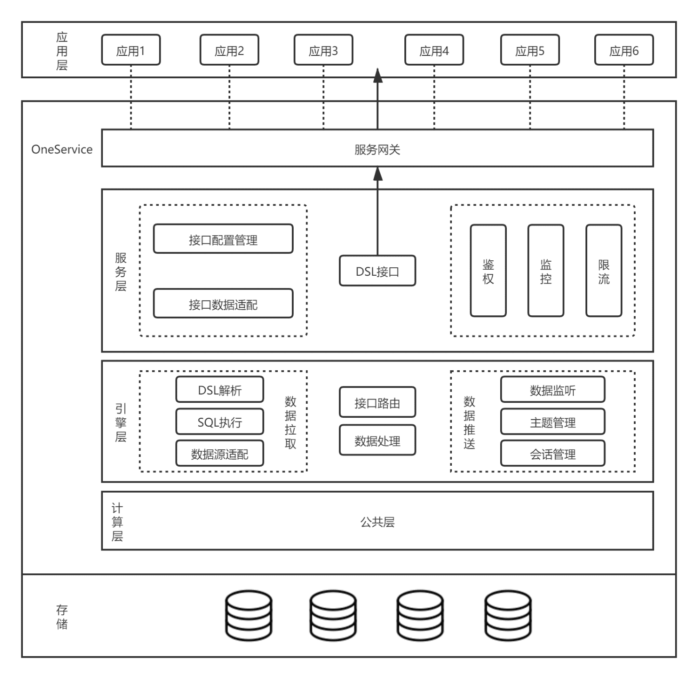
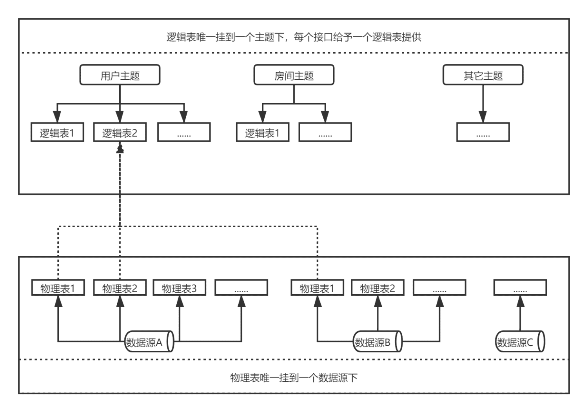
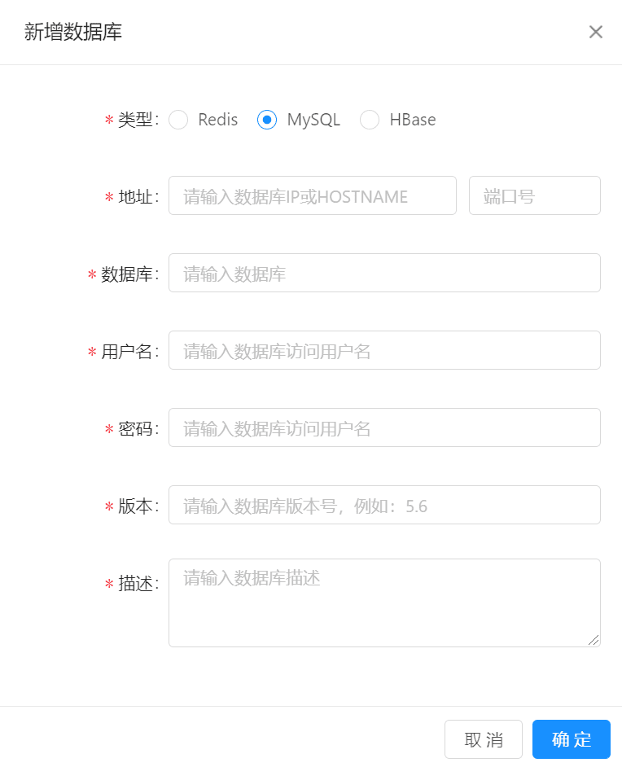
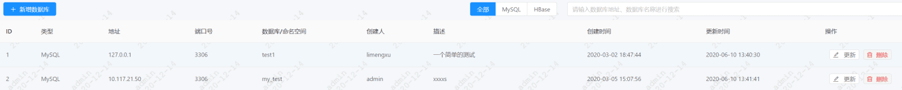
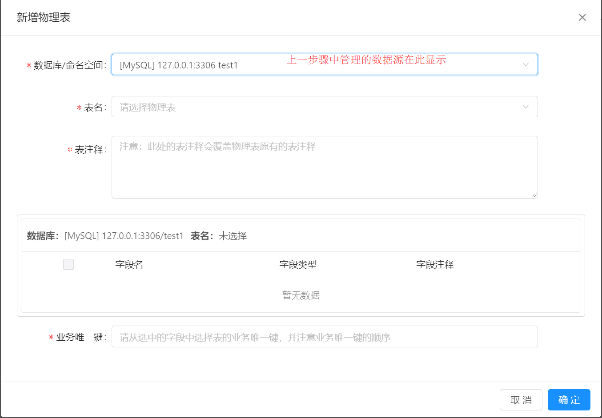
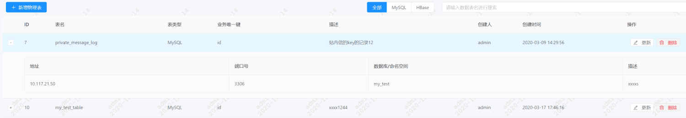
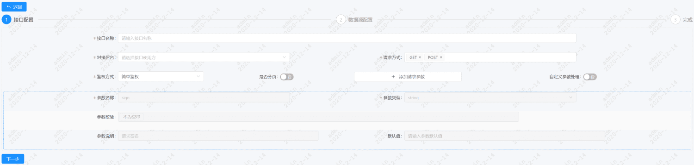
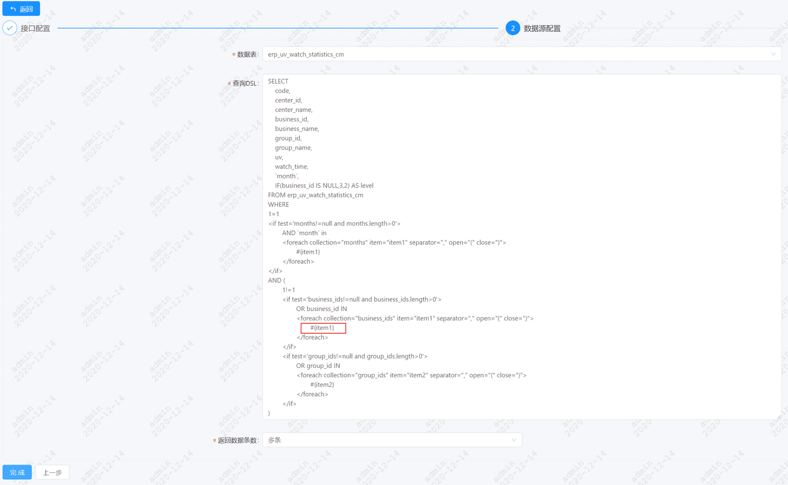
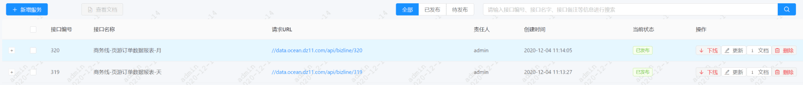

# 1.背景
在整个数据中台构建过程中，从业务数据源到数据仓库ETL再到对外提供数据服务和数据可视化分析是一套完整的流程，其中在对部门对外的末端，数据服务和数据可视化分析是两个重要的环节。

其中数据服务API是一种对业务部门提供数据的主要方式，面对复杂多变的业务场景，每次都需要人工写代码开发接口API的流程十分慢，有必要提供一个可配置化、统一化的接口服务平台，用快速配置接口API的方式来替代开发代码的方式，并且提供一个闭环的接口生命周期管理。

# 2.目标
## 2.1 服务接口配置化
在传统的数据服接口中，每个API接口都需要额外手工的写代码开发、测试、发布上线等流程，往往跟不上业务爆炸式增长的需求。通过对数据仓库提供数据API接口流程的抽象，将数据API接口的生成过程抽象成API参数配置、数据源配置、查询SQL配置、API网关配置等阶段，从而将开发式的API接口提供方式变成配置式的方式，极大提升数据仓库API接口的提供效率。

## 2.2 服务接口治理闭环
随着业务的不断增长，数据仓库对外提供的数据接口API越来越多，传统开发式的API分布在各个项目工程中，使得管理这些已经提供的API接口变得十分困难。再加上团队人员变动，许多年代久远的API甚至没人维护，同时业务上是否还在使用也不得而知。通过集中配置式的数据服务平台，可以监控每个API的使用情况，定时清理没有使用的API，做到API接口有上有下，形成API接口的生命周期闭环。

# 3.实现方案
## 3.1 业界实现
目前各大云厂商都已经推出商业化的数据服务平台，其中以阿里云的最为便捷和完善。其支持的功能如下。

1. API配置生成、API标签管理
2. 服务编排、支持多数据源
3. 前置过滤器、后置过滤器
4. API业务管理
5. API测试、API发布、API网关
6. API鉴权、API计量

## 3.2 我们的方案
针对公司业务场景以及参考阿里云的实现方案，我们制定了适合于公司业务现状的实现方案，其功能点如下所示。

1. 支持配置化生成API接口、API按主题分类
2. 支持API接口前后置过滤器
3. 支持多数据源、支持数据源抽象、有限支持异构数据源
4. API测试、发布、鉴权
5. API计量、监控
6. API网关、服务编码功能已提前规划，预留扩展

## 3.3 方案细节
数据服务平台整体架构图如下图所示。其中存储层只现有数据仓库所接受的各种异构数据源，而应用层是数据服务平台的直接服务对象。

在数据服务平台整体架构中，一共分为四层，其中最上面的网关层接入API网关中间件，而最底层的计算层直接复用现有的数据仓库计算资源，重点在服务层和引擎层。

服务层负责进行接口配置、返回数据格式转换，以及接口鉴权、监控、限流等。

引擎层负责对接口配置进行解析，实现数据源的查询，接口路由，覆盖数据拉取和数据推送两个场景。



### 3.3.1 数据源抽象
#### 3.3.1.1 数据服务元数据模型
数据服务的元数据模型指的是逻辑表到物理表的映射，整个模型的架构示意图如下所示。

因为不同的数据服务平台在生产的过程中涉及到跨数据源的场景，那么一个接口服务可能需要到不同的数据源去获取数据，然后组装后提供给应用，为了统一异构数据源，简化数据模型，故需要建立数据源的元数据模型，解决从数据源的物理表到逻辑表的映射关系，记录到字段级别。自底向上分别是：

1. 数据源
    
    计划支持跨数据源查询，底层支持接入多种数据源，一期计划支持MySQL。
2. 物理表
    
    物理表是指具体某个数据源中的一张表。每张物理表都需要指明主键有哪些列组成，主键确定后即可得知该表的统计粒度。
3. 逻辑表
    
    逻辑表可以理解为数据库中的视图（同一个数据源），是一张虚拟表，也可以看做是由若干主键相同的物理表构成的打款表。接口的查询只针对逻辑表，屏蔽底层物理表细节。
4. 主题
    
    逻辑表一般会挂在到某个业务的某个主题下，便于管理和查找。



#### 3.3.1.2 数据服务数据查询引擎
1. 查询数据库
    
    数据服务平台底层支持多种数据源，数据的来源主要有两种：
    1. 实时公共层的计算作业直接将计算结果写入HBase；
    2. 通过同步作业将公共层的离线数据同步到对应的查询库。
2. 服务层
    
    元数据配置。数据发布者需要到元数据中心进行元数据配置，建立好物理表到逻辑表的映射关系，服务层会将元数据加载到缓存中，以便进行后续的模型解析。
3. 主处理模块
    
    一次查询从开始到结果返回，一般会经过如下几步。
    - DSL解析：对用户的查询DSL进行语法解析，构建完成的查询树。
    - 逻辑Query构建：遍历查询树，通过查找元数据模型，转变为逻辑Query。
    - 物理Query构建：通过查找元数据模型中的逻辑表与物理表的映射关系，将逻辑Query转变为物理Query。
    - Query拆分：如果该次查询涉及多张物理表，并且在该查询场景下允许拆分，则将Query拆分为多个SubQuery。
    - SQL执行：将拆分后的SubQuery组装成SQL语句，交给对应的DB执行。
    - 结果合并：将DB执行的返回结果进行合并，并返回给调用者。

#### 3.3.1.3 数据源抽象实现
由上述可知，数据源的抽象是建立在物理表和逻辑表的基础上的，针对逻辑表的查询是数据服务实现的难点，针对不同类型的数据源，有不同的实现策略，具体如下。

1. 单个数据源：如果单数据源支持SQL查询，那么查询引擎的实现中直接使用SQL进行查询，无需进行过多操作；如果单数据源不支持SQL查询，例如HBase，那么需要将HBase数据源进行抽象，支持HBase的SQL数据源查询引擎，可以采用开源的Apache Phoenix或者用Apache Calcite对接实现。
2. 多数据源：对于多个数据，如果多个数据源都支持SQL，那么可以根据数据源的元数据信息（具体指逻辑表和物理表映射、物理表信息）将一个针对逻辑表的SQL查询进行SQL解析，拆分成多个SQL子查询，不同的子查询分别执行之后再合并结果；如果多个数据源是异构数据源，例如：MySQL和HBase的组合，那么在查询SQL中就必需限定按照业务唯一键去查询，同样是通过SQL解析，将查询拆分成子SQL，支持SQL的数据源直接将子SQL提交获取结果，不支持SQL的数据源，则利用Apache Calcite将子SQL解析成对数据源的查询获取结果，最终在合并两个子查询的结果。

### 3.3.2 API接口配置与解析
该模块是API接口实现的第一步，其中重要的包括API基本配置、API请求参数解析、API过滤器实现等

#### 3.3.2.1 基本配置
新增一个接口的功能，在新增接口时必须提供接口的技术信息和业务信息。其中技术信息包括接口唯一URL、接口请求方式、接口参数配置、接口鉴权方式、接口参数形式、接口返回数据格式等；业务信息包括接口对接方、接口涉及的业务需求文档、接口预计访问量等，这些都是基本配置，容易实现。

#### 3.3.2.2 API请求参数解析
API接口在配置时，必需配置API的请求参数、支持的请求方式、参数校验方式等，那么此时必需要对数据服务平台支持的数据类型进行定义和支持，由于HTTP协议传输过来的参数绝大部分都是字符串（也有二进制流），那么就需要进行参数解析和类型转换，同时还需要支持配置参数校验和其校验方式的实现。

```
/**
 * 解析请求参数
 *
 * @param request 请求对象
 * @return
 */
private Map<String, Object> parseRequestParameters(HttpServletRequest request) {
    String contentType = request.getContentType();
    if (contentType != null) {
        MediaType mediaType = MediaType.valueOf(request.getContentType());
        if (MediaType.APPLICATION_JSON.includes(mediaType)) {
            try {
                return convertParameters(ParameterHandler.parseJsonRequestParameters(request));
            } catch (IOException e) {
                LOGGER.error("解析json请求体异常", e);
                throw new HttpMessageConversionException("解析json请求体异常");
            }
        }
        if (MediaType.MULTIPART_FORM_DATA.includes(mediaType)) {
            StandardServletMultipartResolver resolver = new StandardServletMultipartResolver();
            MultipartHttpServletRequest multipartHttpServletRequest = resolver.resolveMultipart(request);
            return convertParameters(multipartHttpServletRequest.getParameterMap());
        }
    }
    return convertParameters(request.getParameterMap());
}
```

#### 3.3.2.3 过滤器配置
API接口在进行查询数据源之前，一部分场景是需要进行参数转换和过滤的，同时在数据查询结束后很可能还需要对数据返回结果进行一个预处理，所以需要支持过滤器的配置，包括前置过滤器和后置过滤器。

前置过滤器和后置过滤器，由于接口的配置化，一般采用脚本语言代码作为其过滤器实现方式，例如：Python、JavaScript。采用脚本语言的原因主要两点：
1. 脚本语言不需要编译，可以直接执行；
2. 大部分脚本语言语法简洁，易上手，学习成本相对较低。

在我们的项目工程中，数据服务平台采用Java语言实现，那么在过滤器这一功能点就需要进行跨语言调用。对于Python语言来说，可以采用Jython（Python的Java实现），但是得进行充分测试，而且只支持标准Python库；对于JavaScript语言，有两种实现方式，一种是Java自带的ScriptManager，但执行效率较低，另一种可以采用J2V8库实现，改库是利用V8引擎执行JavaScript代码，执行效率高，但不完全支持JavaScript的ES6语法，切对项目部署环境有一定的要求。

#### 3.3.2.4 查询SQL支持
在配置查询SQL时，需要API接口请求的参数传入到SQL中，此时可以采用Mybatis中的动态SQL方案，直接利用Mybatis动态SQL，完美支持其所有特性。

#### 3.3.2.5 接口鉴权
每个接口返回的数据安全性要求不一样，往往需要对接口请求进行鉴权，此时可以利用过滤器或者拦截器机制内置多个鉴权方式，供接口配置者选择。

### 3.3.3 接口监控与隔离
不同业务的接口对接口的性能要求也不一样，所以，在部署时需要接入API网关进行业务隔离，同时，通过API网关可以很好的进行分布式部署，并进行接口计量和接口监控。考虑到项目核心是进行数据服务配置，而API网关也是很大的一个项目，那么为了快速实现，可以考虑集成开源的Apache APISIX项目来实现网关功能，甚至进行二次开发。

# 4.具体实现
对于数据服务，难点在于针对不同类型数据源，通过统一请求接口，抽象同一套DSL接口。现在，我们以实现针对MySQL单类型数据源的配置化数据服务。

通过配置数据服务，客户端可以通过提交MySQL数据源+SQL语句+配置的参数，服务端接收到请求后，匹配到对应的MySQL数据源，并提交拼装后的SQL语句、执行、返回结果集。

1. 数据源配置示例：

    
    
    数据源列表示例：
    
    
2. 物理表管理
   
    
    
    物理表列表示例：
    
    
3. 配置服务接口
   
    第一步配置数据源、接口名称、请求方式、鉴权方式、请求参数：
    
    
    
    第二步配置请求的SQL（MyBatis语句），需要与第一步的参数对应：
    
    
    
    完成接口配置后，服务接口列表示例：
    
    