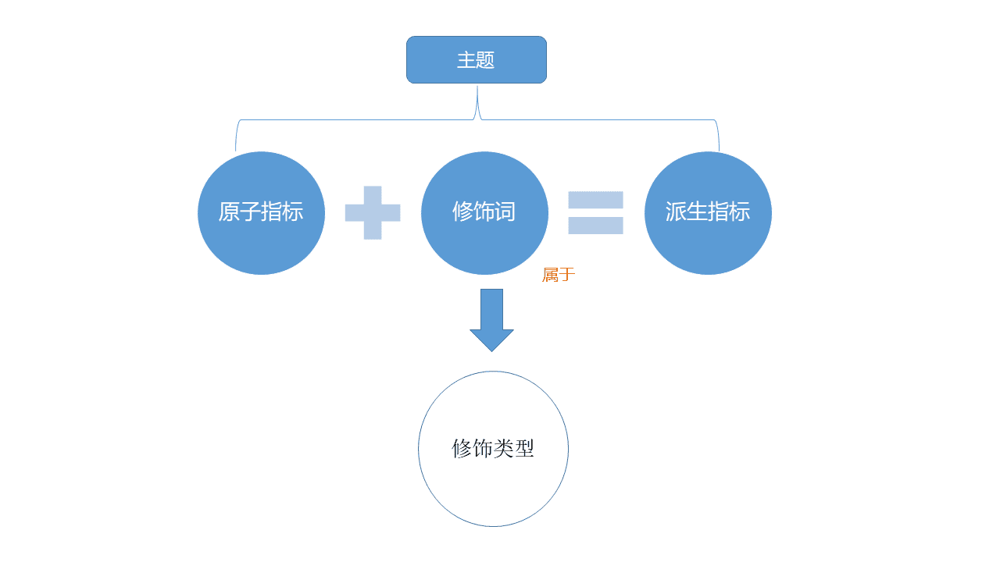
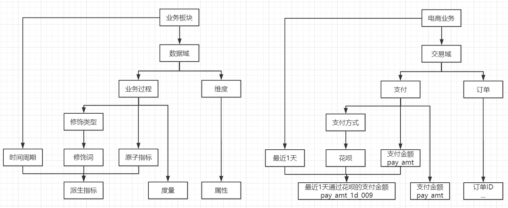
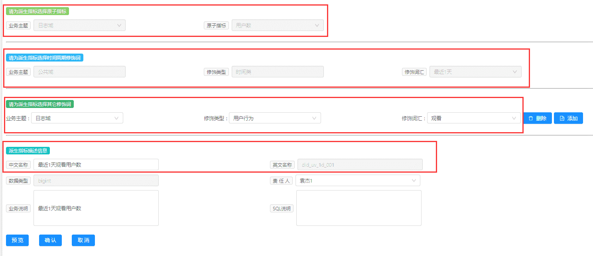
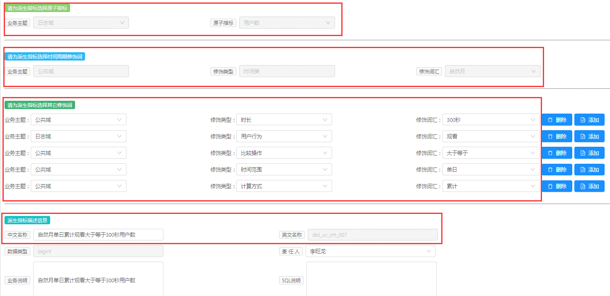
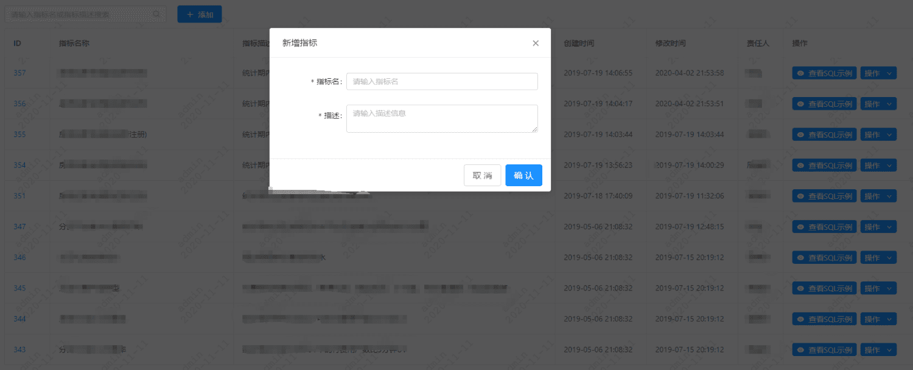
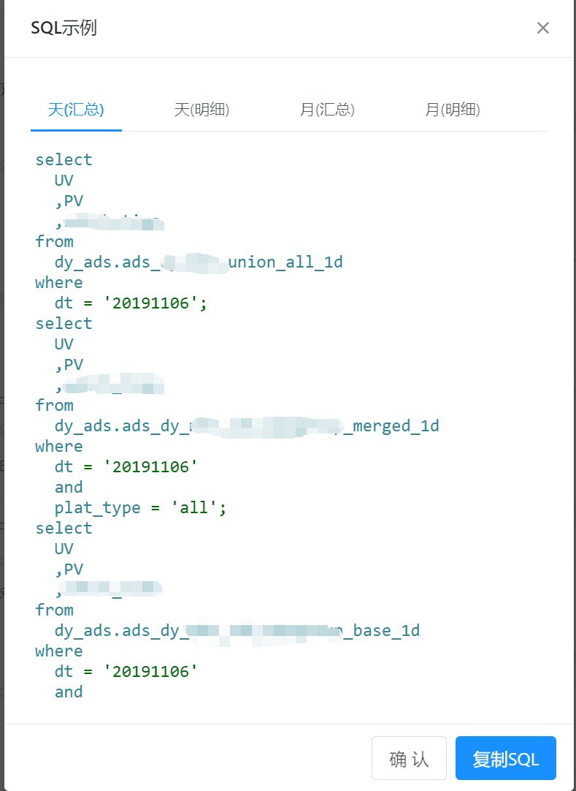
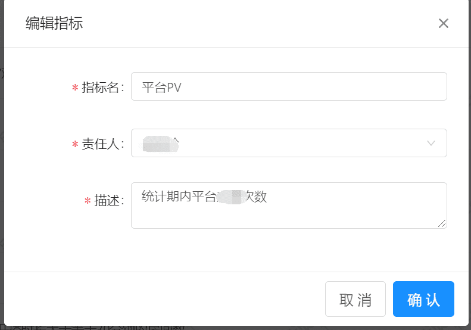
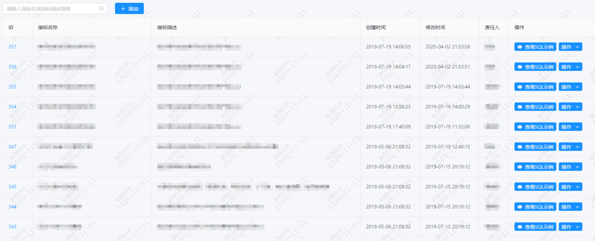

# 一、背景

随着业务的快速增长，业务部门对数据需求越来越迫切，日常取数工作越来越多，取数过程中没有一个统一可执行的指标规范定义方法，取数过程中会出现烟囱式开发、指标的字段命名不规范、定义不同意、算法不一致等问题，这不仅使得对内对外以提供的数据权威性备受质疑，指标烟囱式开发更浪费了大量开发资源、计算资源和存储空间，并随着业务的快速更迭，这种资源浪费现象日益严重。

# 二、目标

制定指标规范并实施后我们想达成的目标如下：

- 建立统一的指标口径、定义和算法。
- 知道指导基础数据建设工作。
- 衡量业务发展质量

# 三、技术方案

## （一）指标规范体系

### 1.   名词和术语

- 业务主题：数据建模从业务和数据的角度出发定义，对数据仓库不同来源，不同类型的数据按照业务的需求界定的数据计算、分析进而提供数据服务的主题。例如，交易主题（也称为交易域）、主播和会员主题、互动主题等。
- 原子指标：指数据建模中从业务出发、不可再细分的指标，原子指标不直接提供数据服务，与修饰词组合生成的派生指标才提供数据服务。例如，交易主题中的交易金额等。
- 指标修饰类型和修饰词：指数据仓库数据计算中可以兑原子指标发生修饰作用的各种类型及各种类型下的修饰词。例如，开播状态作为修饰类型，“天数”和“此数据”作为修饰词；时间周期作为修饰类型，包括“最近1天”、“最近7天”等。
- 派生指标：原子指标和指标修饰词可以根据业务的需求组合任务业务需要的最终指标，即派生指标。派生指标是最终对内外数据服务提供的唯一规范指标。

### 2.   指标定义规范
#### 2.1、基本规范

参照阿里的Onedata方案定义了满足我们需求的指标规范，具体如下图：

- 主题：分为主播和会员域、用户及会员域、交易域、互动域、公共域、日志域。
- 原子指标：例如视频数、订单会员数、访问视频数、关注数等。
- 修饰类型：例如视频、订单类型等。
- 修饰词：日期类修饰词例如日、周、月、自然月等；其他修饰类型如普通礼物、收益等。
- 派生指标：例如最近一天浏览数、自然月、最近一天视频数等。
- 
#### 2.2、公共层指标规范

- 数据域：面向业务分析，将业务过程或者维度进行抽象的集合，如，交易域、互动域等。需要抽象提炼，并且长期维护和更新的，但不轻易变动，划分数据域时，既能涵盖当前所有业务需求，又能在新业务进入时无影响地被包含进已有的数据域和扩展新的数据域
- 业务过程：指业务活动事件，如浏览，关注等。
- 时间周期：用来明确数据统计的时间范围或者时间点，如最近30天，自然周等。
- 修饰类型：是对修饰词的一种抽象划分。修饰类型从属于某个业务域，如日志域的访问终端类型涵盖PC端、无线端等修饰词。
- 修饰词：指除了统计维度意外指标的业务场景限定抽象。修饰词隶属于一种修饰类型。度量/天，自然周等。
- 维度属性：维度属性隶属于一个维度，如地理纬度里面的国家名称、国家ID等。
- 派生指标：派生指标=一个原子指标+多个修饰词（可选）+时间周期。
- 
#### 2.3、指标定义示例

下面以在指标管理平台中的创建过程来说明整个指标规范的运作情况。

a）为派生指标选择原子指标

b）原子指标

原子指标在定义时，需要指定 **业务域（日志域）** ，以及原子指标的 **英文标识（did_uv）** 

c）修饰词

一个修饰词属于一个数据域下的一种修饰类型，而修饰词的组合清晰的描述了指标的计算逻辑。

d）  指标命名

did_uv_cm_007，中文描述：自然月单日累计观看大于等于300秒用户数。

可以发现中文描述可以由修饰词精确的排序得到，英文名是在原子指标之后，添加了时间周期的标识以及一个数字串，数字串即可以理解为这些修饰词在当前原子指标和时间周期下的组合。

## （二）指标管理
### 1.   基础指标管理
基础指标管理分为业务主题、原子指标、修饰类型、修饰词、派生指标管理。

1. 业务主题管理提供业务主题增删改操作
2. 原子指标管理
3. 修饰类型管理
4. 修饰词管理
5. 派生指标管理

### 2.   数据百科
数据百科是对全域的业务数据指标定义、查询、搜索、管理

a）指标定义

b）指标查询、搜索

