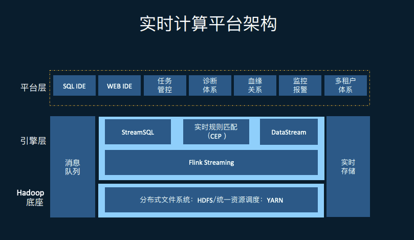
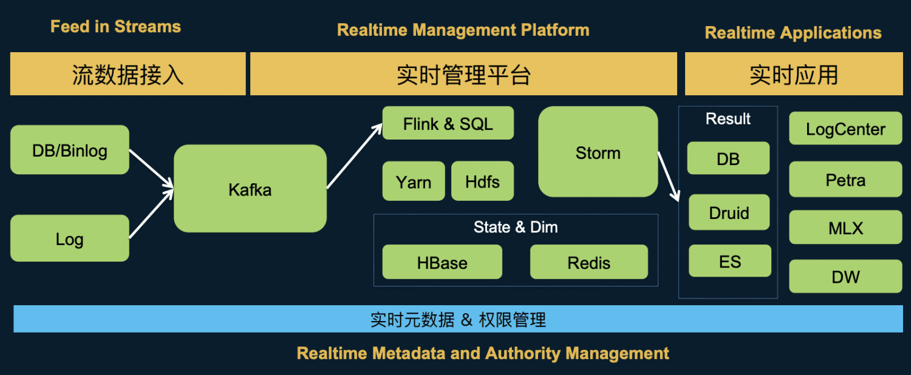
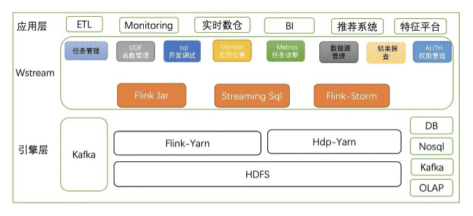
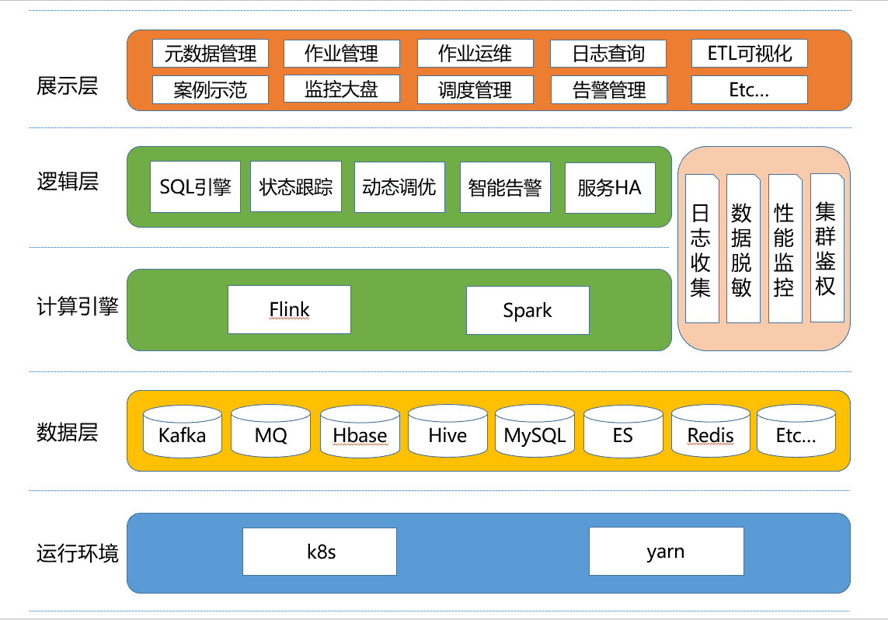
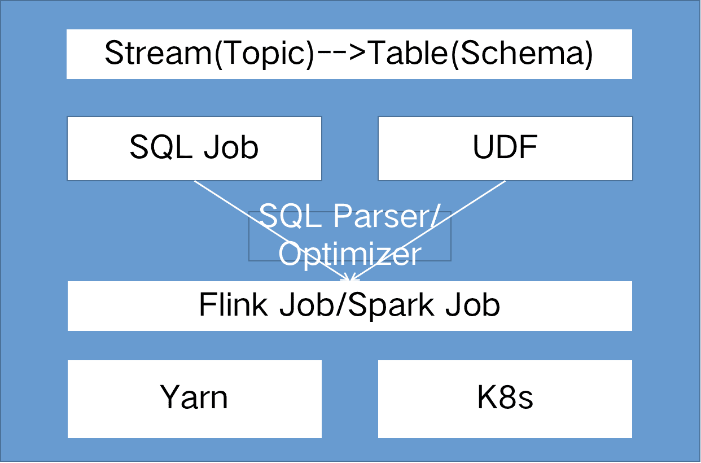
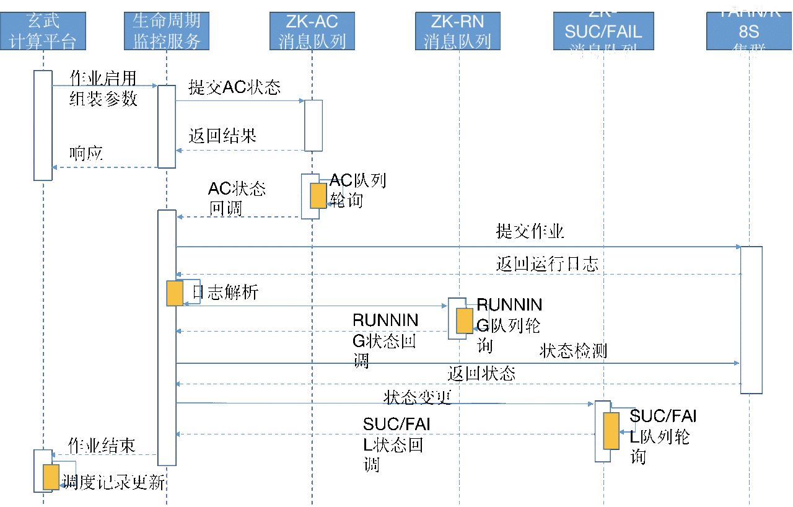
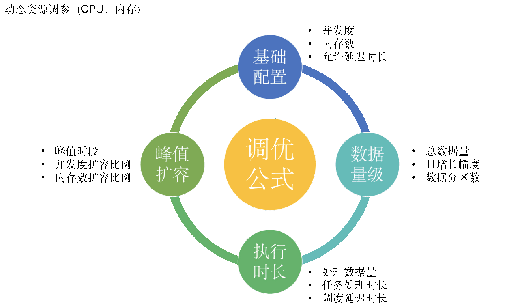

## [1. 背景]()
由于数据仓库数据来源的多样性，存在从多个不同渠道去收集数据，常见有mysql数据库查询、mysql binlog日志解析、kafka日志数据、rocketmq业务数据、loghub日志服务、redis热点数据、es搜索文档等等。
## [2. 现状]()
| 数据工具 | 能力概述 | 优点 | 缺点 | 任务接入成本 |
| --- | --- | --- | --- | --- |
| 数据同步中心 | 支持离线周期性mysql、es、hbase、mongodb、postgre、redis、hive等异构数据源间同步 | 无状态，任务失败重跑即可方便恢复 | 任务配置学习门槛过于高，对于不熟悉的人来说，使用不友好，需专人维护 | 无向导模式1-2小时，向导模式5-10分钟 |
| 实时任务系统 | 支持离线&实时周期性将kafka、rocketmq、loghub等流式数据同步到hive、odps、es、kafka等目标源 | 前端配置页面友好，即开即用，学习成本低 | 有状态，任务失败不可简单重跑恢复，任务失败恢复成本较高，需专人维护处理 | 任务配置5-10分钟 |
| 阿里云同步工具 | 支持离线周期性hive、odps间数据互相同步 | 基于mr架构，同步速率高 | 无配置页面，需专人统一处理，人工成本太大 | 任务配置5-10分钟 |
| mysql日志同步系统 | 支持实时将mysql binlog同步到kafka、rocketmq等流式数据源 | 支持高实时性数据同步 | 数据接入成本较高，需专人处理 | 任务配置5-10分钟 |

### [2.1 存在问题]()

- 需专人维护，人工成本大
- 任务配置入口分散，沟通成本大
- 配置界面不够完善，使用不友好


## [3. 目标]()
建立一个流批一体的、sql化实时/离线指标开发、一站式开发、部署运维的数据处理平台。
## [4. 业界实现方案]()

- 滴滴方案



- 美团方案



- 58同城方案



- 我们的方案 


## [5. 方案对比]()
|   | 滴滴 | 美团 | 58 | 我们的方案 |
| --- | --- | --- | --- | --- |
| SQL化 | 支持 | 支持 | 支持 | 支持 |
| 实时元数据 | 不支持 | 支持 | 不支持 | 支持 |
| Yarn容器 | 支持 | 支持 | 支持 | 支持 |
| K8s容器 | 不支持 | 不支持 | 不支持 | 支持 |

## [6. 实现细节]()
### [6.1 SQL]()引擎：SQL化描述定义流式&批式作业
自定义SQL引擎，赋予流/批式作业以Schema化表述，以DDL（create table）表述数据流的来源与目的源，以DDL（create view as select）表述数据流的ETL加工逻辑，以DML（insert into）表述数据流的方向，构成完整数据流加工DAG图。



看一段简单SQL示例，我们最终会将下面这段SQL通过Flink的Table API提交执行：
```
-- -- -- 开启 mini-batch
SET table.exec.mini-batch.enabled=true;
-- -- -- mini-batch的时间间隔，即作业需要额外忍受的延迟
SET table.exec.mini-batch.allow-latency=5s;
-- -- -- 一个 mini-batch 中允许最多缓存的数据
SET table.exec.mini-batch.size=1000; 
-- -- 开启 local-global 优化
-- SET table.optimizer.agg-phase-strategy=TWO_PHASE;
-- -- 开启 distinct agg 切分
-- SET table.optimizer.distinct-agg.split.enabled=true;
set table.exec.non-temporal-sort.enabled=true;


CREATE TABLE source_spt_daily
(
    `did` STRING
    ,`ct_code` STRING
    ,`dateline` BIGINT
    ,`ext` STRING
    ,proctime as proctime()
)WITH(
    'connector.type' ='kafka'
    ,'connector.version' = 'universal-upsert'
    ,'cluster_name' = 'kafka.log_2.2.1'
    ,'connector.properties.group.id' = 'share-spread-dot-start_20201201'
    ,'connector.topic' ='share-spread-dot-start'
    ,'connector.startup-mode' = 'latest-offset'
    ,'format.type' = 'json-dy'
    ,'format.ignore-parse-errors' = 'true'
);

CREATE TABLE MyResult2(
    `json_value` STRING
) WITH (
    'connector.type' = 'redis'
    ,'cluster_name' = 'redis.wsd-growth-start-up-redis'
    ,'connector.redis.command' = 'LPUSH'
    ,'connector.redis.key.ttl' = '172800'
    ,'connector.redis.mode' = 'standalone'
    ,'connector.redis.key.format' = 'point_start_up_data'
    ,'connector.redis.value.format' = '${json_value}'
    ,'connector.redis.database' = '0'
    ,'connector.redis.timeout' = '2000' --连接超时和读写超时，单位毫秒，默认为2000
    ,'connector.redis.pool.max.idle' = '8'  -- 空闲连接实例的最大数目，默认为8
    ,'connector.redis.pool.max.total' = '8' -- 可用连接实例的最大数目，默认为8
    ,'connector.redis.pool.min.idle' = '0' -- 资源池确保最少空闲的连接数，默认为0
);

INSERT INTO MyResult2
SELECT
    DY_STRING_FORMAT(
        did,imei,idfa,oaid,dateline,chan_code
    ) as `json_value`
FROM
(
    select
        TUMBLE_END(proctime, INTERVAL '10' MINUTE) AS ts,
        did,
        min(dateline) as dateline,
        imei,
        idfa,
        oaid,
        first_value(chan_code) as chan_code
    from (
        select
            did,
            dateline,
            proctime
       from
            source_spt_daily
        where
            ct_code = 'android'
    ) b
    group by TUMBLE(proctime, INTERVAL '10' MINUTE),chan_code
) a;


```
这段SQL前部分 set语句，主要用来做针对当前SQL的自定义优化，会在提交SQL时，将这部分语句转化成KV结构，最终调用Table API 来set这些参数，起到调优集群的作用。
解析这部分Set语句的代码如下：
```
   
 /**
 * Simple parser for determining the type of command and its parameters.
 */
   	public static List<SqlCommandCall> parse(List<String> lines) {
		List<SqlCommandCall> calls = new ArrayList<>();
		StringBuilder stmt = new StringBuilder();
		for (String line : lines) {
			if (line.trim().isEmpty() || line.trim().startsWith("--")) {
				// skip empty line and comment line
				continue;
			}
			stmt.append("\n").append(line);
			if (line.trim().endsWith(";")) {
				Optional<SqlCommandCall> optionalCall = parse(stmt.toString());
				if (optionalCall.isPresent()) {
					calls.add(optionalCall.get());
				} else {
					throw new RuntimeException("Unsupported command '" + stmt.toString() + "'");
				}
				// clear string builder
				stmt.setLength(0);
			}
		}
		return calls;
	}
   
   
   private void callSet(SqlCommandCall cmdCall) {
        String key = cmdCall.operands[0];
        String value = cmdCall.operands[1];
        //为SQL使用到的表增加default_catalog信息
        this.bsTableEnv.useCatalog("default_catalog");
        bsTableEnv.getConfig().getConfiguration().setString(key, value);
    }
```


### [状态跟踪：实时监控作业运行状态]()
自定义ZK消息队列，构建了作业整个生命周期的7种状态，状态与状态间以zk节点的原子操作移动，保障整个状态流转的数据一致性。



基于curator-recipes包的QueueBase二次定制，实现了一个分布式消息队列，支持唯一消息id、消息延迟消费及消息重入队等功能，以保证大并发下状态流转的事务性。

```
public abstract class BaseQueue extends ElasticsearchLogging {

    protected Logger log = LoggerFactory.getLogger(this.getClass());

    @Autowired
    EnvConfig envConfig;
    @Autowired
    TerraConfig terraConfig;
    @Resource
    protected ZkClient zkClient;
    @Autowired
    EngineService engineService;

    /**
     * 队列路径
     */
    protected final String queuePath = this.obtainStatus().getQueuePath();
    /**
     * 锁路径
     */
    protected final String lockPath = this.obtainStatus().getLockPath();
    /**
     * 队列对象
     */
    protected DYDistributedIdQueue<String> queue;

    public DYDistributedIdQueue<String> getQueue() {
        return queue;
    }

    /**
     * 是否存在该id
     *
     * @param id
     * @return
     * @throws Exception
     */
    public boolean isContains(String id) throws Exception {
        return queue.isContains(id);
    }

    /**
     * 获取队列下子对象
     *
     * @return 队列下子对象
     * @throws Exception
     */
    public Map<String, List<String>> getChildrenData() throws Exception {
        Map<String, List<String>> childData = new LinkedHashMap<>();
        List<String> children = zkClient.getCuratorFramework().getChildren().forPath(queuePath);
        if (children != null) {
            children.forEach(itemNode -> {
                String itemPath = ZKPaths.makePath(queuePath, itemNode);
                try {
                    byte[] bytes = zkClient.getCuratorFramework().getData().forPath(itemPath);
                    MultiItem<String> items;
                    try {
                        items = DYItemSerializer.deserialize(bytes, queueSerializer);
                        for (; ; ) {
                            String item = items.nextItem();
                            if (item == null) {
                                break;
                            }
                            List<String> list = childData.getOrDefault(itemNode, new ArrayList<>());
                            list.add(item);
                            childData.put(itemNode, list);
                        }
                    } catch (Throwable e) {
                        log.error("queue item: " + itemNode, e);
                        childData.put(itemNode, null);
                    }
                } catch (Exception e) {
                    log.error("queue item: " + itemNode, e);
                    childData.put(itemNode, null);
                }
            });
        }
        return childData;
    }

    //消费监听器
    protected QueueConsumer<String> queueConsumer = new QueueConsumer<String>() {
        //消费队列数据
        @Override
        public void consumeMessage(String message) throws Exception {
            String topic = null;
            try {
                JobNodeData jobNodeData = JsonUtils.fromJsonString(message,
                        JobNodeData.class);
                topic = jobNodeData.getRunningStatus().getLogTopic();
                //转换运行状态为队列状态
                Status status = transRunningStatus(jobNodeData.getRunningStatus().getStatus());
                //检查运行状态是否与队列状态一直
                if (status == obtainStatus()) {
                    //当前队列处理逻辑
                    process(jobNodeData,true);
                    logInfo(topic, "process success.");
                } else {
                    //跳过当前队列处理
                    logInfo(topic, "running status is not eq queue status,get process by status.");
                    //节点记录状态与当前队列不匹配
                    //在对应队列生产消息，跳过本队列处理
                    processByStatus(jobNodeData, status);
                }
            } catch (RequeueException e) {
                //do nothing
                throw e;
            } catch (Exception e) {
                if (StringUtils.isNotBlank(topic)) {
                    logError(topic, "process error.", e);
                } else {
                    log.error("process error.", e);
                }
                throw e;
            }
        }

        @Override
        public void stateChanged(CuratorFramework client, ConnectionState newState) {
            log.info("state change {}", newState);
        }
    };

    //序列化
    protected QueueSerializer<String> queueSerializer = new QueueSerializer<String>() {
        @Override
        public byte[] serialize(String item) {
            return item.getBytes();
        }

        @Override
        public String deserialize(byte[] bytes) {
            return new String(bytes);
        }
    };

    /**
     * 获取此队列对应的状态
     *
     * @return 队列状态
     */
    protected abstract Status obtainStatus();


    /**
     * 节点处理
     *
     * @param jobNodeData 待处理任务信息
     */
    protected abstract void process(JobNodeData jobNodeData,boolean isStatusEq) throws Exception;

    /**
     * 日志收集器初始化
     */
    public void initLogs() {
        //初始化日志插件
        String endpoint = terraConfig.getAliyunLogEndpoint();
        String accessKeyId = terraConfig.getAliyunLogAccessKeyId();
        String accessKeySecret = terraConfig.getAliyunLogAccessKeySecret();
        String project = terraConfig.getAliyunLogProjectName();
        String logStore = terraConfig.getAliyunLogstoreError();
        init(endpoint, accessKeyId, accessKeySecret, project, logStore);
    }

    /**
     * 初始化队列consumer
     */
    @PostConstruct
    public void init() throws Exception {
        initLogs();
        //创建分布式队列
        if(envConfig.getProducerOnly()){
            queueConsumer = null;
        }
        DYQueueBuilder<String> distributedBuilder = DYQueueBuilder.builder(zkClient.getCuratorFramework(),
                queueConsumer, queueSerializer, queuePath).lockPath(lockPath)
                .executor(new ThreadPoolExecutor(10,
                        50,
                        60L,
                        TimeUnit.SECONDS,
                        new LinkedBlockingQueue<>(1000),
                        new DefaultThreadFactory()));
        queue = distributedBuilder.buildDYIdQueue();
        if (envConfig.getQueueStart()) {
            queue.start();
        }
    }

    /**
     * 线程池构造工厂
     */
    static class DefaultThreadFactory implements ThreadFactory {
        /**
         * 线程组
         */
        private final ThreadGroup group;
        /**
         * 线程数目
         */
        private final AtomicInteger threadNumber = new AtomicInteger(1);
        /**
         * 为每个创建的线程添加的前缀
         */
        private final String namePrefix;

        DefaultThreadFactory() {
            SecurityManager s = System.getSecurityManager();
            group = (s != null) ? s.getThreadGroup() :
                    Thread.currentThread().getThreadGroup();//取得线程组
            /**
             * 原子类，线程池编号
             */
            AtomicInteger poolNumber = new AtomicInteger(1);
            namePrefix = "queueJobPool-" +
                    poolNumber.getAndIncrement() +
                    "-thread-";
        }

        @Override
        public Thread newThread(Runnable r) {
            //真正创建线程的地方，设置了线程的线程组及线程名
            Thread t = new Thread(group, r,
                    namePrefix + threadNumber.getAndIncrement(),
                    0);
            if (t.isDaemon()) {
                t.setDaemon(false);
            }

            //默认是正常优先级
            if (t.getPriority() != Thread.NORM_PRIORITY) {
                t.setPriority(Thread.NORM_PRIORITY);
            }
            return t;
        }
    }

    /**
     * 消息重新入队列
     *
     * @param jobNodeData 消息内容
     */
    public void requeue(JobNodeData jobNodeData) {
        throw new RequeueException("requeue again.", JsonUtils.toJsonStr(jobNodeData));
    }

    /**
     * 生产消息
     *
     * @param jobNodeData 消息内容
     * @throws Exception 异常信息
     */
    public void produce(JobNodeData jobNodeData) throws Exception {
        if (queue == null) {
            throw new BusinessException("queue is null.");
        }
        try {
            logInfo(jobNodeData.getRunningStatus().getLogTopic(), "begin to produce.");
            String id = jobNodeData.getUniqueId();
            String message = JsonUtils.toJsonStr(jobNodeData);
            queue.put(message, id);
            logInfo(jobNodeData.getRunningStatus().getLogTopic(), "produce finish.");
        } catch (Exception e) {
            logError(jobNodeData.getRunningStatus().getLogTopic(), "produce error.", e);
            throw e;
        }
    }


    /**
     * 根据状态生产数据
     *
     * @param jobNodeData 节点数据
     * @param status      状态
     * @throws Exception 异常
     */
    public void produceByStatus(JobNodeData jobNodeData, Status status) throws Exception {
        logInfo(jobNodeData.getRunningStatus().getLogTopic(), "produce to {}.", status.getName());
        // 4、移动对应队列
        BaseQueue baseQueue = getByStatus(status);
        //生成对应队列的节点路径
        String newItemPath = baseQueue.queue.makeIdPath(jobNodeData.getUniqueId(), 0L);
        RequeueException requeueException = new RequeueException("node move to " + status.getName()+".", JsonUtils.toJsonStr(jobNodeData));
        requeueException.setNodePath(newItemPath);
        requeueException.setResultCode(DYDistributedQueue.ProcessMessageBytesCode.MOVE);
        throw requeueException;
    }

    /**
     * 根据状态处理数据
     *
     * @param jobNodeData 节点数据
     * @param status      状态
     * @throws Exception 异常
     */
    public void processByStatus(JobNodeData jobNodeData, Status status) throws Exception {
        logInfo(jobNodeData.getRunningStatus().getLogTopic(), "process by {}.", status.getName());
        // 4、移动对应队列
        BaseQueue baseQueue = getByStatus(status);
        baseQueue.process(jobNodeData,false);
    }

    /**
     * 转换运行状态为队列Status
     *
     * @param runningStatus 运行状态
     * @return 队列Status枚举
     */
    public Status transRunningStatus(int runningStatus) {
        RunningStatusTypeEnum statusTypeEnum = RunningStatusTypeEnum.valueOf(runningStatus);
        Status status;
        switch (statusTypeEnum) {
            case ACCEPT:
                status = Status.ACCEPT;
                break;
            case RUNNING:
            case RUNNING_WARN:
                status = Status.RUNNING;
                break;
            case ERROR_FAIL:
                status = Status.FAIL;
                break;
            case SUCCESS:
                status = Status.SUCCESS;
                break;
            case KILL:
            case CANCEL:
                status = Status.KILL;
                break;
            default:
                status = Status.FINISH;
                break;
        }
        return status;
    }

    /**
     * 转换Status为运行状态
     *
     * @return 运行状态
     */
    public RunningStatusTypeEnum transRunningStatus(Status status) {
        RunningStatusTypeEnum statusTypeEnum;
        switch (status) {
            case ACCEPT:
                statusTypeEnum = RunningStatusTypeEnum.ACCEPT;
                break;
            case RUNNING:
                statusTypeEnum = RunningStatusTypeEnum.RUNNING;
                break;
            case FAIL:
                statusTypeEnum = RunningStatusTypeEnum.ERROR_FAIL;
                break;
            case SUCCESS:
                statusTypeEnum = RunningStatusTypeEnum.SUCCESS;
                break;
            case KILL:
                statusTypeEnum = RunningStatusTypeEnum.KILL;
                break;
            default:
                statusTypeEnum = null;
                break;
        }
        return statusTypeEnum;
    }


    /**
     * 获取状态对应的队列服务
     *
     * @param status 状态
     * @param <T>    队列类型
     * @return 队列服务
     */
    public <T extends BaseQueue> T getByStatus(Status status) {
        BaseQueue baseQueue = SpringBeanUtils.getBean(status.getName(), BaseQueue.class);
        return (T) baseQueue;
    }

    /**
     * 回调状态更新
     *
     * @param runningStatus 运行状态
     */
    public RunningStatusTypeEnum callback(JobRunningStatus runningStatus, boolean ignoreError, boolean isRetry) {
        if (StringUtils.isBlank(runningStatus.getCallbackUrl())) {
            return RunningStatusTypeEnum.valueOf(runningStatus.getStatus());
        }
        try {
            logInfo(runningStatus.getLogTopic(), "callback begin.{}", RunningStatusTypeEnum.valueOf(runningStatus.getStatus()));
            String response = HttpClientTools.doJsonPost(runningStatus.getCallbackUrl(), runningStatus, isRetry);
            ResultVo resultVo = JSON.parseObject(response, ResultVo.class);
            if (resultVo.getCode() == ErrorCodes.SUCCESS.getCode()) {
                //回调成功
                logInfo(runningStatus.getLogTopic(), "callback finish.{}", resultVo.getData());
                return resultVo.getData() == null ? null : RunningStatusTypeEnum.valueOf((String) resultVo.getData());
            } else {
                logWarn(runningStatus.getLogTopic(), "callback fail. {}", response);
                throw new BusinessException(response);
            }
        } catch (Exception e) {
            if (ignoreError) {
                //忽略异常
                logInfo(runningStatus.getLogTopic(), "ignore callback error. {}", e.getMessage());
                return RunningStatusTypeEnum.valueOf(runningStatus.getStatus());
            } else {
                logWarn(runningStatus.getLogTopic(), "callback error. {}", e);
                throw e;
            }
        }
    }


    /**
     * 提交作业
     *
     * @param jobStartArgs  作业启动参数
     * @param runningStatus 作业运行信息
     * @return 作业运行信息
     */
    public JobRunningStatus submitJob(JobStartArgs jobStartArgs, JobRunningStatus runningStatus) {
        String runningKey = engineService.runJob(jobStartArgs, runningStatus.getLogTopic());
        runningStatus.setStatus(RunningStatusTypeEnum.RUNNING.getValue());
        runningStatus.setRunningKey(runningKey);
        runningStatus.setRunningCluster(jobStartArgs.getJobInfo().getClusterName());
        runningStatus.setMonitorStartTime(new Date());
        if (runningStatus.getStartTime() == null) {
            runningStatus.setStartTime(new Date());
        }
        if (StringUtils.isBlank(runningStatus.getManagerUI())) {
            runningStatus.setManagerUI(engineService.getManagerUrl(jobStartArgs.getJobInfo()
                    , runningStatus.getRunningCluster(), runningKey, runningStatus.getLogTopic()));
        }
        return runningStatus;
    }

    /**
     * 查询作业状态
     *
     * @param jobInfo       作业定义
     * @param runningStatus 作业运行记录
     * @return 作业运行记录
     */
    public JobRunningStatus queryJobStatus(JobInfo jobInfo, JobRunningStatus runningStatus) {
        ExecutorJobStatusEnum jobStatusEnum = engineService.checkJobStatus(jobInfo,
                runningStatus.getRunningCluster(), runningStatus.getRunningKey(), runningStatus.getLogTopic());
        switch (jobStatusEnum) {
            case ACCEPTED:
            case RUNNING:
                //作业正在运行中，记录monitor时间
                update2Running(runningStatus);
                log.info("job is running.jobId={},fireTime={}",
                        runningStatus.getJobId(), runningStatus.getFireTime());
                break;
            case SUCCEEDED:
                update2Success(runningStatus);
                log.info("job is succeeded.jobId={},fireTime={}",
                        runningStatus.getJobId(), runningStatus.getFireTime());
                break;
            case FAILED:
                update2Fail(runningStatus);
                log.info("job is failed.jobId={},fireTime={}",
                        runningStatus.getJobId(), runningStatus.getFireTime());
                break;
            case KILLED:
                update2Kill(runningStatus);
                log.info("job is killed.jobId={},fireTime={}",
                        runningStatus.getJobId(), runningStatus.getFireTime());
                break;
            case UNKNOWN:
                //作业状态未找到，运行容器作业id未找到
                update2Unknown(runningStatus);
                log.info("job status is unknown，waiting to get runningKey.jobId={},fireTime={}",
                        runningStatus.getJobId(), runningStatus.getFireTime());
                break;
            default:
                //TODO 未知状态，置为警告运行中
                break;
        }
        return runningStatus;
    }

    /**
     * 更新状态为运行中
     *
     * @param runningStatus 运行状态
     */
    private void update2Running(JobRunningStatus runningStatus) {
        if (runningStatus.getMonitorStartTime() == null) {
            runningStatus.setMonitorStartTime(new Date());
        }
        runningStatus.setMonitorLastTime(new Date());
        runningStatus.setMonitorCount(runningStatus.getMonitorCount() + 1);
        //状态检查恢复，则重置失败监控次数
        runningStatus.setMonitorErrorCount(0L);
    }

    /**
     * 更新状态为成功
     *
     * @param runningStatus 运行状态
     */
    private void update2Success(JobRunningStatus runningStatus) {
        log.info("job running success.");
        //更新作业执行记录状态
        runningStatus.setMonitorLastTime(new Date());
        //状态检查恢复，则重置失败监控次数
        runningStatus.setMonitorErrorCount(0L);
        runningStatus.setStatus(RunningStatusTypeEnum.SUCCESS.getValue());
        log.info("job running success.jobId={},fireTime={}",
                runningStatus.getJobId(), runningStatus.getFireTime());
    }

    /**
     * 更新状态为失败
     *
     * @param runningStatus 运行状态
     */
    private void update2Fail(JobRunningStatus runningStatus) {
        log.info("job running fail.");
        //更新作业执行记录状态
        runningStatus.setMonitorLastTime(new Date());
        //状态检查恢复，则重置失败监控次数
        runningStatus.setMonitorErrorCount(0L);
        runningStatus.setStatus(RunningStatusTypeEnum.ERROR_FAIL.getValue());
        log.info("job running fail.jobId={},fireTime={}",
                runningStatus.getJobId(), runningStatus.getFireTime());
    }

    /**
     * 更新状态为kill
     *
     * @param runningStatus 运行状态
     */
    private void update2Kill(JobRunningStatus runningStatus) {
        log.info("job running kill.");
        //更新作业执行记录状态
        runningStatus.setMonitorLastTime(new Date());
        //状态检查恢复，则重置失败监控次数
        runningStatus.setMonitorErrorCount(0L);
        runningStatus.setStatus(RunningStatusTypeEnum.KILL.getValue());
        log.info("job running kill.jobId={},fireTime={}",
                runningStatus.getJobId(), runningStatus.getFireTime());
    }

    /**
     * 更新状态为未知状态
     *
     * @param runningStatus 运行状态
     */
    private void update2Unknown(JobRunningStatus runningStatus) {
        log.info("job running unknown.");
        //更新作业执行记录状态
        runningStatus.setMonitorLastTime(new Date());
        runningStatus.setMonitorErrorCount(runningStatus.getMonitorErrorCount() + 1);
        log.info("job running unknown.jobId={},fireTime={}",
                runningStatus.getJobId(), runningStatus.getFireTime());
    }
}


/**
 * <p>An implementation of the Distributed Queue ZK recipe. Items put into the queue
 * are guaranteed to be ordered (by means of ZK's PERSISTENT_SEQUENTIAL node).</p>
 *
 * <p>
 * Guarantees:</p>
 * <ul>
 * <li>If a single consumer takes items out of the queue, they will be ordered FIFO. i.e. if ordering is important,
 * use a {@link LeaderSelector} to nominate a single consumer.</li>
 * <li>Unless a {@link QueueBuilder#lockPath(String)} is used, there is only guaranteed processing of each message to the point of receipt by a given instance.
 * <li>If an instance receives an item from the queue but dies while processing it, the item will be lost. If you need message recoverability, use
 * a {@link QueueBuilder#lockPath(String)}</li>
 * </ul>
 */
public class DYDistributedQueue<T> implements QueueBase<T> {
    private final Logger log = LoggerFactory.getLogger(getClass());
    private final CuratorFramework client;
    private final QueueSerializer<T> serializer;
    private final String queuePath;
    private final Executor executor;
    private final ExecutorService service;
    private final AtomicReference<State> state = new AtomicReference<State>(State.LATENT);
    private final QueueConsumer<T> consumer;
    private final int minItemsBeforeRefresh;
    private final boolean refreshOnWatch;
    private final boolean isProducerOnly;
    private final String lockPath;
    private final AtomicReference<ErrorMode> errorMode = new AtomicReference<ErrorMode>(ErrorMode.REQUEUE);
    private final ListenerContainer<QueuePutListener<T>> putListenerContainer = new ListenerContainer<QueuePutListener<T>>();
    private final AtomicInteger lastChildCount = new AtomicInteger(0);
    private final int maxItems;
    private final int finalFlushMs;
    private final boolean putInBackground;
    private final ChildrenCache childrenCache;

    private final AtomicInteger putCount = new AtomicInteger(0);

    private enum State {
        LATENT,
        STARTED,
        STOPPED
    }

    @VisibleForTesting
    protected enum ProcessType {
        NORMAL,
        REMOVE
    }

    private static final String QUEUE_ITEM_NAME = "queue-";

    DYDistributedQueue
            (
                    CuratorFramework client,
                    QueueConsumer<T> consumer,
                    QueueSerializer<T> serializer,
                    String queuePath,
                    ThreadFactory threadFactory,
                    Executor executor,
                    int minItemsBeforeRefresh,
                    boolean refreshOnWatch,
                    String lockPath,
                    int maxItems,
                    boolean putInBackground,
                    int finalFlushMs
            ) {
        Preconditions.checkNotNull(client, "client cannot be null");
        Preconditions.checkNotNull(serializer, "serializer cannot be null");
        Preconditions.checkNotNull(threadFactory, "threadFactory cannot be null");
        Preconditions.checkNotNull(executor, "executor cannot be null");
        Preconditions.checkArgument(maxItems > 0, "maxItems must be a positive number");

        isProducerOnly = (consumer == null);
        this.lockPath = (lockPath == null) ? null : PathUtils.validatePath(lockPath);
        this.putInBackground = putInBackground;
        this.consumer = consumer;
        this.minItemsBeforeRefresh = minItemsBeforeRefresh;
        this.refreshOnWatch = refreshOnWatch;
        this.client = client;
        this.serializer = serializer;
        this.queuePath = PathUtils.validatePath(queuePath);
        this.executor = executor;
        this.maxItems = maxItems;
        this.finalFlushMs = finalFlushMs;
        service = Executors.newFixedThreadPool(2, threadFactory);
        childrenCache = new ChildrenCache(client, queuePath);

        if ((maxItems != QueueBuilder.NOT_SET) && putInBackground) {
            log.warn("Bounded queues should set putInBackground(false) in the builder. Putting in the background will result in spotty maxItem consistency.");
        }
    }

    /**
     * Start the queue. No other methods work until this is called
     *
     * @throws Exception startup errors
     */
    @Override
    public void start() throws Exception {
        if (!state.compareAndSet(State.LATENT, State.STARTED)) {
            throw new IllegalStateException();
        }

        try {
            client.create().creatingParentContainersIfNeeded().forPath(queuePath);
        } catch (KeeperException.NodeExistsException ignore) {
            // this is OK
        }
        if (lockPath != null) {
            try {
                client.create().creatingParentContainersIfNeeded().forPath(lockPath);
            } catch (KeeperException.NodeExistsException ignore) {
                // this is OK
            }
        }

        if (!isProducerOnly || (maxItems != QueueBuilder.NOT_SET)) {
            childrenCache.start();
        }

        if (!isProducerOnly) {
            service.submit
                    (
                            new Callable<Object>() {
                                @Override
                                public Object call() {
                                    runLoop();
                                    return null;
                                }
                            }
                    );
        }
    }

    @Override
    public void close() throws IOException {
        if (state.compareAndSet(State.STARTED, State.STOPPED)) {
            if (finalFlushMs > 0) {
                try {
                    flushPuts(finalFlushMs, TimeUnit.MILLISECONDS);
                } catch (InterruptedException e) {
                    Thread.currentThread().interrupt();
                }
            }

            CloseableUtils.closeQuietly(childrenCache);
            putListenerContainer.clear();
            service.shutdownNow();
        }
    }

    /**
     * Return the manager for put listeners
     *
     * @return put listener container
     */
    @Override
    public ListenerContainer<QueuePutListener<T>> getPutListenerContainer() {
        return putListenerContainer;
    }

    /**
     * Used when the queue is created with a {@link QueueBuilder#lockPath(String)}. Determines
     * the behavior when the queue consumer throws an exception
     *
     * @param newErrorMode the new error mode (the default is {@link ErrorMode#REQUEUE}
     */
    @Override
    public void setErrorMode(ErrorMode newErrorMode) {
        Preconditions.checkNotNull(lockPath, "lockPath cannot be null");

        if (newErrorMode == ErrorMode.REQUEUE) {
            log.warn("ErrorMode.REQUEUE requires ZooKeeper version 3.4.x+ - make sure you are not using a prior version");
        }

        errorMode.set(newErrorMode);
    }

    /**
     * Wait until any pending puts are committed
     *
     * @param waitTime max wait time
     * @param timeUnit time unit
     * @return true if the flush was successful, false if it timed out first
     * @throws InterruptedException if thread was interrupted
     */
    @Override
    public boolean flushPuts(long waitTime, TimeUnit timeUnit) throws InterruptedException {
        long msWaitRemaining = TimeUnit.MILLISECONDS.convert(waitTime, timeUnit);
        synchronized (putCount) {
            while (putCount.get() > 0) {
                if (msWaitRemaining <= 0) {
                    return false;
                }

                long startMs = System.currentTimeMillis();

                putCount.wait(msWaitRemaining);

                long elapsedMs = System.currentTimeMillis() - startMs;
                msWaitRemaining -= elapsedMs;
            }
        }
        return true;
    }

    /**
     * Add an item into the queue. Adding is done in the background - thus, this method will
     * return quickly.<br><br>
     * NOTE: if an upper bound was set via {@link QueueBuilder# maxItems}, this method will
     * block until there is available space in the queue.
     *
     * @param item item to add
     * @throws Exception connection issues
     */
    public void put(T item) throws Exception {
        put(item, 0, null);
    }

    /**
     * Same as {@link #put(Object)} but allows a maximum wait time if an upper bound was set
     * via {@link QueueBuilder# maxItems}.
     *
     * @param item item to add
     * @param maxWait maximum wait
     * @param unit wait unit
     * @return true if items was added, false if timed out
     * @throws Exception
     */
    public boolean put(T item, int maxWait, TimeUnit unit) throws Exception {
        checkState();

        String path = makeItemPath();
        return internalPut(item, null, path, maxWait, unit);
    }

    /**
     * Add a set of items into the queue. Adding is done in the background - thus, this method will
     * return quickly.<br><br>
     * NOTE: if an upper bound was set via {@link QueueBuilder# maxItems}, this method will
     * block until there is available space in the queue.
     *
     * @param items items to add
     * @throws Exception connection issues
     */
    public void putMulti(MultiItem<T> items) throws Exception {
        putMulti(items, 0, null);
    }

    /**
     * Same as {@link #putMulti(MultiItem)} but allows a maximum wait time if an upper bound was set
     * via {@link QueueBuilder# maxItems}.
     *
     * @param items items to add
     * @param maxWait maximum wait
     * @param unit wait unit
     * @return true if items was added, false if timed out
     * @throws Exception
     */
    public boolean putMulti(MultiItem<T> items, int maxWait, TimeUnit unit) throws Exception {
        checkState();

        String path = makeItemPath();
        return internalPut(null, items, path, maxWait, unit);
    }

    /**
     * Return the most recent message count from the queue. This is useful for debugging/information
     * purposes only.
     *
     * @return count (can be 0)
     */
    @Override
    public int getLastMessageCount() {
        return lastChildCount.get();
    }

    boolean internalPut(final T item, MultiItem<T> multiItem, String path, int maxWait, TimeUnit unit) throws Exception {
        if (!blockIfMaxed(maxWait, unit)) {
            return false;
        }

        final MultiItem<T> givenMultiItem = multiItem;
        if (item != null) {
            final AtomicReference<T> ref = new AtomicReference<T>(item);
            multiItem = new MultiItem<T>() {
                @Override
                public T nextItem() throws Exception {
                    return ref.getAndSet(null);
                }
            };
        }

        putCount.incrementAndGet();
        byte[] bytes = ItemSerializer.serialize(multiItem, serializer);
        if (putInBackground) {
            doPutInBackground(item, path, givenMultiItem, bytes);
        } else {
            doPutInForeground(item, path, givenMultiItem, bytes);
        }
        return true;
    }

    private void doPutInForeground(final T item, String path, final MultiItem<T> givenMultiItem, byte[] bytes) throws Exception {
        client.create().withMode(CreateMode.PERSISTENT_SEQUENTIAL).forPath(path, bytes);
        synchronized (putCount) {
            putCount.decrementAndGet();
            putCount.notifyAll();
        }
        putListenerContainer.forEach
                (
                        new Function<QueuePutListener<T>, Void>() {
                            @Override
                            public Void apply(QueuePutListener<T> listener) {
                                if (item != null) {
                                    listener.putCompleted(item);
                                } else {
                                    listener.putMultiCompleted(givenMultiItem);
                                }
                                return null;
                            }
                        }
                );
    }

    private void doPutInBackground(final T item, String path, final MultiItem<T> givenMultiItem, byte[] bytes) throws Exception {
        BackgroundCallback callback = new BackgroundCallback() {
            @Override
            public void processResult(CuratorFramework client, CuratorEvent event) throws Exception {
                if (event.getResultCode() != KeeperException.Code.OK.intValue()) {
                    return;
                }

                if (event.getType() == CuratorEventType.CREATE) {
                    synchronized (putCount) {
                        putCount.decrementAndGet();
                        putCount.notifyAll();
                    }
                }

                putListenerContainer.forEach
                        (
                                new Function<QueuePutListener<T>, Void>() {
                                    @Override
                                    public Void apply(QueuePutListener<T> listener) {
                                        if (item != null) {
                                            listener.putCompleted(item);
                                        } else {
                                            listener.putMultiCompleted(givenMultiItem);
                                        }
                                        return null;
                                    }
                                }
                        );
            }
        };
        internalCreateNode(path, bytes, callback);
    }

    @VisibleForTesting
    void internalCreateNode(String path, byte[] bytes, BackgroundCallback callback) throws Exception {
        client.create().withMode(CreateMode.PERSISTENT_SEQUENTIAL).inBackground(callback).forPath(path, bytes);
    }

    void checkState() throws Exception {
        if (state.get() != State.STARTED) {
            throw new IllegalStateException();
        }
    }

    String makeItemPath() {
        return ZKPaths.makePath(queuePath, QUEUE_ITEM_NAME);
    }

    @VisibleForTesting
    ChildrenCache getCache() {
        return childrenCache;
    }

    protected void sortChildren(List<String> children) {
        Collections.sort(children);
    }

    protected List<String> getChildren() throws Exception {
        return client.getChildren().forPath(queuePath);
    }

    protected long getDelay(String itemNode) {
        return 0;
    }

    protected boolean tryRemove(String itemNode) throws Exception {
        boolean isUsingLockSafety = (lockPath != null);
        if (isUsingLockSafety) {
            return processWithLockSafety(itemNode, ProcessType.REMOVE);
        }

        return processNormally(itemNode, ProcessType.REMOVE);
    }

    private boolean blockIfMaxed(int maxWait, TimeUnit unit) throws Exception {
        ChildrenCache.Data data = childrenCache.getData();
        while (data.children.size() >= maxItems) {
            long previousVersion = data.version;
            data = childrenCache.blockingNextGetData(data.version, maxWait, unit);
            if (data.version == previousVersion) {
                return false;
            }
        }
        return true;
    }

    private void runLoop() {
        long currentVersion = -1;
        long maxWaitMs = -1;
        try {
            while (state.get() == State.STARTED) {
                try {
                    ChildrenCache.Data data = (maxWaitMs > 0) ? childrenCache.blockingNextGetData(currentVersion, maxWaitMs, TimeUnit.MILLISECONDS) : childrenCache.blockingNextGetData(currentVersion);
                    currentVersion = data.version;

                    List<String> children = Lists.newArrayList(data.children);
                    sortChildren(children); // makes sure items are processed in the correct order

                    if (children.size() > 0) {
                        maxWaitMs = getDelay(children.get(0));
                        if (maxWaitMs > 0) {
                            continue;
                        }
                    } else {
                        continue;
                    }

                    processChildren(children, currentVersion);
                } catch (InterruptedException e) {
                    // swallow the interrupt as it's only possible from either a background
                    // operation and, thus, doesn't apply to this loop or the instance
                    // is being closed in which case the while test will get it
                }
            }
        } catch (Exception e) {
            log.error("Exception caught in background handler", e);
        }
    }

    private void processChildren(List<String> children, long currentVersion) throws Exception {
        final Semaphore processedLatch = new Semaphore(0);
        final boolean isUsingLockSafety = (lockPath != null);
        int min = minItemsBeforeRefresh;
        for (final String itemNode : children) {
            if (Thread.currentThread().isInterrupted()) {
                processedLatch.release(children.size());
                break;
            }

            if (!itemNode.startsWith(QUEUE_ITEM_NAME)) {
                log.warn("Foreign node in queue path: " + itemNode);
                processedLatch.release();
                continue;
            }

            if (min-- <= 0) {
                if (refreshOnWatch && (currentVersion != childrenCache.getData().version)) {
                    processedLatch.release(children.size());
                    break;
                }
            }

            if (getDelay(itemNode) > 0) {
                processedLatch.release();
                continue;
            }

            executor.execute
                    (
                            new Runnable() {
                                @Override
                                public void run() {
                                    try {
                                        if (isUsingLockSafety) {
                                            processWithLockSafety(itemNode, ProcessType.NORMAL);
                                        } else {
                                            processNormally(itemNode, ProcessType.NORMAL);
                                        }
                                    } catch (Exception e) {
                                        ThreadUtils.checkInterrupted(e);
                                        log.error("Error processing message at " + itemNode, e);
                                    } finally {
                                        processedLatch.release();
                                    }
                                }
                            }
                    );
        }

        processedLatch.acquire(children.size());
    }

    public enum ProcessMessageBytesCode {
        //普通操作
        NORMAL,
        //重入队操作
        REQUEUE,
        //移动队列操作
        MOVE
    }

    private static class ProcessMessageResult {
        byte[] bytes;
        String itemPath;
        ProcessMessageBytesCode resultCode;

        public ProcessMessageResult(byte[] bytes, String itemPath, ProcessMessageBytesCode resultCode) {
            this.bytes = bytes;
            this.itemPath = itemPath;
            this.resultCode = resultCode;
        }
    }

    private ProcessMessageResult processMessageBytes(String itemNode, byte[] bytes) throws Exception {
        ProcessMessageBytesCode resultCode = ProcessMessageBytesCode.NORMAL;
        MultiItem<T> preItems;
        MultiItem<T> items;
        Map<T, T> newItems;
        String newItemPath = null;
        try {
            preItems = ItemSerializer.deserialize(bytes, serializer);
            items = ItemSerializer.deserialize(bytes, serializer);
        } catch (Throwable e) {
            ThreadUtils.checkInterrupted(e);
            log.error("Corrupted queue item: " + itemNode, e);
            return new ProcessMessageResult(bytes, null, resultCode);
        }
        newItems = Maps.newLinkedHashMap();
        for (;;){
            T item = preItems.nextItem();
            if (item == null) {
                break;
            }
            //原始值
            newItems.put(item,item);
        }
        for (; ; ) {
            T item = items.nextItem();
            if (item == null) {
                break;
            }
            try {
                consumer.consumeMessage(item);
            } catch (RequeueException e) {
                //重新入队列异常
                T reItem = (T) e.getItem();
                newItems.put(item,reItem);
                ThreadUtils.checkInterrupted(e);
                log.warn("requeue processing queue item: " + itemNode);
                if (e.getResultCode() != null && e.getResultCode() == ProcessMessageBytesCode.MOVE) {
                    //移动节点
                    resultCode = ProcessMessageBytesCode.MOVE;
                    newItemPath = e.getNodePath();
                    break;
                } else if (e.getResultCode() != null && e.getResultCode() == ProcessMessageBytesCode.REQUEUE) {
                    //重入队
                    resultCode = ProcessMessageBytesCode.REQUEUE;
                    break;
                } else if (errorMode.get() == ErrorMode.REQUEUE) {
                    resultCode = ProcessMessageBytesCode.REQUEUE;
                    break;
                }
            } catch (Throwable e) {
                ThreadUtils.checkInterrupted(e);
                log.error("Exception processing queue item: " + itemNode, e);
                if (errorMode.get() == ErrorMode.REQUEUE) {
                    resultCode = ProcessMessageBytesCode.REQUEUE;
                    break;
                }
            }
        }
        //新数据序列化
        final Iterator<T> iterator = newItems.values().iterator();
        MultiItem<T> newMultiItem = () -> iterator.hasNext() ? iterator.next() : null;
        byte[] newBytes = ItemSerializer.serialize(newMultiItem, serializer);
        return new ProcessMessageResult(newBytes, newItemPath, resultCode);
    }

    private boolean processNormally(String itemNode, ProcessType type) throws Exception {
        try {
            String itemPath = ZKPaths.makePath(queuePath, itemNode);
            Stat stat = new Stat();

            byte[] bytes = null;
            if (type == ProcessType.NORMAL) {
                bytes = client.getData().storingStatIn(stat).forPath(itemPath);
            }
            if (client.getState() == CuratorFrameworkState.STARTED) {
                client.delete().withVersion(stat.getVersion()).forPath(itemPath);
            }

            if (type == ProcessType.NORMAL) {
                processMessageBytes(itemNode, bytes);
            }

            return true;
        } catch (KeeperException.NodeExistsException ignore) {
            // another process got it
        } catch (KeeperException.NoNodeException ignore) {
            // another process got it
        } catch (KeeperException.BadVersionException ignore) {
            // another process got it
        }

        return false;
    }

    @VisibleForTesting
    protected boolean processWithLockSafety(String itemNode, ProcessType type) throws Exception {
        String lockNodePath = ZKPaths.makePath(lockPath, itemNode);
        boolean lockCreated = false;
        try {
            client.create().withMode(CreateMode.EPHEMERAL).forPath(lockNodePath);
            lockCreated = true;

            String itemPath = ZKPaths.makePath(queuePath, itemNode);
            byte[] bytes = null;
            ProcessMessageResult messageResult =null;
            if (type == ProcessType.NORMAL) {
                bytes = client.getData().forPath(itemPath);
                messageResult =processMessageBytes(itemNode, bytes);
                bytes = messageResult.bytes;
            }

            if (messageResult!=null) {
                if(messageResult.resultCode == ProcessMessageBytesCode.REQUEUE){
                    //重入队
                    client.inTransaction()
                            .delete().forPath(itemPath)
                            .and()
                            .create().withMode(CreateMode.PERSISTENT_SEQUENTIAL).forPath(makeRequeueItemPath(itemPath), bytes)
                            .and()
                            .commit();
                }else if(messageResult.resultCode == ProcessMessageBytesCode.MOVE){
                    String newItemPath = messageResult.itemPath;
                    //移动队列
                    client.inTransaction()
                            .delete().forPath(itemPath)
                            .and()
                            .create().withMode(CreateMode.PERSISTENT_SEQUENTIAL).forPath(newItemPath, bytes)
                            .and()
                            .commit();
                }else{
                    client.delete().forPath(itemPath);
                }
            } else {
                client.delete().forPath(itemPath);
            }
            return true;
        } catch (KeeperException.NodeExistsException ignore) {
            // another process got it
        } catch (KeeperException.NoNodeException ignore) {
            // another process got it
        } catch (KeeperException.BadVersionException ignore) {
            // another process got it
        } finally {
            if (lockCreated) {
                client.delete().guaranteed().forPath(lockNodePath);
            }
        }

        return false;
    }

    protected String makeRequeueItemPath(String itemPath) {
        return makeItemPath();
    }
}

/**
 * A version of {@link DistributedQueue} that allows IDs to be associated with queue items. Items
 * can then be removed from the queue if needed
 */
public class DYDistributedIdQueue<T> implements QueueBase<T> {
    private final Logger log = LoggerFactory.getLogger(getClass());
    private final DYDistributedQueue<T> queue;

    private static final char SEPARATOR = '|';

    private static class Parts {
        final String id;
        final String cleaned;
        final long epoch;

        private Parts(String id, String cleaned, long epoch) {
            this.id = id;
            this.cleaned = cleaned;
            this.epoch = epoch;
        }
    }

    DYDistributedIdQueue
            (
                    CuratorFramework client,
                    QueueConsumer<T> consumer, QueueSerializer<T>
                            serializer, String
                            queuePath, ThreadFactory
                            threadFactory, Executor
                            executor,
                    int minItemsBeforeRefresh,
                    boolean refreshOnWatch,
                    String lockPath,
                    int maxItems,
                    boolean putInBackground,
                    int finalFlushMs,
                    long requeueDelay
            ) {
        queue = new DYDistributedQueue<T>(client, consumer, serializer, queuePath, threadFactory, executor, minItemsBeforeRefresh, refreshOnWatch, lockPath, maxItems, putInBackground, finalFlushMs) {

            @Override
            protected long getDelay(String itemNode) {
                return getDelay(itemNode, System.currentTimeMillis());
            }

            private long getDelay(String itemNode, long sortTime) {
                Parts parts = parseId(itemNode);
                long epoch = parts.epoch;
                return getDelay(epoch, sortTime);
            }

            private long getDelay(long epoch, long sortTime) {
                return epoch - sortTime;
            }

            @Override
            protected void sortChildren(List<String> children) {
                final long sortTime = System.currentTimeMillis();
                Collections.sort
                        (children,
                                new Comparator<String>() {
                                    @Override
                                    public int compare(String o1, String o2) {
                                        Parts parts1 = parseId(o1);
                                        Parts parts2 = parseId(o2);
                                        long diff = getDelay(parts1.epoch, sortTime) - getDelay(parts2.epoch, sortTime);
                                        if (diff < 0) {
                                            return -1;
                                        } else if (diff > 0) {
                                            return 1;
                                        } else {
                                            return parts1.cleaned.compareTo(parts2.cleaned);
                                        }
//                                        return (diff < 0) ? -1 : ((diff > 0) ? 1 : 0);
                                    }
                                }
                        );
//                internalSortChildren(children);
            }

            @Override
            protected String makeRequeueItemPath(String itemPath) {
                Parts parts = parseId(itemPath);
                return makeIdPath(parts.id, System.currentTimeMillis() + requeueDelay);
            }
        };

        if (queue.makeItemPath().contains(Character.toString(SEPARATOR))) {
            throw new IllegalStateException("DistributedQueue can't use " + SEPARATOR);
        }
    }

    @Override
    public void start() throws Exception {
        queue.start();
    }

    @Override
    public void close() throws IOException {
        queue.close();
    }

    @Override
    public ListenerContainer<QueuePutListener<T>> getPutListenerContainer() {
        return queue.getPutListenerContainer();
    }

    @Override
    public void setErrorMode(ErrorMode newErrorMode) {
        queue.setErrorMode(newErrorMode);
    }

    @Override
    public boolean flushPuts(long waitTime, TimeUnit timeUnit) throws InterruptedException {
        return queue.flushPuts(waitTime, timeUnit);
    }

    @Override
    public int getLastMessageCount() {
        return queue.getLastMessageCount();
    }

    /**
     * Put an item into the queue with the given Id<br><br>
     * NOTE: if an upper bound was set via {@link QueueBuilder# maxItems}, this method will
     * block until there is available space in the queue.
     *
     * @param item   item
     * @param itemId item Id
     * @throws Exception errors
     */
    public void put(T item, String itemId) throws Exception {
        put(item, itemId, 0L, 0, null);
    }

    /**
     * Put an item into the queue with the given Id<br><br>
     * NOTE: if an upper bound was set via {@link QueueBuilder# maxItems}, this method will
     * block until there is available space in the queue.
     *
     * @param item   item
     * @param itemId item Id
     * @throws Exception errors
     */
    public void put(T item, String itemId, long delayUntilEpoch) throws Exception {
        put(item, itemId, delayUntilEpoch, 0, null);
    }

    /**
     * Same as {@link #put(Object, String)} but allows a maximum wait time if an upper bound was set
     * via {@link QueueBuilder# maxItems}.
     *
     * @param item    item
     * @param itemId  item Id
     * @param maxWait maximum wait
     * @param unit    wait unit
     * @return true if items was added, false if timed out
     * @throws Exception
     */
    public boolean put(T item, String itemId, long delayUntilEpoch, int maxWait, TimeUnit unit) throws Exception {
        Preconditions.checkArgument(isValidId(itemId), "Invalid id: " + itemId);

        queue.checkState();

        return queue.internalPut(item, null, makeIdPath(itemId, delayUntilEpoch), maxWait, unit);
    }

    /**
     * Remove any items with the given Id
     *
     * @param id item Id to remove
     * @return number of items removed
     * @throws Exception errors
     */
    public int remove(String id) throws Exception {
        id = Preconditions.checkNotNull(id, "id cannot be null");

        queue.checkState();

        int count = 0;
        for (String name : queue.getChildren()) {
            if (parseId(name).id.equals(id)) {
                if (queue.tryRemove(name)) {
                    ++count;
                }
            }
        }

        return count;
    }

    @VisibleForTesting
    boolean debugIsQueued(String id) throws Exception {
        for (String name : queue.getChildren()) {
            if (parseId(name).id.equals(id)) {
                return true;
            }
        }

        return false;
    }

    public String makeIdPath(String itemId, long delayUntilEpoch) {
        return queue.makeItemPath() + SEPARATOR + fixId(itemId) + SEPARATOR + epochToString(delayUntilEpoch) + SEPARATOR;
    }

//    private void internalSortChildren(List<String> children) {
//        Collections.sort
//                (children,
//                        new Comparator<String>() {
//                            @Override
//                            public int compare(String o1, String o2) {
//                                Parts parts1 = parseId(o1);
//                                Parts parts2 = parseId(o2);
//                                return parts1.cleaned.compareTo(parts2.cleaned);
//                            }
//                        }
//                );
//    }

    private boolean isValidId(String id) {
        return (id != null) && (id.length() > 0);
    }

    @VisibleForTesting
    static String epochToString(long epoch) {
        return String.format("%08X", epoch);
    }

    private static long getEpoch(String epochStr) {
        try {
            return Long.parseLong(epochStr, 16);
        } catch (NumberFormatException ignore) {
            // ignore
        }
        return 0;
    }

    private static String fixId(String id) {
        String fixed = id.replace('/', '_');
        return fixed.replace(SEPARATOR, '_');
    }

    private Parts parseId(String name) {
        int firstIndex = name.indexOf(SEPARATOR);
        int secondIndex = name.indexOf(SEPARATOR, firstIndex + 1);
        int thirdIndex = name.indexOf(SEPARATOR, secondIndex + 1);
        if ((firstIndex < 0) || (secondIndex < 0) || (thirdIndex < 0)) {
            log.error("Bad node in queue: " + name);
            return new Parts(name, name, 0L);
        }

        return new Parts
                (
                        name.substring(firstIndex + 1, secondIndex),
                        name.substring(0, firstIndex) + name.substring(thirdIndex + 1),
                        getEpoch(name.substring(secondIndex + 1, thirdIndex))
                );
    }

    /**
     * 是否存在该id
     *
     * @param id
     * @return
     * @throws Exception
     */
    public boolean isContains(String id) throws Exception {
        for (String name : queue.getChildren()) {
            if (parseId(name).id.equals(id)) {
                return true;
            }
        }
        return false;
    }
}
```


### [动态调优：根据历史执行记录动态调整作业资源]()
以PID算法为核心，以历史执行记录为样本，动态计算当前批次运行资源，实现资源的充分利用。


### [日志收集]()
基于Log4j2架构，自定义append插件，实现日志异步转发es、loghub（阿里云日志服务）。


```
public class ElasticsearchAppender extends AppenderSkeleton {
    private String project;

    private String endpoint;

    private String accessKeyId;

    private String accessKeySecret;

    private String userAgent = "com/douyu/oceans/es/log/log4j";

    private String logStore;

    private EsRestHighLevelClient esRestHighLevelClient;

    private String indexAlias = "";
    private String indexType = "log";

    private String topic = "";

    /**
     * 一次bulk请求最大数据量
     */
    private int maxActionsPerBulkRequest;

    /**
     * 刷新时间（单位：秒）
     */
    private int flushSecs;

    private String source = "";

    private String timeFormat = "yyyy-MM-dd'T'HH:mm:ssZ";

    private String timeZone = "UTC";

    private DateTimeFormatter formatter;

    /**
     * LongAdder在高并发下性能比AtomicLong高，这里用于生成自增的整数
     */
    private LongAdder count = new LongAdder();

    @Override
    public void activateOptions() {
        super.activateOptions();
        formatter = DateTimeFormat.forPattern(timeFormat).withZone(DateTimeZone.forID(timeZone));
        esRestHighLevelClient = createEsRestHighLevelClient();
    }


    @Override
    public void close() {
        this.esRestHighLevelClient.closeClient();
    }

    @Override
    public boolean requiresLayout() {
        return true;
    }

    public EsRestHighLevelClient createEsRestHighLevelClient() {
        this.maxActionsPerBulkRequest = maxActionsPerBulkRequest == 0 ? 50 : maxActionsPerBulkRequest;
        this.flushSecs = flushSecs == 0 ? 1 : flushSecs;
        EsRestHighLevelClient esRestHighLevelClient = new EsRestHighLevelClient(maxActionsPerBulkRequest, flushSecs, endpoint);
        return esRestHighLevelClient;
    }

    /**
     * logging event append to elasticsearch
     * @param event
     */
    @Override
    protected void append(LoggingEvent event) {
        // 这里使用 event timeStamp + count作为唯一uid，因为event timeStamp没法唯一，需要再加上 count值，保证在1s内并发在1000的数据是可以唯一的。覆盖99.9%情况
        count.increment();
        if (count.longValue() >= Constant.COUNT_LIMIT) {
            count = new LongAdder();
        }
        long uid = event.getTimeStamp() + count.longValue();
        Map<String, Object> logItem = LoggingEventManager.buildLogItem(event,topic,uid,formatter,getLayout());
        esRestHighLevelClient.index(indexAlias,indexType,logItem);
    }
}

public class EsRestHighLevelClient {
    private RestHighLevelClient restHighLevelClient;
    /**
     * new HttpHost("192.168.0.1", 9200, "http")
     */
    private final HttpHost[] hosts;

    private String restClientUrl;

    private final int maxActionsPerBulkRequest;

    private final Queue<IndexRequest> indexRequests = new ConcurrentLinkedQueue<>();

    public static boolean stopFlag = false;

    private static boolean closeFinished = false;

    public static int CONNECT_TIMEOUT_MILLIS = 3000;
    public static int SOCKET_TIMEOUT_MILLIS = 3000;
    public static int CONNECTION_REQUEST_TIMEOUT_MILLIS = 5000;
    public static int MAX_CONN_PER_ROUTE = 100;
    public static int MAX_CONN_TOTAL = 100;

    /**
     * @param hosts
     */
    public EsRestHighLevelClient(int maxActionsPerBulkRequest, final int flushSecs,String... hosts) {
        this.maxActionsPerBulkRequest = maxActionsPerBulkRequest;

        this.hosts = IpHelper.getHostArrByStr(hosts);
        this.restClientUrl = this.hosts[0].toURI();
        restHighLevelClient = createClient();
        // 启动创建es模板
        //addTemplateForIndexAliasByHttp(restClientUrl);
        Runtime.getRuntime().addShutdownHook(new Thread(new Runnable() {
            @Override
            public void run() {
                stopLogger();
            }
        }));

        new Thread(new Runnable() {
            @Override
            public void run() {
                while(true){
                    //stop  action
                    if (stopFlag || closeFinished) {
                        close();
                        break;
                    }

                    try {
                        flush();
                    } catch (Exception e) {
                        e.printStackTrace();
                    } finally {
                        suspendSecond(flushSecs);
                    }

                }

            }
        }).start();
    }

    private RestHighLevelClient createClient() {
        RestHighLevelClient client = new RestHighLevelClient(
                RestClient.builder(this.hosts).setHttpClientConfigCallback(new RestClientBuilder.HttpClientConfigCallback(){
                    // 使用异步httpclient时设置并发连接数
                    @Override
                    public HttpAsyncClientBuilder customizeHttpClient(HttpAsyncClientBuilder httpAsyncClientBuilder) {
                        //最大连接数
                        httpAsyncClientBuilder.setMaxConnTotal(MAX_CONN_TOTAL);
                        //最大路由连接数
                        httpAsyncClientBuilder.setMaxConnPerRoute(MAX_CONN_PER_ROUTE);
                        return httpAsyncClientBuilder;
                    }
                }).setRequestConfigCallback(new RestClientBuilder.RequestConfigCallback() {
                    // 配置连接时间延时
                    @Override
                    public RequestConfig.Builder customizeRequestConfig(RequestConfig.Builder requestConfigBuilder) {
                        //连接超时时间
                        requestConfigBuilder.setConnectTimeout(CONNECT_TIMEOUT_MILLIS);
                        //连接超时时间
                        requestConfigBuilder.setSocketTimeout(SOCKET_TIMEOUT_MILLIS);
                        //获取连接超时时间
                        requestConfigBuilder.setConnectionRequestTimeout(CONNECTION_REQUEST_TIMEOUT_MILLIS);
                        return requestConfigBuilder;
                    }})
        );
        return client;
    }

    /**
     * 从队列中取出批量数据执行index
     */
    public void flush(){
        List<IndexRequest> requests = new ArrayList<>();
        int i = maxActionsPerBulkRequest;
        IndexRequest request;
        while ((request = indexRequests.poll()) != null && (i-- > 0)) {
            requests.add(request);
        }
        if(requests == null || requests.size() == 0){
            return;
        }

        executeBulkRequest(requests);
    }

    public void close()  {
        try {
            suspendSecond(3);
            flush();
        } finally {
            closeFinished = true;
        }

    }

    public void closeClient()  {
        try {
            restHighLevelClient.close();
        } catch (IOException e) {
            e.printStackTrace();
        }
    }

    public static void  stopLogger(){
        EsRestHighLevelClient.stopFlag = true;
        for(int i=0; i<10; i++){
            if(closeFinished){
                break;
            }
            suspendSecond(1);
        }

    }

    public static void suspendSecond(long second){
        try {
            Thread.sleep(second *1000L);
        } catch (InterruptedException e) {
            e.printStackTrace();
        }
    }

    public IndexRequest indexRequest(String index, String type) {
        return new IndexRequest(index, type);
    }

    /**
     * index the data of map
     * @param indexAlias
     * @param type
     * @param map
     * @throws IOException
     */
    public void index(String indexAlias, String type,Map<String, Object> map) {
        // 这里需要根据时间构建索引，indexAlias + "-" + "2020-11-26"
        StringBuilder index = new StringBuilder(indexAlias);
        index.append(Constant.CONCAT_STR).append(TimeUtil.dateToString(new Date(), Constant.ES_SUFFIX_FORMAT));
        indexRequests.add(this.indexRequest(index.toString(),type).source(map));

    }

    /**
     * 新增别名
     * @param index
     * @param indexAlias
     */
    private void addAlias(String index,String indexAlias) {
        IndicesAliasesRequest request = new IndicesAliasesRequest();
        IndicesAliasesRequest.AliasActions aliasAction =
                new IndicesAliasesRequest.AliasActions(IndicesAliasesRequest.AliasActions.Type.ADD)
                        .index(index)
                        .alias(indexAlias);
        request.addAliasAction(aliasAction);
        request.timeout(TimeValue.timeValueMinutes(2));
        try {
            AcknowledgedResponse indicesAliasesResponse = restHighLevelClient.indices().updateAliases(request, RequestOptions.DEFAULT);
            boolean acknowledged = indicesAliasesResponse.isAcknowledged();
            if (!acknowledged) {
                LogLog.error("index alias error!");
            }
        } catch (Exception e) {
            LogLog.error("index alias request system error:",e);
        }
    }

    /**
     * 执行批量request
     * @param indexRequests
     */
    public void executeBulkRequest(List<IndexRequest> indexRequests) {
        BulkRequest bulkRequest = new BulkRequest();
        if (indexRequests != null && indexRequests.size() > 0) {
            indexRequests.forEach(indexRequest -> {
                bulkRequest.add(indexRequest);
            });
        }
        // 等待bulk请求执行的超时
        bulkRequest.timeout(TimeValue.timeValueMinutes(2));
        restHighLevelClient.bulkAsync(bulkRequest, new ActionListener<BulkResponse>() {

            @Override
            public void onResponse(BulkResponse bulkItemResponses) {
                LogLog.debug("bulkItems response:"+bulkItemResponses.getItems());
            }

            @Override
            public void onFailure(Exception e) {
                // 版本冲突、集群异常可能会导致 失败
                LogLog.error("bulkItems error:",e);
            }
        });
    }
}
```

