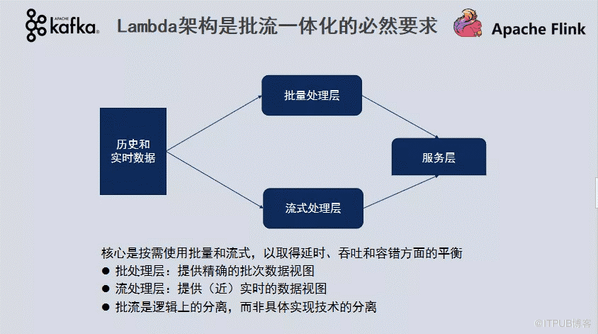
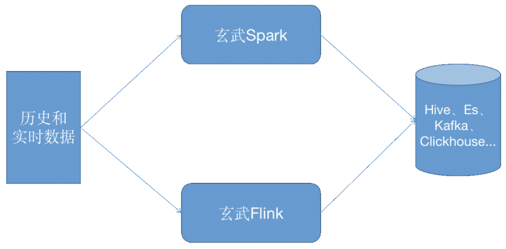
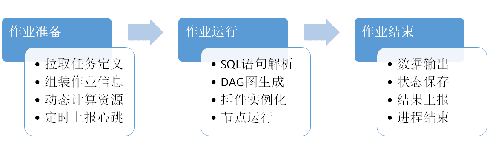
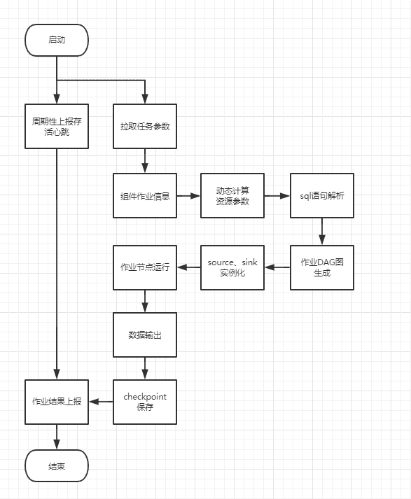

## [背景]()
随着业务上对于数据实时性要求越来越高，而传统strom、sparkStream以编程方式开发实时指标的具有较大难度，往往一个实时需求就需要30+工时/人，较难大规模推广与使用。
## [目标]()
建立一个流批一体的、sql化实时/离线指标开发的数据处理引擎。
## [业界实现方案]()
业界实现上，批处理用flink-batch-sql处理，流式处理以flink-stream-sql处理。

## [我们的方案]()
批处理使用定制化开发的SparkSQL引擎，流式处理以flink-stream-sql处理。注：玄武是项目名

## [方案对比]()
|   | 业界方案 | 我们方案 |
| --- | --- | --- |
| 批处理 | Flink | spark |
| 流处理 | Flink | flink |
| 开发方式 | sql | sql |
| 发布部署 | 较困难 | 简易 |
| 吞吐量 | 高 | 高 |
| 运维成本 | 高 | 低 |
| 支持数据源 | 5+ | 20+ |

## [实现细节]()
       计算引擎，以spark、flink为基础，以sql化为交互方式，扩展支持20+的数据源，实现了完整的SQL化流批一体的计算引擎。整个架构以自定义dag执行器为核心，可插拔的插件设计，可快速扩展source、sink及translate插件，丰富引擎能力。

### [sql]()解析
sql解析分为sparkSQL与flinkSQL双引擎，sql语句又可以细分为set语句、create table语句、create view语句和insert into语句，对应语句解析方式如下表。

|   | 玄武Spark | 玄武Flink |
| --- | --- | --- |
| set | 正则解析 | 正则解析 |
| create table | antlr4 | calcite |
| create view | antlr4 | calcite |
| insert into | antlr4 | calcite |

### [任务描述]()
spark任务或flink任务可拆解为三部分，source源定义、sink源定义以及转换逻辑，对应映射导sql语句中，可抽象为source源DDL、sink源DDL以及转换逻辑DML语句。如下所示：``
`-- 定义hive输入source源`
`CREATE TABLE source (`
`        *`
`) WITH (`
`   type = "hive",`
`   db_name ="dy_xxx",`
`   table_name = "xxx",`
`   partition_key = "dt",`
`        query = "dt='${bizdate_yyyyMMdd}'",`
`);`
`-- 定义odps输出sink源`
`CREATE TABLE sink (`
`    *`
`) WITH (`
`   type = "odps",`
`   cluster_name = "aliyun.odps",`
`   project_name = "dy_xxx",`
`   table_name = "xxx",`
`   partition_key = "dt",`
`   mode = "overwrite",`
`   create_partitions_from = "source",`
`);`
`-- 数据转换逻辑`
`INSERT INTO sink`
`select`
`*`
`from source;`

### [执行逻辑]()
引擎层运行逻辑包含三个阶段。作业准备阶段、作业运行阶段和作业结束阶段。作业准备阶段从后台服务拉取任务定义即玄武sql语句及集群配置，运行参数等。组装成完整的作业信息；作业运行阶段进行SQL解析组装成作业DAG图，根据DAG图中依赖的数据源进行插件实例化，然后提交整个DAG图运行；作业结束阶段将结果数据、状态信息checkpoint等进行保存及部分metric信息上报。

