## [1. 背景]()
日常工作中，数据处理是常见的工作内容之一，这类工作繁杂而多样，面对大量的数据处理任务，一站式的大数据开发平台将大大提升数据处理工作的效率，降低出错概率，提升人效。
## [2. 目标]()
建立一站式的大数据开发平台，提供数据处理任务开发、管理、调度、运维、监控等功能，并提供低门槛、低脚本、可视化的数据处理任务配置界面，提升数据处理任务的开发效率。
## [3. 业界实现方案]()
业界主流大数据开发平台都提供了任务开发、任务管理、任务调度、任务运维监控等功能，大多数产品提供了可视化的数据开发流程配置界面。

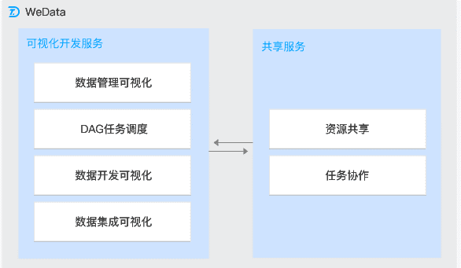
## [4. 我们的方案]()
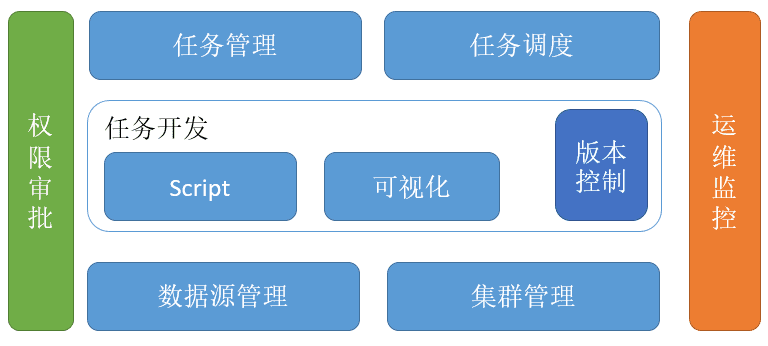
### 4.1 数据源管理
管理aliyun、hive、hwyun、kafka、、RMQ、ES、Redis、关系数据库等不同类型数据源，为用户提供提供统一的数据源管理界面

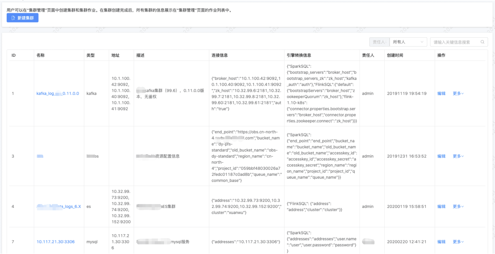

### 4.2 集群管理
管理不同的计算集群，为用户提供统一的集群管理界面

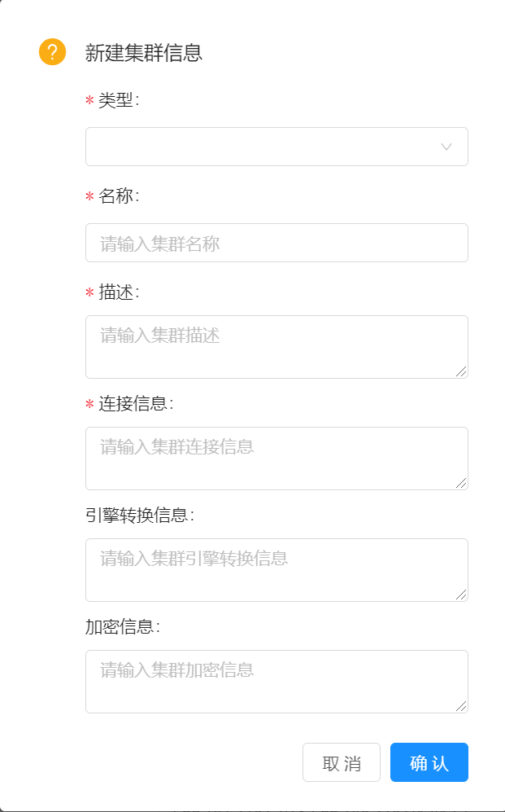

### 4.3 任务开发
提供脚本和可视化两种任务配置界面，并且提供任务版本管理功能

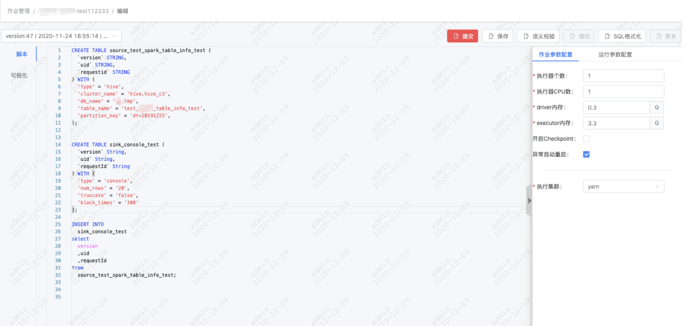

4.4 **任务管理**

提供统一的任务管理界面

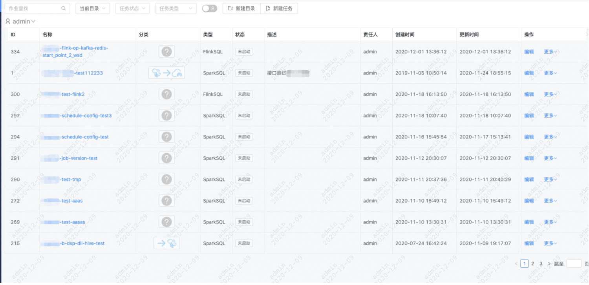

### 4.5 任务调度
为任务进行精细化的调度配置，包含任务执行时间、依赖、告警

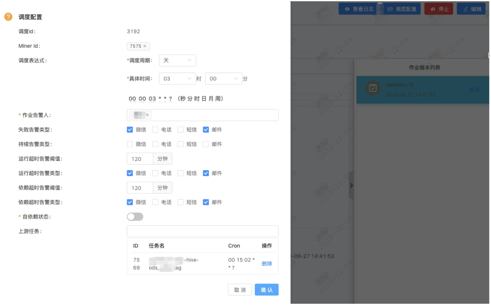

### 4.6 运维监控
提供统一的运维监控界面

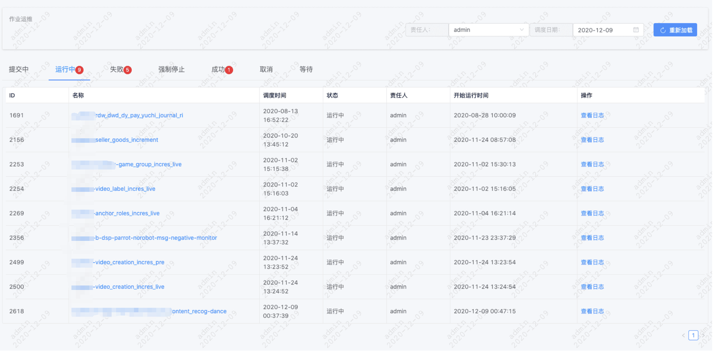

4.7 **权限审批**

提供统一的任务审批界面

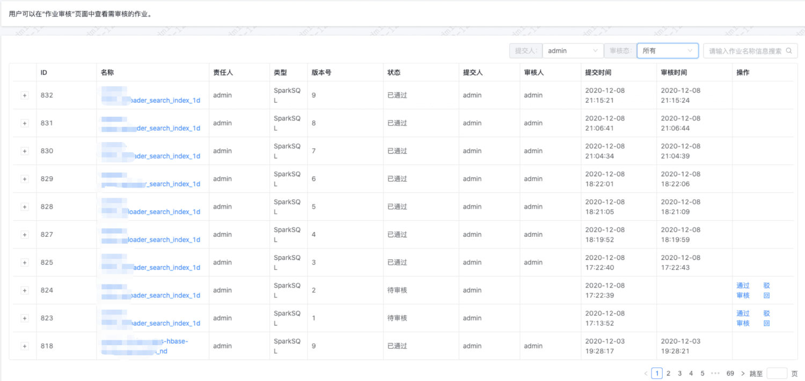

## [方案对比]()
|   | 业界方案 | 我们方案 |
| --- | --- | --- |
| 数据源管理功能/界面 | 无 | 有 |
| 集群管理功能/界面 | 无，单一集群 | 支持多种集群 |
| 开发方式功能/界面 | Sql、可视化 | Sql、可视化 |
| 版本控制功能/界面 | 无 | 有 |
| 任务管理功能/界面 | 有 | 有 |
| 任务调度功能/界面 | 有 | 有 |
| 运维监控功能/界面 | 有 | 有 |
| 权限审批功能/界面 | 无 | 有 |

## [实现细节]()

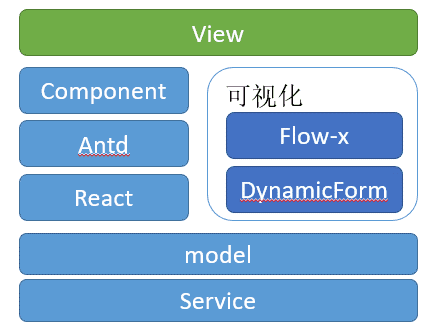
### [可视化数据流编辑器（]()Flow-x）
Flow-x是一款数据流开发通用前端组件，底层采用了antv-g6图分析可视化库，封装了一整套DAG编辑功能，封装了一整套数据流构建相关的交互逻辑，使用者不需要了解组件的内部实现，只需要通过几个简单api即可实现与Flow-x的交互。

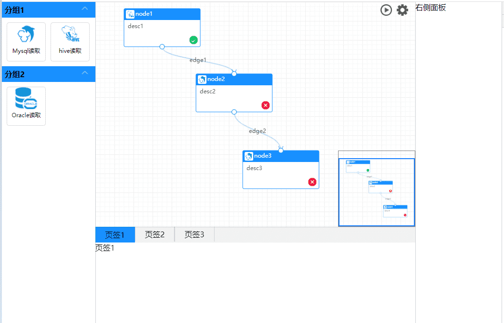
### [动态表单（]()DynamicForm）
DynamicForm是一款通用的前端表单组件，它只需要json元数据就能动态渲染出表单，具备表单校验、表单项级联查询、数据远程加载等能力。

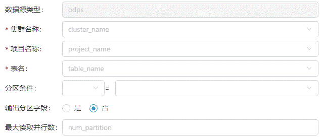

