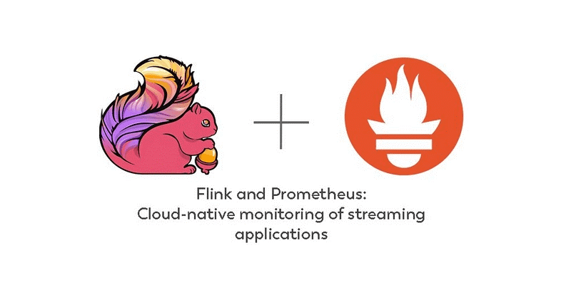
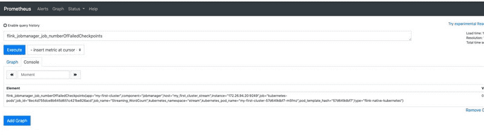
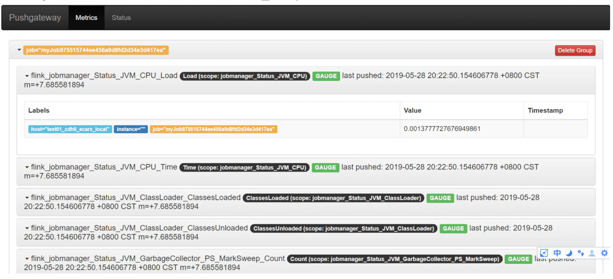
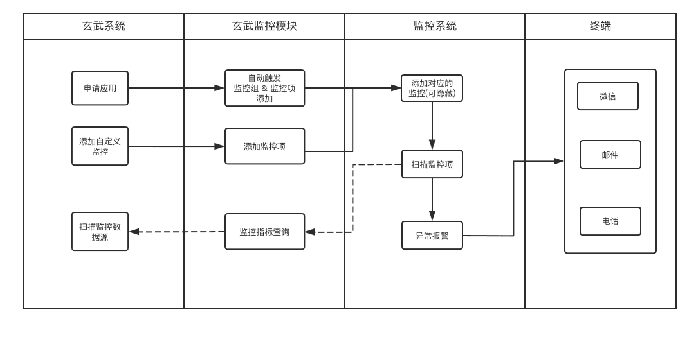
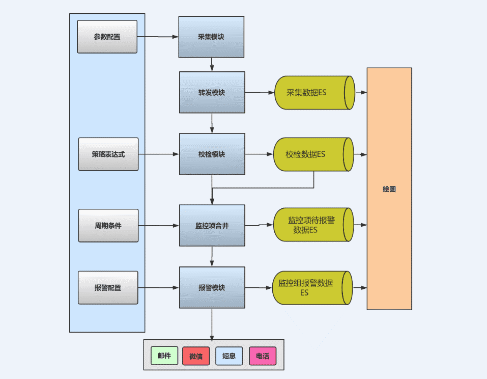

## [1. 背景]()
在实时业务决定用Flink框架后,  Flink业务是否健康, Flink集群是否稳定运行, Flink消费队列是否存在反压等等都是亟待解决的问题.
## [2. 目标]()
一套稳定的, 可视化的, 可定制指标的 集群监控方案;
## [3. 业界实现方案]()
目前官方推荐的flink运行指标收集以及默认解决方案是  prometheus





Flink 任务执行状态, 以及checkpoint状态都可以通过prometheus查询出来;



## [4. 我们的方案]()
Prometheus 因为没有专门维护人员, 以及存在单点问题, 在使用一段时间后, 弃用了;

最新的解决方案是用influxDB存储相关时序的运行指标数据;

相关监控利用已有的监控系统, 做到微信+邮件+电话全覆盖, 在默认常用监控项的基础上,可以自定义相关监控项, 做到监控项根据业务可扩展;



## [5. 方案对比]()
|   | 业界方案 | 我们方案 |
| --- | --- | --- |
| 支持自定义指标 | 否 | 是(得改上报点) |
| 可视化 | grafana | grafana |
| 常用指标自动添加 | 否 | 是 |

## [6. 实现细节]()



### 6.1 定时器扫描监控项；
为了实现水平扩展, 每个实例在启动后会注册到zk中, 成为zk中的有序子节点, 每个定时器实例根据mysql中配置的自增监控项id, 对定时器实例个数进行取余操作, 就实现了定时器实例的水平扩展, 每个定时器只扫描 指定余数的部分监控项;
注册zk方法:
```
public void registerCurrentNode() {
        //OceanConstant.PID_AT_HOST替换成应用id
        try {
            // 创建Agent节点
            if (null == curatorFramework.checkExists().forPath(MonitorConstants.ZK_PATH_AGENT)) {
                curatorFramework.create().creatingParentsIfNeeded()
                        .withMode(CreateMode.PERSISTENT).forPath(MonitorConstants.ZK_PATH_AGENT);
            }
            // Agent节点下创建当前应用节点
            if (null == curatorFramework.checkExists().forPath(getAgentPath())) {
                curatorFramework
                        .create()
                        .creatingParentsIfNeeded()
                        .withMode(CreateMode.EPHEMERAL)
                        .forPath(getAgentPath(),String.valueOf(0).getBytes(
                                        StandardCharsets.UTF_8));
            }
            // 初始化LeaderLatch
            initLeaderLatch();
            // 对Agent节点进行监听
            treeCache = new TreeCache(curatorFramework, MonitorConstants.ZK_PATH_AGENT);
            treeCache.getListenable().addListener(new TreeCacheListener() {
                @Override
                public void childEvent(CuratorFramework curatorFramework,
                        TreeCacheEvent treeCacheEvent) throws Exception {
                    if (!leaderLatch.hasLeadership()) {
                        return;
                    }
                    // 节点变化后对节点重新分配编号
                    if (TreeCacheEvent.Type.NODE_ADDED == treeCacheEvent
                            .getType()
                            || TreeCacheEvent.Type.NODE_REMOVED == treeCacheEvent
                                    .getType()) {
                        assignNumber();
                    }
                }
            });
            treeCache.start();
        } catch (Exception e) {
            log.error("register current node error, e : ", e);
        }
    }
```


统计注册节点个数:
```
/**
     * 对所有节点进行重新编号
     */
    private synchronized void assignNumber() {
        List<String> childNodePaths = new ArrayList<>();
        // 获取所有的子节点
        try {
            childNodePaths = curatorFramework.getChildren().forPath(
                    MonitorConstants.ZK_PATH_AGENT);
        } catch (Exception e) {
            log.error("get childredn error, e : ", e);
        }
        // 对所有节点从0开始分配编号
        int nodeNumber = 0;
        for (String cildNodePath : childNodePaths) {
            try {
                curatorFramework.setData().forPath(
                        MonitorConstants.ZK_PATH_AGENT + "/" + cildNodePath,
                        String.valueOf(nodeNumber).getBytes(
                                StandardCharsets.UTF_8));
            } catch (Exception e) {
                log.error("assign number error, node : {}", childNodePaths, e);
            }
            nodeNumber++;
        }
    }
    /**
     * 从Zookeeper中获取节点总数
     * 
     * @return 节点总数
     */
    private int getNodeTotalFromZk() {
        int nodeTotal = 1;
        try {
            nodeTotal = curatorFramework.getChildren().forPath(MonitorConstants.ZK_PATH_AGENT)
                    .size();
        } catch (Exception e) {
            log.error("get node total from zookeeper error, e : ", e);
        }
        return nodeTotal == 0 ? 1 : nodeTotal;
    }
    
    /**
     * 从Zookeeper节点中获取当前节点编号
     * 
     * @return 当前节点编号
     */
    public int getNodeNumberFromZk() {
        int nodeNumber = 0;
        try {
            String dataStr = new String(curatorFramework.getData().forPath(getAgentPath()),
                    StandardCharsets.UTF_8);
            nodeNumber = Integer.parseInt(dataStr);
        } catch (Exception e) {
            log.error("get node number from zookeeper error, e : ", e);
        }
        return nodeNumber;
    }
```


### 6.2 采集模块执行监控项对应程序进行数据采集，结果发送至转发模块；
转发模块对数据对象进行过滤，如异常则发送给开发人员报警，如正常进行下一步； 转发模块定时扫描步骤1中的内存队列, 将数据进行加工后存入es中
```
@Scheduled(cron = "20 * * * * ?")
    public void execute() {
        Map<Integer, TransferAlarmMsg> map = Maps.newHashMap();
        int len = Transfer.KING_QUEUE.size();
        try {
            while (len > 0) {
                len--;
                TransferAlarmMsg transferAlarmMsg = Transfer.KING_QUEUE.poll();
                if (null != transferAlarmMsg) {
                    Integer key = transferAlarmMsg.getItemId();
                    if (!map.containsKey(key)) {
                        map.put(key, transferAlarmMsg);
                    }
                }
            }
            if (MapUtils.isNotEmpty(map)) {
                ItemMonitor execute = SpringContextUtil.getBean(ItemMonitor.class);
                execute.execute(map);
            }
        } catch (Exception ignored) {}
    }
```


### 6.3 转发模块对数据对象进行过滤，如异常则发送给开发人员报警，如正常进行下一步；


### 6.4 发送数据rowkey至kafka消费等待校检，存储采集数据至ElasticSearch；
通过策略配置对采集数据进行校检，校检结果存入ElasticSearch；
校验这块主要根据JEXL表达式进行解析判断,达到了可自定义的检查的效果, 核心代码如下:
```
@Component
public class StringExpression implements ExpressionParse {
    
    /** 英文名 */
    private static final String EN_FIELD_NAME = "enName";
    
    /** 附件信息 */
    private static final String ADD_CONTENT_NAME = "{message}";
    /** 附件信息REGEX */
    private static final String ADD_CONTENT_REGEX = "\\{message=\"(.*)\"\\}";
    
    @Autowired
    private ItemService itemService;
    @Override
    public ValidateResultEntiy expression(CollectDataEntity colData, ItemStrategy itemStrategy) {
        //校验数据
        JudgeNeedAlarm judgeNeedAlarm = new JudgeNeedAlarm();
        judgeNeedAlarm.setIsOnlyJudgeExp(Boolean.FALSE);
        ValidatorExpEntity vaExpEntity = judgeNeedAlarm.judgeNeedAlarm(colData.getValueMap(), itemStrategy);
        ValidateResultEntiy vaResultEntiy = new ValidateResultEntiy(colData.getItemId());
        Date nowDate = new Date();
        //这里设定id与收集数据的id一致，方便后续一一对应查找
        vaResultEntiy.setId(colData.getId());
        vaResultEntiy.setItemName(itemStrategy.getItem().getName());
        vaResultEntiy.setCreateTime(nowDate);
        //date是Item-DataLoader执行的时间，如果数据异常，此时间为最准确时间
        vaResultEntiy.setValidateTime(colData.getEndExecTime());
        vaResultEntiy.setLevel(itemStrategy.getAlarmLevel());
        vaResultEntiy.setFlag(vaExpEntity.getFlag());
        vaResultEntiy.setExpression(vaExpEntity.getExpression());
        vaResultEntiy.setErrorMsg(vaExpEntity.getErrorMsg());
        vaResultEntiy.setNeedAlarm(vaExpEntity.getNeedAlarm());
        String alarmContent = setAlarmConttent(vaExpEntity.getAlarmContent(), colData.getAddContent());
        vaResultEntiy.setAlarmContent(alarmContent);
        return vaResultEntiy;
    }
    
    @Override
    public ValidatorExpEntity judgeExpression(ItemStrategy itemStrategy) {
        Integer itemId = itemStrategy.getItemId();
        ValidatorExpEntity vaExpEntity;
        Item item = itemService.findOne(itemId);
        Map<String, Double> valueMap = Maps.newHashMap();
        if (item !=null && StringUtils.isNotEmpty(item.getValueFieldNames())) {
            String valueFieldNames = item.getValueFieldNames();
            try {
                JSONArray queuesJsonArr = JSONArray.parseArray(valueFieldNames);
                for (int i=0 ; i < queuesJsonArr.size(); i++) {
                    JSONObject queuesJson = queuesJsonArr.getJSONObject(i);
                    String fieldName = queuesJson.getString(EN_FIELD_NAME);
                    valueMap.put(fieldName, 0.0);
                }
            } catch (Exception ignored) {}
            //校验数据
            JudgeNeedAlarm judgeNeedAlarm = SpringContextUtil.getBean(JudgeNeedAlarm.class);
            judgeNeedAlarm.setIsOnlyJudgeExp(Boolean.TRUE);
            vaExpEntity = judgeNeedAlarm.judgeNeedAlarm(valueMap, itemStrategy);
        } else {
            vaExpEntity = new ValidatorExpEntity(itemId);
            vaExpEntity.setFlag(0);
            vaExpEntity.setNeedAlarm(0);
            vaExpEntity.setErrorMsg("The Item is not exist，please check！");
        }
        return vaExpEntity;
    }
    /**
     * 对监控模板中附加信息进行置换
     *
     * @param alarmContent alarmContent
     * @return String
     */
    private static String setAlarmConttent(String alarmContent, String addCotent) {
        if (null == addCotent) {
            addCotent = StringUtils.EMPTY;
        }
        if (StringUtils.isBlank(alarmContent)) {
            return StringUtils.EMPTY;
        }
        try {
            alarmContent = alarmContent.replace(ADD_CONTENT_NAME, addCotent);
            String messageStr = CommonUtil.getValueByRegex(alarmContent, ADD_CONTENT_REGEX);
            if (StringUtils.isNotBlank(messageStr)) {
                String regex = CommonUtil.getValueByRegex(alarmContent, ADD_CONTENT_REGEX, 1);
                if (StringUtils.isNotBlank(regex)) {
                    String[] reArr = regex.split(MonitorConstants.COMMA);
                    int group = 0;
                    if (reArr.length > 1) {
                        group = Integer.parseInt(reArr[1]);
                    }
                    alarmContent = alarmContent.replace(messageStr, CommonUtil.getValueByRegex(addCotent, reArr[0], group));
                }
            }
        } catch (Exception ignored) {}
        return alarmContent;
    }
}
```


5. 通过策略配置对采集数据进行校检，校检结果存入ElasticSearch；

6. 每条数据校检完毕触发监控项周期性校检，如满足条件，生成报警内容，待报警内容存储入ElasticSearch；

7. 监控组通过定时扫描本组内的监控项是否需要报警，如发现，合并多个监控项的报警内容进行报警。


## 7. 相关自定义监控项Demo
kafka offset 监控部分代码
```
public class KafkaLagLoader extends BaseCronDataLoader {
    @FieldMeta(fieldName="Topic名称", name="topic", description="kafka topic name")
    private static String TOPIC = "topic"; 
    
    @FieldMeta(fieldName="消费组", name="groupId", description="consumer groupId")
    private static String GROUP_ID = "groupId";
    
    @FieldMeta(fieldName="Broker", name="broker", description="exa：10.32.99.6:9092,10.32.99.7:9092")
    private static String BROKER = "broker";
    @Override
    public void loadData(Item item) {
        try {
            Map map=JsonUtil.jsonStrToMap(item.getDataLoaderArgs());
            String topic = (String) map.get(TOPIC);
            String groupId = (String) map.get(GROUP_ID);
            String broker = (String) map.get(BROKER);
            Map<String, Double> result = KafkaApiLagUtil.getKafkaOffset(topic, groupId, broker);
            if (MapUtils.isEmpty(result)) {
                collectDataEntity.setExecFlag(TrueOrFalse.FALSE.getValue());
                collectDataEntity.setExecErrorContent("query kafka offset fail, please check kafka health!");
            } else {
                collectDataEntity.setValueMap(result);
                collectDataEntity.setAddContent("topic:" + topic + ",groupId:" + groupId);
            }
        } catch (Exception e) {
            collectDataEntity.setExecFlag(TrueOrFalse.TRUE.getValue());
            collectDataEntity.setExecErrorContent(e.toString());
            Map<String, Double> resultMap = Maps.newLinkedHashMap();
            resultMap.put(KafkaApiLagUtil.LOG_SIZE, -1d);
            resultMap.put(KafkaApiLagUtil.OFFSET, -1d);
            resultMap.put(KafkaApiLagUtil.LAG, -1d);
            collectDataEntity.setValueMap(resultMap);
        }
        sendDataIntoTransfer(item);
    }
    public static void main(String[] args) throws SocketTimeoutException {
        String brokers = "10.32.99.6:9092,10.32.99.7:9092,10.32.99.8:9092,10.32.99.60:9092,10.32.99.61:9092";
        String groupId = "msg_log_realtime";
        String topic = "msgstatLog";
        Map<String, Double> result = KafkaApiLagUtil.getKafkaOffset(topic, groupId, brokers);
        // System.out.println(result);
    }
}
```


指定prometheus 语句 监控代码
```
public class XXPrometheusLoader extends BaseCronDataLoader {
    @FieldMeta(fieldName = "URL", name = "url", isRequired = false, description = "可为空，默认为http://10.2.0.1:9090/api/v1/query")
    private static String URL = "url";
    @FieldMeta(fieldName = "Query", name = "query", description = "query 语句")
    private static String QUERY = "query";
    
    /**
     * 存储字段名
     */
    @FieldMeta(fieldName = "存储字段名前缀", name = "enFieldName", type = "text",
            onlyCreateEdit = true, isResultField = true, defaultVaule = "value",
            description="英文字段名:必须字母开头，只可包含大小写字母数字和下横杠（不可修改）")
    private static final String EN_RESULT = "enFieldName";
    private static final String URL_DEFAULT = "http://10.2.0.1:9090/api/v1/query";
    /**
     * 获取数据
     * 
     * @param item item
     */
    @Override
    public void loadData(Item item) {
        try {
            String dataLoaderArgs = item.getDataLoaderArgs();
            String query = getSingleExpressions(dataLoaderArgs);
            dataLoaderArgs = dataLoaderArgs.replace(query, StringUtils.EMPTY);
            Map map = JsonUtil.jsonStrToMap(dataLoaderArgs);
            String urlPre = (String) map.get(URL);
            String fieldName = (String) map.get(EN_RESULT);
            if (StringUtils.isBlank(fieldName)) {
                fieldName = "value";
            }
            if (StringUtils.isEmpty(query)) {
                return;
            }
            if (StringUtils.isBlank(urlPre)) {
                return;
            }
            urlPre = urlPre + "?query=%s";
            query = query.replaceAll("\\\\", "");
            String url = String.format(urlPre, URLEncoder.encode(query, StandardCharsets.UTF_8.name()));
            String content = HttpClientUtil.doGet(url);
            Map<String, Double> valueMap = Maps.newLinkedHashMap();
            Integer index = 0;
            if (StringUtils.isNotBlank(content)) {
                JSONObject json = JSONObject.parseObject(content);
                JSONArray jsonList = json.getJSONObject("data").getJSONArray("result");
                if (null != jsonList) {
                    Integer len = jsonList.size();
                    for (Integer i = 0 ; i < len; i++) {
                        JSONObject single = jsonList.getJSONObject(i);
                        String[] value = single.getString("value").split("\\[+|,\"|\"\\]+");
                        List<String> list = Arrays.asList(value);
                        if (len == 1) {
                            valueMap.put(fieldName, Double.valueOf(list.get(2)));
                        } else {
                            index++;
                            valueMap.put(fieldName + index, Double.valueOf(list.get(2)));
                        }
                    }
                }
            }
            collectDataEntity.setValueMap(valueMap);
            collectDataEntity.setAddContent(query);
            sendDataIntoTransfer(item);
        } catch (Exception ignored) {}
    }
    /**
     * 通过正则获取需要数值
     *
     * @param expressions expressions
     * @return String
     */
    private static String getSingleExpressions(String expressions) {
        if (StringUtils.isBlank(expressions)) {
            return StringUtils.EMPTY;
        }
        Pattern pattern = Pattern.compile("\"query\":\"(.*)\",");
        Matcher matcher = pattern.matcher(expressions);
        try {
            if (matcher.find()) {
                return matcher.group(1);
            }
        } catch (Exception ignored) {}
        return StringUtils.EMPTY;
    }
}
```


