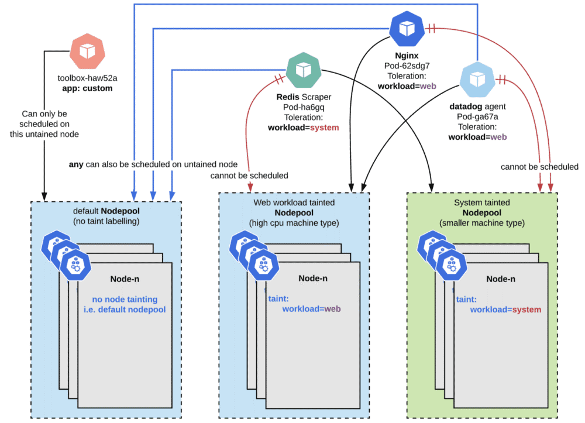

## [背景]()
实时业务的目标是较低的延时和高吞吐, 后台业务的目标是低延时和高并发; 因此实时业务和后台业务对宿主机的硬件需求也不同 ; 同时, 实时业务在内存用尽后, 会把数据溢写磁盘, 造成IO激增, 从而影响整个宿主机响应性能, 所以实时业务和后台业务在部署上应该做到完全独立, 避免互相影响.

在实时业务决定用Flink框架, 同时采用K8S集群方式部署后, 如何在不影响或少影响常规后台应用的情况下, 高效的管理和分配集群机器资源, 成为一个亟待解决的问题.

## [目标]()
一套基于k8s混合云的, 后台业务和实时业务 独立运行的, 宿主机可动态扩缩容的, 计算节点间尽量本机通信的方案;
## [业界实现方案]()
业界因为用的是yarn集群, 所以采用的都是Yarn的管理方案, 即Hadoop大集群维护管理

## [我们的方案]()
利用K8S节点Node的 label和 taint机制, 做到与常规后台服务app 分离部署;
简单的说将K8S大集群中分离一小部分高性能机器, 作为实时计算使用, 别的app应用不会调度到这部分机器中来, 实时应用也只会在这部分机器中运行, 不会调度到其它app机器中;

app应用与实时应用机器分离主要是出于如下几点考虑:
1. 实时应用有时会溢写磁盘, 影响宿主机IO, 从而会影响此宿主机所有程序的执行效率;
2. 后台app可能会存在高峰, 同样会导致实时任务运行缓慢, 不方便排查问题;
3. 实时任务对内存占用较大, 对cpu消耗不明显, 所以要求宿主机内存和cpu比例值更大, 目前, 线上使用64核, 256G内存的宿主机
## [实现细节]()




图为K8S 中taint和 label使用举例说明, 具体针对Flink实时任务, 我们是这样实现的


- 给实时计算宿主机分配taint为, fink-only=enable

```
  # 打污点
  kubectl taint nodes xxx fink-only=enable:NoSchedule
  # 取消污点
  kubectl taint nodes 10.32.168.1 fink-only-
```

- 给实时计算宿主机分配label为 , flink=enable

```
  # 打标签
  kubectl label nodes xxx flink=enable
  # 取消标签
  kubectl label node xxx flink-
```

- 所有flink应用(yaml)设置Toleration: flink-only=enable

```
  tolerations:
      - key: fink-only
        operator: Equal
        value: enable
```

- 所有flink应用(yaml)设置Label: flink=enable

```
        nodeAffinity:
         requiredDuringSchedulingIgnoredDuringExecution:
            nodeSelectorTerms:
            - matchExpressions:
              - key: flink
                operator: In
                values:
                - enable
```

- l  其他业务app, 不要设置flink-only=enable容忍


这样既可做到在大的K8S集群中, 独立划分一小块给实时任务运行使用;

