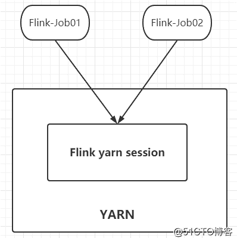
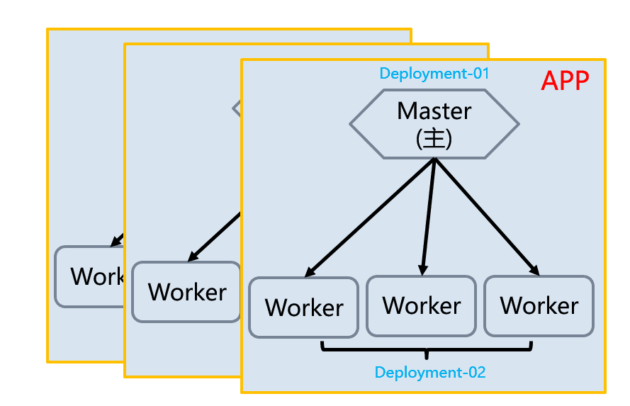
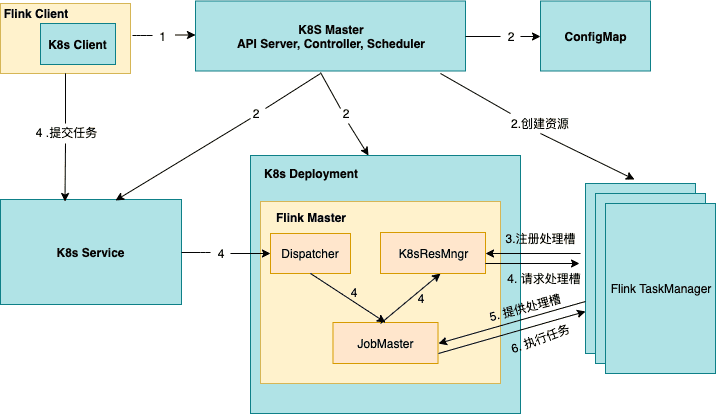
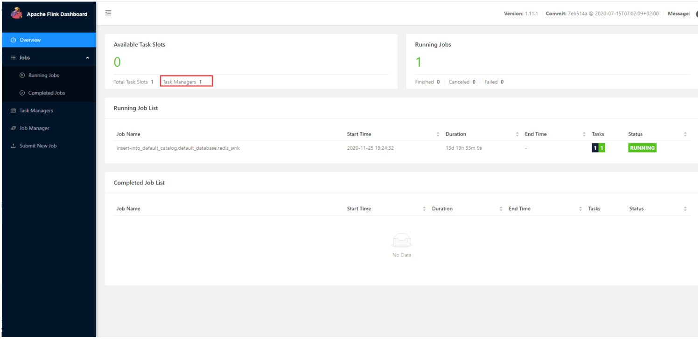
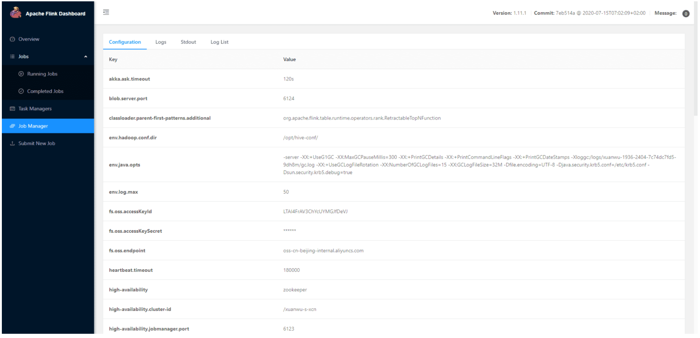

## [背景]()
在实时业务决定用Flink框架后,  Flink集群采用何种方式部署成了亟待解决的问题.
考虑目前架构主要是混合云为主, 因此如何灵活的在自建机房和公有云机房自建来回切换相关任务, 也是重要的考虑因素.
## [目标]()
一套方便扩容的, 运维简单的, 方便升级, 资源隔离的 集群方案;
## [业界实现方案]()
目前官方推荐的flink运行方式, 是基于yarn上的方案, 多个Flink-Job 运行在一个大的Yarn资源池中。

 

## [我们的方案]()
充分利用已存的容器平台, 在容器上建立集群, 把每个job当成一个独立的应用, 配合独立的Flink集群镜像, 做到任务级别的资源隔离;



## [方案对比]()
|   | 业界方案 | 我们方案 |
| --- | --- | --- |
| 支持混合云 | 否 | 是 |
| 资源隔离 | 否 | 是 |
| 开发方式         | 需要多个大集群 | 每个任务都可以配置不同Flink版本 |
| 发布部署 | 需要维护yarn大集群 | 简易 |
| 资源利用 | 高 | 每个任务会多浪费一个master资源 |
| 运维成本 | 方便查看整体资源消耗 | 无法查看集群水位 |
| 应用启动速度 | 快 | 需要新建立集群, 浪费30秒 |

[实现细节]()



如图所示

1. Flink提供了Kubernetes 模式的入口脚本 kubernetes-session.sh，当用户执行了该脚本之后，Flink 客户端会生成 Kubernets 资源描述文件，包括 FlinkMaster Service，FlinkMasterDeloyment，Configmap，Service并设置了owner reference，在 Flink 1.10 版本中，是将 FlinkMaster Service 作为其他资源的 Owner，也就意味着在删除 Flink 集群的时候，只需要删除 FlinkMaster service，其他资源则会被以及联的方式自动删除；

根据业务需求, 我们定制了Flink镜像，主要包括了连接Hadoop集群的认证信息, 以及阿里云日志的sdk包:
```
# Flink 基础镜像 Dockerfile
# 构建命令: docker build --network host -t hub.******.cn/flink/flink:1.11.1-scala-2.12-u200525  --file=Dockerfile .
FROM docker-registry1.******.com/java-centos:1.8_201_b09
RUN set -ex && \
   # 添加ssh
    yum install -y openssh-server openssh-clients jq && \
    sed -i 's/UsePAM yes/UsePAM no/g' /etc/ssh/sshd_config && \
    sed -i '/^#Host_Key/'d /etc/ssh/sshd_config && \
    sed -i '/^Host_Key/'d /etc/ssh/sshd_config && \
    echo 'HostKey /etc/ssh/ssh_host_rsa_key'>/etc/ssh/sshd_config && \
    ssh-keygen -q -t rsa -b 2048 -f /etc/ssh/ssh_host_rsa_key -N '' && \
    yum clean all
ARG FLINK_VERSION=1.11.1
ARG SCALA_VERSION=2.12
ENV FLINK_VERSION=${FLINK_VERSION} \
    SCALA_VERSION=${SCALA_VERSION} \
    FLINK_FILE_NAME=flink-${FLINK_VERSION}-bin-scala_${SCALA_VERSION}.tgz \
    FLINK_HOME=/opt/flink \
    PATH=$FLINK_HOME/bin:/usr/local/bin/:$PATH
# https://github.com/apache/flink-docker/blob/master/1.10/scala_2.12-debian/docker-entrypoint.sh
# wget -q https://mirrors.tuna.tsinghua.edu.cn/apache/flink/flink-${FLINK_VERSION}/${FLINK_FILE_NAME} -P /tmp 
# https://flink.apache.org/downloads.html
COPY dist \
    /tmp/
WORKDIR $FLINK_HOME
RUN set -ex && \
    yum -y install epel-release && yum -y install nginx && yum -y install net-tools vim wget pcre pcre-devel zlib zlib-devel openssl openssl-devel iproute net-tools iotop && \
    # tar -zxf /tmp/dist.tar.gz  -C  /tmp/   && \
    ls -alF /tmp/ && \
    # 添加gosu
    mkdir -p /usr/local/bin/ && \
    cp -f /tmp/system/gosu  /usr/local/bin/ && \
    chmod a+x /usr/local/bin/gosu && \
    gosu nobody true && \
    # 添加flink用户
    groupadd --system --gid=9999 flink && \
    useradd --system --home-dir $FLINK_HOME --uid=9999 --gid=flink flink  && \
    # 下载解压flink文件
    tar -xf /tmp/${FLINK_FILE_NAME}  -C $FLINK_HOME --strip-components=1  && \
    # 复制hive依赖
    cp -f /tmp/hive/*  $FLINK_HOME/lib/  && \
    # 删除自带默认conf
    rm -rf $FLINK_HOME/conf/* && \
    # 复制log依赖
    #rm -rf $FLINK_HOME/lib/log4j-*  $FLINK_HOME/lib/slf4j-* && \
    #cp -f /tmp/log/*.jar  $FLINK_HOME/lib/ && \
    #cp -f /tmp/log/*.xml  $FLINK_HOME/conf/ && \
    cp -f /tmp/log/*.properties  $FLINK_HOME/conf/ && \
    mkdir -p /opt/aliyunlog/ && \
    echo "xxxx" > /opt/aliyunlog/accessKeyId && \
    echo "xxxx" > /opt/aliyunlog/accessKeySecret  && \
    # 复制conf自定义配置
    cp -f /tmp/others/flink-conf.yaml  $FLINK_HOME/conf/ && \
    # 改用户
    chown -R flink:flink $FLINK_HOME && \
    # 添加入口函数
    cp -f /tmp/docker-entrypoint.sh  /  && \
    chmod a+x /docker-entrypoint.sh && \
    # 添加root远程连接
    sed -i 's/exec "\$@"/\/usr\/sbin\/sshd\nexec "\$@"/g' /docker-entrypoint.sh  && \
    echo 'root:xxxx..'|chpasswd  && \
    # 清理tmp
    yum clean all && \
    rm -rf /tmp/*
ENTRYPOINT ["/docker-entrypoint.sh"]
EXPOSE 6123 8081 22
CMD ["help"]
```

2. Kubernetes 收到来自 Flink 的资源描述请求后，开始创建FlinkMaster Service，FlinkMaster Deloyment，以及 Configmap 资源，从图中可以看到，伴随着 FlinkMaster 的创建，Dispatch 和 K8sResMngr 组件也同时被创建了，这里的 K8sResMngr 就是 Native 方式的核心组件，正是这个组件去和 Kubernetes API server 进行通信，申请 TaskManager 资源；当前，用户已经可以向Flink 集群提交任务请求了；
这里主要是对接了实时计算平台的配置信息，我们定义了配置模版，在启动时进行配置生成和替换：
cat /opt/flink/conf/flink-conf.yaml
```
taskmanager.numberOfTaskSlots: NUMBER_OF_TASK_SLOTS
blob.server.port: 6124
queryable-state.server.ports: 6125
taskmanager.rpc.port: 6122
jobmanager.memory.process.size: JM_HEAP_SIZE_MB
taskmanager.memory.process.size: TM_HEAP_SIZE_MB
env.log.max: 50
high-availability.jobmanager.port: 6123
high-availability: zookeeper
high-availability.zookeeper.quorum: 10.254.145.36:2181,10.254.145.37:2181,10.254.145.66:2181
high-availability.zookeeper.path.root: /flink/XUANWU_JOB_SIMPLE_NAME
high-availability.cluster-id: /XUANWU_JOB_NAME
high-availability.storageDir: oss://ocean-xuanwu/XUANWU_JOB_SIMPLE_NAME/recovery
# 设置RocksDB存储,并开启增量更新
state.backend: rocksdb
state.checkpoints.dir: oss://ocean-xuanwu/XUANWU_JOB_SIMPLE_NAME/checkpoints
state.savepoints.dir: oss://ocean-xuanwu/XUANWU_JOB_SIMPLE_NAME/savepoints
state.backend.incremental: true
# oss config
fs.oss.endpoint: oss-cn-beijing-internal.aliyuncs.com
fs.oss.accessKeyId: LOG_ACCESS_KEY_ID
fs.oss.accessKeySecret: LOG_ACCESS_KEY_SECRET
# InfluxDB
metrics.reporter.influxdb.factory.class: org.apache.flink.metrics.influxdb.InfluxdbReporterFactory
# 自定义属性scheme，参考Flink master分支, Flink 1.12官方支持
metrics.reporter.influxdb.scheme: https
metrics.reporter.influxdb.host: ts-2ze3dp5o7o7knh4xt.influxdata.tsdb.aliyuncs.com
metrics.reporter.influxdb.port: 8086
metrics.reporter.influxdb.db: xuanwu-flink
metrics.reporter.influxdb.username: xuanwu
metrics.reporter.influxdb.password: LWMRyY0FTcdQqoRdWY5glm4-FKtz7eTI
metrics.reporter.influxdb.connectTimeout: 60000
metrics.reporter.influxdb.writeTimeout: 60000
metrics.reporter.influxdb.interval: 30 SECONDS
# Hadoop config
security.kerberos.login.use-ticket-cache: true
security.kerberos.login.krb5: /etc/krb5.conf
security.kerberos.login.keytab: /opt/hive-conf/ocean_spark.keytab
security.kerberos.login.principal: ocean_spark
env.hadoop.conf.dir: /opt/hive-conf/
yml.config.enable: true
# network
taskmanager.network.request-backoff.max: 300000
akka.ask.timeout: 120s
# 所有的flink进程均应用此jvm options
env.java.opts: -server -XX:+UseG1GC -XX:MaxGCPauseMillis=300 -XX:+PrintGCDetails -XX:+PrintCommandLineFlags -XX:+PrintGCDateStamps -Xloggc:/logs/POD_NAME/gc.log -XX:+UseGCLogFileRotation -XX:NumberOfGCLogFiles=15 -XX:GCLogFileSize=32M -Dfile.encoding=UTF-8 -Djava.security.krb5.conf=/etc/krb5.conf -Dsun.security.krb5.debug=true
# TM sender 和receiver 的心跳超时时间
heartbeat.timeout: 180000
# 双亲委派加载白名单
classloader.parent-first-patterns.additional: org.apache.flink.table.runtime.operators.rank.RetractableTopNFunction
```


3. 用户通过 Flink client 向 Flink 集群提交任务，flink client 会生成 Job graph，然后和 jar 包一起上传；当任务提交成功后，JobSubmitHandler 收到了请求并提交给 Dispatcher并生成 JobMaster，JobMaster 用于向 KubernetesResourceManager 申请 task 资源；

相关启动脚本如下:
```
# 启动脚本
# jm启动命令 /usr/sbin/sshd; bash /opt/sql/submit.sh run -name xuanwu-s-xcn -url http://dataworks.ocean-web.com -s true -topic xuanwu-1936_1606303398; tail -f /dev/null
# tm启动命令 bash /opt/sql/submit.sh start-tm -name xuanwu-s-xcn -url http://dataworks.ocean-web.com -s true -topic xuanwu-1936_1606303398; tail -f
```

4. Kubernetes－Resource－Manager 会为 taskmanager生成一个新的配置文件，包含了 service 的地址，这样当 Flink Master 异常重建后，能保证 taskmanager 通过 Service 仍然能连接到新的 Flink Master；若发现任务无故失败, 则可查看slot个数



5. TaskManager 创建成功后注册到slotManager，这时 slotManager向TaskManager 申请 slots，TaskManager 提供自己的空闲 slots，任务被部署并运行。
相关配置是否生效可以查看Dashbord



另外, 我们还做了如下优化:

- Flink Master 作为独立的一个Deployment, 运行错误会自动重启;
- Flink TaskManager 作为独立的Deployment, 会根据业务的复杂程度配置多个 pod
- 相关配置ConfigMap以任务id为主键, 存储在玄武数据库中, 启动时自动拉取最新的配置,版本配置由玄武控制
- 相关webUI界面由K8S-Service暴露到 网关, 供探活监控等等使用


总体来说, 充分利用已有的容器集群资源,以及K8S概念, 以浪费一个master的资源, 换取维护集群的简便性以及资源隔离性, 保证业务稳定运行.