# 1. Linux平台安装Davinci

## 1.1 环境准备

- JDK 1.8（或更高版本）

- MySql5.5（或更高版本）


## 1.2 配置部署

### 1.2.1 初始化目录

将安装包davinci-assembly_0.3*.zip解压到安装目录，如：~/app/davinci

```bash
unzip -d ~/app/davinci davinci-assembly_0.3*.zip
```

解压后目录结构如下图所示：

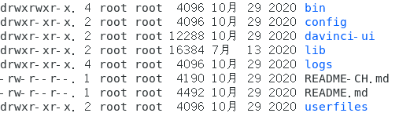

### 1.2.2 配置环境变量

将上述解压后的目录配置到环境变量DAVINCI3_HOME

```bash
export DAVINCI3_HOME=~/app/davinci
```

### 1.2.3 初始化数据库

登录MySQL，输入密码

```bash
mysql -h 主机名或IP地址 -P 端口号 -u 用户名 -p
```

创建数据库davinci3

```mysql
CREATE DATABASE davinci3;
```

进入davinci/bin目录，修改initdb.sh中的数据库信息为要初始化的数据库davinci3

```bash
mysql -h 主机名或IP地址 -P 端口号 -u 用户名 -p密码 davinci3 < %DAVINCI3_HOME%/bin/davinci.sql
```

运行脚本初始化数据库

```bash
sh initdb.sh
```

### 1.2.4 初始化配置

进入davinci/config目录，打开application.yml文件，修改server和datasource配置

注意：由于 Davinci 使用 ymal 作为应用配置文件格式，请务必确保每个配置项键后的冒号和值之间至少有一个空格

#### 1.2.4.1 server配置

修改server.address和server.port分别为IP地址和端口号

示例：

```yaml
server:
 protocol: http
 address: 127.0.0.1
 port: 8080

 access:
  address: 192.168.1.1
  port: 80
```

server 配置如上示例所示，server.access.address和server.access.port表示真实访问地址和端口，默认不开启，其值默认为server.address和server.port

如在虚拟主机上部署 Davinci，启动端口为8080，该主机真实访问IP地址为192.168.1.1，要将虚拟主机的8080端口映射到80端口，则需打开 access 配置项，否则将不能正常使用 Davinci 的部分功能，如激活账号、下载、分享等

#### 1.2.4.2 datasource 配置

这里的 datasource 配置指 Davinci 系统的数据源，配置如下：

```yaml
spring:
 datasource:
  url: jdbc:mysql://主机名或IP地址:端口号/davinci3?useUnicode=true&characterEncoding=UTF-8&zeroDateTimeBehavior=convertToNull&allowMultiQueries=true
  username: 用户名
  password: 密码
```

将2.2.3中初始化的数据库dvinci3地址配置到url中，url中的参数不要做任何修改，然后修改正确的数据库访问用户和密码即username和password，initial-size、min-idle、max-wait、max-active是连接池参数

## 1.3 启动和关闭服务

进入davinci/bin目录，运行start-server.sh文件

```bash
sh start-server.sh
```

打开浏览器，在地址栏输入在application.yml文件中配置的server地址和端口，跳转到登录页面，服务启动成功

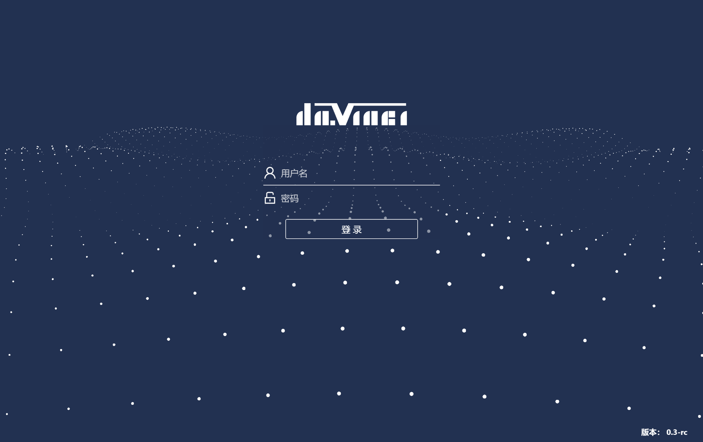

运行stop-server.sh文件，关闭服务

```bash
sh stop-server.sh
```

# 2. Windows平台安装Davinci

## 2.1 环境准备

- JDK 1.8（或更高版本）

- MySql5.5（或更高版本）


## 2.2 配置部署

### 2.2.1 初始化目录

将安装包解压到安装目录，如：C:\Davinci，解压后目录结构如下图所示：

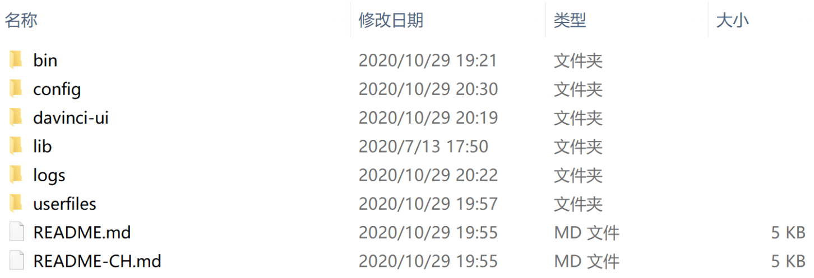

### 2.2.2 配置环境变量

右键单击“此电脑”图标，点击“属性”，在左侧选择“高级系统设置”

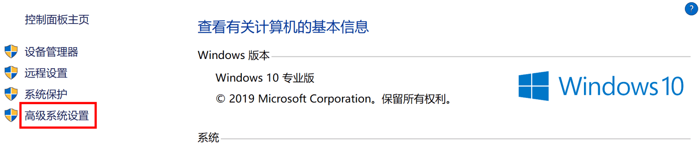

在“高级”选项卡下点击“环境变量”

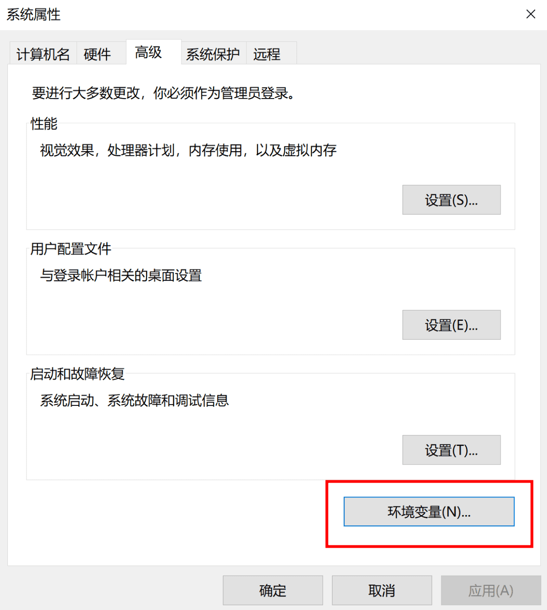

在“系统变量”下点击“新建”

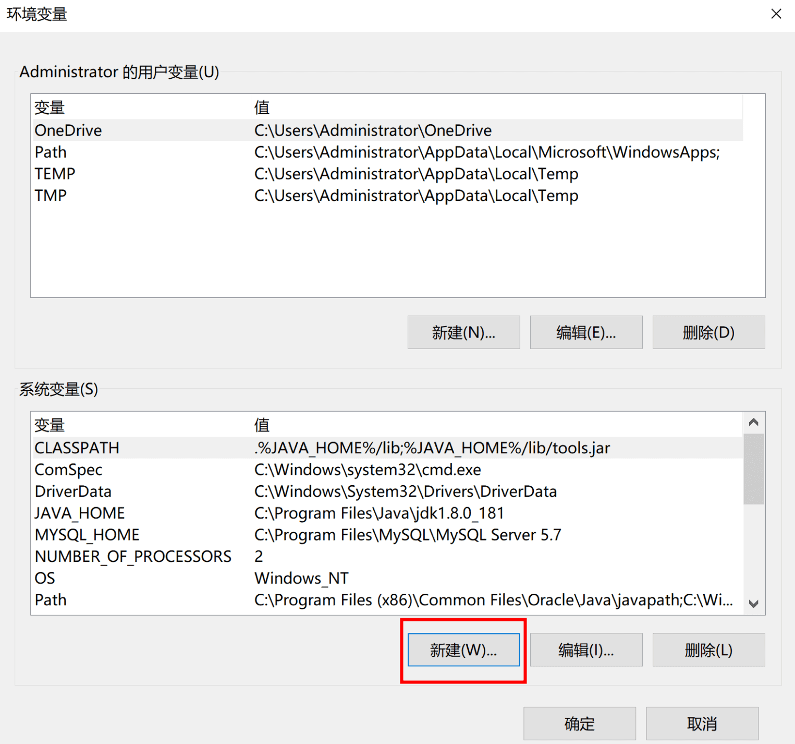

将1.2.1中解压后的目录配置到环境变量DAVINCI3_HOME，点击“确定”返回


在“系统变量”下双击“Path”变量，打开编辑页面

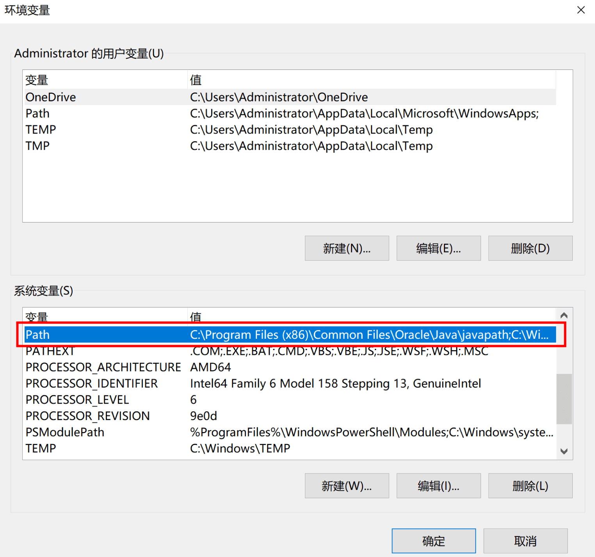

双击空白栏，添加路径“%DAVINCI3_HOME%\bin”，点击“确定”返回

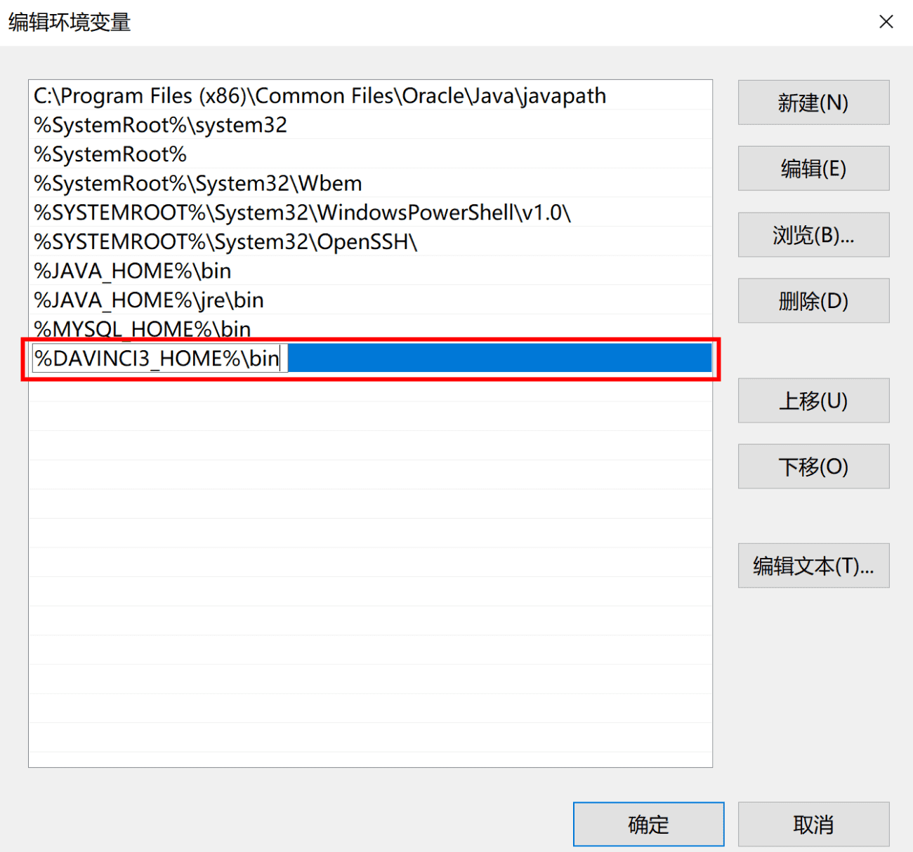

### 2.2.3 初始化数据库

打开命令提示符界面，登录MySQL，输入密码

```
mysql -h 主机名或IP地址 -P 端口号 -u 用户名 -p
```

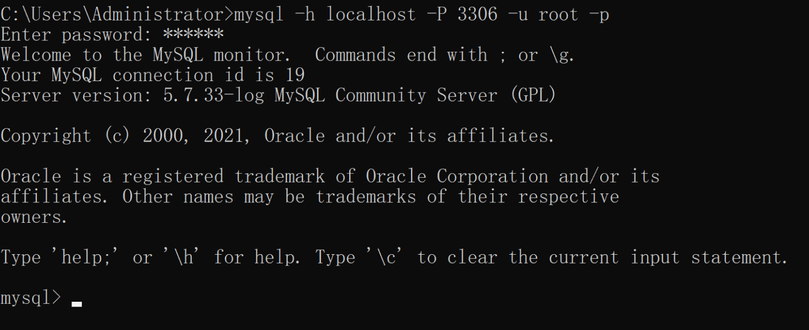

创建数据库davinci3

```mysql
CREATE DATABASE davinci3;
```

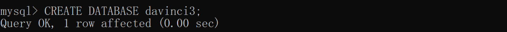

打开安装目录下bin文件夹，右键单击initdb.bat文件，选择“编辑”

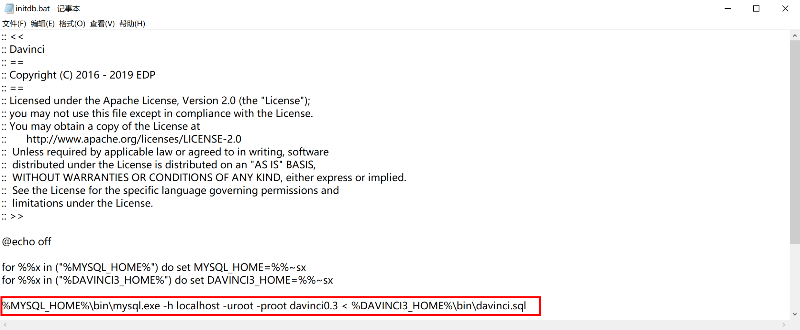

修改文件中的数据库信息为要初始化的数据库davinci3

```
%MYSQL_HOME%\bin\mysql.exe -h 主机名或IP地址 -P 端口号 -u 用户名 -p密码 davinci3 < %DAVINCI3_HOME%\bin\davinci.sql
```

双击initdb.bat文件运行脚本初始化数据库

### 2.2.4 初始化配置

打开安装目录下config文件夹中的application.yml文件，修改server和datasource配置

注意：由于 Davinci 使用 yaml作为应用配置文件格式，请务必确保每个配置项键后的冒号和值之间至少有一个空格

#### 2.2.4.1 server配置

修改server.address和server.port分别为访问IP地址和端口号

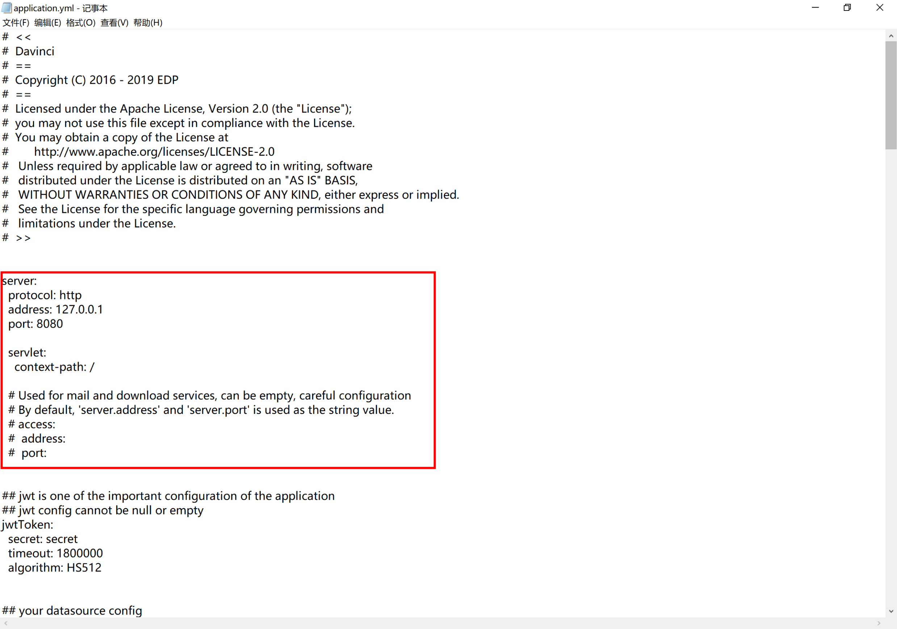

示例：

```yaml
server:
 protocol: http
 address: 127.0.0.1
 port: 8080

 access:
  address: 192.168.1.1
  port: 80
```

server 配置如上示例所示，server.access.address和server.access.port表示真实访问地址和端口，默认不开启，其值默认为server.address和server.port

如在虚拟主机上部署 Davinci，启动端口为8080，该主机真实访问IP地址为192.168.1.1，要将虚拟主机的8080端口映射到80端口，则需打开 access 配置项，否则将不能正常使用 Davinci 的部分功能，如激活账号、下载、分享等

#### 2.2.4.2 datasource 配置

这里的 datasource 配置指 Davinci 系统的数据源，配置如下：

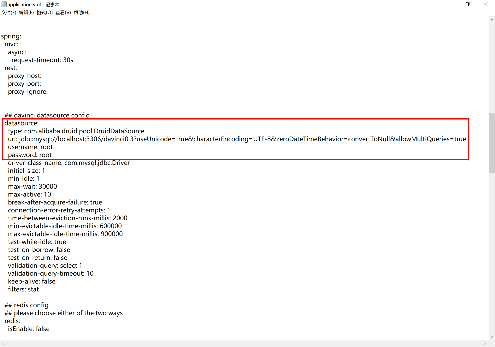

将1.2.3中初始化的数据库dvinci3地址配置到url中，url中的参数不要做任何修改，然后修改正确的数据库访问用户和密码即username和password，initial-size、min-idle、max-wait、max-active是连接池参数

```yaml
spring:
 datasource:
  url: jdbc:mysql://主机名或IP地址:端口号/davinci3?useUnicode=true&characterEncoding=UTF-8&zeroDateTimeBehavior=convertToNull&allowMultiQueries=true
  username: 用户名
  password: 密码
```

## 2.3 启动和关闭服务

打开安装目录下bin文件夹，双击start.bat文件，弹出运行窗口，显示如下执行结果

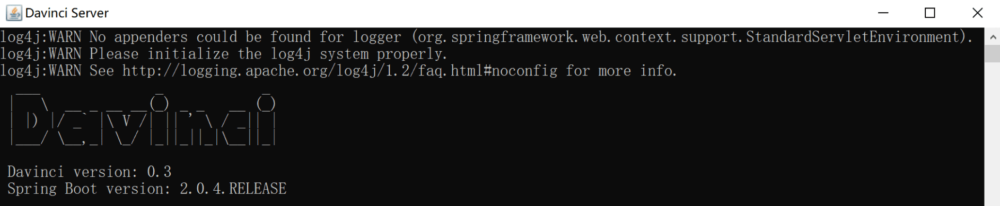

打开浏览器，在地址栏输入在application.yml文件中配置的server地址和端口，跳转到如下登录页面，服务启动成功


双击安装目录下bin文件夹中stop.bat文件，关闭服务

