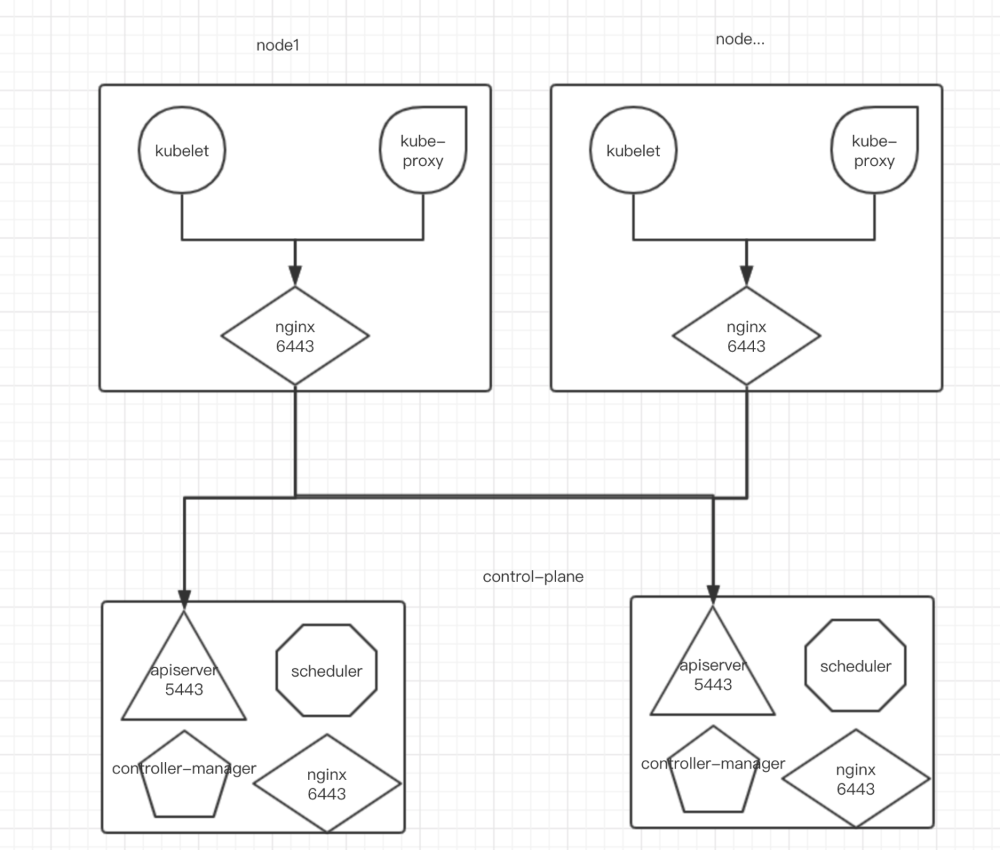
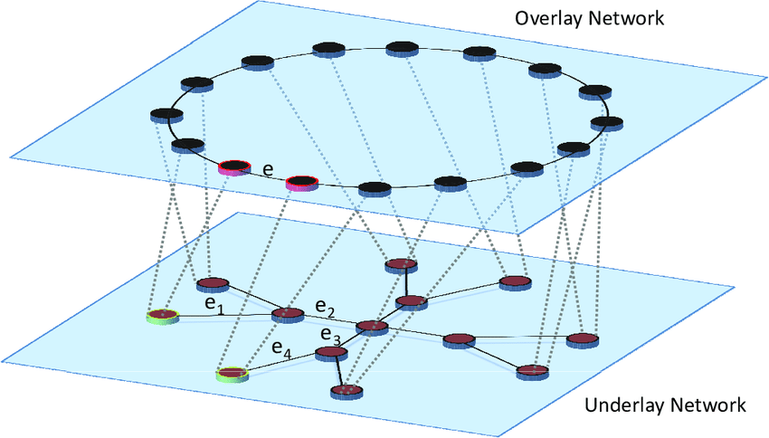

Kubernetes作为容器应用的管理中心，通过对Pod的数量进行监控，并且根据主机或容器失效的状态将新的Pod调度到其他Node上，实现了应用层的高可用性。针对Kubernetes集群，高可用性还应包含以下两个层面的考虑：ETCD数据存储的高可用性和Kubernetes Master组件的高可用性。
# 一、环境准备
最小的搭建环境建为 7 台服务器，每台服务器配置至少为 4 核心 8G 内存，其他软件配置如下：

- OS version: CentOS 7.8
- Kubeadm version: 1.18
- Kubernetes version: 1.18
# 二、服务器节点角色
**Master:** K8S主节点，负责K8S内部分布式协调。不用来运行其它应用程序；

**Worker: **承载用户的应用程序；

**Gateway: **仅部署Ingress-Controller服务，作为整个集群的流量入口；

| **服务器节点编号** | **角色** |
| --- | --- |
| node-1 | Master |
| node-2 | Master |
| node-3 | Master |
| node-4 | Worker |
| node-5 | Worker |
| node-6 | Worker |
| node-7 | Gateway |
| node-8 | Gateway |

# 二、高可用方案介绍
## 部署方案
目前的 HA 方案与官方的不同，官方 HA 方案推荐使用类似 haproxy 等工具进行 4 层代理 apiserver，但是同样会有一个问题就是我们还需要对这个 haproxy 做 HA；在集群服务数量总数比较小的情况下单独弄 2 台 haproxy + keeplived 去维持这个 apiserver LB 的 HA 资源过于浪费。

本方案将外部 apiserver 的 4 层 LB 前置到每个 node 节点上。每个 node 节点上部署 nginx 4 层代理所有 apiserver，nginx 本身资源消耗低而且请求量不大，综合来说对宿主机影响很小。

**高可用架构图：**

## 网络方案
整个集群网络采使用 Calico 或者 Flannel 组成 Overlay 网络，无需关心底层网络拓扑结构。

# 三、服务器环境初始化
[ 服务器初始化（CentOS7）](https://www.yuque.com/sartner/sd94ah/iq8hps)

# 四、集群安装
## 4.1、主节点
[Kubernetes v1.18 高可用模式搭建](https://www.yuque.com/sartner/sd94ah/gygfh7)
## 4.2、工作节点
[Kubernetes v1.18 高可用模式搭建 - 安装工作节点](https://www.yuque.com/sartner/sd94ah/gygfh7#86080d2b)

## 4.3、网关节点
可以使用 Traefk 或者 Nginx 搭建 Ingress-Controller

- [Traefik 方案](https://www.yuque.com/sartner/sd94ah/hrfcoy)
- [Nginx 方案 - 不支持4层负载均衡](https://www.yuque.com/sartner/sd94ah/udppgo)
# 五、集群监控
[Kubernetes Dashboard](https://www.yuque.com/sartner/sd94ah/yuwkfx)

[使用 kube-prometheus 监控集群状态](https://www.yuque.com/sartner/sd94ah/bnc8gr)