# 一、背景
当企业IT建设容器云平台时，会碰到一系列的挑战，根据CNCF的调查报告指出，容器的网络和安全实现成为容器云平台建设最主要的挑战，当企业开始将重要的企业核心应用迁移至容器平台，缺乏足够的网络和安全管控将会给业务上线带来潜在的巨大威胁。

除了容器网络安全，如何更好的链接不同Kubernetes集群孤岛，如何链接异构容器云平台，这些都是一系列的网络问题需要考虑。

## 1.1 为什么需要Overlay Network
为了不影响隔离性并实现容器间的网络通信，Docker通过虚拟网桥“连接”容器，使容器得以像物理节点一样经过“交换机”通讯。Docker在宿主机上创建名为docker0的虚拟网桥，对于每一个创建的容器均创建一对虚拟网卡设备，其中一端在docker0，另一端映射到容器内的eth0，并对容器内网卡分配一个容器网络IP。通过这一对虚拟网卡，容器就相当于“连接”到网桥上，虚拟网卡接在网桥上时只负责接受数据包，不再调用网络协议栈进行处理，因此只具有类似端口的作用。当容器A要访问容器B时，只需要广播ARP协议，通过docker0转发请求到对应”端口”，就实现了数据的转发。


然而，虽然虚拟网桥解决了同一宿主机下的容器间通信问题，以及容器与外部世界之间的通信，但是跨节点的容器通信依然存在问题。集群中每个节点的docker0都是独立的，不同节点分配的容器IP之间存在冲突的可能，因此需要有一个具有全局视角的上层网络以实现跨节点的容器网络，这便是Overlay Network解决方案的由来。

# 二、实现方案

## 2.1 Flannel 容器网络

### 2.1.1 **Flannel 容器集群网络方案的出现** 
Flannel是由CoreOS提出的跨主通信容器网络解决方案，通过分配和管理全局唯一容器IP以及实现跨组网络转发的方式，构建基于Overlay Network的容器通信网络。作为最早出现的网络编排方案，Flannel是最简单的集群编排方案之一，为容器跨节点通信提供了多种网络连接方式，后续很多插件的方案也是基于Flannel的方案进行扩展。

Flannel的框架包含以下组件：每个节点上的代理服务flanneld，负责为每个主机分配和管理子网；全局的网络配f置存储etcd（或K8S API）负责存储主机和容器子网的映射关系；多种网络转发功能的后端实现。本文主要介绍三种最常见的模式：UDP、VXLAN和Host-gateway（以下简称host-gw）。

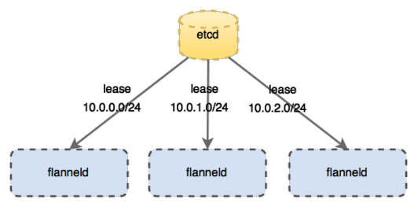

Flannel在Kubernetes集群中的架构图

### 2.1.2 **Flannel数据转发模式之UDP** 
UDP是与Docker网桥模式最相似的实现模式。不同的是，UDP模式在虚拟网桥基础上引入了TUN设备（flannel0）。TUN设备的特殊性在于它可以把数据包转给创建它的用户空间进程，从而实现内核到用户空间的拷贝。在Flannel中，flannel0由flanneld进程创建，因此会把容器的数据包转到flanneld，然后由flanneld封包转给宿主机发向外部网络。

UDP转发的过程为：Node1的container-1发起的IP包（目的地址为Node2的container-2）通过容器网关发到docker0，宿主机根据本地路由表将该包转到flannel0，接着发给flanneld。Flanneld根据目的容器容器子网与宿主机地址的关系（由etcd维护）获得目的宿主机地址，然后进行UDP封包，转给宿主机网卡通过物理网络传送到目标节点。在UDP数据包到达目标节点后，根据对称过程进行解包，将数据传递给目标容器。

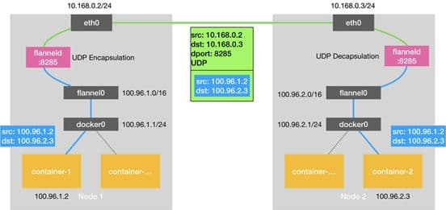

UDP模式工作模式图

UDP模式使用了Flannel自定义的一种包头协议，实现三层网络Overlay网络处理跨主通信的问题。但是由于数据在内核和用户态经过了多次拷贝：容器是用户态，docker0和flannel0是内核态，flanneld是用户态，最终又要通过内核将数据发到外部网络，因此性能损耗较大，对于有数据传输有要求的在线业务并不适用。

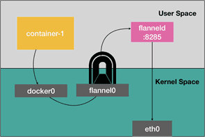

UDP模式数据包的传递过程

### 2.1.3 **Flannel数据转发模式之VXLAN** 
如果要进行性能优化，就需要减少用户态与内核态之间的数据拷贝，这就是VXLAN模式解决的问题。VXLAN的核心在于在三层网络的基础上构建了二层网络，使分布在不同节点上的所有容器在这个虚拟二层网络下自由通信。二层虚拟网络通过VXLAN在宿主机上创建的VTEP设备（flannel.1）实现，flannel.1和flanneld一样负责封包解包工作，不同的是flannel.1的封解包对象是二层数据帧，在内核中完成。

VXLAN的转发过程为：Node1的容器container-1发出的数据包经过docker0，路由给VTEP设备。每个在flannel网络中的节点，都会由flanneld维护一张路由表，指明发往目标容器网段的包应该经过的VTEP设备IP地址。Node1的VTEP会获得数据包应该发向Node2的VTEP设备的IP，并通过本地的ARP表知道目的VTEP设备的MAC地址，然后封装在数据包头部构成二层数据帧并再加上VXLAN头，标识是由VTEP设备处理的数据帧。另外，flannel会维护转发数据库FDB，记录目标VTEP的MAC地址应该发往的宿主机（也就是Node2），宿主机网卡将封装为外部网络传输的包转发到Node2。数据帧在Node2上解封后，宿主机会识别VXLAN头部，直接在内核拆包，然后转发到目标VTEP设备并转到对应容器。

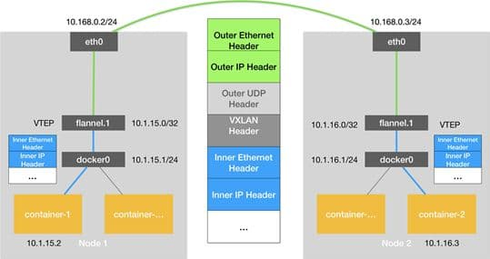

VXLAN模式工作模式图

作为Flannel中最被普遍采用的方案，VXLAN采用的是内置在Linux内核里的标准协议，因此虽然封包结构比UDP模式复杂，但装包和解包过程均在内核中完成，实际的传输速度要比UDP模式快许多。较快的传输速度和对底层网络的可兼容性也使得VXLAN适用性较其他模式更高，成为业务环境下的主流选择。

### 2.1.4 **Flannel数据转发模式之Host-gw** 
除去上述两种模式外，Flannel还提供了一种纯三层网络模式host-gw。顾名思义，host-gw是一种主机网关模式，每个主机会维护一张路由表，记录发往某目标容器子网的数据包的下一跳IP地址（也就是子网所在宿主机的IP）。宿主机将下一跳目的主机的MAC地址作为目的地址，通过二层网络把包发往目的主机。目的主机收到后，会直接转发给对应容器。所以host-gw模式下，数据包直接以容器IP包的形式在网络中传递，每个宿主机就是通信链路中的网关。


Host-Gateway模式工作模式图

和其他两种模式相比，host-gw模式少了额外的封包和拆包过程，效率与虚拟机直接的通信相差无几。但是，该模式要求所有节点都在物理二层网络中联通，且每个主机都需要维护路由表，节点规模较大时有较大的维护压力，因此不适用复杂网络。

### 2.1.5 **Flannel性能测试** 

目前UDP模式由于其性能问题已基本被弃用，因此对于三层物理网络首选VXLAN模式，而二层网络VXLAN和host-gw均可选用。为了测试VXLAN和host-gw在二层网络下性能，我们在实验子网内对两种模式进行了性能对比，以便更好的根据场景选择模式。我们从带宽和转发吞吐量两个方面考察性能，选择了IPerf和netperf两种网络性能测试工具。

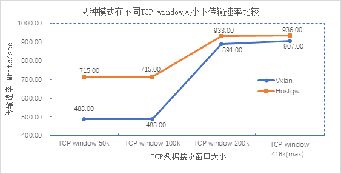

两种模式在不同TCP window大小下的传输速率比较

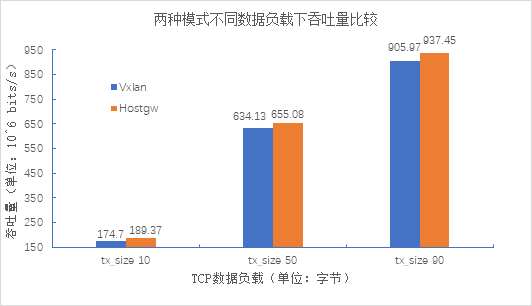

两种模式不同数据负载下的吞吐量比较

根据上面两张测试数据可以得出：

1. 在TCP数据接收窗口相同的情况下，host-gw平均传输速度更快，比VXLAN快约20%，实验环境下最终趋于相近的速率；
1. host-gw的平均吞吐量较VXLAN模式高出约5%。由此可见，对于小规模集群、二层网络下的通信，可以优先选择host-gw；而大规模集群、三层网络下的通信更适合走VXLAN模式。

### 2.1.6 **Flannel出现后网络编排方案的发展** 

Flannel作为最早的跨网络通信解决方案，提供了自动化简单的策略，可以满足一般情况下的跨节点容器通信。市场上的云服务商如CDK Global、Ranchor、Platform9等都选择在支持其他方案的基础上保留了Flannel，足以见其在容器网络通信的适用性。作为容器网络解决方案的先驱者，Flannel和其他企业级开源解决方案如Calico、Weave等一同驱动了网络方案发展。

## 2.2 Calico 容器网络
**项目地址：** [https://github.com/projectcalico/calico](https://github.com/projectcalico/calico)


Calico是Kubernetes生态系统中另一种流行的网络选择。虽然Flannel被公认为是最简单的选择，但Calico以其性能、灵活性而闻名。Calico的功能更为全面，不仅提供主机和pod之间的网络连接，还涉及网络安全和管理。Calico CNI插件在CNI框架内封装了Calico的功能。

在满足系统要求的新配置的Kubernetes集群上，用户可以通过应用单个manifest文件快速部署Calico。如果您对Calico的可选网络策略功能感兴趣，可以向集群应用其他manifest，来启用这些功能。

尽管部署Calico所需的操作看起来相当简单，但它创建的网络环境同时具有简单和复杂的属性。与Flannel不同，Calico不使用overlay网络。相反，Calico配置第3层网络，该网络使用BGP路由协议在主机之间路由数据包。这意味着在主机之间移动时，不需要将数据包包装在额外的封装层中。BGP路由机制可以本地引导数据包，而无需额外在流量层中打包流量。

除了性能优势之外，在出现网络问题时，用户还可以用更常规的方法进行故障排除。虽然使用VXLAN等技术进行封装也是一个不错的解决方案，但该过程处理数据包的方式同场难以追踪。使用Calico，标准调试工具可以访问与简单环境中相同的信息，从而使更多开发人员和管理员更容易理解行为。

除了网络连接外，Calico还以其先进的网络功能而闻名。 网络策略是其最受追捧的功能之一。此外，Calico还可以与服务网格Istio集成，以便在服务网格层和网络基础架构层中解释和实施集群内工作负载的策略。这意味着用户可以配置强大的规则，描述pod应如何发送和接受流量，提高安全性并控制网络环境。

如果对企业的环境而言，支持网络策略是非常重要的一点，而且企业对其他性能和功能也有需求，那么Calico会是一个理想的选择。此外，如果您现在或未来有可能希望得到技术支持，那么Calico是提供商业支持的。一般来说，当企业希望能够长期控制网络，而不是仅仅配置一次并忘记它时，Calico是一个很好的选择。

**适用场景** ：k8s环境中的pod之间需要隔离

**设计思想** ：Calico 不使用隧道或 NAT 来实现转发，而是巧妙的把所有二三层流量转换成三层流量，并通过 host 上路由配置完成跨 Host 转发。

### 2.2.1 Calico组件
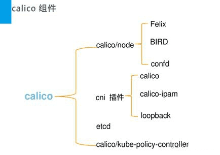

calico包括如下重要组件：Felix，etcd，BGP Client，BGP Route Reflector。下面分别说明一下这些组件。

Felix：主要负责路由配置以及ACLS规则的配置以及下发，它存在在每个node节点上。

etcd：分布式键值存储，主要负责网络元数据一致性，确保Calico网络状态的准确性，可以与kubernetes共用；

BGPClient(BIRD), 主要负责把 Felix写入 kernel的路由信息分发到当前 Calico网络，确保 workload间的通信的有效性；

BGPRoute Reflector(BIRD), 大规模部署时使用，摒弃所有节点互联的mesh模式，通过一个或者多个 BGPRoute Reflector 来完成集中式的路由分发；

### 2.2.2 Calico 架构
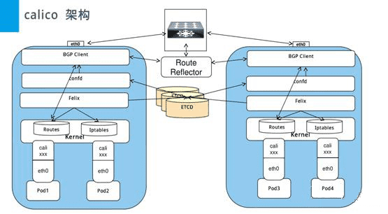

由于Calico是一种纯三层的实现，因此可以避免与二层方案相关的数据包封装的操作，中间没有任何的NAT，没有任何的overlay，所以它的转发效率可能是所有方案中最高的，因为它的包直接走原生TCP/IP的协议栈，它的隔离也因为这个栈而变得好做。因为TCP/IP的协议栈提供了一整套的防火墙的规则，所以它可以通过IPTABLES的规则达到比较复杂的隔离逻辑。

### 2.2.3 Calico 原理
下图描述了从源容器经过源宿主机，经过数据中心的路由，然后到达目的宿主机最后分配到目的容器的过程。

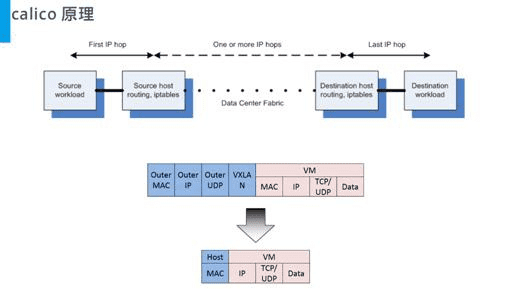

整个过程中始终都是根据iptables规则进行路由转发，并没有进行封包，解包的过程，这和flannel比起来效率就会快多了。

### 2.2.4 Calico**跨主机通信** 

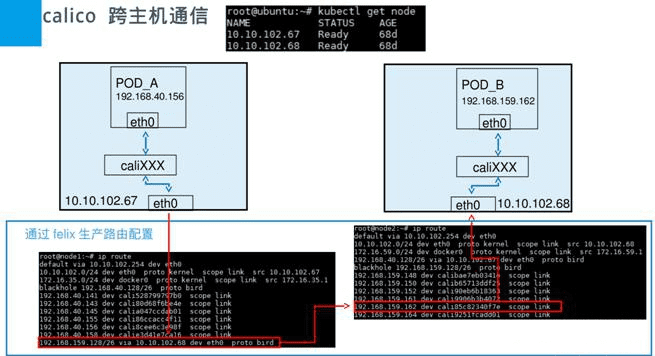

### 2.2.5 Calico **下发 ACL 规则** 

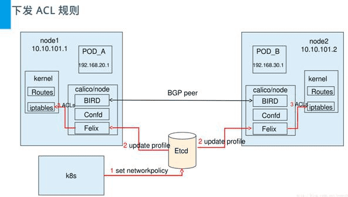

# 三、安装与配置
## 3.1 Flannel 安装

```bash
kubectl apply -f https://raw.githubusercontent.com/coreos/flannel/master/Documentation/kube-flannel.yml
```

## 3.2 Calico 安装

```bash
wget https://docs.projectcalico.org/v3.8/manifests/calico.yaml

#该配置文件默认采用的Pod的IP地址为192.168.0.0/16，需要修改为集群初始化参数--pod-network-cidr中采用的值10.157.0.0/16
sed -i "s#192\.168\.0\.0/16#10\.157\.0\.0/16#" ./calico.yaml
kubectl apply -f calico.yaml

# 等待所有容器状态处于Running状态
watch -n 2 kubectl get pods -n kube-system -o wide

# 查看节点状态
kubectl get nodes -o wide
```
