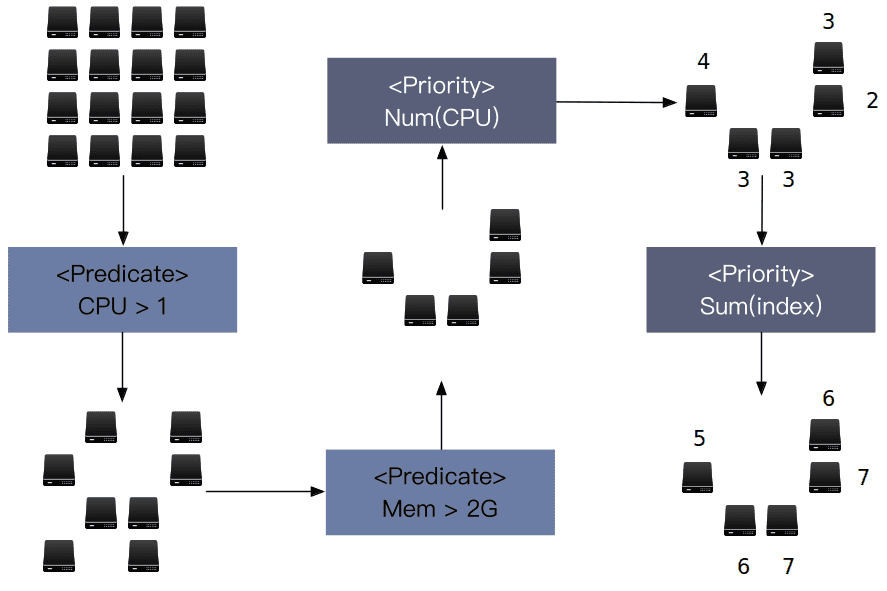
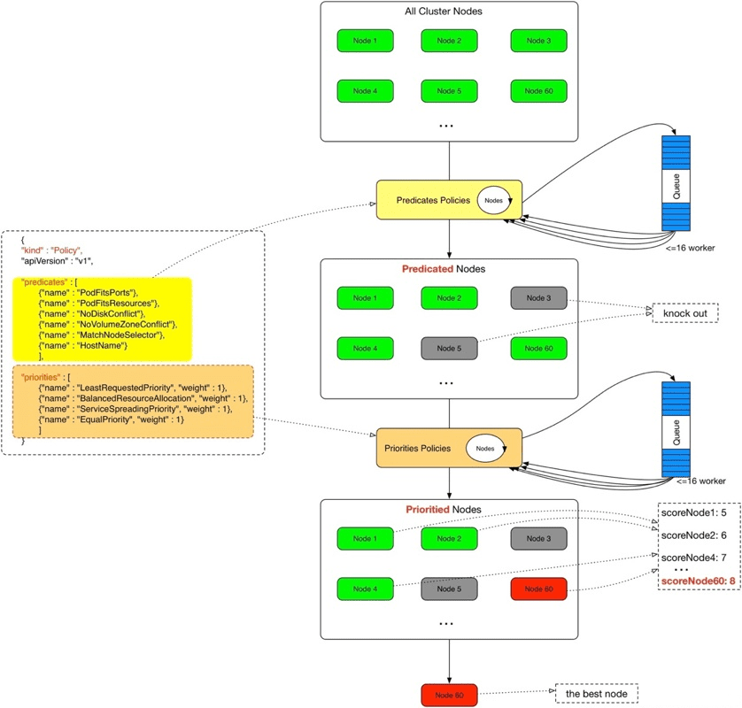

# 一、背景
随着微服务架构和容器技术在云计算领域的广泛应用，如何在大型集群中管理容器化的微服务成为了开发者们迫切希望解决的问题。Amazon、Red Hat、VMware等公司先后推出了自己的PaaS层集群管理系统,但是由于这些系统存在一定的局限性，PaaS的发展一直很缓慢。

Kubernetes的出现打破了这个局面，并且发展势头越来越猛，已成为了AWS、Oracle和Pivotal的首选容器集群管理平台。

# 二、实现方案
## 2.1 概述
容器云平台使用 Kubernetes 进行原生的容器调度管理，在 Kubernetes 体系结构中 kube-scheduler 组件负责管理整个容器的生命周期，可以基于服务器的资源压力、容器亲和性、节点硬件环境等进行智能化调度。

调度器通过 kubernetes 的 watch 机制来发现集群中新创建且尚未被调度到 Node 上的 Pod。调度器会将发现的每一个未调度的 Pod 调度到一个合适的 Node 上来运行。调度器会依据下文的调度原则来做出调度选择。

如果你想要理解 Pod 为什么会被调度到特定的 Node 上，或者你想要尝试实现一个自定义的调度器。

## 2.2 Kube-Scheduler 调度器
[kube-scheduler](https://kubernetes.io/zh/docs/reference/command-line-tools-reference/kube-scheduler/) 是 Kubernetes 集群的默认调度器，并且是集群 [控制面](https://kubernetes.io/zh/docs/reference/glossary/?all=true#term-control-plane) 的一部分。如果你真的希望或者有这方面的需求，kube-scheduler 在设计上是允许你自己写一个调度组件并替换原有的 kube-scheduler。

对每一个新创建的 Pod 或者是未被调度的 Pod，kube-scheduler 会选择一个最优的 Node 去运行这个 Pod。然而，Pod 内的每一个容器对资源都有不同的需求，而且 Pod 本身也有不同的资源需求。因此，Pod 在被调度到 Node 上之前，根据这些特定的资源调度需求，需要对集群中的 Node 进行一次过滤。

在一个集群中，满足一个 Pod 调度请求的所有 Node 称之为 _可调度节点_。如果没有任何一个 Node 能满足 Pod 的资源请求，那么这个 Pod 将一直停留在未调度状态直到调度器能够找到合适的 Node。

调度器先在集群中找到一个 Pod 的所有可调度节点，然后根据一系列函数对这些可调度节点打分，然后选出其中得分最高的 Node 来运行 Pod。之后，调度器将这个调度决定通知给 kube-apiserver，这个过程叫做 _绑定_。

在做调度决定时需要考虑的因素包括：单独和整体的资源请求、硬件/软件/策略限制、亲和以及反亲和要求、数据局域性、负载间的干扰等等。

## 2.2 调度流程
kube-scheduler的根本工作任务是根据各种调度算法将Pod绑定（bind）到最合适的工作节点，整个调度流程分为两个阶段：预选策略（Predicates）和优选策略（Priorities）。

1. 预选（Predicates）：输入是所有节点，输出是满足预选条件的节点。kube-scheduler根据预选策略过滤掉不满足策略的Nodes。例如，如果某节点的资源不足或者不满足预选策略的条件如“Node的label必须与Pod的Selector一致”时则无法通过预选。
1. 优选（Priorities）：输入是预选阶段筛选出的节点，优选会根据优先策略为通过预选的Nodes进行打分排名，选择得分最高的Node。例如，资源越富裕、负载越小的Node可能具有越高的排名。

通俗点说，调度的过程就是在回答两个问题：1.候选有哪些？2.其中最适合的是哪个？

值得一提的是，如果在预选阶段没有节点满足条件，Pod会一直处在Pending状态直到出现满足的节点，在此期间调度器会不断的进行重试。

文字性的叙述过于单调，这里用图来说明这个过程。在图中一共有 16 台服务器，有着不同的配置。

经过了两个 predicate 后，过滤掉了不满足条件的 node，剩下的 node 都足以运行 pod，这时候就需要 Priorities 过程来找到最适合的那个 node。经过两轮 priority 后，发现了一个最适合的 node，于是 pod 和 node 终于在一起了。在绝大多数情况下，调度就结束了。

这里特此说明，这些图只是为了说明调度的过程，Kubernetes 支持的 predicate 和 priority 的维度并不是 CPU 和 Memory。

我们可以对Pod的整个启动流程进行总结：

1. 资源管控中心Controller Manager创建新的Pod，将该Pod加入待调度的Pod列表。
1. kube-scheduler通过API Server提供的接口监听Pods，获取待调度pod，经过预选和优选两个阶段对各个Node节点打分排序，为待调度Pod列表中每个对象选择一个最优的Node。
1. kube-scheduler将Pod与Node的绑定写入etcd（元数据管理服务）。
1. 节点代理服务kubelet通过API Server监听到kube-scheduler产生的绑定信息，获得Pod列表，下载Image并启动容器，然后由kubelet负责拉起Pod。

到此为止就完成了Pod的调度与启动。

## 2.2 调度策略
[kube-scheduler](https://kubernetes.io/docs/reference/generated/kube-scheduler/) 根据调度策略指定的_断言（predicates）_和_优先级（priorities）_ 分别对节点进行[过滤和打分](https://kubernetes.io/zh/docs/concepts/scheduling-eviction/kube-scheduler/#kube-scheduler-implementation)。

你可以通过执行 `kube-scheduler --policy-config-file <filename>` 或 `kube-scheduler --policy-configmap <ConfigMap>` 设置并使用[调度策略](https://pkg.go.dev/k8s.io/kube-scheduler@v0.18.0/config/v1?tab=doc#Policy)。

### 断言（_predicates_）
以下_断言_实现了过滤接口：

- `PodFitsHostPorts`：检查 Pod 请求的端口（网络协议类型）在节点上是否可用。
- `PodFitsHost`：检查 Pod 是否通过主机名指定了 Node。
- `PodFitsResources`：检查节点的空闲资源（例如，CPU和内存）是否满足 Pod 的要求。
- `MatchNodeSelector`：检查 Pod 的节点[选择算符](https://kubernetes.io/zh/docs/concepts/overview/working-with-objects/labels/) 和节点的 [标签](https://kubernetes.io/zh/docs/concepts/overview/working-with-objects/labels/) 是否匹配。
- `NoVolumeZoneConflict`：给定该存储的故障区域限制， 评估 Pod 请求的[卷](https://kubernetes.io/zh/docs/concepts/storage/volumes/)在节点上是否可用。
- `NoDiskConflict`：根据 Pod 请求的卷是否在节点上已经挂载，评估 Pod 和节点是否匹配。
- `MaxCSIVolumeCount`：决定附加 [CSI](https://kubernetes.io/zh/docs/concepts/storage/volumes/#csi) 卷的数量，判断是否超过配置的限制。
- `CheckNodeMemoryPressure`：如果节点正上报内存压力，并且没有异常配置，则不会把 Pod 调度到此节点上。
- `CheckNodePIDPressure`：如果节点正上报进程 ID 稀缺，并且没有异常配置，则不会把 Pod 调度到此节点上。
- `CheckNodeDiskPressure`：如果节点正上报存储压力（文件系统已满或几乎已满），并且没有异常配置，则不会把 Pod 调度到此节点上。
- `CheckNodeCondition`：节点可用上报自己的文件系统已满，网络不可用或者 kubelet 尚未准备好运行 Pod。 如果节点上设置了这样的状况，并且没有异常配置，则不会把 Pod 调度到此节点上。
- `PodToleratesNodeTaints`：检查 Pod 的[容忍](https://kubernetes.io/docs/concepts/configuration/taint-and-toleration/) 是否能容忍节点的[污点](https://kubernetes.io/docs/concepts/configuration/taint-and-toleration/)。
- `CheckVolumeBinding`：基于 Pod 的卷请求，评估 Pod 是否适合节点，这里的卷包括绑定的和未绑定的 [PVCs](https://kubernetes.io/docs/concepts/storage/persistent-volumes/) 都适用。

### 优先级（_priorities_）
以下_优先级_实现了打分接口：

- `SelectorSpreadPriority`：属于同一 [Service](https://kubernetes.io/zh/docs/concepts/services-networking/service/)、 [StatefulSet](https://kubernetes.io/zh/docs/concepts/workloads/controllers/statefulset/) 或 [ReplicaSet](https://kubernetes.io/zh/docs/concepts/workloads/controllers/replicaset/) 的 Pod，跨主机部署。
- `InterPodAffinityPriority`：实现了 [Pod 间亲和性与反亲和性](https://kubernetes.io/zh/docs/concepts/scheduling-eviction/assign-pod-node/#inter-pod-affinity-and-anti-affinity)的优先级。
- `LeastRequestedPriority`：偏向最少请求资源的节点。 换句话说，节点上的 Pod 越多，使用的资源就越多，此策略给出的排名就越低。
- `MostRequestedPriority`：支持最多请求资源的节点。 该策略将 Pod 调度到整体工作负载所需的最少的一组节点上。
- `RequestedToCapacityRatioPriority`：使用默认的打分方法模型，创建基于 ResourceAllocationPriority 的 requestedToCapacity。
- `BalancedResourceAllocation`：偏向平衡资源使用的节点。
- `NodePreferAvoidPodsPriority`：根据节点的注解 `scheduler.alpha.kubernetes.io/preferAvoidPods` 对节点进行优先级排序。 你可以使用它来暗示两个不同的 Pod 不应在同一节点上运行。
- `NodeAffinityPriority`：根据节点亲和中 PreferredDuringSchedulingIgnoredDuringExecution 字段对节点进行优先级排序。 你可以在[将 Pod 分配给节点](https://kubernetes.io/zh/docs/concepts/scheduling-eviction/assign-pod-node/)中了解更多。
- `TaintTolerationPriority`：根据节点上无法忍受的污点数量，给所有节点进行优先级排序。 此策略会根据排序结果调整节点的等级。
- `ImageLocalityPriority`：偏向已在本地缓存 Pod 所需容器镜像的节点。
- `ServiceSpreadingPriority`：对于给定的 Service，此策略旨在确保该 Service 关联的 Pod 在不同的节点上运行。 它偏向把 Pod 调度到没有该服务的节点。 整体来看，Service 对于单个节点故障变得更具弹性。
- `EqualPriority`：给予所有节点相等的权重。
- `EvenPodsSpreadPriority`：实现了 [Pod 拓扑扩展约束](https://kubernetes.io/zh/docs/concepts/workloads/pods/pod-topology-spread-constraints/)的优先级排序。