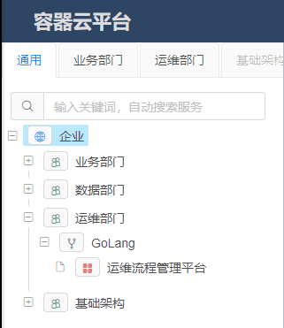

# 一、背景
随着软件系统架构的演变，微服务架构的使用已然成为目前软件开发的主流模式，随之带来的是企业对应用管理方面的需求。在企业IT建设容器云平台时，对于服务的管理是整个服务体系的基石。

# 二、实现方案
## 2.1 概述
容器云平台是一个围绕应用和微服务的平台，提供一站式应用全生命周期管理能力和数据化运营支持，提供多维度应用和服务的监控数据，助力服务性能优化。

在 Kubernetes + Docker 体系结构下，应用的实例已经运行在Docker容器内部。为了便于应用实例的管理，以及实现更强大的管理能里，Kubernetes 自身引入了 POD、Deployment、Service 等概念。

在设计容器云技术方案时，对这些概念应该如何把控、利用是整个容器云顺利落地的关键所在。

## 2.2 实现方案
容器云提在 Kubernetes 的概念之上，建立了应用、应用组、实例组概念:

- **容器云-应用：** 企业内每个实际的应用；
- **容器云-应用组：** 每个应用属于一个应用组，一个应用组下可以有任意个应用；
- **容器云-实例组：** 每个应用可以建立多个实例组，每个实例组的应用启动参数相同，允许实例组水平扩容；

之所以如此设计是容器云本身可以支持多集群接入。多集群接入可以满足企业对异地多活的需求，允许企业应用部署在不同集群中。

### 2.2.1 容器云-应用

通常我们为企业的每个真实服务创建一个容器云的应用。

应用里我们需要填写基本信息

- **应用名：** 全局唯一的应用ID，仅能使用字母、数字进行命名；
- **显示名称：** 给平台使用者展示的名称，可以使用业务中文名；

### 2.2.2 容器云-应用组

应用组的目的是给应用进行分类，通常我们同一个业务域下的应用集中放置一个业务组里。

### 2.2.3 容器云-实例组
每个应用可以建立多个实例组，每个实例组的应用启动参数相同，允许实例组水平扩容。

一个应用实例组对应了一个 Kubernetes 集群中的一个 Deployment。

容器云支持多集群接入，我们可以讲实例组创建在不同的Kubernetes集群内以增强应用的健壮性。