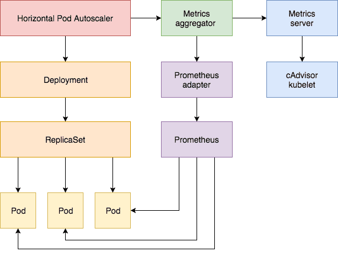

# 一、背景
云计算的快速发展满足了大规模计算、海量数据存储的要求。在面对双11抢购、春运抢票等特殊场景下，无疑给应用带来了空前的挑战。在这种高并发的场景下，最可能出现的就是由于没有进行充分的流量预估、服务器资源不够、没有运行足够的应用实例导致应用程序响应变慢，最终业务效果大打折扣甚至无法进行。

为了解决这种问题，我们需要引入一种弹性伸缩的技术，能够基于应用的负载水位进行智能扩缩容。

# 二、方案介绍
## 2.1 概述
一般来讲，弹性伸缩主要用来解决两个问题：

- 应对突发流量

    这点很好理解，当系统由于外界因素（比如 XXX 突然结婚了， XXX 突然离婚了等突发的热门话题），导致系统负载激增，原有的配置已无法满足需求，需要增加系统配置。这种增加可能是自动的，可能是需要手工调整的，甚至是需要去购买机器，重启服务等对服务比较不友好的行为。具体进行何种操作，需要以及目前公司的弹性伸缩级别来制定相应的计划。

- 节省资源

    绝大多数情况下，我们不可能让我们的工作负载跑满服务器（即便能跑满，为了服务稳定性，我们也不大敢这么做）。在不损失服务稳定性的大前提下，尽可能地提高资源利用率，一直是各个弹性伸缩方案不懈的目标。减少单个服务资源占用，通过合理调度资源减少服务器数量，及时增减服务数量等手段，都能直接或间接的达到节省资源的目的。

## 2.2 实现方式
容器云基于 Kubernetes，并拥有弹性伸缩能力

k8s 默认提供了多个服务粒度的弹性伸缩组件。主要有 VPA， addon resizer 和 HPA。

此外，各大云厂商也积极贡献提供了多种伸缩组件，例如阿里云提供的 cronHPA。
以下我们分别详细说明。

在服务粒度的伸缩中，依据执行触发时机不同，可分为立即执行，定时执行和预测性执行。

先来看立即执行。

立即执行又细分为垂直伸缩和水平伸缩。

#### 垂直伸缩
k8s 中的垂直伸缩一般是指调整 Pod 的内存和 CPU 配额(resource limit 和 request)。

k8s 官方 [autoscaler](https://github.com/kubernetes/autoscaler) 包中有两个类型的垂直伸缩组件：

VPA(vertical pod autoscaler) 和 addon resizer。

**addon resizer**可以根据集群节点数量来动态地调整某个其他 deployment 中的 pod 的配额。

addon resizer 周期性地查看集群节点数量，然后计算出监控的 pod 需要分配的内存和 CPU，如果 pod 的实际 pod 配额和所需配额超过某个阈值，则会修改 deployment 并触发生成新的 pod。addon resizer 的这种特性决定了它用来伸缩与集群规模密切相关的服务。

一般， addon resizer 用来伸缩部署在集群内的 heapster， metrics-server， kube-state-metrics等监控组件。**VPA**的应用范围要广一些。设置 VPA 后，它能够自动为 pod 设定 request 和 limit 配额值，然后动态地将 pod 调度到合适的节点上去。

VPA 在 k8s 中定义类型为 VerticalPodAutoscaler 的 [CRD](https://kubernetes.io/docs/concepts/extend-kubernetes/api-extension/custom-resources/)，为每个需要开启垂直弹性伸缩功能的 deployment 创建一个 custom resource，然后 VPA 会定期查看对应 pod 的资源使用情况，结合历史数据，自动调整 pod 的配额。

VPA controller 由三部分组成。

- Recommender：它监视当前和过去的资源消耗，并基于此提供容器的cpu和内存请求的推荐值。
- Updater：它检查哪个托管的pod设置了正确的资源，如果没有，则杀死它们，以便它们的控制器可以用更新后的请求重新创建它们。
- Admission Plugin：它在新pod上设置正确的资源请求(由于Updater的活动，它们的控制器只是创建或重新创建了这些请求)。

使用 VPA 监控 deployment 时，它并不会去改变 deployment 的配置，而是使用 admission plugin 以类似 pre hook 的方式在创建 pod 时动态为其配置配额值。

使用 VPA 之前需要注意以下问题：

- VPA 默认会从 metrics server 中采集历史数据，因此使用 VPA 之前，需要配置好 metrics server。VPA 也支持从 prometheus 中采集历史数据，不过需要额外的配置。
- VPA 是在伸缩调整过程中，是通过重启 pod 来使调整生效的，因此已经公司基础架构不同，可能会引起服务闪断，需要具体分析服务是否可接受
- 使用 VPA 扩容有上限，具体受 pod 所在宿主机影响。为 pod 分配的资源无法超过宿主机的大小。如果 recommender 计算出的 pod 所需资源超过节点可用资源，将导致 pod 一直 pending。这点可与通过与 cluster autoscaler 共同使用来部分解决。
- VPA 目前不应与基于内存和 CPU 监控的水平Pod自动调度器(HPA)一起使用，否则可能产生预期外的行为。
#### 水平伸缩
Horizontal Pod Autoscaler 是 k8s 内置的水平伸缩控制器。它根据观察到的CPU使用率（或使用自定义指标支持，基于某些其他应用程序提供的指标）自动缩放 replication 控制器、deployment、副本集或状态集中的 pod 数量。 需要注意的是，水平窗格自动缩放不适用于无法缩放的对象，例如DaemonSets。

HPA 实现为Kubernetes API资源和控制器。资源决定控制器的行为。控制器定期（默认为 15 秒）调整复制控制器或部署中的副本数量，以使所观察到的平均CPU利用率与用户指定的目标相匹配。

与 VPA 仅支持从 metrics server 中采集 CPU 和内存数据不同的是，HPA 支持多种数据维度和数据采集方式:

- 从 heapster 中采集 CPU 和内存数据(自 kubernetes 1.11 起废除)
- 遵循特定格式记录在 annotation 中的应用自定义 metrics(自 kubernetes 1.6 起废除)
- 使用 metrics API 采集 metric server 中的数据
- 通过 custom metrics adapter 将 prometheus 等第三方中的数据采集提供给 custom metrics API 使用。

和 VPA 一样，使用 HPA 一般需要先搭建 metrics server，具体方法可参考 kubernetes 官方指南。

在新版本(kubernetes 1.6 以后)的 metrics API 中，引入聚合层(aggregation layer)，为应用查询 metrics server内部的数据和第三方数据提供了一致的抽象。第三方监控数据只需自己实现相应的 adapter，并在 metrcis API 中为其监控的metric 注册相应的 custom metrics API 即可。

下图展示了使用 HPA 根据 metrics server 和 prometheus 中的数据进行弹性伸缩的过程。

