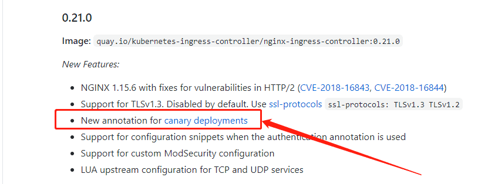
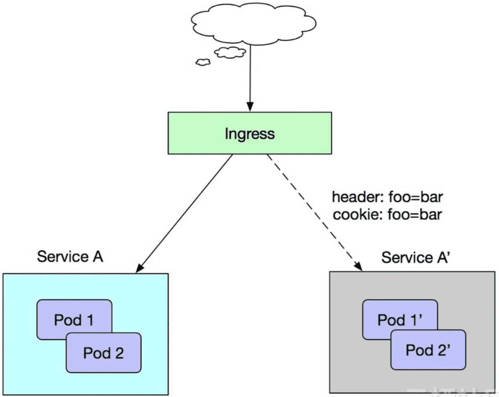
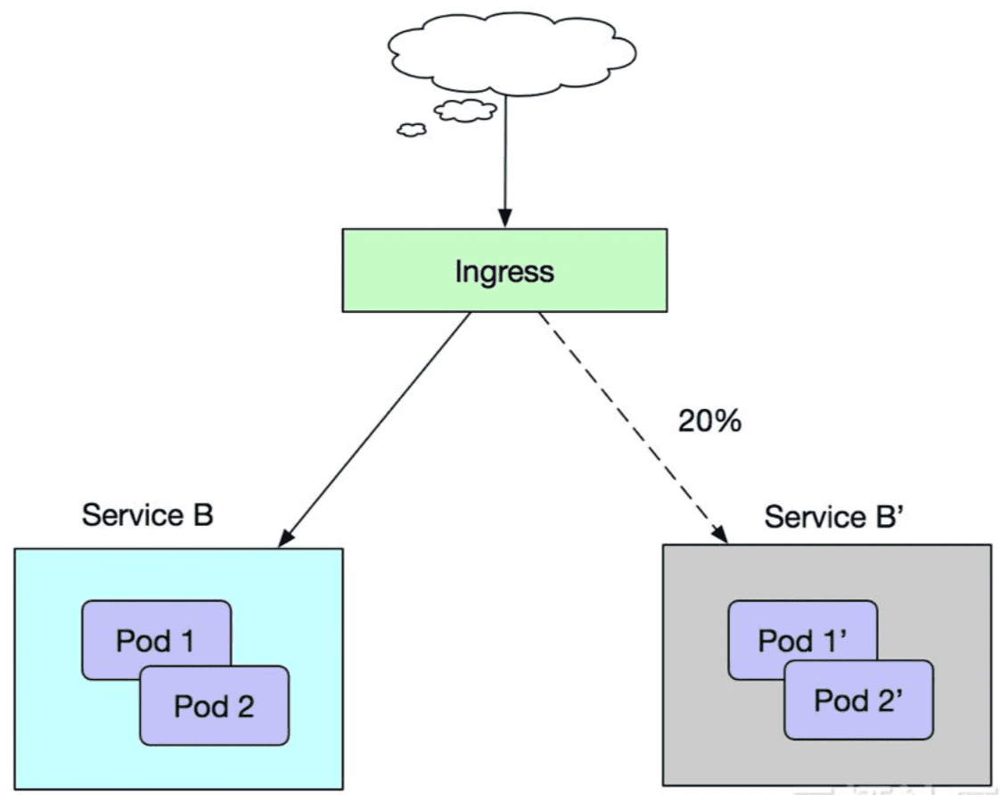

# 一、背景
灰度发布是一种常见的服务滚动升级或 A/B 测试策略。在新版本服务正式发布前，可以部署少量的新版本服务和上个版本共存，用部分生产流量测试新版本的功能和特性。如果新版本反馈良好，则可以渐进地提高新版本的比例或者全部替换成新版本，如果有问题也能够及时撤回，不至于造成太大范围的影响。
# 二、实现方案
容器云使用 nginx-ingress作为K8S集群对外的流量入口，充当K8S集群内各个service的反向代理。并基于该组件提供了完整的灰度发布能力。

Ingress-Nginx 是一个K8S ingress工具，Ingress-nginx 从 0.21.0 版本开始支持灰度发布功能：



# 三、发布场景介绍

## **场景一**

假设当前线上环境我们已经有一套服务Service A对外提供7层服务，此时我们新开发了一些新的特性，需要灰度发布上线一个新的版本Service A'，但是我们暂时又不希望简单地直接替换掉Service A服务，而是希望将请求头中包含foo=bar或者cookie中包含foo=bar的客户端请求转发到Service A'服务中，待运行一段时间稳定，将所有的流量切换到Service A'服务中后，再平滑地下线掉Service A服务



## **场景二**

假设当前线上环境我们已经有一套服务Service B对外提供7层服务，此时我们修复了一些问题，需要灰度发布上线一个新的版本Service B'，但是我们又不希望简单直接地将所有客户端流量切换到新版本Service B'中，而是希望仅仅切换20%的流量到新版本Service B'中，待运行一段时间稳定，将所有的流量切换到Service B'服务中后，再平滑地下线掉Service B服务：




针对以上多种不同的应用发布需求，nginx Ingress 支持了多种流量切分方式：

1. 基于Request Header的流量切分，适用于灰度发布以及AB测试场景
1. 基于Cookie的流量切分，适用于灰度发布以及AB测试场景
1. 基于服务权重的流量切分，适用于蓝绿发布场景

# **四、**Ingress 注解说明

K8S Ingress Controller通过下列Annotation来支持应用服务的不同发布机制，首先需要设置

```yaml
nginx.ingress.kubernetes.io/canary: "true"
```

然后根据需要求设定对应的配置

## **基于Request Header的流量切分**
`nginx.ingress.kubernetes.io/canary-by-header：`用于通知Ingress将请求路由到Canary Ingress中指定的服务的标头。当请求标头设置always为时，它将被路由到Canary。当标头设置never为时，它将永远不会被路由到Canary。对于任何其他值，将忽略标头，并通过优先级将请求与其他Canary规则进行比较。

`nginx.ingress.kubernetes.io/canary-by-header-value：`要匹配的标头值，用于通知Ingress将请求路由到Canary Ingress中指定的服务。当请求标头设置为此值时，它将被路由到Canary。对于任何其他标头值，标头将被忽略，并且请求与其他Canary规则的优先级进行比较。此注释必须与canary-by-header一起使用。`nginx.ingress.kubernetes.io/canary-by-header`注释允许自定义标头值而不是使用硬编码值的扩展。如果`nginx.ingress.kubernetes.io/canary-by-header`注释未定义，则没有任何效果。

> 例1：使用canary-by-header

```yaml
apiVersion: extensions/v1beta1
kind: Ingress
metadata:
  annotations:
    nginx.ingress.kubernetes.io/canary: "true"
    nginx.ingress.kubernetes.io/canary-by-header: "new"
  labels:
    app: demo
  name: demo-ingress
  namespace: demo-canary
spec:
  rules:
  - host: canary.example.com
    http:
      paths:
      - backend:
          serviceName: demo-canary
          servicePort: 80
        path: /
```

上面这个示例，当你请求头加入new: always的时候就会访问demo-canary，当标头设置never为时，则不会访问。例如下面的这个curl

```bash
curl -s -H "new: always"  http://canary.example.com
```

下面这个示例使用的是自定义的标头值

> 例2：使用canary-by-header-value

```yaml
apiVersion: extensions/v1beta1
kind: Ingress
metadata:
  annotations:
    nginx.ingress.kubernetes.io/canary: "true"
    nginx.ingress.kubernetes.io/canary-by-header: "new"
    nginx.ingress.kubernetes.io/canary-by-header-value："xxx"
  labels:
    app: demo
  name: demo-ingress
  namespace: demo-canary
spec:
  rules:
  - host: canary.example.com
    http:
      paths:
      - backend:
          serviceName: demo-canary
          servicePort: 80
        path: /
```

使用如下请求可以正常访问demo-canary

```bash
curl -s -H "new: xxx" http://canary.example.com
```

## **基于Cookie的流量切分**

`nginx.ingress.kubernetes.io/canary-by-cookie：`用于通知Ingress将请求路由到Canary Ingress中指定的服务的cookie。当cookie值设置always为时，它将被路由到Canary。当cookie被设置never为时，它将永远不会被路由到Canary。对于任何其他值，cookie将被加入，并且请求与其他Canary规则的优先级进行比较。

```yaml
apiVersion: extensions/v1beta1
kind: Ingress
metadata:
  annotations:
    nginx.ingress.kubernetes.io/canary: "true"
    nginx.ingress.kubernetes.io/canary-by-cookie: "use_under_30_feature"
  labels:
    app: demo
  name: demo-ingress
  namespace: demo-canary
spec:
  rules:
  - host: canary.example.com
    http:
      paths:
      - backend:
          serviceName: demo-canary
          servicePort: 80
        path: /
```

上面的这个示例，当cookie设置为use_under_30_feature为always的时候，则会访问demo-canary

## **基于服务权重的流量切分**
`nginx.ingress.kubernetes.io/canary-weight：`将路由到金丝雀Ingress中指定的服务的随机请求的整数（0 - 100）百分比。权重为0意味着该Canary规则不会向Canary入口中的服务发送任何请求。权重为100意味着所有请求都将被发送到Ingress中指定的替代服务。示例如下（使用20%的权重）：

```yaml
apiVersion: extensions/v1beta1
kind: Ingress
metadata:
  annotations:
    nginx.ingress.kubernetes.io/canary: "true"
    nginx.ingress.kubernetes.io/canary-weight: "20"
  labels:
    app: demo
  name: demo-ingress
  namespace: demo-canary
spec:
  rules:
  - host: canary.example.com
    http:
      paths:
      - backend:
          serviceName: demo-canary
          servicePort: 80
        path: /
```

注意这里权重不是一个精确的百分比，使用过程当中，只是会看到一个近似分布。

## 三种注释的优先级和注意点

上面的规则按优先顺序进行评估。优先顺序如下： `canary-by-header -> canary-by-cookie -> canary-weight`

**注意：** 

当您将入口标记为canary时，除了`nginx.ingress.kubernetes.io/load-balance`和之外，所有其他非canary注释都将被忽略（从相应的主入口继承）`nginx.ingress.kubernetes.io/upstream-hash-by`

已知的限制

目前，每个Ingress规则最多可以应用一个canary入口。