# 一、背景
监控是整个运维乃至整个产品生命周期中最重要的一环，事前及时预警发现故障，事后提供详实的数据用于追查定位问题。

目前业界有很多不错的开源产品可供选择。选择一款开源的监控系统，是一个省时省力，效率最高的方案。

# 二、实现方案
容器云基于开源系统 Prometheus 实现了自己的监控体系。
## 2.1 为什么选择 Prometheus 及主流方案对比
### Prometheus vs Zabbix

- Zabbix 使用的是 C 和 PHP, Prometheus 使用 Golang, 整体而言 Prometheus 运行速度更快一点。
- Zabbix 属于传统主机监控，主要用于物理主机，交换机，网络等监控，Prometheus 不仅适用主机监控，还适用于 Cloud, SaaS, Openstack，Container 监控。
- Zabbix 在传统主机监控方面，有更丰富的插件。
- Zabbix 可以在 WebGui 中配置很多事情，但是 Prometheus 需要手动修改文件配置。
### Prometheus vs Graphite

- [Graphite](http://graphite.readthedocs.io/en/latest/overview.html) 功能较少，它专注于两件事，存储时序数据， 可视化数据，其他功能需要安装相关插件，而 Prometheus 属于一站式，提供告警和趋势分析的常见功能，它提供更强的数据存储和查询能力。
- 在水平扩展方案以及数据存储周期上，Graphite 做的更好。
### Prometheus vs InfluxDB

- [InfluxDB](https://www.influxdata.com/) 是一个开源的时序数据库，主要用于存储数据，如果想搭建监控告警系统， 需要依赖其他系统。
- InfluxDB 在存储水平扩展以及高可用方面做的更好, 毕竟核心是数据库。
### Prometheus vs OpenTSDB

- [OpenTSDB](http://opentsdb.net/) 是一个分布式时序数据库，它依赖 Hadoop 和 HBase，能存储更长久数据， 如果你系统已经运行了 Hadoop 和 HBase, 它是个不错的选择。
- 如果想搭建监控告警系统，OpenTSDB 需要依赖其他系统。
### Prometheus vs Nagios

- [Nagios](https://www.nagios.org/) 数据不支持自定义 Labels, 不支持查询，告警也不支持去噪，分组, 没有数据存储，如果想查询历史状态，需要安装插件。
- Nagios 是上世纪 90 年代的监控系统，比较适合小集群或静态系统的监控，显然 Nagios 太古老了，很多特性都没有，相比之下Prometheus 要优秀很多。
### Prometheus vs Sensu

- [Sensu](https://sensuapp.org/) 广义上讲是 Nagios 的升级版本，它解决了很多 Nagios 的问题，如果你对 Nagios 很熟悉，使用 Sensu 是个不错的选择。
- Sensu 依赖 RabbitMQ 和 Redis，数据存储上扩展性更好。
## 2.1 容器云 Prometheus 介绍
Prometheus受启发于Google的Brogmon监控系统（相似的Kubernetes是从Google的Brog系统演变而来），从2012年开始由前Google工程师在Soundcloud以开源软件的形式进行研发，并且于2015年早期对外发布早期版本。2016年5月继Kubernetes之后成为第二个正式加入CNCF基金会的项目，同年6月正式发布1.0版本。2017年底发布了基于全新存储层的2.0版本，能更好地与容器平台、云平台配合。

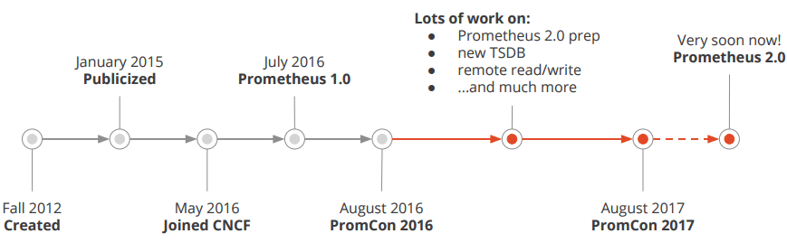

#### Prometheus 的优点

- 非常少的外部依赖，安装使用超简单
- 已经有非常多的系统集成 例如：docker HAProxy Nginx JMX等等
- 服务自动化发现
- 直接集成到代码
- 设计思想是按照分布式、微服务架构来实现的

#### Prometheus 的特性

- 自定义多维度的数据模型
- 非常高效的存储 平均一个采样数据占 ~3.5 bytes左右，320万的时间序列，每30秒采样，保持60天，消耗磁盘大概228G。
- 强大的查询语句
- 轻松实现数据可视化
## 2.2 容器云 Prometheus 架构

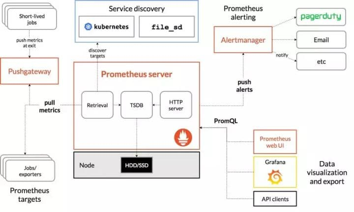

Prometheus 的主要模块包含， Server, Exporters, Pushgateway, PromQL, Alertmanager, WebUI 等。

它大致使用逻辑是这样：

1. Prometheus server 定期从静态配置的 targets 或者服务发现的 targets 拉取数据。
1. 当新拉取的数据大于配置内存缓存区的时候，Prometheus 会将数据持久化到磁盘（如果使用 remote storage 将持久化到云端）。
1. Prometheus 可以配置 rules，然后定时查询数据，当条件触发的时候，会将 alert 推送到配置的 Alertmanager。
1. Alertmanager 收到警告的时候，可以根据配置，聚合，去重，降噪，最后发送警告。
1. 可以使用 API， Prometheus Console 或者 Grafana 查询和聚合数据。

Prometheus Server是整个系统的核心，它定时地从监控目标（Exporters）暴露的API中拉取指标，然后将这些数据保存到时序数据库中，如果是监控目标是动态的，可以借助服务发现的机制动态地添加这些监控目标，另外它还会暴露执行PromQL（用来操纵时序数据的语言）的API，其他组件，例如Prometheus Web，Grafana可以通过这个API查询对应的时序数据。Prometheus Server会定时地执行告警规则，告警规则是PromQL表达式，表达式的值是true或false，如果是true，就将产生的告警数据推送给alertmanger。告警通知的聚合、分组、发送、禁用、恢复等功能，并不是Prometheus Server来做的，而是Alertmanager来做的，Prometheus Server只是将触发的告警数据推送给Alertmanager，然后Alertmanger根据配置将告警聚合到一块，发送给对应的接收人。

如果我们想要监控定时任务，想要instrument任务的执行时间，任务执行成功还是失败，那么如何将这些指标暴露给Prometheus Server？例如每隔一天做一次数据库备份，我们想要知道每次备份执行了多长时间，备份是否成功，我们备份任务只会执行一段时间，如果备份任务结束了，Prometheus Server该如何拉取备份指标的数据呢？解决这种问题，可以通过Prometheus的pushgateway组件来做，每个备份任务将指标推送pushgateway组件，pushgateway将推送来的指标缓存起来，Prometheus Server从Pushgateway中拉取指标。

## 2.3 使用PromQL查询监控数据
Prometheus UI是Prometheus内置的一个可视化管理界面，通过Prometheus UI用户能够轻松的了解Prometheus当前的配置，监控任务运行状态等。 通过`Graph`面板，用户还能直接使用`PromQL`实时查询监控数据：

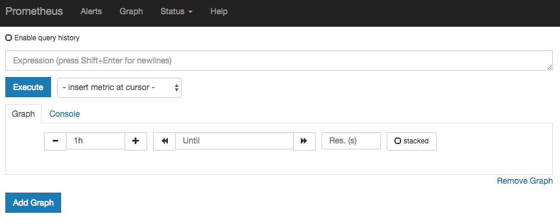

Graph Query

切换到面板，用户可以使用PromQL表达式查询特定监控指标的监控数据。如下所示，查询主机负载变化情况，可以使用关键字可以查询出Prometheus采集到的主机负载的样本数据，这些样本数据按照时间先后顺序展示，形成了主机负载随时间变化的趋势图表：

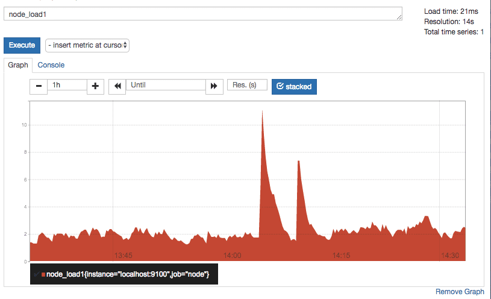

主机负载情况

PromQL是Prometheus自定义的一套强大的数据查询语言，除了使用监控指标作为查询关键字以为，还内置了大量的函数，帮助用户进一步对时序数据进行处理。例如使用函数，可以计算在单位时间内样本数据的变化情况即增长率，因此通过该函数我们可以近似的通过CPU使用时间计算CPU的利用率：

rate(node_cpu[2m])

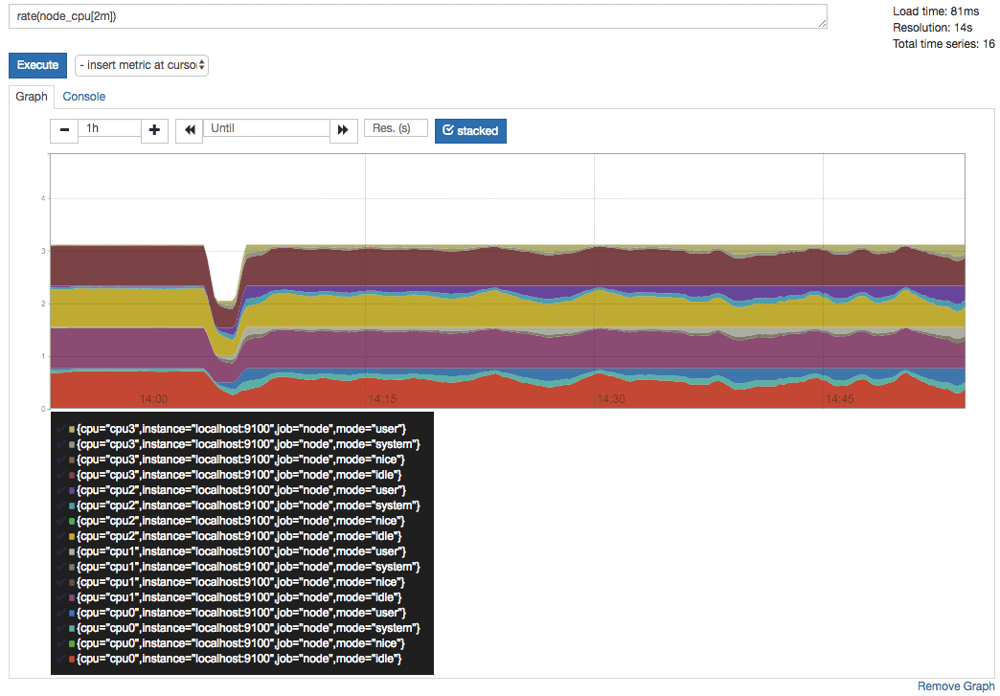

系统进程的CPU使用率

这时如果要忽略是哪一个CPU的，只需要使用without表达式，将标签CPU去除后聚合数据即可：

avg without(cpu) (rate(node_cpu[2m]))

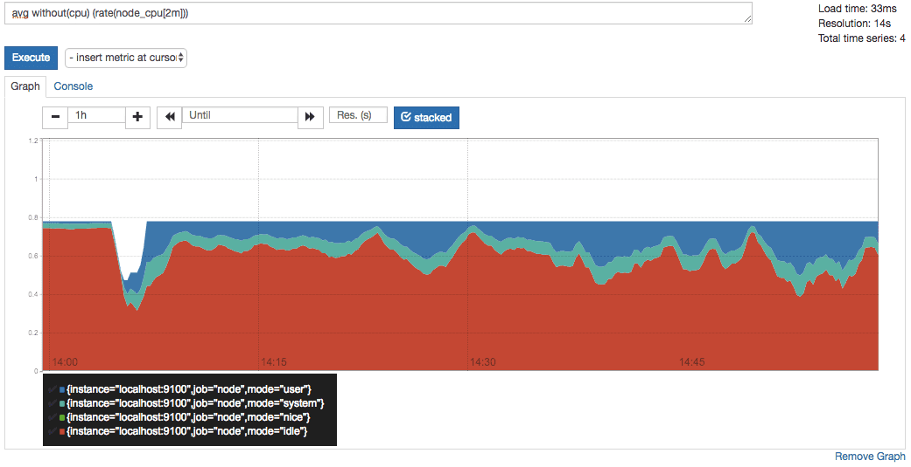

系统各mode的CPU使用率

那如果需要计算系统CPU的总体使用率，通过排除系统闲置的CPU使用率即可获得:

1 - avg without(cpu) (rate(node_cpu{mode="idle"}[2m]))

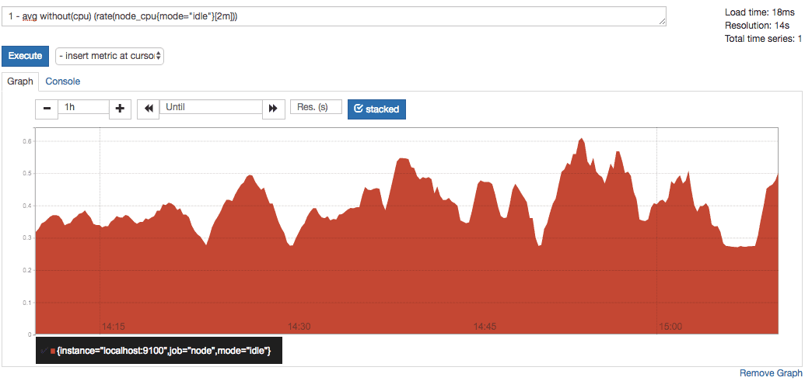

系统CPU使用率

通过PromQL我们可以非常方便的对数据进行查询，过滤，以及聚合，计算等操作。通过这些丰富的表达书语句，监控指标不再是一个单独存在的个体，而是一个个能够表达出正式业务含义的语言。

## 2.4 监控数据可视化
Prometheus UI提供了快速验证PromQL以及临时可视化支持的能力，而在大多数场景下引入监控系统通常还需要构建可以长期使用的监控数据可视化面板（Dashboard）。这时用户可以考虑使用第三方的可视化工具如Grafana，Grafana是一个开源的可视化平台，并且提供了对Prometheus的完整支持。

docker run -d -p 3000:3000 grafana/grafana

访问[http://localhost:3000](http://localhost:3000/) 就可以进入到Grafana的界面中，默认情况下使用账户admin/admin进行登录。在Grafana首页中显示默认的使用向导，包括：安装、添加数据源、创建Dashboard、邀请成员、以及安装应用和插件等主要流程:

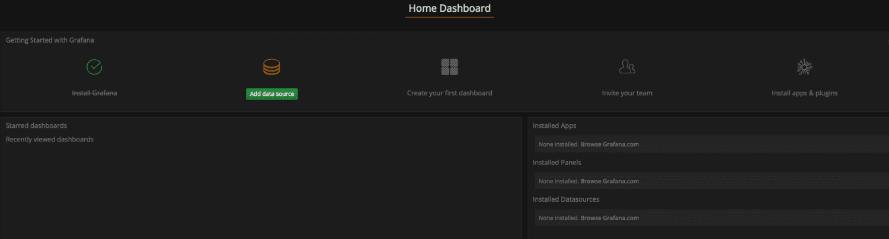

这里将添加Prometheus作为默认的数据源，如下图所示，指定数据源类型为Prometheus并且设置Prometheus的访问地址即可，在配置正确的情况下点击“Add”按钮，会提示连接成功的信息：

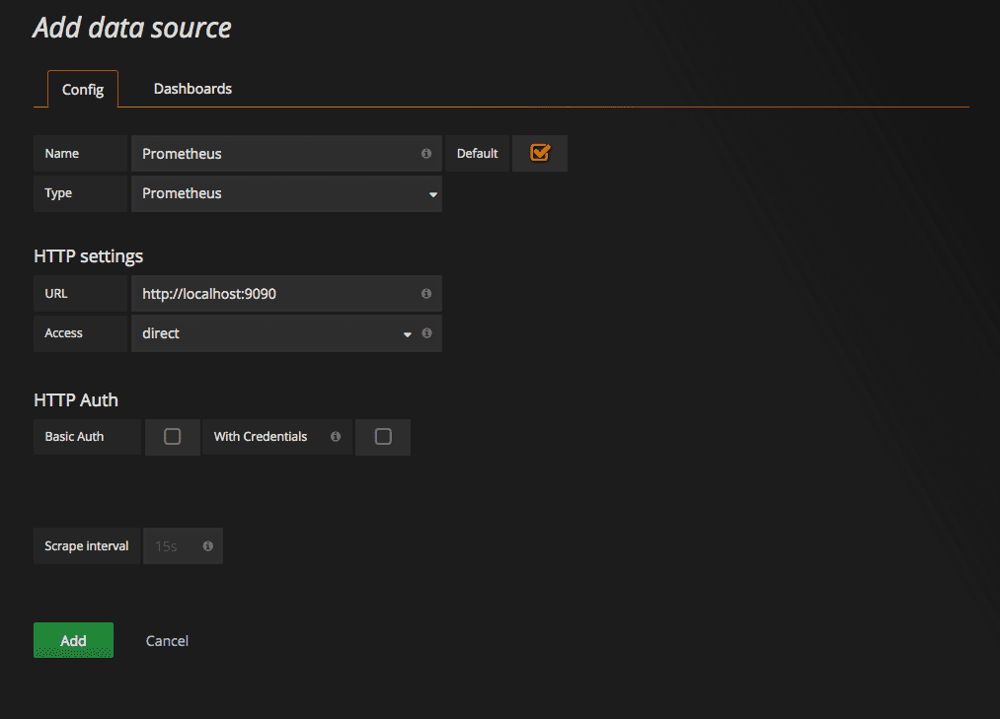

在完成数据源的添加之后就可以在Grafana中创建我们可视化Dashboard了。Grafana提供了对PromQL的完整支持，如下所示，通过Grafana添加Dashboard并且为该Dashboard添加一个类型为“Graph”的面板。 并在该面板的“Metrics”选项下通过PromQL查询需要可视化的数据：

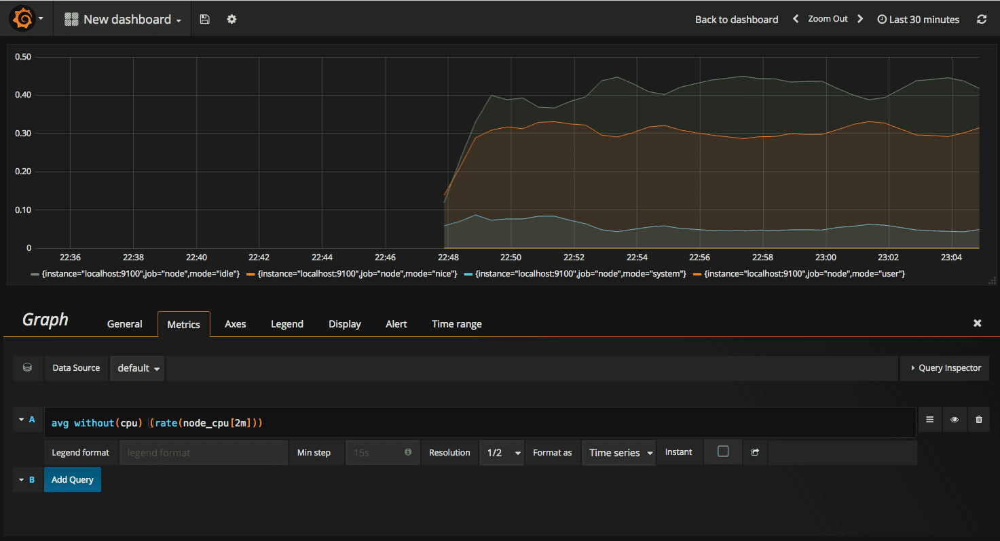

点击界面中的保存选项，就创建了我们的第一个可视化Dashboard了。 当然作为开源软件，Grafana社区鼓励用户分享Dashboard通过[https://grafana.com/dashboards](https://grafana.com/dashboards) 网站，可以找到大量可直接使用的Dashboard：

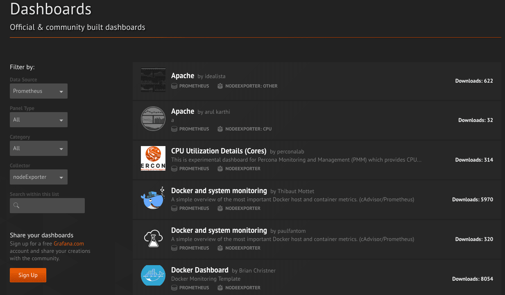

Grafana中所有的Dashboard通过JSON进行共享，下载并且导入这些JSON文件，就可以直接使用这些已经定义好的Dashboard：

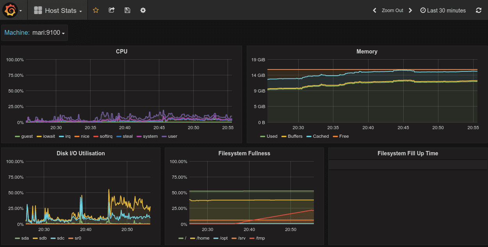

