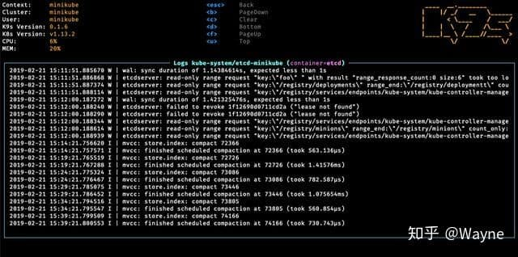
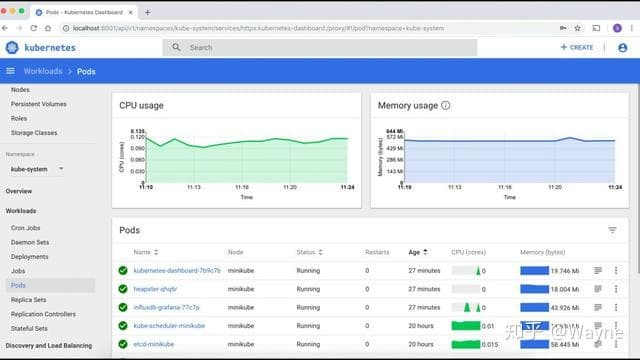
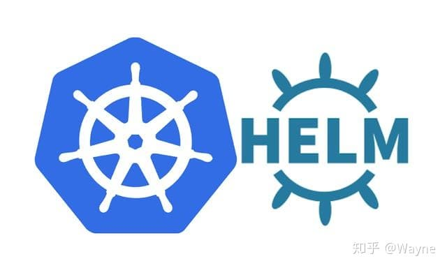

# 一、背景
从现代云原生应用诞生后，Kubernetes 环境变得高度分散化。它们可以部署到多个内部数据中心，也可以部署到云和边缘。Kubernetes 整个集群在企业应用架构中处于一个心脏的角色。保证Kubernetes的稳定性，对于企业来讲是重中之重。

Kubernetes 单个集群虽然目前支撑的POD数量可以超过1W+，但是对于大规模企业，可能这个数量显得捉襟见肘。

为了规模化使用或在生产环境中使用 Kubernetes，一些组织会部署多个集群，例如用于开发、测试和生产，这些集群分散在多个环境中，需要高效地进行管理。

**多集群 Kubernetes 部署的益处：** 

- 提高应用可用性
- 减少延迟
- 提高灾难恢复能力
- 在各种环境中部署传统和云原生应用

# 二、方案介绍

## 2.1 概述
目前的 Kubernetes 环境需要对集群进行逐个管理，因此在企业内管理它们的成本将随着集群的数量而上升。 

每个集群必须要单独部署、升级，并为其配置安全防护。此外，如果需要跨环境部署应用，必须要采用手动方式或在 Kubernetes 环境控制范围外进行。

管理修补和升级之类的运维操作时，也非常耗时且容易出错。

**Kubernetes 集群的生命周期管理包括：** 

- 创建新集群
- 移除集群
- 更新控制平面和计算节点
- 维护和更新节点
- 升级 Kubernetes API 版本
- 保护集群安全
- 升级集群，这也可能依赖于提供商

开发人员希望能够在需要时轻松访问新的集群。对于运维团队和站点可靠性工程师（SRE） 而言，新集群需要经过正确配置，从而在生产环境中提供应用。运维团队和 SRE 也希望监控环境中集群的健康状态。

Kubernetes 集群管理解决了管理员和站点可靠性工程师在处理运行 Kubernetes 集群的各种环境时所面临的常见难题。

**为什么选择需要集群管理** 

恰当的 Kubernetes 集群管理工具能够让您洞察集群内部情况，帮助您在混合环境中管理应用生命周期。使用内置安全策略从单个控制台控制集群和应用。

DevOps平台可提供必要的平台和功能，帮助您应对组织在处理包括多数据中心以及私有、混合和公共云在内的各种环境时所面临的挑战。所含的功能可以统一多集群管理，提供基于策略的监管，以及扩展应用生命周期管理。

用于 Kubernetes 的红帽高级集群管理让您能够：

- 跨多个私有云和公共云集中创建、更新和删除 Kubernetes 集群
- 在整个域上搜索、查找和修改任何 Kubernetes 资源
- 基于渠道和订阅定义，自动对特定集群部署应用

## 2.2 集群管理工具
### 2.2.1 K9s
k9s是基于终端的资源仪表板。它只有一个命令行界面。无论在Kubernetes仪表板Web UI上做什么，都可以在终端使用K9s仪表板工具进行相同的操作。k9s持续关注Kubernetes集群，并提供命令以使用集群上定义的资源。

K9s的功能包括集群的实时跟踪，使用K9s皮肤自定义视图，通过Kubernetes资源轻松遍历，向下通过选项以检查集群资源问题，提供扩展的插件来创建你自己的命令。

### 2.2.2 Rancher
Rancher是开源容器管理平台，任何企业都可以轻松采用Kubernetes。可以部署和管理在谷歌云GKE，AWS EKS，Azure AKS中运行的托管Kubernetes集群，也可以仅在选择的虚拟机或裸机基础架构上部署Kubernetes。

Rancher简化了管理员的操作，主要功能包括监控集群的运行状况，设置警报和通知，启用集中式日志记录，定义和应用全局安全策略，建立身份验证并执行后台策略，管理和扩展基础架构等。

随着企业中Kubernetes的采用速度，Rancher让用户可以直接访问Kubernetes API和CLI。Rancher的新智能界面简化了应用程序管理;团队可以轻松地部署和管理工作负载，定义机密信息并管理私有注册表，配置持久卷声明，配置负载均衡和服务发现，以及管理CI管道等。

### 2.2.3 Dashboard+Kubectl+Kubeadm
Kubernetes仪表盘基于Web的界面来部署容器应用。它可以对应用程序进行故障排除，并与资源一起管理集群本身。

可以使用仪表板来概述集群上运行的应用程序，以及创建或修改单个Kubernetes资源，例如部署作业，副本集等。可以扩展部署，也可以启动滚动更新，甚至可以使用仪表板上的部署向导重新启动pod或部署新应用程序。

Kubectl是用于与API服务进行通信，并将命令发送到主节点的命令行工具。它的隐式命令用于对Kubernetes集群API服务器的API调用。

Kubeadm是带有内置命令的工具，用于启动最小的Kubernetes集群。使用kubeadm，可以运行一些基本命令来引导集群，创建令牌以加入集群，还原对Kubernetes集群所做的更改等。

### 2.2.4 Helm
Helm是Kubernetes的软件包管理工具。它允许开发者和管理员在Kubernetes集群上打包，配置和部署应用程序和服务。它为管理员提供了对Kubernetes集群的更大控制权。

Helm的主要功能有使应用程序部署容易，标准化和可重用，通过Helm Charts轻松描述复杂的应用程序，提高开发人员生产力，降低部署复杂性，增强操作准备，加快采用云原生应用程序的速度，轻松回滚到以前的版本等。

### 2.2.5 KubeSpray
KubeSpray是一个集群生命周期管理器，可帮助部署可用于生产的Kubernetes集群。它使用ansible-playbook来自动化Kubernetes集群配置。

主要功能包括基于Ansible，高度可用，跨平台;流行的云提供商集成甚至是裸机，多种配置选项，多平台CI/CD等等。

默认情况下，Kubespray允许通过kube-master IP地址和端口6443远程连接到Kubernetes集群。Kubespray最适合于需要灵活部署的用户。它提供了许多自定义配置选项。另外，如果熟悉Ansible，那么Kubespray将会非常易于使用。

### 2.2.6 Kontena Lens
Kontena Lens是Kubernetes的智能仪表板。

作为控制Kubernetes唯一需要的管理系统。它可免费用于Mac OS，Windows和Linux操作系统。应用程序启动后，将在界面中看到所有相关集群的列表。

对于确实需要每天处理Kubernetes的用户来说，它是功能最强大的IDE。可以确保正确设置和配置集群，并且可以更轻松、更快速地使用集群，并从根本上提高生产率和业务速度。

Kontena Lens IDE主要功能包括可以一次管理多个集群，实时可视化集群状态，提供内置终端;安装非常简单，因为它是独立的应用程序;支持Kubernetes RBAC。经过测试可处理集群中近25000个Pod。

Kubernetes是一个复杂的工具，Lens IDE可以帮助初学者轻松地使用Kubernetes。它是用于管理和可视化Kubernetes集群的优秀工具之一。

### 2.2.7 WKSctl
WKSctl代表Weave Kubernetes系统控制，它是Weave Kubernetes平台的一部分。

WKSctl是使用GitOps进行Kubernetes配置管理的工具。GitOps只是一组实践，这些实践使用git请求以传统方式管理应用程序和基础结构。

使用WKSctl，可以通过Git提交来管理Kubernetes集群。可以升级集群或从集群添加/删除节点。

可以在2种模式下运行它：独立模式和GitOps模式。在独立模式下，它将创建一个静态集群。在GitOps模式下，它将根据git上存在的cluster.yml和machines.yml信息配置集群。

WKSctl主要功能有使用git快速启动集群，部署失败时轻松回滚，记录更改以供审核，创建集群只需要IP地址和ssh密钥，持续验证和纠正集群状态。