这里我们使用一个标准的springboot工程来演示如何使用DevOps平台
# 新建工程
## 创建GitLab工程
过程省略
## 创建 release 模块

为了避免对业务代码中的文件进行改动，我们对helloworld工程进行模块拆分，将所有业务代码放入 helloworld-core 模块

另外创建一个命名为 helloworld-release 的maven模块，该模块用来进行工程打包

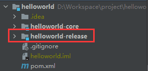

## 在工程中添加发布脚本
### 加入发布脚本

[release.zip](https://www.yuque.com/attachments/yuque/0/2020/zip/2215478/1608187136477-c04279c2-7c4e-42af-8b39-849935e6f15e.zip?_lake_card=%7B%22uid%22%3A%221608187136374-0%22%2C%22src%22%3A%22https%3A%2F%2Fwww.yuque.com%2Fattachments%2Fyuque%2F0%2F2020%2Fzip%2F2215478%2F1608187136477-c04279c2-7c4e-42af-8b39-849935e6f15e.zip%22%2C%22name%22%3A%22release.zip%22%2C%22size%22%3A18207%2C%22type%22%3A%22application%2Fx-zip-compressed%22%2C%22ext%22%3A%22zip%22%2C%22progress%22%3A%7B%22percent%22%3A99%7D%2C%22status%22%3A%22done%22%2C%22percent%22%3A0%2C%22id%22%3A%2254Qyf%22%2C%22card%22%3A%22file%22%7D)

将以上资源文件解压到 helloworld-release 目录

### helloworld-release 模块结构介绍

解压完毕后helloworld-release 如下图：

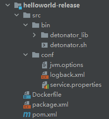

- **src/bin：** 启动脚本目录，主启动文件为 `detonator.sh` ，入口函数为 `lib_main.sh` 文件中的 `main()`
- **src/conf：** 应用基础配置，包含 jvm配置文件、logback日志框架配置文件、服务配置文件（服务配置文件是DevOps平台需要读取的配置文件，负责匹配应用启动名称以及MainClass）
- **Dockerfile：** 打包Docker镜像的描述文件
- **package.xml：** [maven-assembly-plugin](http://maven.apache.org/plugins/maven-assembly-plugin/) 打包插件所需的配置文件
- **pom.xml：** Maven Module 配置文件

### 修改发布脚本中的配置文件

> 需要为每个应用单独修改以下配置文件

- 修改 src/conf/service.properties
    - 设置服务名称（SERVICE_NAME）
    - 设置Java工程的main class（MAIN_CLASS）
    
    这2变量会被DevOps平台读取

```
# 服务名称
SERVICE_NAME=helloworld
# 主函数入口
MAIN_CLASS=lan.sc.helloworld.HelloworldApplication
```

- pom.xml

    工程打包需要用到以下2个 Maven 插件

    - [maven-resources-plugin](https://maven.apache.org/plugins/maven-resources-plugin/)：用来替换资源文件内的占位符，避免人肉修改
    - [maven-assembly-plugin：](http://maven.apache.org/plugins/maven-assembly-plugin/)负责打包，构建出DevOps平台所需标准工程结构

    将以下xml片段放入pom.xml文件（直接完整粘贴进去即可，无需修改任何内容）

```xml
<build>
        <finalName>application</finalName>
        <plugins>
            <plugin>
                <artifactId>maven-resources-plugin</artifactId>
                <version>3.2.0</version>
                <executions>
                    <!-- 拷贝Dockerfile方便Jenkins构建容器 -->
                    <execution>
                        <id>copy-docker-resources</id>
                        <phase>package</phase>
                        <goals>
                            <goal>copy-resources</goal>
                        </goals>
                        <configuration>
                            <encoding>UTF-8</encoding>
                            <delimiters>
                                <delimiter>@@@</delimiter><!-- to add Ant-like tokens style -->
                            </delimiters>
                            <useDefaultDelimiters>false</useDefaultDelimiters>
                            <resources>
                                <resource>
                                    <directory>./</directory>
                                    <includes>
                                        <include>Dockerfile</include>
                                    </includes>
                                    <filtering>true</filtering>
                                </resource>
                            </resources>
                            <outputDirectory>target</outputDirectory>
                        </configuration>
                    </execution>
                </executions>
            </plugin>
            <plugin>
                <artifactId>maven-assembly-plugin</artifactId>
                <version>3.3.0</version><!--$NO-MVN-MAN-VER$ -->
                <configuration>
                    <appendAssemblyId>false</appendAssemblyId>
                    <descriptors>
                        <descriptor>package.xml</descriptor>
                    </descriptors>
                </configuration>
                <executions>
                    <execution>
                        <id>make-assembly</id>
                        <phase>package</phase>
                        <goals>
                            <goal>single</goal>
                        </goals>
                    </execution>
                </executions>
            </plugin>
        </plugins>
    </build>
```

## 配置Jenkins
进入Jenkins，选择对应的分组（devops），点击New Item

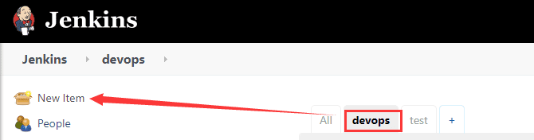

填入我们服务名称，选择Maven Project类型，点击OK

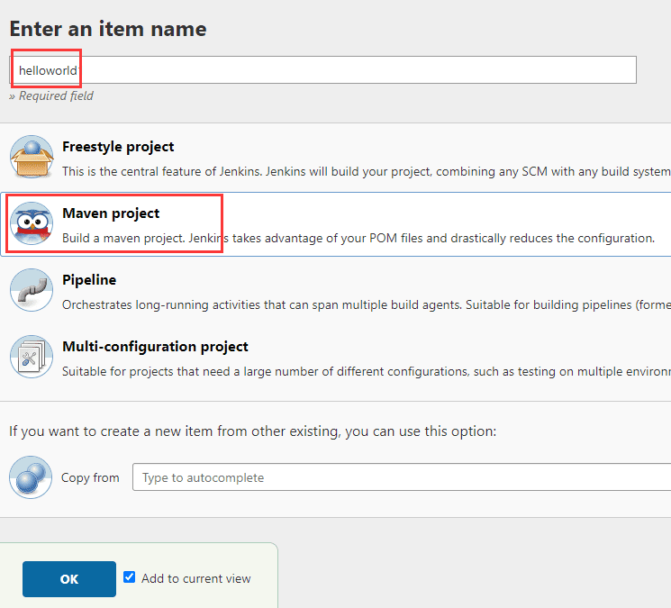

详细配置，按照如下配置即可，其它工程参考此配置需要修改3个地方

- Git地址
- 构建出的镜像名称
- Dockerfile位置

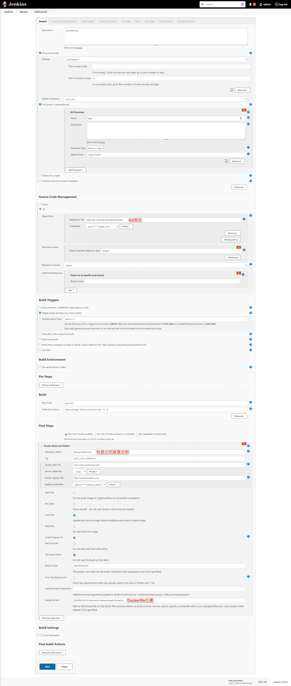

# DevOps 平台配置

## 服务创建

- **在平台左侧服务树上右键点击节点，选择添加服务** 

    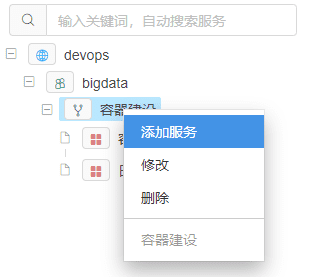

- **填写表单** 
    - 服务名称：全局唯一标识，跟 service.properties 中的 SERVICE_NAME 保持一致
    
    - 服务别名：任意字符，方便阅读

    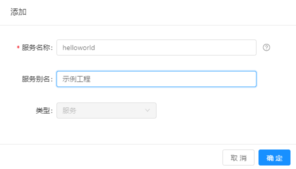

- **创建完成** 

    成功创建完毕后，我们可以在服务树目录里看到刚才创建的 `示例工程` 了

    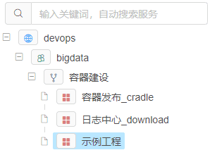

## 服务构建

- 点击 `示例工程` 构建TAB页中的添加按钮

    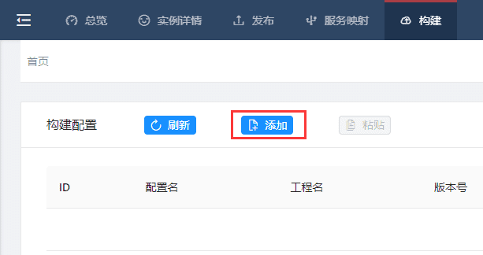

- 填写配置表单
    - 配置名称：任意
    - Jenkins选择：默认即可
    - Job名称：选择我们刚才在Jenkins中创建的Job

    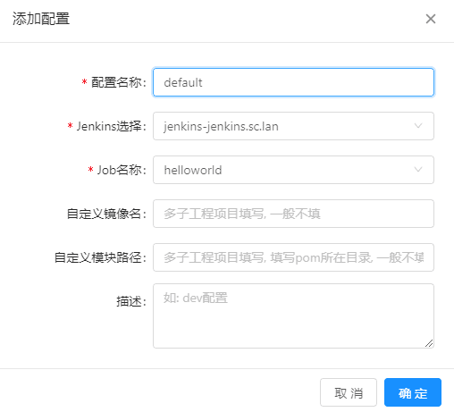

- 点击构建，选择分支开始构建

    - 在构建历史中可以查看构建日志

    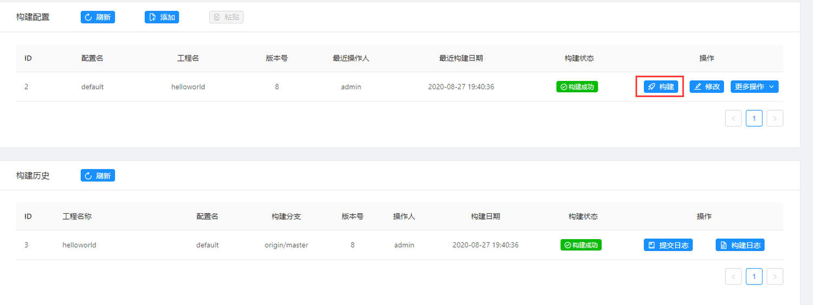

## 服务发布

- 进入服务发布页，点击添加

    

- 填写表单

    - 镜像名称填写我们在Jenkins中配置的镜像名称

    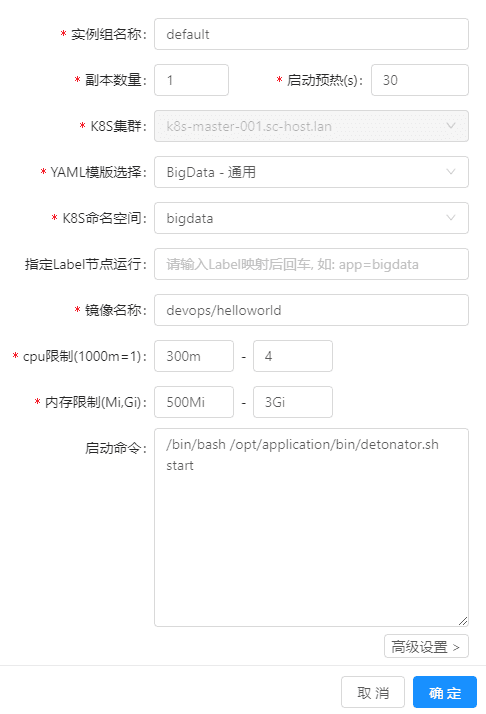    

- 点击发布按钮

    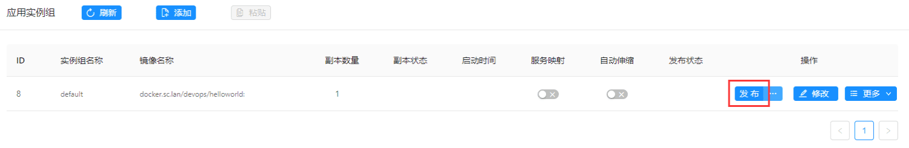

- 选择版本，点击确定

    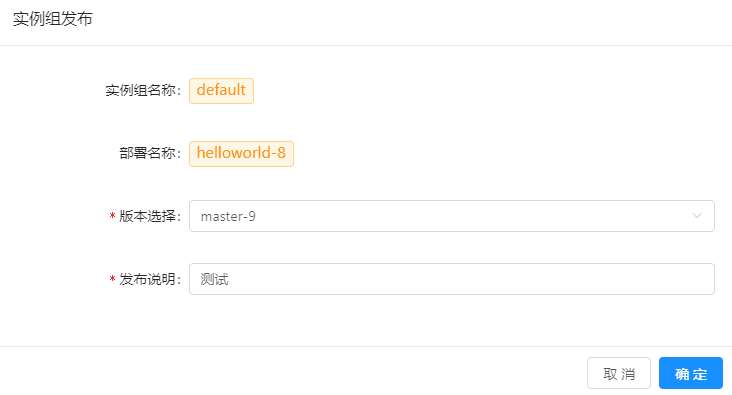

发布过程中出现发布失败，使用以下命令查看状态

```
kubectl  get pod

#找到发布的pod名称
kubectl describe pod  helloworld-1-5bfcf6d4d-ggl9j
```

发现任务状态处于ImagePullBackOff，此时拉取远程私有仓库失败

解决办法：

首先在k8s各集群登录harbor，如果登录后还不行尝试以下方法

```
##添加k8s令牌
kubectl create secret docker-registry regcred \
  --docker-server=harbor.software.dc \
  --docker-username=<你的用户名> \
  --docker-password=<你的密码> 
  
##修改pod yaml文件，添加以下配置
 imagePullSecrets:
  - name: regcred
  
```

devops平台中在数据库中的yaml_template表修改模板。已添加一条BigData - 测试记录，修改任务模板即可。

如果需要配置传入，可以在YAML中${param_name}占位符。有占位符后才能在自定义变量里替换，比如：{"param_name":"123"}

添加上述令牌后，更新MySQL中docker_repository_server表信息，修改已添加的harbor连接信息证书字段ca_cert为regcred，为后续做准备。

如后续发布flink时，yaml文件中含有参数配置

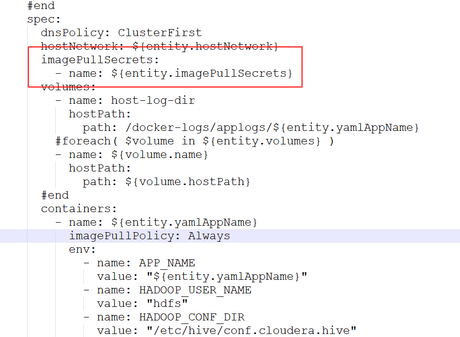

此处参数就读取docker_repository_server表的ca_cert字段

参考：[https://kubernetes.io/zh/docs/tasks/configure-pod-container/pull-image-private-registry/](https://kubernetes.io/zh/docs/tasks/configure-pod-container/pull-image-private-registry/)

## 实例详情

服务发布之后，我们可以通过实例详情页查看服务的所有实例信息

### 实例组、实例状态

左侧展示了实例组、实例的详细信息

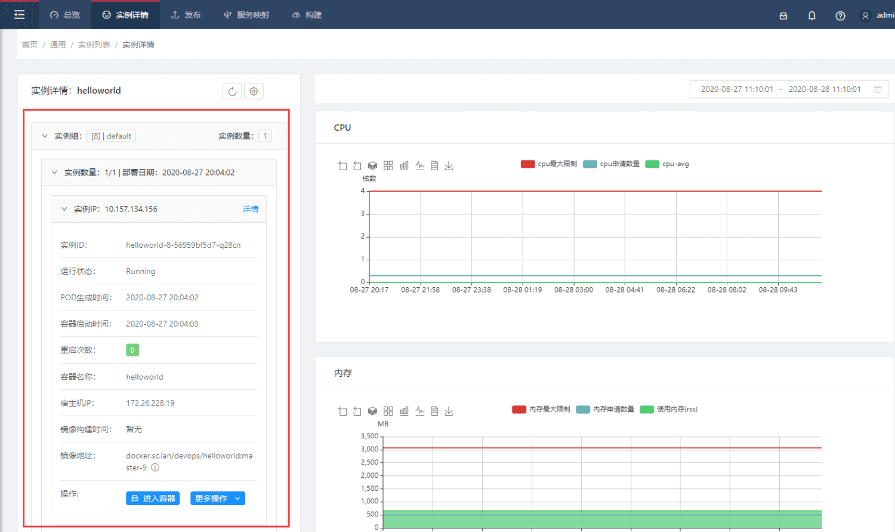

### 基础监控数据

右侧展示了当前所选实例的基础监控数据（CPU、内存、网络）

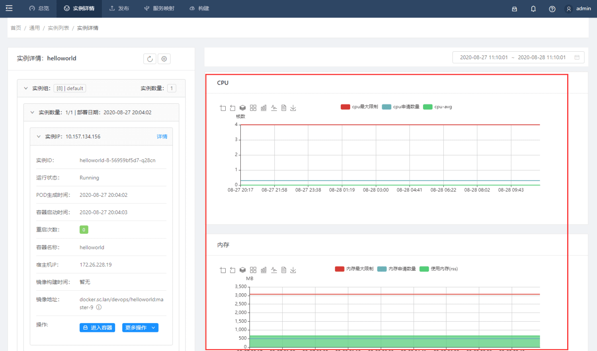

### Web控制台

点击实例信息中的进入容器

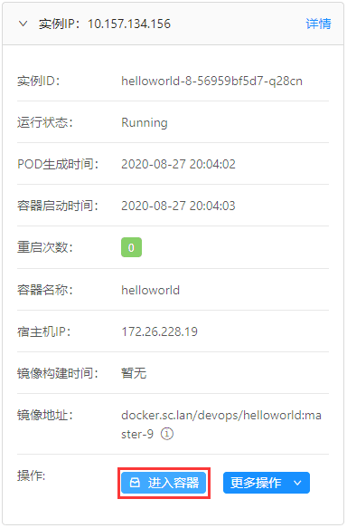

### 日志查看

使用更多操作中的控制台日志、日志查询按钮，可以查看服务日志

- 控制台日志： `docker logs`  命令查询到的日志信息

- 日志查询：查看服务日志目录中的日志

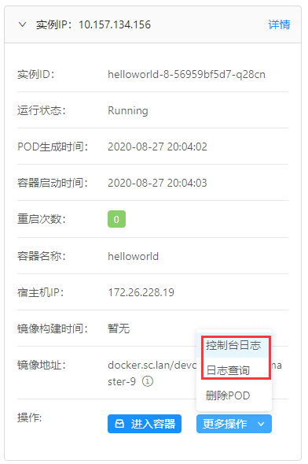

### 销毁实例

> 实例 > 更多操作 > 删除POD

删除所选的实例，实例销毁后容器平台会重新创建新的实例，以满足实例组副本数要求。

## 服务映射

### 添加服务映射（K8S-Service）

目前服务已经部署完毕，但是每个容器的IP地址是变化的。

如果我们需要通过统一的域名访问服务的接口，首先我们需要创建服务映射。

- 进入服务映射Tab页，点击添加

    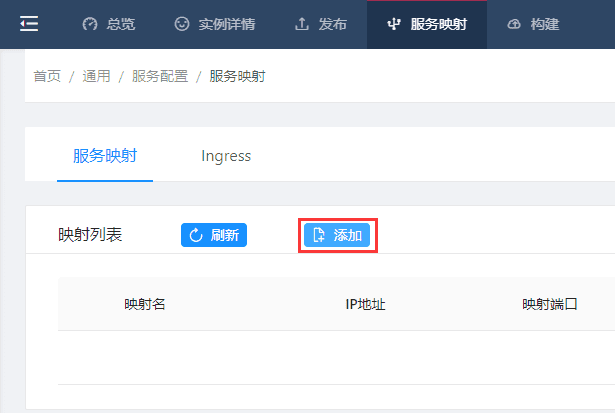

- 填写表单
  
    - 实例组选择：选择我们在服务发布中，创建的实例组
    
    - 修改YAML端口：修改YAML中的ports，将targetPort修改为服务使用的端口

    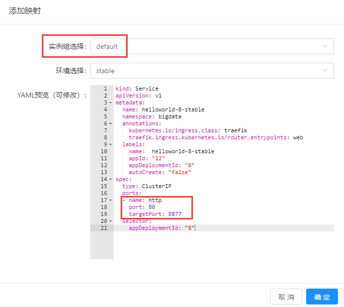

### 添加Ingress

> 服务映射 > Ingress > 添加

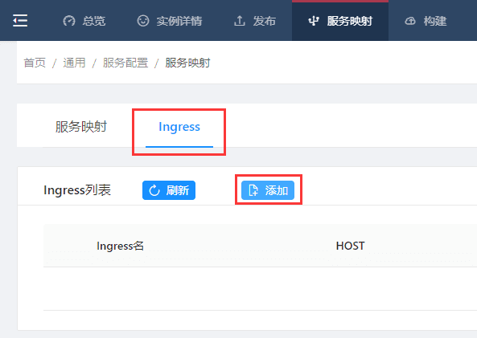

- 填写表单

    按需修改域名，域名需要以k8s.sc.lan结尾（DNS泛域名解析到K8S网关服务器上）
    
    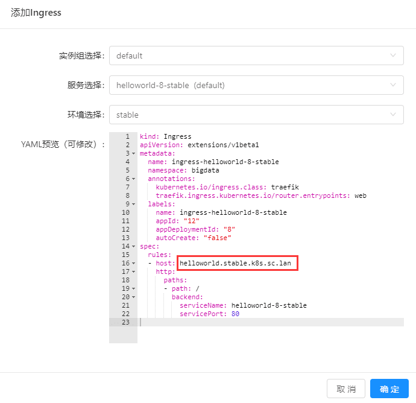

### 测试

在dns中添加当前域名解析后，访问服务接口 [http://helloworld.stable.k8s.sc.lan/hello](http://helloworld.stable.k8s.sc.lan/hello) 测试结果是否正常