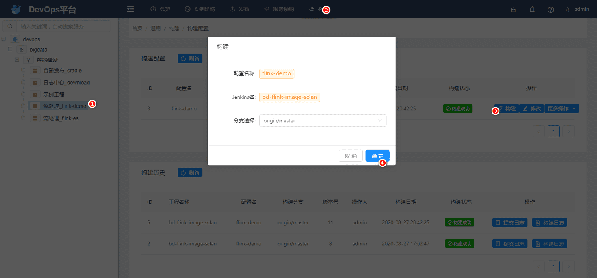
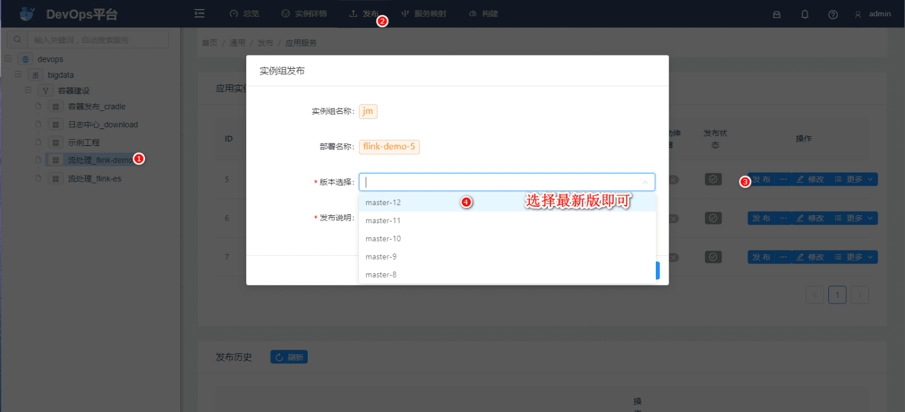
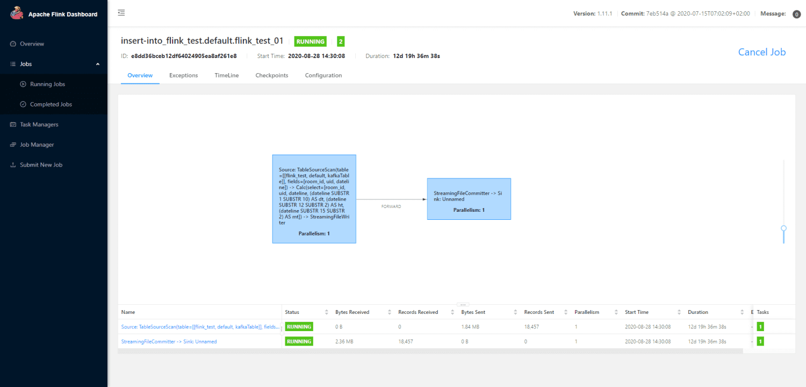
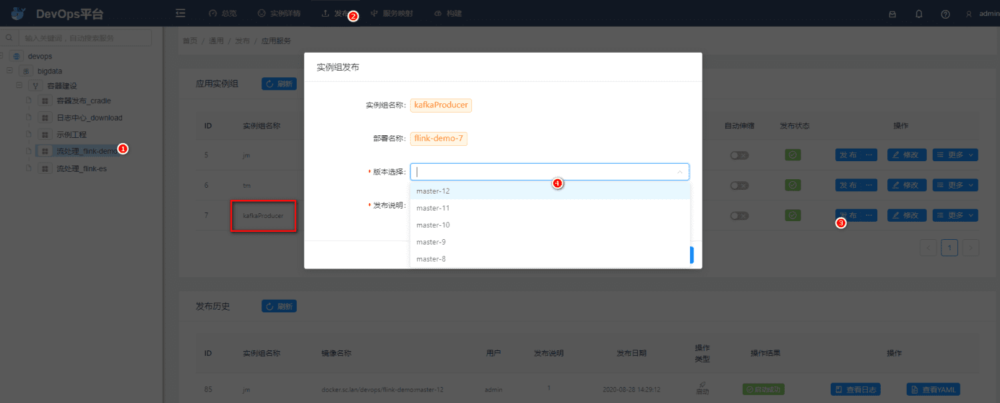
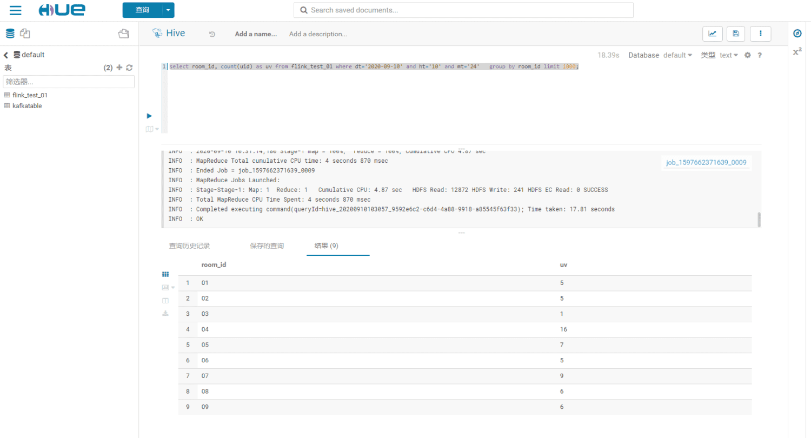

flink-demo是基于容器平台上搭建的一个flink应用, 采用jar方式提交;

## 源代码
[http://git.sc.lan/devops/bd-flink-image-sclan.git](http://git.sc.lan/devops/bd-flink-image-sclan.git)

## 操作步骤
源码推送至master后, 可以在[Devops平台](http://europa.sc.lan/common/publish/deployment?13)中构建出新版本, 按照步骤点击1, 2, 3, 4步骤即可



然后就可以在Devops平台里面选择发布的版本

**PS** : jm 和 tm 实例组都得操作一次, 一个是flink主节点, 一个是flink从节点, 都必须更新为最新代码；



操作完成后, 大概等1min等容器启动, 任务提交, 等待过程中, 可以去 `实例详情` 菜单中看看日志, 也可以去flink自带的操作面板进行观察；

Flink面板：[http://flink-demo.k8s.sc.lan/#/overview](http://flink-demo.k8s.sc.lan/#/overview)



## 数据验证
此应用主要用于测试 kafkaProducer 产生数据到 kafka, 然后经过flink 处理后, 以文件方式落地到hive;

### 生成kafka中数据
发布个小程序, 随机生成数据写kafka即可; 



(略) 启动jm 和tm 实例组, 启动方法见操作步骤,

### 查询Hive

进入hive查询界面, [http://hadoop-001.sc-host.lan:8889/hue/editor/?type=hive](http://hadoop-001.sc-host.lan:8889/hue/editor/?type=hive), 即可查询

如查询2020-09-10 10:24:00 这一分钟各个房间的uv: 

```sql
select room_id, count(uid) as uv from flink_test_01 where dt='2020-09-10' and ht='10' and mt='24'   group by room_id limit 1000;
```

