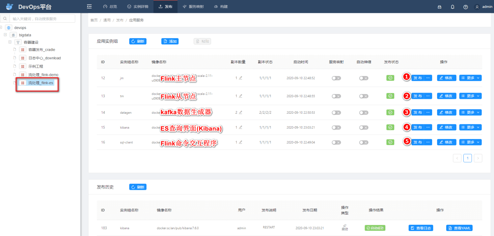
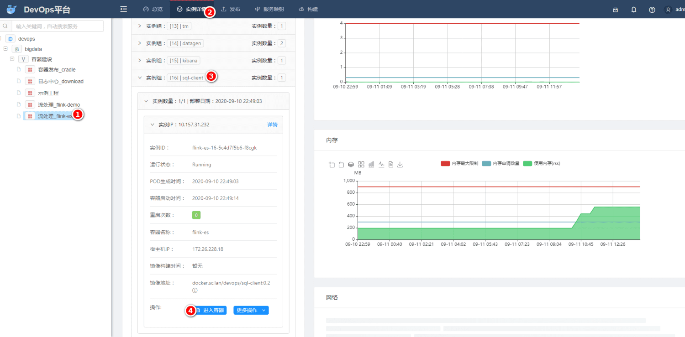
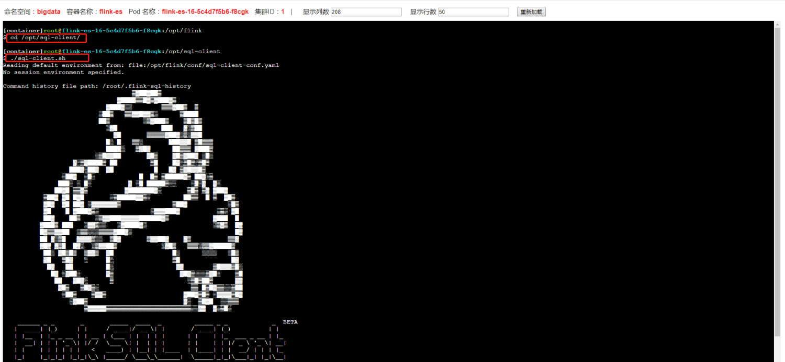
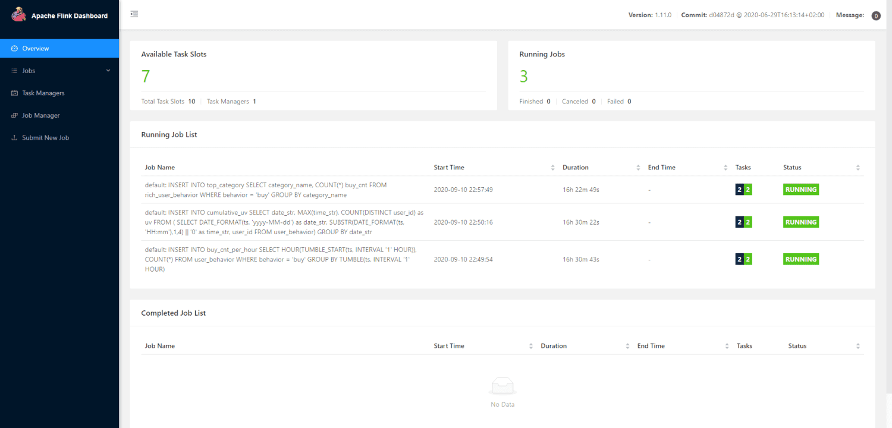
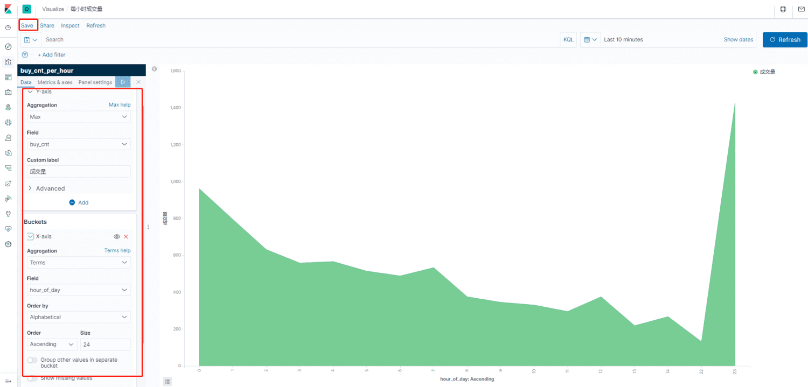
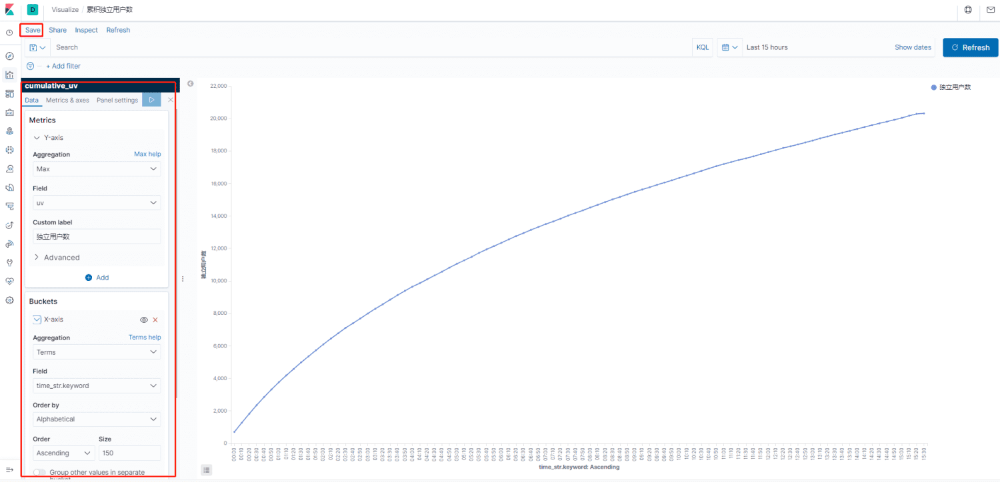
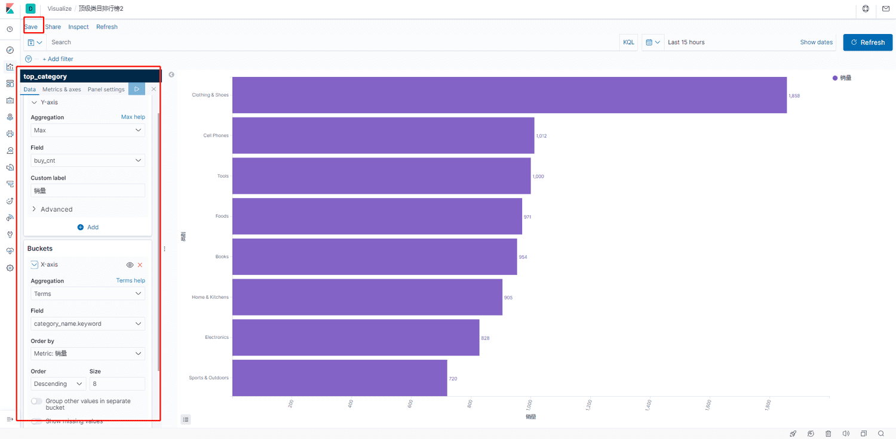

此项目是Flink的一个Demo项目, 随机生成器模拟用户行为数据, 插入Kafka, 经过Flink处理后, 插入ES, 最终用Kibana展示数据;

## 源代码

Git地址: [http://git.sc.lan/devops/bd-flink-image-sclan-es](http://git.sc.lan/devops/bd-flink-image-sclan-es)

> flink-es 项目参考 此开源项目搭建 [https://github.com/wuchong/flink-sql-demo/tree/v1.11-CN](https://github.com/wuchong/flink-sql-demo/tree/v1.11-CN)

## 操作步骤

在[Devops平台](http://europa.sc.lan/)中, 根据顺序依次执行如下发布步骤, 相关说明如图



等启动完成后, 进入实例详情, 点击sql-client 的 "进入容器"



进入容器后, 执行命令 进入Flink-SQL的交互窗口

```sql
cd /opt/sql-client/  &&  ./sql-client.sh
```



在FlinkSQL Client 交互界面中, 中输入业务SQL,即可创建Flink任务,  具体sql代码如下: 
```sql
## 创建user_behavior 数据源, 公用
CREATE TABLE user_behavior (
    user_id BIGINT,
    item_id BIGINT,
    category_id BIGINT,
    behavior STRING,
    ts TIMESTAMP(3),
    proctime AS PROCTIME(),   -- generates processing-time attribute using computed column
    WATERMARK FOR ts AS ts - INTERVAL '5' SECOND  -- defines watermark on ts column, marks ts as event-time attribute
) WITH (
    'connector' = 'kafka',  -- using kafka connector
    'topic' = 'user_behavior',  -- kafka topic
    'scan.startup.mode' = 'latest-offset',  -- reading from the beginning
    'properties.bootstrap.servers' = 'base-service-001.sc-host.lan:19092',  -- kafka broker address
    'format' = 'json'  -- the data format is json
);
```

```sql
## 统计每小时的成交量
CREATE TABLE buy_cnt_per_hour (
    hour_of_day BIGINT,
    buy_cnt BIGINT
) WITH (
    'connector' = 'elasticsearch-7', -- using elasticsearch connector
    'hosts' = 'http://base-service-001.sc-host.lan:9200',  -- elasticsearch address
    'index' = 'buy_cnt_per_hour'  -- elasticsearch index name, similar to database table name
);

## 插入数据
INSERT INTO buy_cnt_per_hour
SELECT HOUR(TUMBLE_START(ts, INTERVAL '1' HOUR)), COUNT(*)
FROM user_behavior
WHERE behavior = 'buy'
GROUP BY TUMBLE(ts, INTERVAL '1' HOUR);

```

```sql
## 统计一天每10分钟累计独立用户数
CREATE TABLE cumulative_uv (
    date_str STRING,
    time_str STRING,
    uv BIGINT,
    PRIMARY KEY (date_str, time_str) NOT ENFORCED
) WITH (
    'connector' = 'elasticsearch-7',
    'hosts' = 'http://base-service-001.sc-host.lan:9200',
    'index' = 'cumulative_uv'
);
## 插入数据
INSERT INTO cumulative_uv
SELECT date_str, MAX(time_str), COUNT(DISTINCT user_id) as uv
FROM (
  SELECT
    DATE_FORMAT(ts, 'yyyy-MM-dd') as date_str,
    SUBSTR(DATE_FORMAT(ts, 'HH:mm'),1,4) || '0' as time_str,
    user_id
  FROM user_behavior)
GROUP BY date_str;
```

```sql
## 顶级类目排行榜 维表
CREATE TABLE category_dim (
    sub_category_id BIGINT,
    parent_category_name STRING
) WITH (
    'connector' = 'jdbc',
    'url' = 'jdbc:mysql://base-service-001.sc-host.lan:3306/flink',
    'table-name' = 'category',
    'username' = 'root',
    'password' = 'admin11.1',
    'lookup.cache.max-rows' = '5000',
    'lookup.cache.ttl' = '10min'
);

## 顶级类目排行榜 结果表
CREATE TABLE top_category (
    category_name STRING PRIMARY KEY NOT ENFORCED,
    buy_cnt BIGINT
) WITH (
    'connector' = 'elasticsearch-7',
    'hosts' = 'http://base-service-001.sc-host.lan:9200',
    'index' = 'top_category'
);

## 顶级类目排行榜 视图
CREATE VIEW rich_user_behavior AS
SELECT U.user_id, U.item_id, U.behavior, C.parent_category_name as category_name
FROM user_behavior AS U LEFT JOIN category_dim FOR SYSTEM_TIME AS OF U.proctime AS C
ON U.category_id = C.sub_category_id;

## 插入数据
INSERT INTO top_category
SELECT category_name, COUNT(*) buy_cnt
FROM rich_user_behavior
WHERE behavior = 'buy'
GROUP BY category_name;
```

## 数据验证
### 观察Flink任务
在Flink 自带的Dashbord中, 可以看到 3个Flink任务 [http://flink-es.k8s.sc.lan](http://flink-es.k8s.sc.lan/)/



### Kibana中创建index
上述操作后, 等待10min左右的 时间窗口, 即可去Kibana中操作 [http://kibana.k8s.sc.lan/](http://kibana.k8s.sc.lan/)

### Kibana中创建 index pattern
根据Kibana提示创建3个 索引, 后续做Dashbord要用, buy_cnt_per_hour, cumulative_uv, top_category


### Kibana中创建 Dashboard
点击Kibana左侧菜单中 Dashbord, 创建一个新的Dashbord, 根据[Github](https://github.com/wuchong/flink-sql-demo/tree/v1.11-CN)中例子, 会创建3个Dashbord, 每个Dashbord配置, 如图





