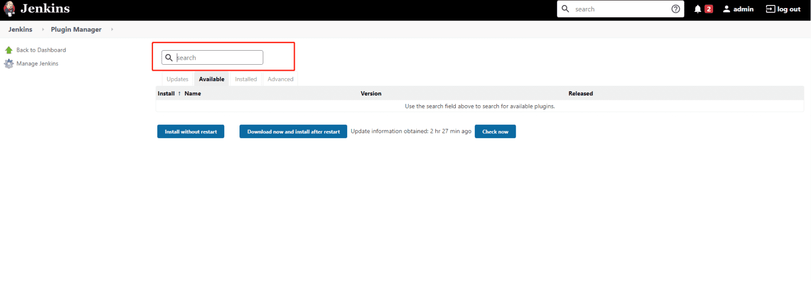
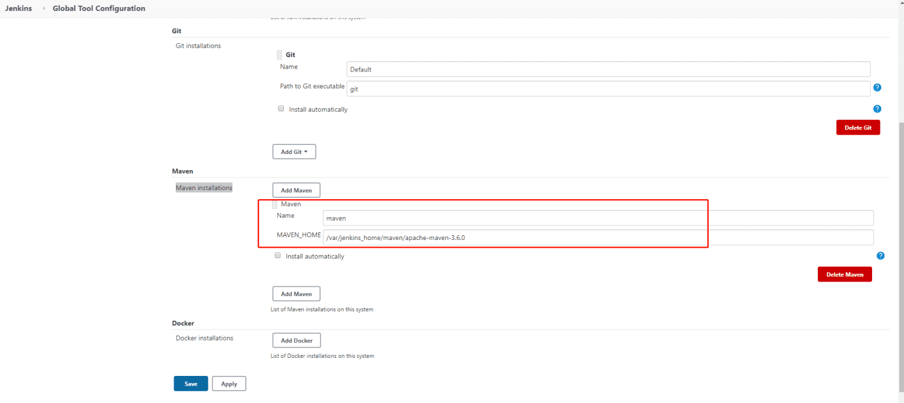
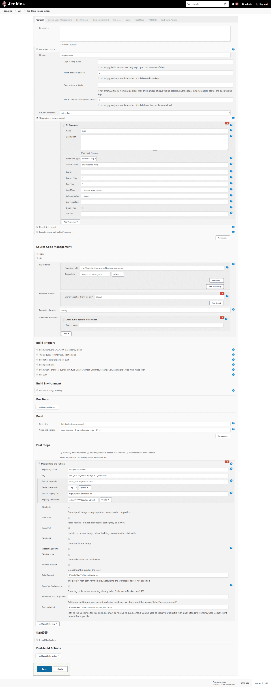
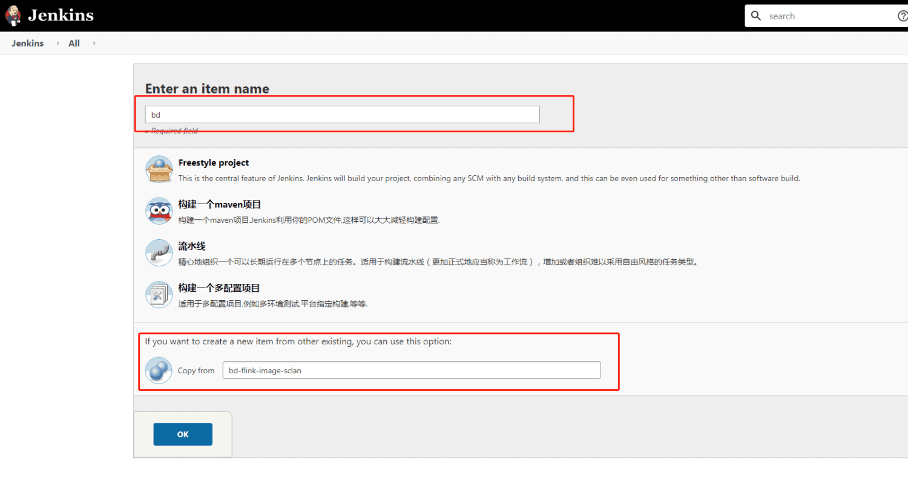

只有在Jenkins提前创建好相关构建任务后, 才能去容器平台中的 "构建" 菜单进行下拉选择, 一个应用可以关联多个构建配置;

## 安装相关插件(只需安装一次)
在创建任务的之前, 先检查Jenkins是否已经安装如下插件, 插件列表如下: (只需安装一次)

若未安装, 通过 [http://jenkins.sc.lan/jenkins/](http://jenkins.sc.lan/jenkins/)  的UI中 Manage Jenkins ->pluginManager ->Available 中搜索相关插件, 进行安装;



```bash
# Jenkins需要插件

Apache HttpComponents Client 4.x API Plugin
Authentication Tokens API Plugin
bouncycastle API Plugin
Build Timestamp Plugin
CloudBees Docker Build and Publish plugin
Command Agent Launcher Plugin
Conditional BuildStep
Credentials Binding Plugin
Credentials Plugin
Display URL API
Docker Commons Plugin
Extensible Choice Parameter plugin
Git client
Git Parameter Plug-In
Git plugin
Gitlab Hook Plugin
GitLab Plugin
jQuery plugin
JSch dependency plugin
JUnit
Mailer Plugin
Matrix Authorization Strategy Plugin
Matrix Project Plugin
Maven Integration plugin
Oracle Java SE Development Kit Installer Plugin
OWASP Markup Formatter Plugin
Pipeline: API
Pipeline: Job
Pipeline: SCM Step
Pipeline: Step API
Pipeline: Supporting APIs
Plain Credentials Plugin
ruby-runtime
Hosts runtime for enabling pure-Ruby plugins
Run Condition Plugin
SCM API Plugin
Script Security Plugin
SSH Credentials Plugin
Structs Plugin
Token Macro Plugin
Trilead API Plugin
WMI Windows Agents Plugin
```

## 配置Maven(只需配置一次)

通过 [http://jenkins.sc.lan/jenkins/](http://jenkins.sc.lan/jenkins/)  的UI中 Manage Jenkins ->Global Tool Configuration->Maven -> Maven installations

添加本地已经安装的Maven路径



## 配置全新Job
按照截图配置即可



## 配置全新Job(利用已有Job)
若已经完整配置过一个Job, 后面就可以以此Job为模版进行简化配置, 将配置好的Job填入 Copy from, 即可复制一个Job, 相关参数微调一下即可拥有一个全新的Job


