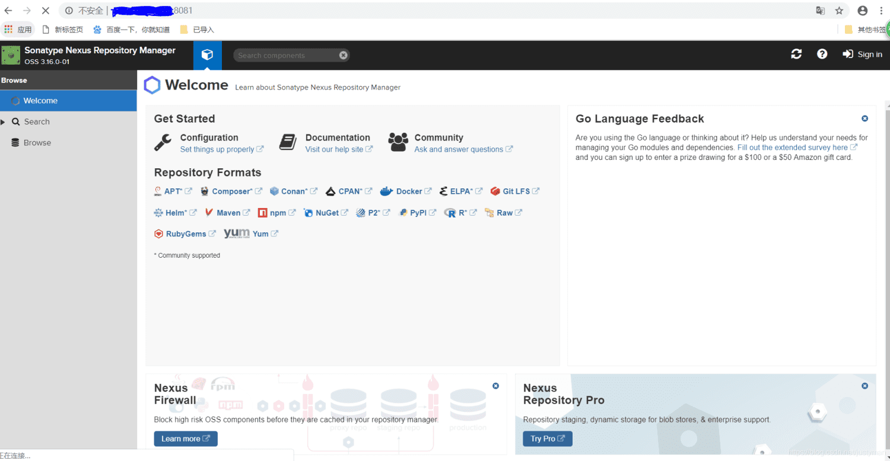
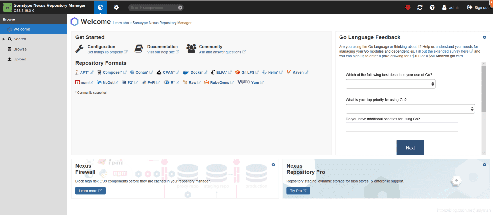
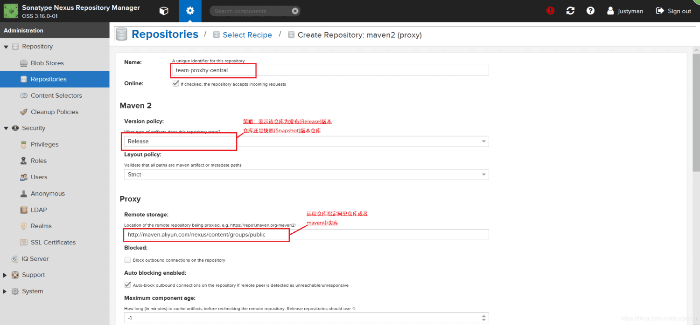
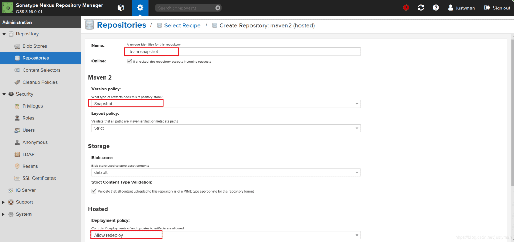
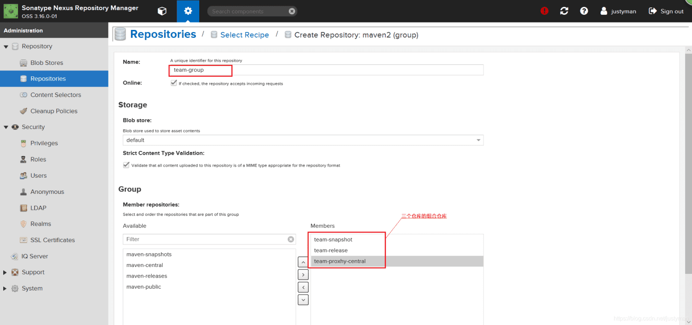
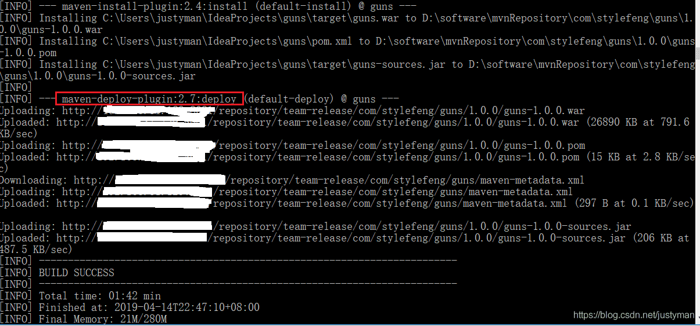
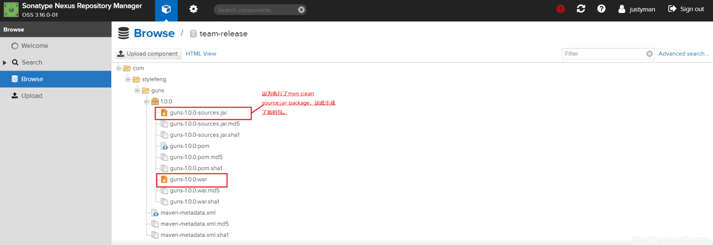
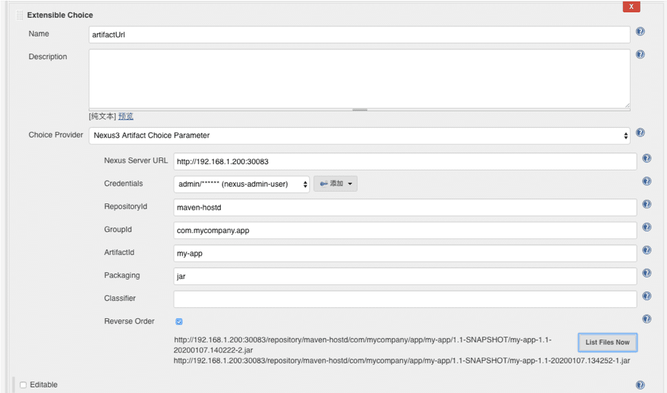
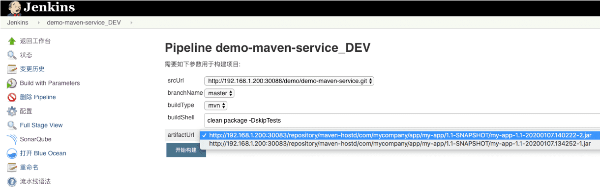

# 一、概述
交付件管理又称为制品管理。制品也叫产出物或工件。制品是软件开发过程中产生的多种有形副产品之一。广义的制品包括用例、UML图、设计文档等。而狭义的制品就可以简单地理解为二进制包。虽然有些代码是不需要编译就可以执行的，但是我们还是习惯于将这些可执行文件的集合称为二进制包。

在软件开发流程中，每天可能都会产生大量的制品产物。如何高效的去管理这些制品是每个企业需要考虑的问题。

# 二、技术方案
## 2.1 概述

最简单的制品管理仓库就是将制品统一放在一个系统目录结构下。但是很少有人这样做，更多的做法是使用现成的制品库。

制品管理涉及两件事情：一是如何将制品放到制品库中；二是如何从制品库中取出制品。

DevOps 平台通过使用 Nexus 作为制品管理仓库，用来存放包括Jar、DockerImage、Yum Package 等多种制品产物。

## 2.2 搭建 Nexus3 制品仓库
### 安装

1、下载地址：[https://www.sonatype.com/download-oss-sonatype](https://www.sonatype.com/download-oss-sonatype)    （这里我使用3.16.0版本进行演示）

2、解压tar包并在解压后会多了两个文件夹

| 文件夹 | 作用 |
| :--- | :--- |
| nexus-3.16.0-01 | 核心 |
| sonatype-work | maven下载jar存放地址 |

```
1. [xxxx@localhost opt]# tar -zxvf /tmp/nexus-3.16.0-01-unix.tar.gz
2. nexus-3.16.0-01/.install4j/9d17dc87.lprop
3. nexus-3.16.0-01/.install4j/MessagesDefault
4. nexus-3.16.0-01/.install4j/build.uuid
5. nexus-3.16.0-01/.install4j/i4j_extf_0_17is1ik.utf8
6. .....
7. sonatype-work/nexus3/log/.placeholder
8. sonatype-work/nexus3/orient/plugins/studio.zip
9. sonatype-work/nexus3/tmp/.placeholder
10.
```

```
1. [xxxx@localhost opt]# ls -alrt
2. total 0
3. dr-xr-xr-x. 17 root root 224 Mar 29 20:42 ..
4. drwxr-xr-x.  9 root root 163 Apr 12 22:59 nexus-3.16.0-01
5. drwxr-xr-x.  3 root root  20 Apr 12 22:59 sonatype-work
```

### 启动服务

1、进入Nexus的bin文件夹并启动服务。

```
1. [root@localhost nexus-3.16.0-01]# java -version
2. openjdk version "1.8.0_201"
3. OpenJDK Runtime Environment (build 1.8.0_201-b09)
4. OpenJDK 64-Bit Server VM (build 25.201-b09, mixed mode)
5. [root@localhost nexus-3.16.0-01]# ./bin/nexus start
6. WARNING: ************************************************************
7. WARNING: Detected execution as "root" user.  This is NOT recommended!
8. WARNING: ************************************************************
9. Starting nexus
```

2、如有你想忽略该警告，可以通过修改nexus配置。 

```
1. [root@localhost nexus-3.16.0-01]# vi bin/nexus
2. 
3. ---------------------------------------------------------
4. # user to execute as; optional but recommended to set
5. #run_as_user=''
6. run_as_user=root
```

3、重启

```
1. [root@localhost nexus-3.16.0-01]# ./bin/nexus start
2. WARNING: ************************************************************
3. WARNING: Detected execution as "root" user.  This is NOT recommended!
4. WARNING: ************************************************************
5. Starting nexus
6. [root@localhost nexus-3.16.0-01]#
```

4、常见命令

bin/nexus {start|stop|run|run-redirect|status|restart|force-reload}

查看防火墙状态

查看防火墙状态 systemctl status firewalld

开启防火墙 systemctl start firewalld  

关闭防火墙 systemctl stop firewalld

开启防火墙 service firewalld start 

若遇到无法开启

先用：systemctl unmask firewalld.service 

然后：systemctl start firewalld.service

5、常见问题

5.1 即使nexus已经启动成功，但是web端访问还是报超时，一般情况就是端口没有开放。

```
1. #查询指定端口是否已开 （yes表示开启；no表示未开启）
2. firewall-cmd --query-port=666/tcp
3. 
4. #假若没有开启
5. 
6. #添加指定需要开放的端口：
7. firewall-cmd --add-port=666/tcp --permanent
8. #重载入添加的端口：
9. firewall-cmd --reload
10. #查询指定端口是否开启成功：
11. firewall-cmd --query-port=666/tcp
12.
```

### 使用与配置

1、输入[http://localhost:8081/](http://localhost:8081/) ,登录并显示以下界面证明Nexus安装并启动成功。



2、使用admin/admin123进行登录。



3、然后创建三种不同类型的仓库（Hosted、Proxy、Group），每个仓库的格式为maven2或者maven1，同时仓库还有一个Policy（策略）的属性，它表示该仓库为发布（Release）版本仓库还是快照（Snapshot）版本仓库。最后两列的值为仓库的状态和路径。具体每种仓库的描述可以参考以下表格。

值得注意的是，仓库组所包含的仓库的顺序决定了仓库组遍历其所含仓库的次序，因此最好将常用的仓库放在前面，当用户从仓库组下载构件的时候，就能够尽快地访问到包含构件的仓库。

| 种类 | 作用 |
| :--- | :--- |
| group(仓库组类型) | 组仓库，用于方便开发人员自己设定的仓库 |
| hosted(宿主类型) | 内部项目的发布仓库，一般用于内部开发人员发布上去存放程序包的仓库。其中根据版本分为两类：1. Release：用于版本发布的仓库; 2. Snapshot：用于开发、调试、测试的仓库 |
| proxy(代理类型) | 从远程中央仓库中寻找数据的仓库，一般用于从远程拉取jar包 |
| virtual(虚拟类型) | 虚拟仓库，一般不怎么用到|

创建远程仓库



创建宿主快照仓库



创建宿主发布仓库


创建组合仓库



### 上传构件包

1、配置pom.xml与setting.xml。

**setting.xml** ：配置nexus私库的登录账户与密码。

```
1. <server>
2. <id>release</id>  <!--对应pom.xml的id=releases的仓库-->
3. <username>XXXXX</username>
4. <password>YYYYYYYY</password>
5. </server>
6. <server>
7. <id>snapshot</id> <!--对应pom.xml中id=snapshots的仓库-->
8. <username>XXXXX</username>
9. <password>YYYYYYYY</password>
10. </server>
```

pom.xml：用于配置

```
1. <distributionManagement>
2. <repository>
3. <!--id的名字可以任意取，但是在setting文件中的属性<server>的ID与这里一致-->
4. <id>release</id>
5. <!--指向仓库类型为host(宿主仓库）的Release仓库，这里我仓库为team-release-->
6. <url>http://{ip}:{port}/repository/team-release/</url>
7. </repository>
8. <snapshotRepository>
9. <id>snapshot</id>
10. <!--指向仓库类型为host(宿主仓库）的Snapshot仓库，这里我仓库为team-snapshot-->
11. <url>http://{ip}:{port}/repository/team-snapshot/</url>
12. </snapshotRepository>
13. </distributionManagement>
```

2、在项目的根目录下执行以下命令：

```
1. mvn clean source:jar package
2. mvn deploy -e
```

3、当命令执行成功后会看到以下日志：

另外：**maven会判断版本后面是否带了-SNAPSHOT，如果带了就发布到snapshots仓库，否则发布到release仓库。** 



4、通过日志发现该源代码包与程序包部署到nexus私服成功，并存到releas仓库。我们到私服查看确认无误。





用户选择制品，在应用服务器通过salt、ansible下载制品并部署 



